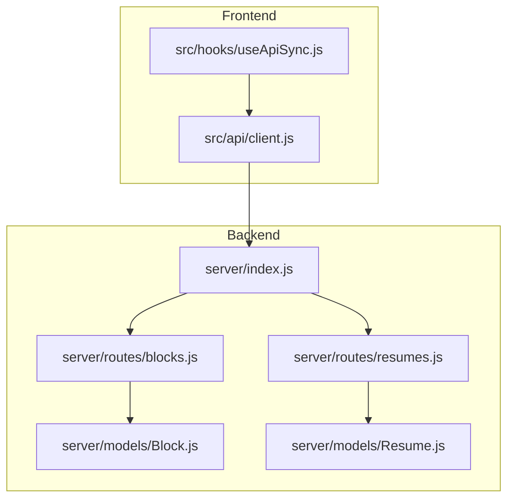
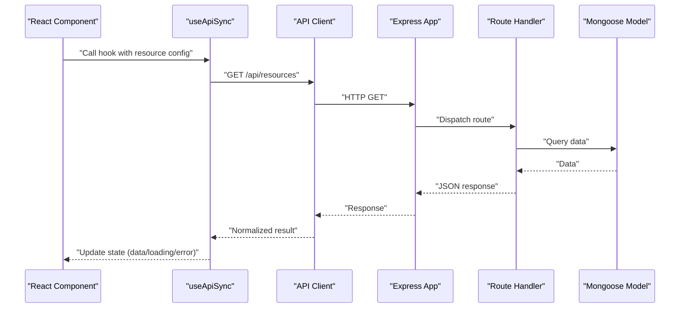
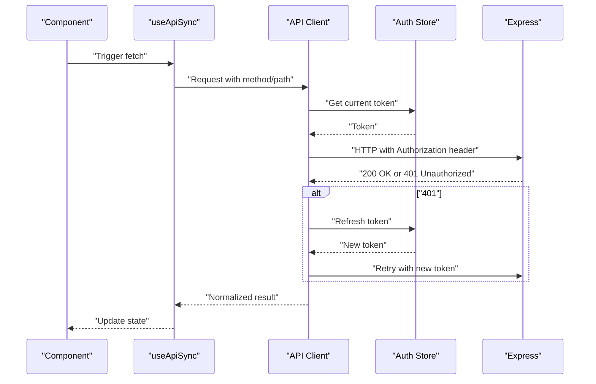
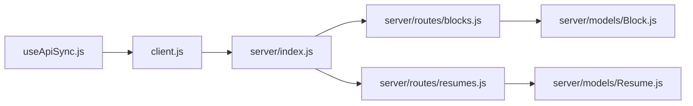

# API Client Integration

<cite>
**Referenced Files in This Document**
- [client.js](file://src/api/client.js)
- [useApiSync.js](file://src/hooks/useApiSync.js)
- [blocks.js](file://server/routes/blocks.js)
- [resumes.js](file://server/routes/resumes.js)
- [Block.js](file://server/models/Block.js)
- [Resume.js](file://server/models/Resume.js)
- [index.js](file://server/index.js)
</cite>

## Table of Contents
1. [Introduction](#introduction)
2. [Project Structure](#project-structure)
3. [Core Components](#core-components)
4. [Architecture Overview](#architecture-overview)
5. [Detailed Component Analysis](#detailed-component-analysis)
6. [Dependency Analysis](#dependency-analysis)
7. [Performance Considerations](#performance-considerations)
8. [Troubleshooting Guide](#troubleshooting-guide)
9. [Conclusion](#conclusion)

## Introduction
This document explains how the frontend API client and hooks integrate with the backend to manage resume data. It covers configuration, initialization, request/response handling, error management, retry strategies, authentication patterns, and practical usage examples. It also documents the useApiSync hook for automatic state synchronization between the UI and server.

## Project Structure
The project is organized into a React frontend and an Express backend:
- Frontend API client: src/api/client.js
- Frontend hook for sync: src/hooks/useApiSync.js
- Backend routes: server/routes/blocks.js, server/routes/resumes.js
- Backend models: server/models/Block.js, server/models/Resume.js
- Server entrypoint: server/index.js

**Diagram sources**
- [client.js](file://src/api/client.js)
- [useApiSync.js](file://src/hooks/useApiSync.js)
- [index.js](file://server/index.js)
- [blocks.js](file://server/routes/blocks.js)
- [resumes.js](file://server/routes/resumes.js)
- [Block.js](file://server/models/Block.js)
- [Resume.js](file://server/models/Resume.js)

**Section sources**
- [client.js](file://src/api/client.js)
- [useApiSync.js](file://src/hooks/useApiSync.js)
- [index.js](file://server/index.js)
- [blocks.js](file://server/routes/blocks.js)
- [resumes.js](file://server/routes/resumes.js)
- [Block.js](file://server/models/Block.js)
- [Resume.js](file://server/models/Resume.js)

## Core Components
- API client (src/api/client.js): Centralized HTTP client that encapsulates base URL, headers, token injection, request/response transformations, error normalization, and optional retry behavior.
- useApiSync hook (src/hooks/useApiSync.js): Declarative hook that synchronizes local component state with server resources by invoking the API client on mount/update and managing loading/error states.

Key responsibilities:
- Configuration: Base URL, default headers, auth token source, timeout, retries.
- Request lifecycle: Build requests, attach tokens, transform payloads, handle responses.
- Error strategy: Normalize errors, surface user-friendly messages, support retries for transient failures.
- Sync pattern: Trigger fetches on dependencies, update state, reflect loading and error conditions.

**Section sources**
- [client.js](file://src/api/client.js)
- [useApiSync.js](file://src/hooks/useApiSync.js)

## Architecture Overview
The frontend uses a thin API client layer to communicate with Express routes. The useApiSync hook orchestrates data fetching and state updates in components.

**Diagram sources**
- [useApiSync.js](file://src/hooks/useApiSync.js)
- [client.js](file://src/api/client.js)
- [index.js](file://server/index.js)
- [blocks.js](file://server/routes/blocks.js)
- [resumes.js](file://server/routes/resumes.js)
- [Block.js](file://server/models/Block.js)
- [Resume.js](file://server/models/Resume.js)

## Detailed Component Analysis

### API Client (src/api/client.js)
Responsibilities:
- Initialization parameters:
  - Base URL for the backend
  - Default headers (e.g., content type)
  - Authentication token source (static or dynamic getter)
  - Timeout and retry settings
- Request building:
  - Merges provided options with defaults
  - Injects authorization header when available
  - Serializes JSON bodies and parses JSON responses
- Response handling:
  - Normalizes success envelopes
  - Converts network/server errors into consistent error objects
- Retry logic:
  - Retries on transient errors (network timeouts, 5xx)
  - Exponential backoff with jitter
  - Maximum attempts and cancellation support

Usage patterns:
- GET/POST/PUT/DELETE helpers
- Typed wrappers for specific endpoints (e.g., blocks, resumes)
- Interceptors for logging or metrics (optional)

Best practices:
- Keep token retrieval centralized to avoid duplication
- Normalize all errors to include message, code, and optional details
- Use timeouts to prevent hanging requests
- Debounce rapid mutations if needed at the call site

**Section sources**
- [client.js](file://src/api/client.js)

### useApiSync Hook (src/hooks/useApiSync.js)
Purpose:
- Declaratively synchronize a piece of UI state with a server resource.
- Manage loading, error, and data states automatically.
- Trigger refetches based on dependency changes.

Configuration options:
- Resource identifier or endpoint path
- Method (GET/POST/PUT/DELETE)
- Payload (for mutations)
- Dependencies array to trigger refetch
- Optional flags: autoFetch, immediate, manualRefetch

Lifecycle:
- On mount or dependency change:
  - Set loading true
  - Invoke API client
  - Update data and clear errors on success
  - Capture and normalize errors on failure
- Provide methods to manually refresh or reset state

Integration example outline:
- Fetch list of blocks
- Create a new block
- Update an existing block
- Delete a block

Error handling:
- Map server codes to user-facing messages
- Persist last known good data until recovery
- Surface actionable feedback to users

Loading states:
- Show skeletons or spinners while loading
- Disable destructive actions during mutation

**Section sources**
- [useApiSync.js](file://src/hooks/useApiSync.js)

### Backend Routes and Models
Routes:
- Blocks: CRUD operations for resume blocks
- Resumes: CRUD operations for resumes

Models:
- Block: Schema defining block fields and relationships
- Resume: Schema defining resume fields and relationships

Flow:
- Client calls Express routes via HTTP
- Routes validate input and interact with Mongoose models
- Models enforce schema and persist data

**Section sources**
- [blocks.js](file://server/routes/blocks.js)
- [resumes.js](file://server/routes/resumes.js)
- [Block.js](file://server/models/Block.js)
- [Resume.js](file://server/models/Resume.js)

### Authentication Flow
Typical flow:
- Obtain token from login or storage
- Attach token to Authorization header via client configuration
- Refresh token on 401 responses if supported
- Clear token on logout

**Diagram sources**
- [client.js](file://src/api/client.js)
- [useApiSync.js](file://src/hooks/useApiSync.js)

## Dependency Analysis
High-level dependencies:
- useApiSync depends on the API client for all network operations.
- API client depends on browser fetch or configured HTTP adapter.
- Backend routes depend on Mongoose models for persistence.

**Diagram sources**
- [useApiSync.js](file://src/hooks/useApiSync.js)
- [client.js](file://src/api/client.js)
- [index.js](file://server/index.js)
- [blocks.js](file://server/routes/blocks.js)
- [resumes.js](file://server/routes/resumes.js)
- [Block.js](file://server/models/Block.js)
- [Resume.js](file://server/models/Resume.js)

**Section sources**
- [useApiSync.js](file://src/hooks/useApiSync.js)
- [client.js](file://src/api/client.js)
- [index.js](file://server/index.js)
- [blocks.js](file://server/routes/blocks.js)
- [resumes.js](file://server/routes/resumes.js)
- [Block.js](file://server/models/Block.js)
- [Resume.js](file://server/models/Resume.js)

## Performance Considerations
- Prefer GET caching where possible; consider query params for invalidation.
- Debounce frequent mutations (e.g., typing) before sending requests.
- Use pagination for large lists.
- Minimize payload size; send only necessary fields.
- Implement optimistic updates for better UX, with rollback on failure.
- Avoid unnecessary re-renders by memoizing derived values and stable dependencies.

[No sources needed since this section provides general guidance]

## Troubleshooting Guide
Common issues and resolutions:
- Network errors: Check connectivity, CORS, and proxy settings. Verify base URL configuration.
- Authentication failures: Ensure token presence and validity; implement refresh on 401.
- Validation errors: Inspect server error structure and map to user-friendly messages.
- Stale data: Refetch after mutations; invalidate caches appropriately.
- Timeouts: Increase timeout for slow endpoints; add retry for transient failures.

Operational tips:
- Log request IDs and timestamps for debugging.
- Centralize error reporting and analytics.
- Add health checks for backend availability.

**Section sources**
- [client.js](file://src/api/client.js)
- [useApiSync.js](file://src/hooks/useApiSync.js)

## Conclusion
The API client and useApiSync hook provide a cohesive integration layer between the React frontend and Express backend. By centralizing configuration, normalizing errors, and automating state synchronization, they simplify development and improve reliability. Follow the best practices outlined here for robust, performant, and maintainable integrations.