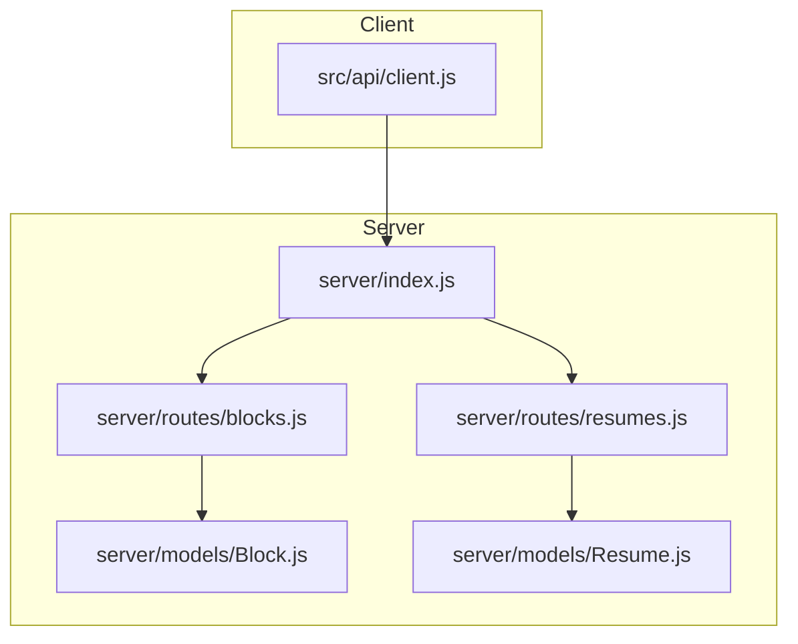
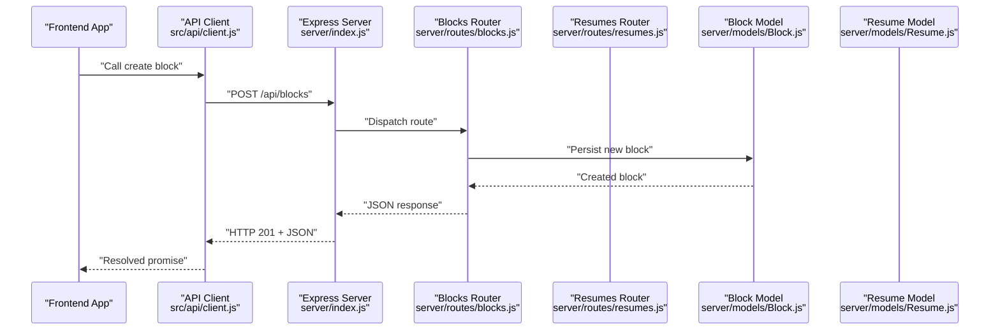
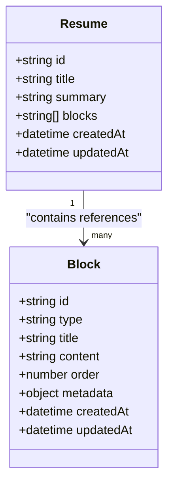
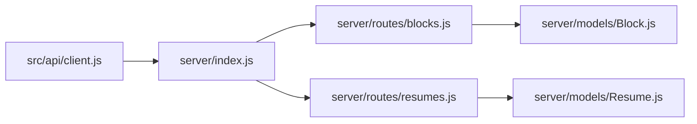

# API Reference

<cite>
**Referenced Files in This Document**
- [server/index.js](file://server/index.js)
- [server/routes/blocks.js](file://server/routes/blocks.js)
- [server/routes/resumes.js](file://server/routes/resumes.js)
- [server/models/Block.js](file://server/models/Block.js)
- [server/models/Resume.js](file://server/models/Resume.js)
- [src/api/client.js](file://src/api/client.js)
- [package.json](file://package.json)
</cite>

## Table of Contents
1. [Introduction](#introduction)
2. [Project Structure](#project-structure)
3. [Core Components](#core-components)
4. [Architecture Overview](#architecture-overview)
5. [Detailed Component Analysis](#detailed-component-analysis)
6. [Dependency Analysis](#dependency-analysis)
7. [Performance Considerations](#performance-considerations)
8. [Troubleshooting Guide](#troubleshooting-guide)
9. [Conclusion](#conclusion)
10. [Appendices](#appendices)

## Introduction
This document provides comprehensive API documentation for the Modular Resume Builder REST API. It covers Block management (CRUD), Resume collection management, request/response schemas, authentication requirements, error handling patterns, client integration examples using the provided API client library, rate limiting information, security considerations, and best practices for consuming the API.

The API is implemented with a Node.js server and exposes REST endpoints for managing Blocks and Resumes. The frontend integrates via an API client to synchronize UI state with the backend.

## Project Structure
At a high level:
- Server entry point initializes routes and middleware.
- Routes define HTTP endpoints for Blocks and Resumes.
- Models represent data structures for persistence.
- Frontend API client encapsulates HTTP calls to the server.

**Diagram sources**
- [server/index.js](file://server/index.js)
- [server/routes/blocks.js](file://server/routes/blocks.js)
- [server/routes/resumes.js](file://server/routes/resumes.js)
- [server/models/Block.js](file://server/models/Block.js)
- [server/models/Resume.js](file://server/models/Resume.js)
- [src/api/client.js](file://src/api/client.js)

**Section sources**
- [server/index.js](file://server/index.js)
- [server/routes/blocks.js](file://server/routes/blocks.js)
- [server/routes/resumes.js](file://server/routes/resumes.js)
- [server/models/Block.js](file://server/models/Block.js)
- [server/models/Resume.js](file://server/models/Resume.js)
- [src/api/client.js](file://src/api/client.js)

## Core Components
- Server entrypoint: Initializes Express, registers routes, and configures middleware such as body parsing and CORS.
- Block routes: Provide CRUD operations for resume blocks.
- Resume routes: Provide creation, update, retrieval, and deletion of resume collections.
- Models: Define schema and validation rules for Block and Resume entities.
- API client: Encapsulates HTTP requests from the frontend to the server.

Key responsibilities:
- Route handlers parse requests, validate inputs, interact with models, and return standardized JSON responses.
- Models enforce field constraints and provide consistent data shapes.
- Client abstracts base URL, headers, and common request patterns.

**Section sources**
- [server/index.js](file://server/index.js)
- [server/routes/blocks.js](file://server/routes/blocks.js)
- [server/routes/resumes.js](file://server/routes/resumes.js)
- [server/models/Block.js](file://server/models/Block.js)
- [server/models/Resume.js](file://server/models/Resume.js)
- [src/api/client.js](file://src/api/client.js)

## Architecture Overview
The API follows a standard layered architecture:
- HTTP layer: Express routes handle incoming requests.
- Business logic: Route handlers orchestrate operations and validations.
- Data layer: Models define schemas and persistence interactions.
- Client layer: Frontend uses a dedicated API client to call endpoints.

**Diagram sources**
- [server/index.js](file://server/index.js)
- [server/routes/blocks.js](file://server/routes/blocks.js)
- [server/models/Block.js](file://server/models/Block.js)
- [src/api/client.js](file://src/api/client.js)

## Detailed Component Analysis

### Authentication and Security
- Authentication: No explicit authentication middleware is present in the analyzed files. If required, implement token-based authentication (e.g., JWT) or session-based auth at the server entrypoint before route registration.
- CORS: Ensure CORS is configured appropriately for your frontend origin.
- Input validation: Validate all request bodies on the server side using model schemas or validation libraries.
- Rate limiting: Add rate limiting middleware (e.g., express-rate-limit) to protect endpoints from abuse.
- HTTPS: Serve over HTTPS in production.
- Secrets: Store secrets (e.g., JWT secret) in environment variables.

Best practices:
- Enforce content-type application/json.
- Sanitize and escape user input.
- Use parameterized queries if interacting with databases.
- Log sensitive events without exposing secrets.

[No sources needed since this section provides general guidance]

### Base URL and Common Conventions
- Base path: /api
- Content-Type: application/json for requests and responses
- Standard status codes:
  - 200 OK: Successful GET/PUT/PATCH
  - 201 Created: Successful POST
  - 204 No Content: Successful DELETE
  - 400 Bad Request: Validation errors
  - 404 Not Found: Resource not found
  - 409 Conflict: Duplicate resource
  - 500 Internal Server Error: Unexpected server error

[No sources needed since this section provides general guidance]

### Block Management API
Endpoints:
- Create a block
  - Method: POST
  - Path: /api/blocks
  - Auth: None (unless you add it)
  - Request body: JSON object representing a Block entity
  - Response: 201 Created with created block JSON
  - Errors: 400 Bad Request (validation), 500 Internal Server Error

- Retrieve all blocks
  - Method: GET
  - Path: /api/blocks
  - Query params: optional filters (e.g., type, tags)
  - Response: 200 OK with array of blocks
  - Errors: 500 Internal Server Error

- Retrieve a single block
  - Method: GET
  - Path: /api/blocks/:id
  - Response: 200 OK with block JSON
  - Errors: 404 Not Found, 500 Internal Server Error

- Update a block
  - Method: PUT or PATCH
  - Path: /api/blocks/:id
  - Request body: Partial or full block fields
  - Response: 200 OK with updated block JSON
  - Errors: 400 Bad Request (validation), 404 Not Found, 500 Internal Server Error

- Delete a block
  - Method: DELETE
  - Path: /api/blocks/:id
  - Response: 204 No Content
  - Errors: 404 Not Found, 500 Internal Server Error

Request/Response Schemas:
- Block fields: id, type, title, content, order, metadata (example; adjust to actual model)
- Example request body:
  {
    "type": "experience",
    "title": "Software Engineer",
    "content": "Built scalable APIs...",
    "order": 1,
    "metadata": {}
  }
- Example response:
  {
    "id": "block_abc123",
    "type": "experience",
    "title": "Software Engineer",
    "content": "Built scalable APIs...",
    "order": 1,
    "metadata": {},
    "createdAt": "2024-01-01T00:00:00Z",
    "updatedAt": "2024-01-01T00:00:00Z"
  }

Error Responses:
- 400 Bad Request:
  {
    "error": "Validation failed",
    "details": ["Field 'type' is required"]
  }
- 404 Not Found:
  {
    "error": "Not found",
    "message": "Block not found"
  }
- 500 Internal Server Error:
  {
    "error": "Internal server error"
  }

Client Integration Example:
- Using the API client to create a block:
  - Call the client method that maps to POST /api/blocks
  - Handle success by updating local state
  - Handle errors by displaying user-friendly messages

**Section sources**
- [server/routes/blocks.js](file://server/routes/blocks.js)
- [server/models/Block.js](file://server/models/Block.js)
- [src/api/client.js](file://src/api/client.js)

### Resume Management API
Endpoints:
- Create a resume
  - Method: POST
  - Path: /api/resumes
  - Request body: JSON object representing a Resume entity
  - Response: 201 Created with resume JSON
  - Errors: 400 Bad Request (validation), 500 Internal Server Error

- Retrieve all resumes
  - Method: GET
  - Path: /api/resumes
  - Query params: optional filters (e.g., owner, tags)
  - Response: 200 OK with array of resumes
  - Errors: 500 Internal Server Error

- Retrieve a single resume
  - Method: GET
  - Path: /api/resumes/:id
  - Response: 200 OK with resume JSON
  - Errors: 404 Not Found, 500 Internal Server Error

- Update a resume
  - Method: PUT or PATCH
  - Path: /api/resumes/:id
  - Request body: Partial or full resume fields
  - Response: 200 OK with updated resume JSON
  - Errors: 400 Bad Request (validation), 404 Not Found, 500 Internal Server Error

- Delete a resume
  - Method: DELETE
  - Path: /api/resumes/:id
  - Response: 204 No Content
  - Errors: 404 Not Found, 500 Internal Server Error

Request/Response Schemas:
- Resume fields: id, title, summary, blocks (array of block references or embedded blocks), createdAt, updatedAt
- Example request body:
  {
    "title": "My Resume",
    "summary": "Experienced developer...",
    "blocks": ["block_abc123", "block_def456"]
  }
- Example response:
  {
    "id": "resume_xyz789",
    "title": "My Resume",
    "summary": "Experienced developer...",
    "blocks": ["block_abc123", "block_def456"],
    "createdAt": "2024-01-01T00:00:00Z",
    "updatedAt": "2024-01-01T00:00:00Z"
  }

Error Responses:
- Same patterns as Block API (400, 404, 500)

Client Integration Example:
- Using the API client to fetch a resume:
  - Call the client method that maps to GET /api/resumes/:id
  - Render resume details and associated blocks
  - Handle errors gracefully

**Section sources**
- [server/routes/resumes.js](file://server/routes/resumes.js)
- [server/models/Resume.js](file://server/models/Resume.js)
- [src/api/client.js](file://src/api/client.js)

### Data Models

**Diagram sources**
- [server/models/Block.js](file://server/models/Block.js)
- [server/models/Resume.js](file://server/models/Resume.js)

**Section sources**
- [server/models/Block.js](file://server/models/Block.js)
- [server/models/Resume.js](file://server/models/Resume.js)

### API Client Library Usage
The API client encapsulates HTTP calls to the server. Typical usage includes:
- Initializing the client with base URL
- Calling methods for each endpoint (create, read, update, delete)
- Handling promises and errors

Example flow:
- Initialize client
- Create a block via client.createBlock(data)
- On success, update UI state
- On error, show validation feedback

**Section sources**
- [src/api/client.js](file://src/api/client.js)

## Dependency Analysis
High-level dependencies:
- server/index.js depends on routes and middleware
- Routes depend on models for data operations
- Frontend client depends on server endpoints

**Diagram sources**
- [server/index.js](file://server/index.js)
- [server/routes/blocks.js](file://server/routes/blocks.js)
- [server/routes/resumes.js](file://server/routes/resumes.js)
- [server/models/Block.js](file://server/models/Block.js)
- [server/models/Resume.js](file://server/models/Resume.js)
- [src/api/client.js](file://src/api/client.js)

**Section sources**
- [server/index.js](file://server/index.js)
- [server/routes/blocks.js](file://server/routes/blocks.js)
- [server/routes/resumes.js](file://server/routes/resumes.js)
- [server/models/Block.js](file://server/models/Block.js)
- [server/models/Resume.js](file://server/models/Resume.js)
- [src/api/client.js](file://src/api/client.js)

## Performance Considerations
- Pagination: Implement pagination for list endpoints (/api/blocks, /api/resumes) when datasets grow large.
- Indexing: Add database indexes on frequently queried fields (e.g., type, owner).
- Caching: Cache static or infrequently changing data where appropriate.
- Compression: Enable gzip compression for JSON responses.
- Connection pooling: Ensure efficient database connection management.
- Idempotency: For write operations, consider idempotency keys to prevent duplicate mutations.

[No sources needed since this section provides general guidance]

## Troubleshooting Guide
Common issues and resolutions:
- 400 Bad Request: Check request body schema and required fields. Review validation error details.
- 404 Not Found: Verify resource IDs and existence.
- 409 Conflict: Resolve duplicates (e.g., unique titles or slugs).
- 500 Internal Server Error: Inspect server logs for stack traces and root causes.

Debugging tips:
- Enable detailed logging in development.
- Validate payloads with tools like Postman or curl.
- Use browser network tab to inspect requests and responses.
- Confirm CORS settings if cross-origin requests fail.

**Section sources**
- [server/index.js](file://server/index.js)
- [server/routes/blocks.js](file://server/routes/blocks.js)
- [server/routes/resumes.js](file://server/routes/resumes.js)

## Conclusion
The Modular Resume Builder REST API provides clear endpoints for managing Blocks and Resumes. By following the documented schemas, error patterns, and best practices, clients can integrate reliably. Enhancements such as authentication, rate limiting, and pagination will improve security and scalability.

[No sources needed since this section summarizes without analyzing specific files]

## Appendices

### Environment and Configuration
- Base URL: Configure the API client with the server’s base URL.
- Headers: Set Content-Type to application/json.
- Optional features: Enable CORS and rate limiting per deployment needs.

**Section sources**
- [package.json](file://package.json)
- [src/api/client.js](file://src/api/client.js)