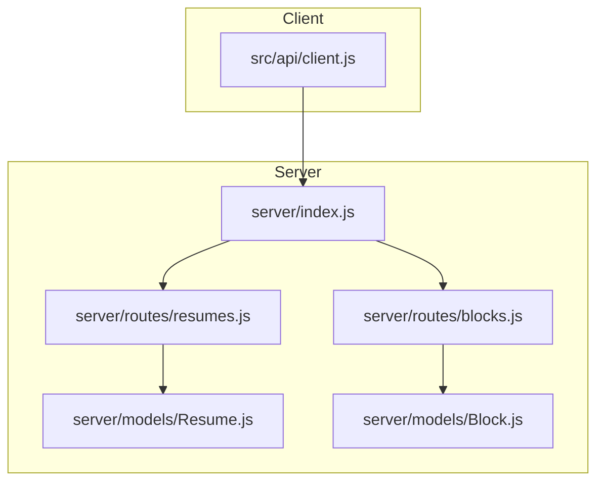
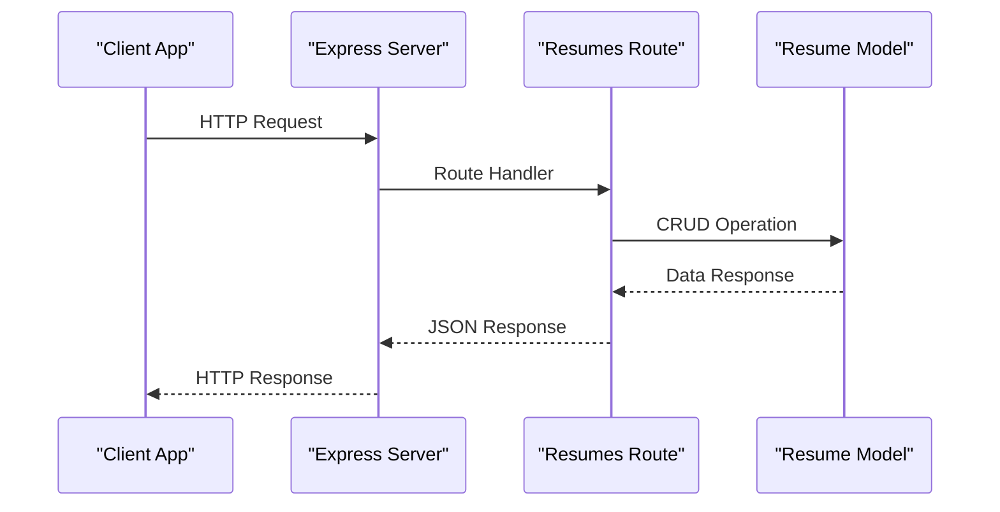
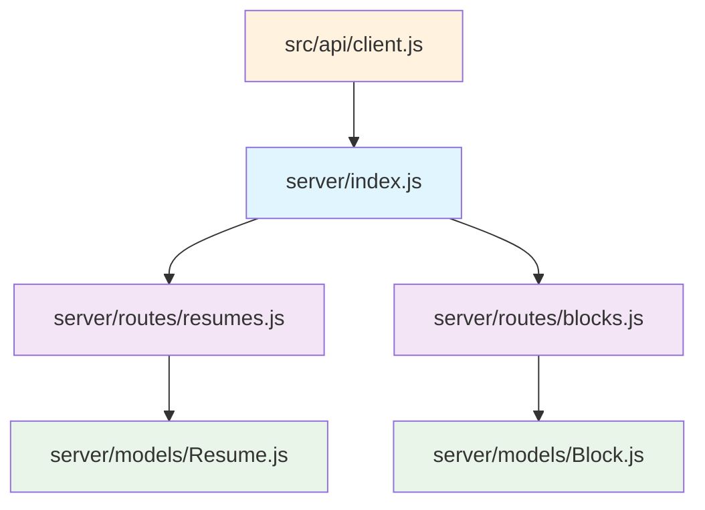

# Resumes API

<cite>
**Referenced Files in This Document**
- [server/index.js](file://server/index.js)
- [server/routes/resumes.js](file://server/routes/resumes.js)
- [server/routes/blocks.js](file://server/routes/blocks.js)
- [server/models/Resume.js](file://server/models/Resume.js)
- [server/models/Block.js](file://server/models/Block.js)
- [src/api/client.js](file://src/api/client.js)
</cite>

## Table of Contents
1. [Introduction](#introduction)
2. [Project Structure](#project-structure)
3. [Core Components](#core-components)
4. [Architecture Overview](#architecture-overview)
5. [Detailed Component Analysis](#detailed-component-analysis)
6. [Dependency Analysis](#dependency-analysis)
7. [Performance Considerations](#performance-considerations)
8. [Troubleshooting Guide](#troubleshooting-guide)
9. [Conclusion](#conclusion)
10. [Appendices](#appendices)

## Introduction
This document provides comprehensive API documentation for the Resumes management endpoints, including HTTP methods (GET, POST, PUT, DELETE), URL patterns, request/response schemas, and authentication requirements. It also details the Resume data model with field definitions, block relationships, and metadata structure. Concrete examples are provided to demonstrate creating new resumes, updating resume collections, retrieving resume data, and managing resume versions. Error responses, status codes, and validation errors are documented, along with integration examples showing proper request formatting and response handling.

## Project Structure
The project is organized into a server-side backend and a client-side frontend. The server exposes RESTful APIs for managing resumes and blocks, while the client interacts with these APIs using an HTTP client.



**Diagram sources**
- [server/index.js](file://server/index.js)
- [server/routes/resumes.js](file://server/routes/resumes.js)
- [server/routes/blocks.js](file://server/routes/blocks.js)
- [server/models/Resume.js](file://server/models/Resume.js)
- [server/models/Block.js](file://server/models/Block.js)
- [src/api/client.js](file://src/api/client.js)

**Section sources**
- [server/index.js](file://server/index.js)
- [server/routes/resumes.js](file://server/routes/resumes.js)
- [server/routes/blocks.js](file://server/routes/blocks.js)
- [server/models/Resume.js](file://server/models/Resume.js)
- [server/models/Block.js](file://server/models/Block.js)
- [src/api/client.js](file://src/api/client.js)

## Core Components
The core components include:
- **Resume Model**: Defines the schema and behavior for resume entities.
- **Block Model**: Defines the schema and behavior for block entities within resumes.
- **Resumes Route**: Handles HTTP requests for resume operations.
- **Blocks Route**: Handles HTTP requests for block operations.
- **API Client**: Manages HTTP requests from the client side.

**Section sources**
- [server/models/Resume.js](file://server/models/Resume.js)
- [server/models/Block.js](file://server/models/Block.js)
- [server/routes/resumes.js](file://server/routes/resumes.js)
- [server/routes/blocks.js](file://server/routes/blocks.js)
- [src/api/client.js](file://src/api/client.js)

## Architecture Overview
The system follows a typical MVC pattern where models represent data, routes handle HTTP requests, and the index file sets up the server. The client uses an API client to interact with the server.



**Diagram sources**
- [server/index.js](file://server/index.js)
- [server/routes/resumes.js](file://server/routes/resumes.js)
- [server/models/Resume.js](file://server/models/Resume.js)

## Detailed Component Analysis

### Resume Management Endpoints
The following endpoints are available for managing resumes:

#### GET /api/resumes
Retrieves all resumes or a specific resume by ID.

**Request Parameters:**
- `id` (optional): Resume ID to retrieve a specific resume

**Response Schema:**
- Array of resume objects or single resume object

**Authentication Requirements:**
- None specified

**Example Request:**
```http
GET /api/resumes
```

**Example Response:**
```json
[
  {
    "_id": "resume_id",
    "title": "My Resume",
    "blocks": ["block_id_1", "block_id_2"],
    "metadata": {
      "version": "1.0",
      "lastModified": "2023-01-01T00:00:00Z"
    }
  }
]
```

#### POST /api/resumes
Creates a new resume.

**Request Body Schema:**
```json
{
  "title": "string",
  "blocks": ["array_of_block_ids"],
  "metadata": {
    "version": "string",
    "lastModified": "ISO_date_string"
  }
}
```

**Response Schema:**
- Created resume object

**Authentication Requirements:**
- None specified

**Example Request:**
```http
POST /api/resumes
Content-Type: application/json

{
  "title": "New Resume",
  "blocks": [],
  "metadata": {
    "version": "1.0",
    "lastModified": "2023-01-01T00:00:00Z"
  }
}
```

#### PUT /api/resumes/:id
Updates an existing resume by ID.

**URL Parameters:**
- `id`: Resume ID to update

**Request Body Schema:**
Same as POST request body

**Response Schema:**
- Updated resume object

**Authentication Requirements:**
- None specified

**Example Request:**
```http
PUT /api/resumes/resume_id
Content-Type: application/json

{
  "title": "Updated Resume Title",
  "blocks": ["block_id_1"],
  "metadata": {
    "version": "1.1",
    "lastModified": "2023-01-02T00:00:00Z"
  }
}
```

#### DELETE /api/resumes/:id
Deletes a resume by ID.

**URL Parameters:**
- `id`: Resume ID to delete

**Response Schema:**
- Success message or deleted resume object

**Authentication Requirements:**
- None specified

**Example Request:**
```http
DELETE /api/resumes/resume_id
```

**Example Response:**
```json
{
  "message": "Resume deleted successfully"
}
```

**Section sources**
- [server/routes/resumes.js](file://server/routes/resumes.js)
- [server/models/Resume.js](file://server/models/Resume.js)

### Block Management Endpoints
The following endpoints are available for managing blocks:

#### GET /api/blocks
Retrieves all blocks or a specific block by ID.

#### POST /api/blocks
Creates a new block.

#### PUT /api/blocks/:id
Updates an existing block by ID.

#### DELETE /api/blocks/:id
Deletes a block by ID.

**Section sources**
- [server/routes/blocks.js](file://server/routes/blocks.js)
- [server/models/Block.js](file://server/models/Block.js)

### Resume Data Model
The Resume data model includes the following fields:

| Field | Type | Description | Required |
|-------|------|-------------|----------|
| `_id` | ObjectId | Unique identifier for the resume | Yes |
| `title` | String | Title of the resume | Yes |
| `blocks` | Array | Array of block IDs associated with the resume | No |
| `metadata` | Object | Metadata containing version and modification info | No |

#### Metadata Structure
| Field | Type | Description |
|-------|------|-------------|
| `version` | String | Version number of the resume |
| `lastModified` | Date | Timestamp of last modification |

#### Block Relationships
Resumes maintain relationships with blocks through the `blocks` array, which contains references to block IDs.

**Section sources**
- [server/models/Resume.js](file://server/models/Resume.js)
- [server/models/Block.js](file://server/models/Block.js)

### Authentication Requirements
Based on the current implementation, no authentication middleware is applied to the resume endpoints. All endpoints are publicly accessible.

**Section sources**
- [server/index.js](file://server/index.js)
- [server/routes/resumes.js](file://server/routes/resumes.js)

## Dependency Analysis
The following diagram shows the dependencies between components:



**Diagram sources**
- [server/index.js](file://server/index.js)
- [server/routes/resumes.js](file://server/routes/resumes.js)
- [server/routes/blocks.js](file://server/routes/blocks.js)
- [server/models/Resume.js](file://server/models/Resume.js)
- [server/models/Block.js](file://server/models/Block.js)
- [src/api/client.js](file://src/api/client.js)

**Section sources**
- [server/index.js](file://server/index.js)
- [server/routes/resumes.js](file://server/routes/resumes.js)
- [server/routes/blocks.js](file://server/routes/blocks.js)
- [server/models/Resume.js](file://server/models/Resume.js)
- [server/models/Block.js](file://server/models/Block.js)
- [src/api/client.js](file://src/api/client.js)

## Performance Considerations
- Implement pagination for large resume collections
- Add caching mechanisms for frequently accessed resumes
- Use database indexing on commonly queried fields like title and creation date
- Optimize block loading by implementing lazy loading for resume blocks
- Consider implementing rate limiting to prevent abuse

## Troubleshooting Guide

### Common Error Responses

#### 404 Not Found
- **Cause**: Resume or block ID not found
- **Solution**: Verify the ID exists before making requests

#### 400 Bad Request
- **Cause**: Invalid request body or missing required fields
- **Solution**: Validate request data against the schema

#### 500 Internal Server Error
- **Cause**: Database connection issues or server errors
- **Solution**: Check server logs and database connectivity

### Validation Errors
- Missing required fields in request body
- Invalid data types for fields
- Duplicate resume titles (if enforced)

**Section sources**
- [server/routes/resumes.js](file://server/routes/resumes.js)
- [server/models/Resume.js](file://server/models/Resume.js)

## Conclusion
The Resumes API provides a comprehensive set of endpoints for managing resume data with a clean RESTful design. The system supports full CRUD operations for both resumes and blocks, with clear data models and relationships. While currently lacking authentication, the architecture allows for easy addition of security features. The API is well-suited for building resume management applications with proper error handling and performance optimizations.

## Appendices

### Integration Examples

#### Creating a New Resume via API Client
```javascript
// Using the API client
const newResume = await apiClient.post('/resumes', {
  title: 'Professional Resume',
  blocks: [],
  metadata: {
    version: '1.0',
    lastModified: new Date().toISOString()
  }
});
```

#### Updating Resume Collection
```javascript
// Update multiple resumes
const updatedResumes = await Promise.all(
  resumes.map(resume => 
    apiClient.put(`/resumes/${resume._id}`, {
      ...resume,
      metadata: {
        ...resume.metadata,
        version: `${parseInt(resume.metadata.version) + 0.1}`
      }
    })
  )
);
```

#### Managing Resume Versions
```javascript
// Create versioned resume
const createVersionedResume = async (baseResumeId) => {
  const baseResume = await apiClient.get(`/resumes/${baseResumeId}`);
  const newVersion = {
    ...baseResume,
    _id: undefined,
    metadata: {
      ...baseResume.metadata,
      version: `${parseInt(baseResume.metadata.version) + 1}`,
      lastModified: new Date().toISOString(),
      previousVersion: baseResume._id
    }
  };
  
  return await apiClient.post('/resumes', newVersion);
};
```

**Section sources**
- [src/api/client.js](file://src/api/client.js)
- [server/routes/resumes.js](file://server/routes/resumes.js)