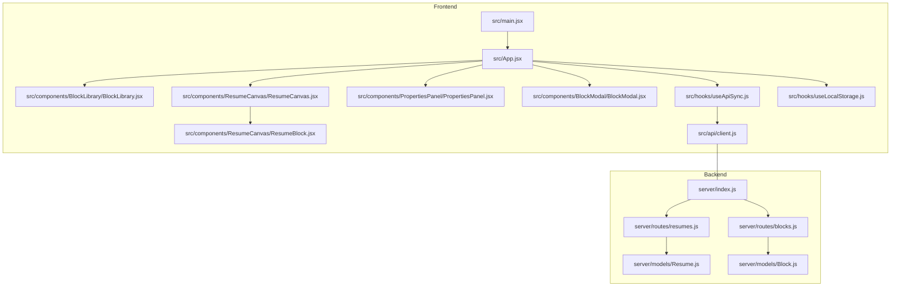
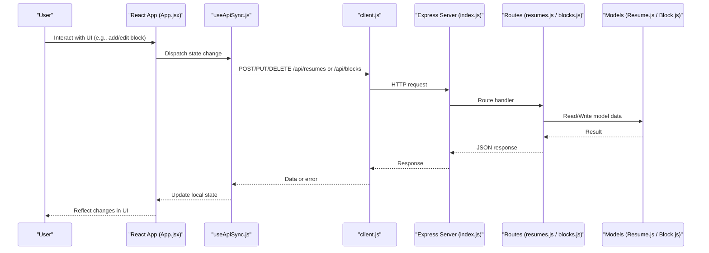
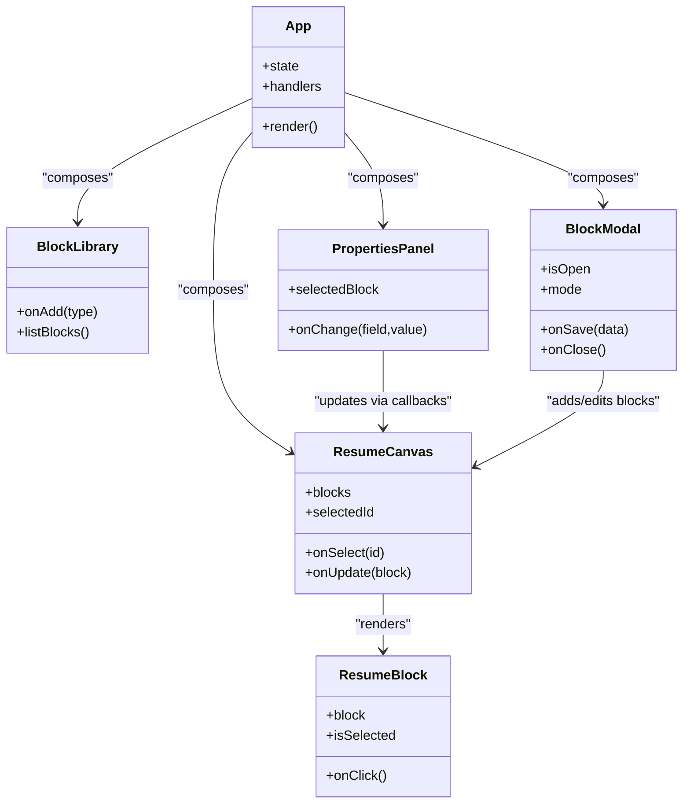
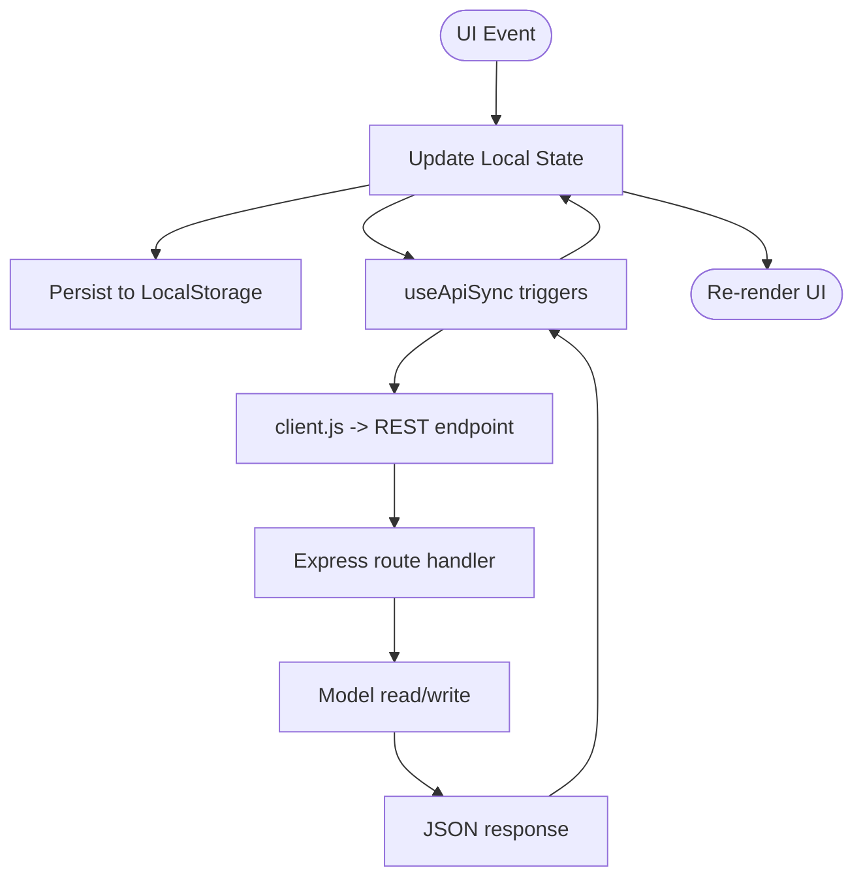
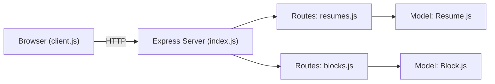
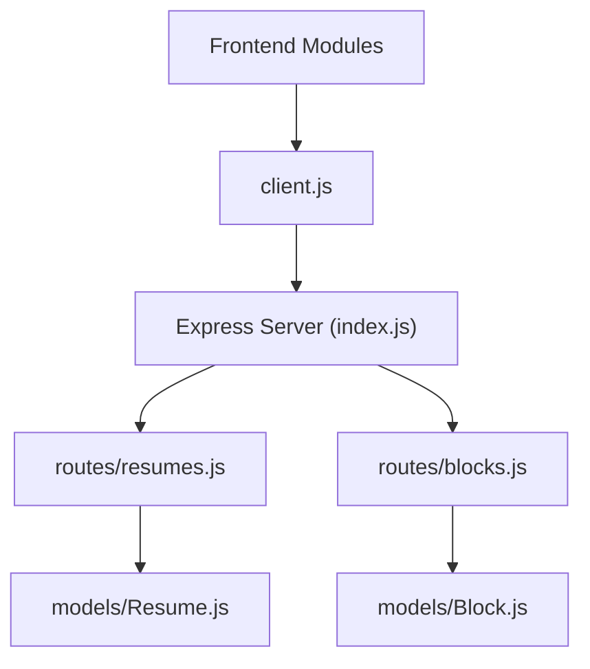

# Architecture Overview

<cite>
**Referenced Files in This Document**
- [index.js](file://server/index.js)
- [Resume.js](file://server/models/Resume.js)
- [Block.js](file://server/models/Block.js)
- [resumes.js](file://server/routes/resumes.js)
- [blocks.js](file://server/routes/blocks.js)
- [App.jsx](file://src/App.jsx)
- [main.jsx](file://src/main.jsx)
- [client.js](file://src/api/client.js)
- [useApiSync.js](file://src/hooks/useApiSync.js)
- [useLocalStorage.js](file://src/hooks/useLocalStorage.js)
- [BlockLibrary.jsx](file://src/components/BlockLibrary/BlockLibrary.jsx)
- [BlockModal.jsx](file://src/components/BlockModal/BlockModal.jsx)
- [PropertiesPanel.jsx](file://src/components/PropertiesPanel/PropertiesPanel.jsx)
- [ResumeCanvas.jsx](file://src/components/ResumeCanvas/ResumeCanvas.jsx)
- [ResumeBlock.jsx](file://src/components/ResumeCanvas/ResumeBlock.jsx)
</cite>

## Table of Contents
1. [Introduction](#introduction)
2. [Project Structure](#project-structure)
3. [Core Components](#core-components)
4. [Architecture Overview](#architecture-overview)
5. [Detailed Component Analysis](#detailed-component-analysis)
6. [Dependency Analysis](#dependency-analysis)
7. [Performance Considerations](#performance-considerations)
8. [Troubleshooting Guide](#troubleshooting-guide)
9. [Conclusion](#conclusion)

## Introduction
This document describes the architecture of the Modular Resume Builder system, focusing on the separation between a React frontend and an Express.js backend. It explains the component hierarchy from App down to UI components, details data flow from user interactions through state management to API calls and database operations, and outlines system boundaries for REST communication. The backend follows an MVC-like pattern with models, routes, and server configuration. Cross-cutting concerns such as CORS handling, error management, and state synchronization are addressed.

## Project Structure
The repository is organized into two main layers:
- Frontend (React + Vite): src directory containing application entry point, components, hooks, utilities, and API client.
- Backend (Express.js): server directory containing server bootstrap, models, and route handlers.

**Diagram sources**
- [main.jsx](file://src/main.jsx)
- [App.jsx](file://src/App.jsx)
- [BlockLibrary.jsx](file://src/components/BlockLibrary/BlockLibrary.jsx)
- [ResumeCanvas.jsx](file://src/components/ResumeCanvas/ResumeCanvas.jsx)
- [ResumeBlock.jsx](file://src/components/ResumeCanvas/ResumeBlock.jsx)
- [PropertiesPanel.jsx](file://src/components/PropertiesPanel/PropertiesPanel.jsx)
- [BlockModal.jsx](file://src/components/BlockModal/BlockModal.jsx)
- [useApiSync.js](file://src/hooks/useApiSync.js)
- [useLocalStorage.js](file://src/hooks/useLocalStorage.js)
- [client.js](file://src/api/client.js)
- [index.js](file://server/index.js)
- [resumes.js](file://server/routes/resumes.js)
- [blocks.js](file://server/routes/blocks.js)
- [Resume.js](file://server/models/Resume.js)
- [Block.js](file://server/models/Block.js)

**Section sources**
- [main.jsx](file://src/main.jsx)
- [App.jsx](file://src/App.jsx)
- [index.js](file://server/index.js)

## Core Components
- Application shell (App): Orchestrates layout and global state, composes top-level UI components, and wires up data synchronization hooks.
- Canvas and blocks: ResumeCanvas renders the resume layout; ResumeBlock represents individual content blocks within the canvas.
- Library and modal: BlockLibrary provides available block types; BlockModal handles adding or editing blocks.
- Properties panel: PropertiesPanel exposes editable fields for selected block properties.
- State synchronization: useApiSync coordinates local state changes with remote persistence via REST endpoints; useLocalStorage persists draft state locally.
- API client: client.js centralizes HTTP requests to the backend.

Key responsibilities and relationships:
- App manages high-level state and passes props/callbacks to child components.
- ResumeCanvas listens to selection and updates, rendering ResumeBlock instances.
- BlockLibrary and BlockModal trigger creation/editing flows that update shared state.
- PropertiesPanel emits property changes that propagate back to the canvas and sync layer.
- useApiSync translates state mutations into API calls using client.js.
- useLocalStorage ensures resilience by persisting drafts across sessions.

**Section sources**
- [App.jsx](file://src/App.jsx)
- [ResumeCanvas.jsx](file://src/components/ResumeCanvas/ResumeCanvas.jsx)
- [ResumeBlock.jsx](file://src/components/ResumeCanvas/ResumeBlock.jsx)
- [BlockLibrary.jsx](file://src/components/BlockLibrary/BlockLibrary.jsx)
- [BlockModal.jsx](file://src/components/BlockModal/BlockModal.jsx)
- [PropertiesPanel.jsx](file://src/components/PropertiesPanel/PropertiesPanel.jsx)
- [useApiSync.js](file://src/hooks/useApiSync.js)
- [useLocalStorage.js](file://src/hooks/useLocalStorage.js)
- [client.js](file://src/api/client.js)

## Architecture Overview
The system follows a clear separation of concerns:
- Frontend: React-based SPA built with Vite, managing UI state and orchestrating user interactions.
- Backend: Express.js server exposing REST endpoints for resumes and blocks, backed by model abstractions.
- Communication: Frontend uses fetch-based HTTP calls to backend endpoints.

System boundaries and cross-cutting concerns:
- CORS: Configured on the server to allow browser-origin requests from the frontend.
- Error management: Centralized error handling on the server; consistent error responses consumed by the frontend.
- State synchronization: Local-first approach with optimistic updates and background persistence via useApiSync.

**Diagram sources**
- [App.jsx](file://src/App.jsx)
- [useApiSync.js](file://src/hooks/useApiSync.js)
- [client.js](file://src/api/client.js)
- [index.js](file://server/index.js)
- [resumes.js](file://server/routes/resumes.js)
- [blocks.js](file://server/routes/blocks.js)
- [Resume.js](file://server/models/Resume.js)
- [Block.js](file://server/models/Block.js)

## Detailed Component Analysis

### Frontend Component Hierarchy
The React tree starts at App and branches into major feature areas:
- App composes BlockLibrary, ResumeCanvas, PropertiesPanel, and BlockModal.
- ResumeCanvas renders multiple ResumeBlock instances based on current resume state.
- PropertiesPanel reacts to selected block and emits updates.
- BlockModal drives creation/editing workflows and integrates with library and canvas.

**Diagram sources**
- [App.jsx](file://src/App.jsx)
- [BlockLibrary.jsx](file://src/components/BlockLibrary/BlockLibrary.jsx)
- [ResumeCanvas.jsx](file://src/components/ResumeCanvas/ResumeCanvas.jsx)
- [ResumeBlock.jsx](file://src/components/ResumeCanvas/ResumeBlock.jsx)
- [PropertiesPanel.jsx](file://src/components/PropertiesPanel/PropertiesPanel.jsx)
- [BlockModal.jsx](file://src/components/BlockModal/BlockModal.jsx)

**Section sources**
- [App.jsx](file://src/App.jsx)
- [BlockLibrary.jsx](file://src/components/BlockLibrary/BlockLibrary.jsx)
- [ResumeCanvas.jsx](file://src/components/ResumeCanvas/ResumeCanvas.jsx)
- [ResumeBlock.jsx](file://src/components/ResumeCanvas/ResumeBlock.jsx)
- [PropertiesPanel.jsx](file://src/components/PropertiesPanel/PropertiesPanel.jsx)
- [BlockModal.jsx](file://src/components/BlockModal/BlockModal.jsx)

### Data Flow and State Synchronization
Data flow spans UI events, local state, persistence, and remote API:
- User actions in UI components trigger state updates in App or context.
- useApiSync observes state changes and issues corresponding API calls via client.js.
- useLocalStorage persists draft state to ensure recovery after reload.
- Backend routes handle CRUD operations and delegate to models for data access.

**Diagram sources**
- [useApiSync.js](file://src/hooks/useApiSync.js)
- [useLocalStorage.js](file://src/hooks/useLocalStorage.js)
- [client.js](file://src/api/client.js)
- [resumes.js](file://server/routes/resumes.js)
- [blocks.js](file://server/routes/blocks.js)
- [Resume.js](file://server/models/Resume.js)
- [Block.js](file://server/models/Block.js)

**Section sources**
- [useApiSync.js](file://src/hooks/useApiSync.js)
- [useLocalStorage.js](file://src/hooks/useLocalStorage.js)
- [client.js](file://src/api/client.js)
- [resumes.js](file://server/routes/resumes.js)
- [blocks.js](file://server/routes/blocks.js)
- [Resume.js](file://server/models/Resume.js)
- [Block.js](file://server/models/Block.js)

### Backend MVC-like Separation
The backend organizes code into:
- Models: Resume.js and Block.js encapsulate data structures and operations.
- Routes: resumes.js and blocks.js define REST endpoints and orchestrate model usage.
- Server: index.js configures middleware (including CORS), mounts routes, and starts the HTTP server.

**Diagram sources**
- [index.js](file://server/index.js)
- [resumes.js](file://server/routes/resumes.js)
- [blocks.js](file://server/routes/blocks.js)
- [Resume.js](file://server/models/Resume.js)
- [Block.js](file://server/models/Block.js)

**Section sources**
- [index.js](file://server/index.js)
- [resumes.js](file://server/routes/resumes.js)
- [blocks.js](file://server/routes/blocks.js)
- [Resume.js](file://server/models/Resume.js)
- [Block.js](file://server/models/Block.js)

## Dependency Analysis
High-level dependencies:
- Frontend depends on React runtime and internal modules (hooks, components, API client).
- Backend depends on Express and its routing/middleware ecosystem.
- API client abstracts HTTP transport and URL patterns used by routes.

**Diagram sources**
- [client.js](file://src/api/client.js)
- [index.js](file://server/index.js)
- [resumes.js](file://server/routes/resumes.js)
- [blocks.js](file://server/routes/blocks.js)
- [Resume.js](file://server/models/Resume.js)
- [Block.js](file://server/models/Block.js)

**Section sources**
- [client.js](file://src/api/client.js)
- [index.js](file://server/index.js)
- [resumes.js](file://server/routes/resumes.js)
- [blocks.js](file://server/routes/blocks.js)
- [Resume.js](file://server/models/Resume.js)
- [Block.js](file://server/models/Block.js)

## Performance Considerations
- Prefer batching or debouncing frequent property edits before issuing API calls to reduce network overhead.
- Use optimistic UI updates to improve perceived responsiveness; reconcile with server state on success or rollback on failure.
- Keep payload sizes minimal by sending only changed fields when updating blocks or resumes.
- Cache static assets and leverage browser caching where appropriate for faster page loads.

[No sources needed since this section provides general guidance]

## Troubleshooting Guide
Common issues and strategies:
- CORS errors: Ensure the server enables CORS for the frontend origin and allowed methods/headers. Verify that preflight requests succeed.
- Network failures: Implement retries with exponential backoff for transient errors; surface meaningful messages to users.
- State drift: Validate server responses against expected schema; reconcile local state if discrepancies occur.
- Persistence conflicts: When both local storage and server exist, prefer last-writer-wins with clear conflict resolution rules.

Operational checks:
- Confirm that routes mount correctly under expected paths.
- Validate model operations return consistent shapes for successful and error cases.
- Inspect browser network tab for request/response payloads and status codes.

**Section sources**
- [index.js](file://server/index.js)
- [resumes.js](file://server/routes/resumes.js)
- [blocks.js](file://server/routes/blocks.js)
- [Resume.js](file://server/models/Resume.js)
- [Block.js](file://server/models/Block.js)
- [client.js](file://src/api/client.js)

## Conclusion
The Modular Resume Builder separates concerns cleanly between a React frontend and an Express backend. The frontend’s component hierarchy centers around App, which composes canvas, library, modal, and properties panels. State synchronization is handled by hooks that bridge local state, persistence, and REST APIs. The backend follows an MVC-like structure with models, routes, and server configuration, including CORS and error handling. This design supports maintainability, scalability, and a responsive user experience.