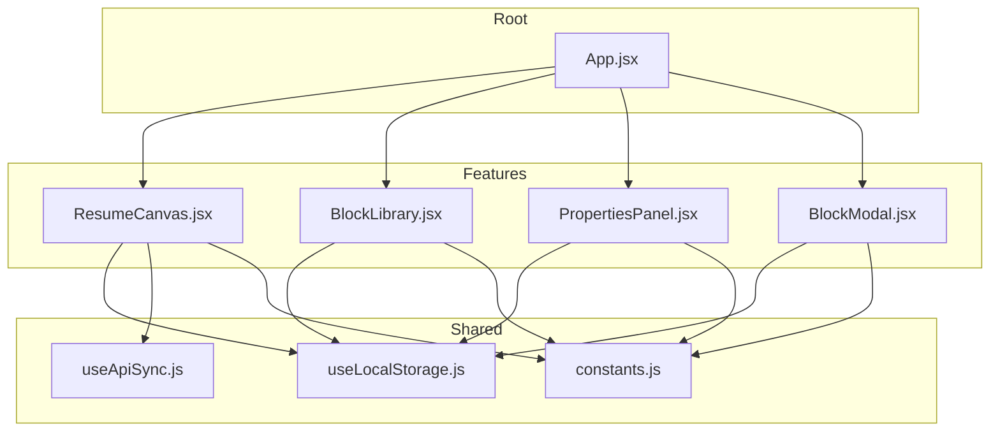
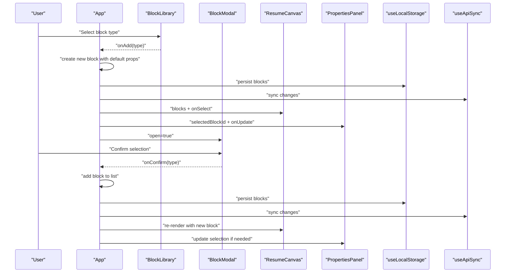
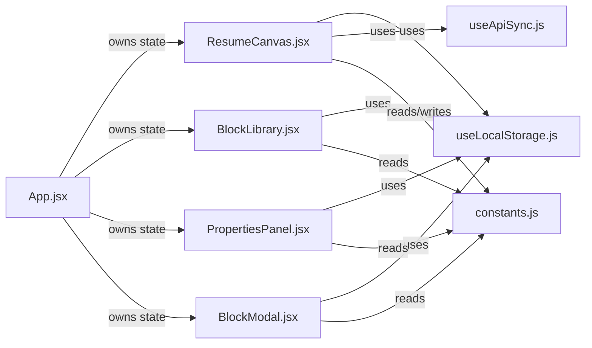

# Component Hierarchy

<cite>
**Referenced Files in This Document**
- [App.jsx](file://src/App.jsx)
- [ResumeCanvas.jsx](file://src/components/ResumeCanvas/ResumeCanvas.jsx)
- [BlockLibrary.jsx](file://src/components/BlockLibrary/BlockLibrary.jsx)
- [PropertiesPanel.jsx](file://src/components/PropertiesPanel/PropertiesPanel.jsx)
- [BlockModal.jsx](file://src/components/BlockModal/BlockModal.jsx)
- [useLocalStorage.js](file://src/hooks/useLocalStorage.js)
- [useApiSync.js](file://src/hooks/useApiSync.js)
- [constants.js](file://src/utils/constants.js)
</cite>

## Table of Contents
1. [Introduction](#introduction)
2. [Project Structure](#project-structure)
3. [Core Components](#core-components)
4. [Architecture Overview](#architecture-overview)
5. [Detailed Component Analysis](#detailed-component-analysis)
6. [Dependency Analysis](#dependency-analysis)
7. [Performance Considerations](#performance-considerations)
8. [Troubleshooting Guide](#troubleshooting-guide)
9. [Conclusion](#conclusion)

## Introduction
This document explains the React component hierarchy and relationships for the Modular Resume Builder. It focuses on how the root App component orchestrates child components, how data flows via props and events, and how state is lifted to enable shared behavior across the canvas, library, properties panel, and modal. It also covers composition patterns, lifecycle considerations, and performance strategies.

## Project Structure
The application organizes UI features into feature folders under src/components, with shared logic in hooks and utilities. The root App component composes the main layout and manages global state that is passed down to child components.

**Diagram sources**
- [App.jsx](file://src/App.jsx)
- [ResumeCanvas.jsx](file://src/components/ResumeCanvas/ResumeCanvas.jsx)
- [BlockLibrary.jsx](file://src/components/BlockLibrary/BlockLibrary.jsx)
- [PropertiesPanel.jsx](file://src/components/PropertiesPanel/PropertiesPanel.jsx)
- [BlockModal.jsx](file://src/components/BlockModal/BlockModal.jsx)
- [useLocalStorage.js](file://src/hooks/useLocalStorage.js)
- [useApiSync.js](file://src/hooks/useApiSync.js)
- [constants.js](file://src/utils/constants.js)

**Section sources**
- [App.jsx](file://src/App.jsx)
- [ResumeCanvas.jsx](file://src/components/ResumeCanvas/ResumeCanvas.jsx)
- [BlockLibrary.jsx](file://src/components/BlockLibrary/BlockLibrary.jsx)
- [PropertiesPanel.jsx](file://src/components/PropertiesPanel/PropertiesPanel.jsx)
- [BlockModal.jsx](file://src/components/BlockModal/BlockModal.jsx)
- [useLocalStorage.js](file://src/hooks/useLocalStorage.js)
- [useApiSync.js](file://src/hooks/useApiSync.js)
- [constants.js](file://src/utils/constants.js)

## Core Components
- App: Root container that holds the canonical resume blocks state, selection state, and modal visibility. It lifts state up and passes it down as props, while exposing event handlers to mutate state.
- ResumeCanvas: Renders the visual resume by mapping over blocks. Handles block selection and deletion, and requests opening the BlockModal when adding a new block.
- BlockLibrary: Displays available block types and triggers an add event when a user chooses a block type.
- PropertiesPanel: Shows editable properties for the currently selected block and emits change events back to the parent.
- BlockModal: Presents a form or picker to select a block type; upon confirmation, it emits an add event to the parent.

Key responsibilities and interactions:
- State ownership: App owns blocks, selectedBlockId, and modal open flag.
- Data flow: Parent-to-child via props (blocks, selectedBlockId, onAdd, onSelect, onDelete, onUpdate, onOpenModal).
- Event flow: Child-to-parent via callbacks (onAdd, onSelect, onDelete, onUpdate, onCloseModal).
- Persistence: useLocalStorage persists blocks and selection across sessions.
- Sync: useApiSync can persist changes to a backend server.

**Section sources**
- [App.jsx](file://src/App.jsx)
- [ResumeCanvas.jsx](file://src/components/ResumeCanvas/ResumeCanvas.jsx)
- [BlockLibrary.jsx](file://src/components/BlockLibrary/BlockLibrary.jsx)
- [PropertiesPanel.jsx](file://src/components/PropertiesPanel/PropertiesPanel.jsx)
- [BlockModal.jsx](file://src/components/BlockModal/BlockModal.jsx)
- [useLocalStorage.js](file://src/hooks/useLocalStorage.js)
- [useApiSync.js](file://src/hooks/useApiSync.js)

## Architecture Overview
The architecture follows a unidirectional data flow pattern with state lifting at the root. Children are mostly presentational and communicate upward through callback props. Shared persistence and sync concerns are abstracted into hooks.

**Diagram sources**
- [App.jsx](file://src/App.jsx)
- [BlockLibrary.jsx](file://src/components/BlockLibrary/BlockLibrary.jsx)
- [BlockModal.jsx](file://src/components/BlockModal/BlockModal.jsx)
- [ResumeCanvas.jsx](file://src/components/ResumeCanvas/ResumeCanvas.jsx)
- [PropertiesPanel.jsx](file://src/components/PropertiesPanel/PropertiesPanel.jsx)
- [useLocalStorage.js](file://src/hooks/useLocalStorage.js)
- [useApiSync.js](file://src/hooks/useApiSync.js)

## Detailed Component Analysis

### App (Root Container)
Role:
- Owns canonical state: blocks array, selectedBlockId, and modal open flag.
- Provides event handlers to add, update, delete, and select blocks.
- Composes child components and wires their props and callbacks.
- Integrates persistence via useLocalStorage and optional server sync via useApiSync.

State lifting strategy:
- All mutable state lives in App and is passed down as props.
- Child components never mutate state directly; they emit events to App.

Composition patterns:
- Layout composition: App renders a grid or flex layout containing Canvas, Library, Panel, and Modal.
- Controlled children: Canvas, Panel, and Modal receive controlled props (e.g., blocks, selectedBlockId, isOpen).

Lifecycle considerations:
- On mount, initialize state from localStorage.
- On state changes, persist to localStorage and optionally sync to server.

Performance considerations:
- Memoize derived values and stable callbacks where appropriate.
- Avoid unnecessary re-renders by passing stable references and using memoization in children.

**Section sources**
- [App.jsx](file://src/App.jsx)
- [useLocalStorage.js](file://src/hooks/useLocalStorage.js)
- [useApiSync.js](file://src/hooks/useApiSync.js)

### ResumeCanvas
Role:
- Renders the resume by iterating over blocks.
- Highlights the selected block and allows deletion.
- Requests opening the modal to add a new block.

Props:
- blocks: array of block objects.
- selectedBlockId: id of the currently selected block.
- onSelect(id): callback to select a block.
- onDelete(id): callback to remove a block.
- onAdd(): callback to open the modal.

Events:
- Emits onSelect and onDelete to App.
- Emits onAdd to request modal open.

Data flow:
- Reads blocks and selectedBlockId from props.
- Calls parent-provided callbacks to mutate state.

Lifecycle:
- Re-renders when blocks or selectedBlockId change.

Performance:
- Use stable keys for each block item.
- Consider memoizing block rendering if blocks are large.

**Section sources**
- [ResumeCanvas.jsx](file://src/components/ResumeCanvas/ResumeCanvas.jsx)

### BlockLibrary
Role:
- Displays available block types.
- Emits an add event when a user selects a type.

Props:
- onAdd(type): callback to add a new block of the given type.

Events:
- Emits onAdd(type) to App.

Data flow:
- Pure presentation; no local state about blocks.

Lifecycle:
- Re-renders only if its own props change.

Performance:
- Keep render lightweight; avoid heavy computations in render.

**Section sources**
- [BlockLibrary.jsx](file://src/components/BlockLibrary/BlockLibrary.jsx)

### PropertiesPanel
Role:
- Displays and edits properties of the currently selected block.
- Emits updates back to App.

Props:
- selectedBlockId: id of the selected block.
- blocks: full blocks array to locate the current block.
- onUpdate(id, patch): callback to apply property changes.

Events:
- Emits onUpdate(id, patch) to App.

Data flow:
- Locates the current block from blocks using selectedBlockId.
- Sends patches back to App for centralized mutation.

Lifecycle:
- Updates when selectedBlockId or blocks change.

Performance:
- Avoid deep equality checks; rely on id-based lookups.
- Debounce rapid input changes if necessary.

**Section sources**
- [PropertiesPanel.jsx](file://src/components/PropertiesPanel/PropertiesPanel.jsx)

### BlockModal
Role:
- Presents a modal to choose a block type.
- Confirms selection and returns the chosen type to App.

Props:
- isOpen: boolean controlling visibility.
- onConfirm(type): callback to confirm selection.
- onClose(): callback to dismiss without changes.

Events:
- Emits onConfirm(type) and onClose() to App.

Data flow:
- Controlled by isOpen prop.
- Returns selected type via onConfirm.

Lifecycle:
- Mount/unmount based on isOpen.
- Focus management and keyboard handling should be considered for accessibility.

Performance:
- Lazy-mount content if modal is heavy.

**Section sources**
- [BlockModal.jsx](file://src/components/BlockModal/BlockModal.jsx)

### Hooks and Utilities
- useLocalStorage: Persists blocks and selection across sessions. Used by App and potentially other components to maintain state consistency.
- useApiSync: Optionally synchronizes state changes to a remote server. Integrated after local persistence to ensure offline-first behavior.
- constants: Centralizes configuration such as block type definitions and default property sets.

Usage patterns:
- Initialize state from localStorage on first render.
- Persist state on every meaningful change.
- Trigger server sync after successful local persistence.

**Section sources**
- [useLocalStorage.js](file://src/hooks/useLocalStorage.js)
- [useApiSync.js](file://src/hooks/useApiSync.js)
- [constants.js](file://src/utils/constants.js)

## Dependency Analysis
The following diagram shows how components depend on hooks and utilities, and how they interact with each other through props and events.

**Diagram sources**
- [App.jsx](file://src/App.jsx)
- [ResumeCanvas.jsx](file://src/components/ResumeCanvas/ResumeCanvas.jsx)
- [BlockLibrary.jsx](file://src/components/BlockLibrary/BlockLibrary.jsx)
- [PropertiesPanel.jsx](file://src/components/PropertiesPanel/PropertiesPanel.jsx)
- [BlockModal.jsx](file://src/components/BlockModal/BlockModal.jsx)
- [useLocalStorage.js](file://src/hooks/useLocalStorage.js)
- [useApiSync.js](file://src/hooks/useApiSync.js)
- [constants.js](file://src/utils/constants.js)

**Section sources**
- [App.jsx](file://src/App.jsx)
- [ResumeCanvas.jsx](file://src/components/ResumeCanvas/ResumeCanvas.jsx)
- [BlockLibrary.jsx](file://src/components/BlockLibrary/BlockLibrary.jsx)
- [PropertiesPanel.jsx](file://src/components/PropertiesPanel/PropertiesPanel.jsx)
- [BlockModal.jsx](file://src/components/BlockModal/BlockModal.jsx)
- [useLocalStorage.js](file://src/hooks/useLocalStorage.js)
- [useApiSync.js](file://src/hooks/useApiSync.js)
- [constants.js](file://src/utils/constants.js)

## Performance Considerations
- Minimize re-renders:
  - Pass stable function references for callbacks (memoize if needed).
  - Use memoization in child components for expensive renders.
- Efficient updates:
  - Update only changed fields in properties panel (patch updates).
  - Avoid spreading large objects unnecessarily.
- Rendering lists:
  - Ensure unique, stable keys for each block item.
- I/O operations:
  - Debounce frequent writes to localStorage and API calls.
  - Batch multiple state updates when possible.
- Modal optimization:
  - Lazy-load modal content if it contains heavy components.

[No sources needed since this section provides general guidance]

## Troubleshooting Guide
Common issues and resolutions:
- Blocks not persisting:
  - Verify that state updates trigger persistence in the hook and that storage permissions are allowed.
- Selected block not updating:
  - Confirm that selectedBlockId is correctly propagated and that updates use the same id reference.
- Modal not closing:
  - Ensure onClose is wired and that isOpen reflects the modal’s actual state.
- Duplicate blocks added:
  - Check that add handlers create unique ids and do not duplicate entries.
- Slow editing in properties panel:
  - Debounce input handlers and avoid recomputing derived data on every keystroke.

**Section sources**
- [useLocalStorage.js](file://src/hooks/useLocalStorage.js)
- [useApiSync.js](file://src/hooks/useApiSync.js)
- [App.jsx](file://src/App.jsx)
- [PropertiesPanel.jsx](file://src/components/PropertiesPanel/PropertiesPanel.jsx)
- [BlockModal.jsx](file://src/components/BlockModal/BlockModal.jsx)

## Conclusion
The application uses a clear, scalable component hierarchy with state lifted to the root App component. Children communicate via props and events, keeping data flow predictable and testable. Persistence and synchronization are abstracted into reusable hooks, improving separation of concerns. Following the recommended performance practices will keep the editor responsive as resumes grow in complexity.