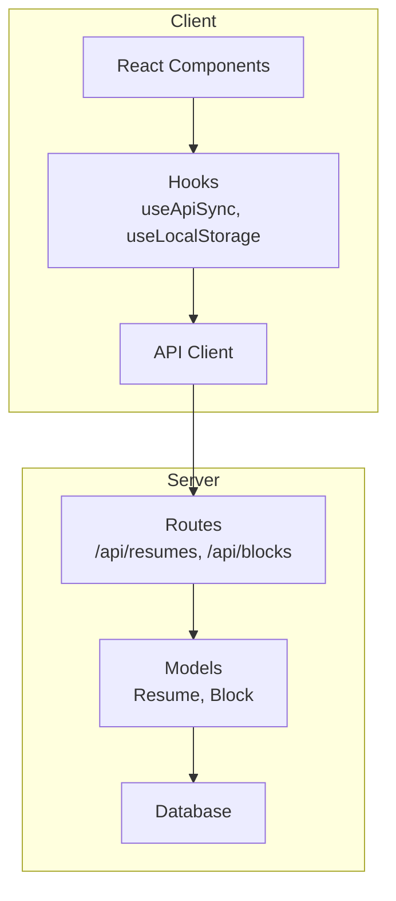
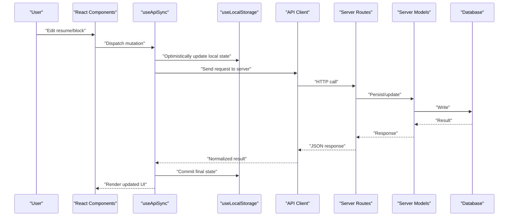
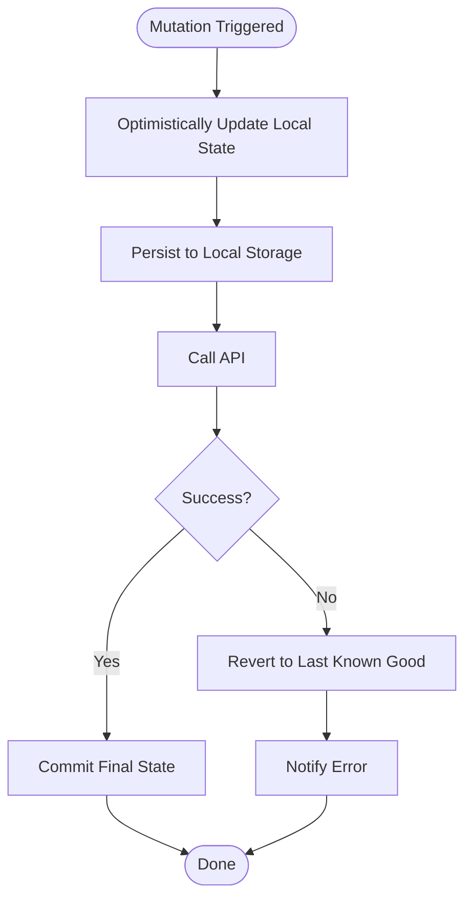
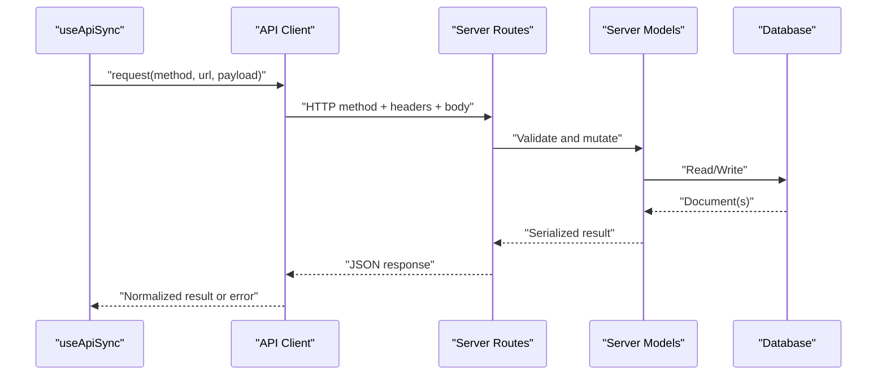
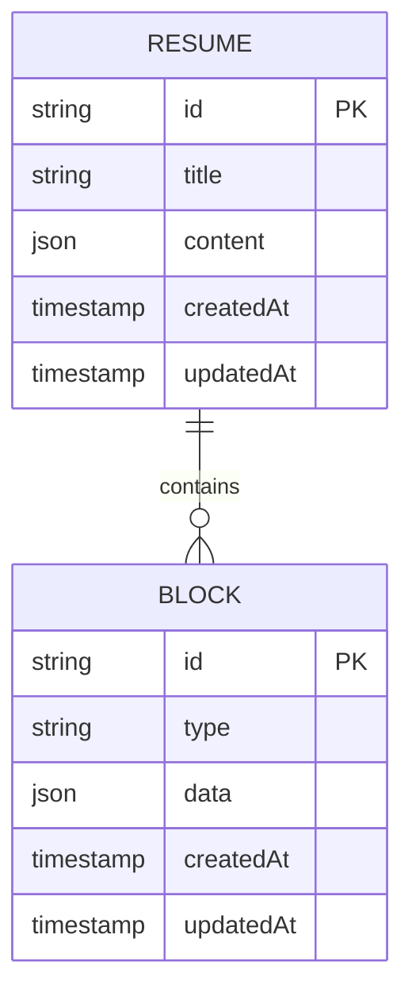
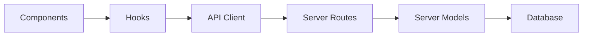
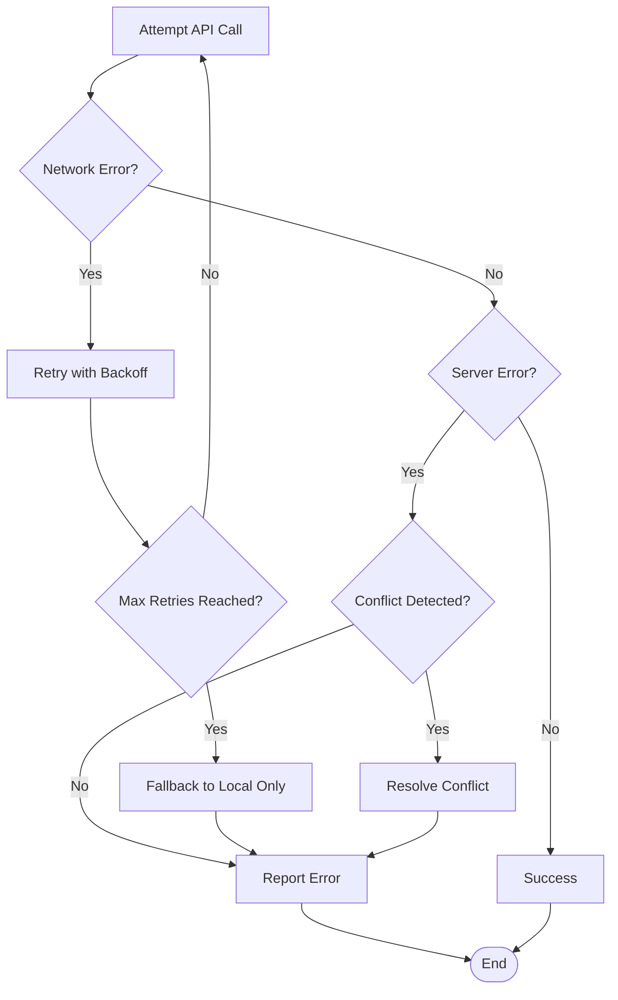

# Data Flow Architecture

<cite>
**Referenced Files in This Document**
- [useApiSync.js](file://src/hooks/useApiSync.js)
- [useLocalStorage.js](file://src/hooks/useLocalStorage.js)
- [client.js](file://src/api/client.js)
- [index.js](file://server/index.js)
- [Resume.js](file://server/models/Resume.js)
- [Block.js](file://server/models/Block.js)
- [resumes.js](file://server/routes/resumes.js)
- [blocks.js](file://server/routes/blocks.js)
- [App.jsx](file://src/App.jsx)
- [main.jsx](file://src/main.jsx)
</cite>

## Table of Contents
1. [Introduction](#introduction)
2. [Project Structure](#project-structure)
3. [Core Components](#core-components)
4. [Architecture Overview](#architecture-overview)
5. [Detailed Component Analysis](#detailed-component-analysis)
6. [Dependency Analysis](#dependency-analysis)
7. [Performance Considerations](#performance-considerations)
8. [Troubleshooting Guide](#troubleshooting-guide)
9. [Conclusion](#conclusion)

## Introduction

This document explains the end-to-end data flow architecture of the application, covering user interactions, React state updates, API calls, and database persistence. It also documents the dual storage strategy (local storage for immediate persistence and API sync for server-side data), optimistic update patterns, error handling and retry mechanisms, synchronization strategies, conflict resolution approaches, and performance optimizations such as debouncing and caching.

## Project Structure

The application is organized into client-side hooks and components, an API client, and a Node/Express server with models and routes. Key areas relevant to data flow include:

- Client hooks: useApiSync and useLocalStorage implement the dual storage strategy and optimistic updates.
- API client: centralizes HTTP requests to the server.
- Server routes and models: handle CRUD operations and persistence.
- App entry points: initialize providers and root components.

[No sources needed since this diagram shows conceptual workflow, not actual code structure]

## Core Components

- useApiSync hook: orchestrates optimistic updates, local storage persistence, and server synchronization. It manages loading/error states, retries failed mutations, and reconciles conflicts between local and remote data.
- useLocalStorage hook: provides reactive local storage access with serialization/deserialization and change propagation to React state.
- API client: encapsulates request/response handling, headers, base URL configuration, and error normalization.
- Server routes and models: expose REST endpoints and persist data via Mongoose models.

Key responsibilities:
- Immediate UI responsiveness via optimistic updates and local storage.
- Reliable persistence through server round-trips and retries.
- Conflict detection and resolution during sync.
- Centralized error handling and user feedback.

**Section sources**
- [useApiSync.js](file://src/hooks/useApiSync.js)
- [useLocalStorage.js](file://src/hooks/useLocalStorage.js)
- [client.js](file://src/api/client.js)
- [resumes.js](file://server/routes/resumes.js)
- [blocks.js](file://server/routes/blocks.js)
- [Resume.js](file://server/models/Resume.js)
- [Block.js](file://server/models/Block.js)

## Architecture Overview

The system follows a layered architecture with clear separation of concerns:

- Presentation layer (React components) triggers actions.
- Hooks layer implements business logic for state and sync.
- API client abstracts network communication.
- Server routes enforce validation and orchestrate model operations.
- Database persists canonical truth.

**Diagram sources**
- [useApiSync.js](file://src/hooks/useApiSync.js)
- [useLocalStorage.js](file://src/hooks/useLocalStorage.js)
- [client.js](file://src/api/client.js)
- [resumes.js](file://server/routes/resumes.js)
- [blocks.js](file://server/routes/blocks.js)
- [Resume.js](file://server/models/Resume.js)
- [Block.js](file://server/models/Block.js)

## Detailed Component Analysis

### Dual Storage Strategy and Optimistic Updates

The application uses a two-tier persistence strategy:
- Local storage for immediate persistence and offline resilience.
- API sync for authoritative server-side data.

Optimistic update pattern:
- On user action, the UI immediately reflects changes by updating local state and local storage.
- A background request is sent to the server; if successful, the local state is committed as final.
- If the request fails, the hook reverts local state to the last known good version and surfaces an error.

**Diagram sources**
- [useApiSync.js](file://src/hooks/useApiSync.js)
- [useLocalStorage.js](file://src/hooks/useLocalStorage.js)

**Section sources**
- [useApiSync.js](file://src/hooks/useApiSync.js)
- [useLocalStorage.js](file://src/hooks/useLocalStorage.js)

### API Client and Request Lifecycle

Responsibilities:
- Build URLs and headers.
- Serialize payloads and parse responses.
- Normalize errors and status codes.
- Provide reusable methods for GET/POST/PUT/DELETE.

Request lifecycle:
- Construct request with idempotency keys where applicable.
- Execute fetch/axios call.
- Handle network vs. server errors distinctly.
- Return normalized results to callers.

**Diagram sources**
- [client.js](file://src/api/client.js)
- [resumes.js](file://server/routes/resumes.js)
- [blocks.js](file://server/routes/blocks.js)
- [Resume.js](file://server/models/Resume.js)
- [Block.js](file://server/models/Block.js)

**Section sources**
- [client.js](file://src/api/client.js)
- [resumes.js](file://server/routes/resumes.js)
- [blocks.js](file://server/routes/blocks.js)
- [Resume.js](file://server/models/Resume.js)
- [Block.js](file://server/models/Block.js)

### Server-Side Data Persistence

Server responsibilities:
- Expose REST endpoints for resumes and blocks.
- Validate inputs and enforce constraints.
- Use Mongoose models to interact with the database.
- Return consistent JSON structures.

Data models:
- Resume: represents a complete resume document.
- Block: represents modular content units within a resume.

**Diagram sources**
- [Resume.js](file://server/models/Resume.js)
- [Block.js](file://server/models/Block.js)

**Section sources**
- [index.js](file://server/index.js)
- [resumes.js](file://server/routes/resumes.js)
- [blocks.js](file://server/routes/blocks.js)
- [Resume.js](file://server/models/Resume.js)
- [Block.js](file://server/models/Block.js)

### Entry Points and Initialization

- main.jsx bootstraps the React app and attaches it to the DOM.
- App.jsx initializes global providers and top-level state.
- These layers ensure hooks and API client are available throughout the component tree.

**Section sources**
- [main.jsx](file://src/main.jsx)
- [App.jsx](file://src/App.jsx)

## Dependency Analysis

High-level dependencies:
- Components depend on hooks for state and sync behavior.
- Hooks depend on the API client for network operations.
- API client depends on server routes.
- Server routes depend on models and database.

**Diagram sources**
- [useApiSync.js](file://src/hooks/useApiSync.js)
- [useLocalStorage.js](file://src/hooks/useLocalStorage.js)
- [client.js](file://src/api/client.js)
- [resumes.js](file://server/routes/resumes.js)
- [blocks.js](file://server/routes/blocks.js)
- [Resume.js](file://server/models/Resume.js)
- [Block.js](file://server/models/Block.js)

**Section sources**
- [useApiSync.js](file://src/hooks/useApiSync.js)
- [useLocalStorage.js](file://src/hooks/useLocalStorage.js)
- [client.js](file://src/api/client.js)
- [resumes.js](file://server/routes/resumes.js)
- [blocks.js](file://server/routes/blocks.js)
- [Resume.js](file://server/models/Resume.js)
- [Block.js](file://server/models/Block.js)

## Performance Considerations

- Debouncing: Throttle frequent mutations (e.g., typing in properties panel) before triggering API calls to reduce network load.
- Caching: Cache GET responses at the API client level with TTL-based invalidation keyed by resource identifiers.
- Batching: Group multiple small mutations into a single request when possible.
- Pagination and selective fields: Fetch only necessary fields and paginate large lists.
- Idempotency: Use idempotency keys for POST/PUT to safely retry without duplication.
- Local-first writes: Ensure local storage updates are synchronous and minimal to keep UI responsive.

[No sources needed since this section provides general guidance]

## Troubleshooting Guide

Common issues and resolutions:
- Network failures: Implement exponential backoff with jitter and a bounded retry policy. Surface actionable errors to users.
- Conflicts: Detect server-side version mismatches and prompt merge strategies (last-write-wins, manual merge).
- Stale local state: Invalidate caches and refetch after mutations to maintain consistency.
- Serialization errors: Validate schema on both client and server; normalize error messages.
- CORS and auth: Verify headers, tokens, and cookie policies.

Error handling flow:

**Diagram sources**
- [useApiSync.js](file://src/hooks/useApiSync.js)
- [client.js](file://src/api/client.js)

**Section sources**
- [useApiSync.js](file://src/hooks/useApiSync.js)
- [client.js](file://src/api/client.js)

## Conclusion

The application’s data flow architecture emphasizes responsiveness and reliability. Optimistic updates and local storage ensure immediate feedback, while robust API sync, retries, and conflict resolution guarantee consistency with the server. By combining debouncing, caching, and idempotent operations, the system balances performance and correctness across typical usage scenarios.