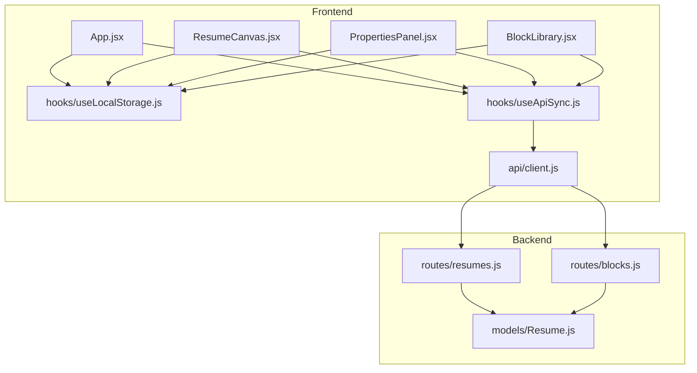
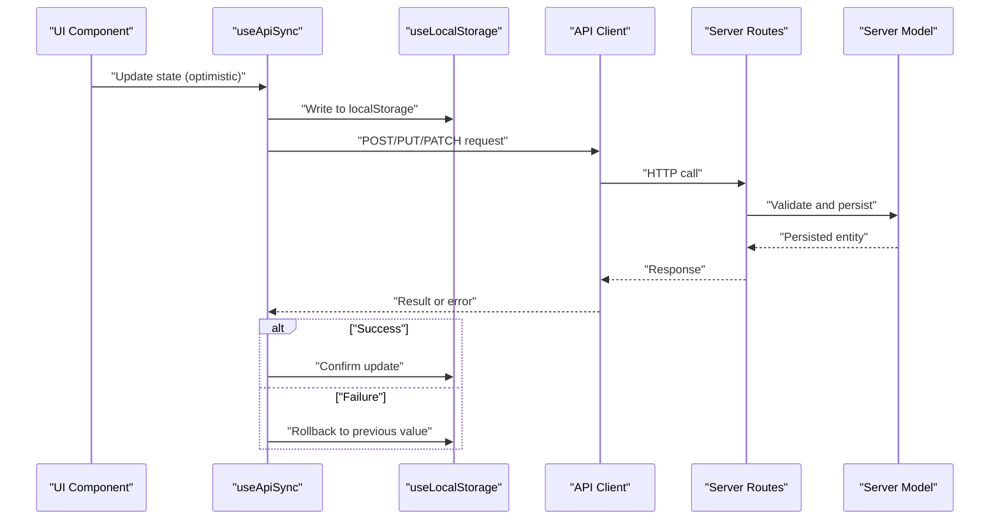
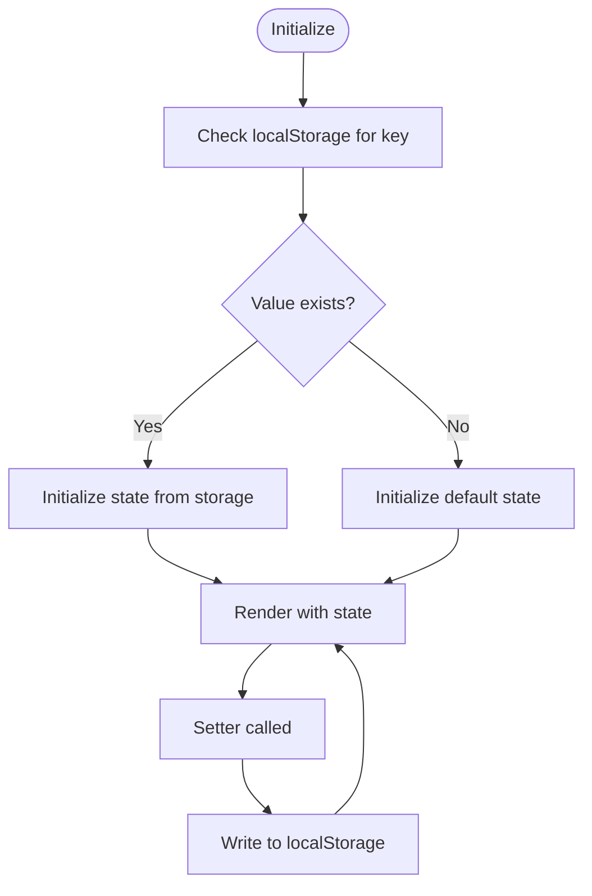
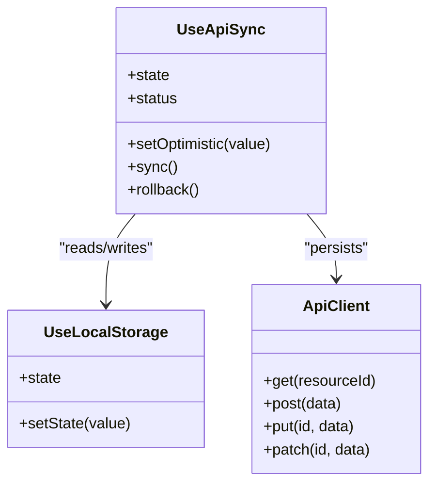
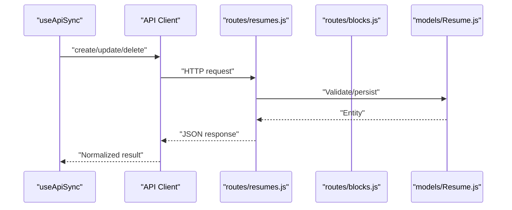
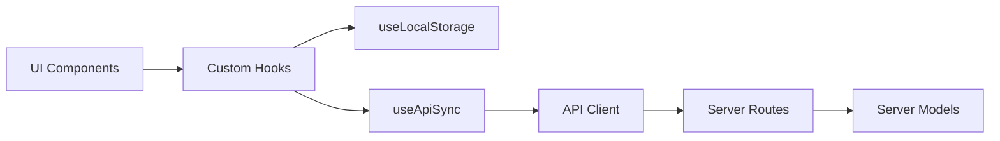

# State Management Patterns

<cite>
**Referenced Files in This Document**
- [useApiSync.js](file://src/hooks/useApiSync.js)
- [useLocalStorage.js](file://src/hooks/useLocalStorage.js)
- [client.js](file://src/api/client.js)
- [App.jsx](file://src/App.jsx)
- [ResumeCanvas.jsx](file://src/components/ResumeCanvas/ResumeCanvas.jsx)
- [PropertiesPanel.jsx](file://src/components/PropertiesPanel/PropertiesPanel.jsx)
- [BlockLibrary.jsx](file://src/components/BlockLibrary/BlockLibrary.jsx)
- [Resume.js](file://server/models/Resume.js)
- [blocks.js](file://server/routes/blocks.js)
- [resumes.js](file://server/routes/resumes.js)
</cite>

## Table of Contents
1. [Introduction](#introduction)
2. [Project Structure](#project-structure)
3. [Core Components](#core-components)
4. [Architecture Overview](#architecture-overview)
5. [Detailed Component Analysis](#detailed-component-analysis)
6. [Dependency Analysis](#dependency-analysis)
7. [Performance Considerations](#performance-considerations)
8. [Troubleshooting Guide](#troubleshooting-guide)
9. [Conclusion](#conclusion)

## Introduction
This document explains the state management patterns used across the application, focusing on custom hooks that encapsulate state logic and persistence. It covers:
- Separation of concerns between UI state and persistent data
- Optimistic updates and background synchronization
- Validation, transformation, and normalization strategies
- Persistence across browser sessions and device synchronization
- Performance considerations for large state objects and frequent updates

The primary mechanisms are:
- useLocalStorage: manages local persistence and provides a React state interface
- useApiSync: synchronizes local state with a remote API using optimistic updates and background sync
- API client: centralizes HTTP requests to the server

## Project Structure
State-related code is organized into focused modules:
- Custom hooks under src/hooks
- API client under src/api
- UI components consume hooks to manage their own state or shared state
- Server models and routes define the backend contract for resumes and blocks

**Diagram sources**
- [App.jsx](file://src/App.jsx)
- [ResumeCanvas.jsx](file://src/components/ResumeCanvas/ResumeCanvas.jsx)
- [PropertiesPanel.jsx](file://src/components/PropertiesPanel/PropertiesPanel.jsx)
- [BlockLibrary.jsx](file://src/components/BlockLibrary/BlockLibrary.jsx)
- [useLocalStorage.js](file://src/hooks/useLocalStorage.js)
- [useApiSync.js](file://src/hooks/useApiSync.js)
- [client.js](file://src/api/client.js)
- [resumes.js](file://server/routes/resumes.js)
- [blocks.js](file://server/routes/blocks.js)
- [Resume.js](file://server/models/Resume.js)

**Section sources**
- [useApiSync.js](file://src/hooks/useApiSync.js)
- [useLocalStorage.js](file://src/hooks/useLocalStorage.js)
- [client.js](file://src/api/client.js)
- [App.jsx](file://src/App.jsx)
- [ResumeCanvas.jsx](file://src/components/ResumeCanvas/ResumeCanvas.jsx)
- [PropertiesPanel.jsx](file://src/components/PropertiesPanel/PropertiesPanel.jsx)
- [BlockLibrary.jsx](file://src/components/BlockLibrary/BlockLibrary.jsx)
- [resumes.js](file://server/routes/resumes.js)
- [blocks.js](file://server/routes/blocks.js)
- [Resume.js](file://server/models/Resume.js)

## Core Components
This section outlines the core state management building blocks and how they interact.

- useLocalStorage
  - Purpose: Provide a React state interface backed by localStorage
  - Responsibilities:
    - Initialize state from localStorage if available
    - Persist state changes to localStorage
    - Expose a setter function compatible with React setState semantics
  - Typical usage: Manage UI-only state or as a base layer for persisted state

- useApiSync
  - Purpose: Synchronize local state with a remote API while keeping UI responsive
  - Responsibilities:
    - Wrap a source of truth (often useLocalStorage) with API calls
    - Apply optimistic updates immediately, then reconcile with server responses
    - Handle conflicts and rollbacks when server rejects updates
    - Perform background sync to keep local and remote in sync
  - Typical usage: Manage domain data such as resume content and block definitions

- API Client
  - Purpose: Centralize HTTP interactions with the server
  - Responsibilities:
    - Build URLs and headers
    - Serialize/deserialize payloads
    - Surface typed methods for CRUD operations on resumes and blocks

Separation of concerns:
- UI state (transient): kept in component-level state or lightweight hooks; not persisted
- Persistent data: managed via useLocalStorage and synchronized via useApiSync
- Network layer: isolated in the API client to avoid coupling UI with transport details

**Section sources**
- [useLocalStorage.js](file://src/hooks/useLocalStorage.js)
- [useApiSync.js](file://src/hooks/useApiSync.js)
- [client.js](file://src/api/client.js)

## Architecture Overview
The state architecture follows a layered approach:
- UI Layer: Components render based on state provided by hooks
- Sync Layer: useApiSync orchestrates optimistic updates and background reconciliation
- Persistence Layer: useLocalStorage ensures durability across sessions
- Transport Layer: API client communicates with server endpoints
- Data Model Layer: Server models define schema and constraints

**Diagram sources**
- [useApiSync.js](file://src/hooks/useApiSync.js)
- [useLocalStorage.js](file://src/hooks/useLocalStorage.js)
- [client.js](file://src/api/client.js)
- [resumes.js](file://server/routes/resumes.js)
- [blocks.js](file://server/routes/blocks.js)
- [Resume.js](file://server/models/Resume.js)

## Detailed Component Analysis

### useLocalStorage Hook
- Role: Encapsulates localStorage-backed state
- Key behaviors:
  - Initializes state from localStorage key if present
  - Persists state on every change
  - Provides a stable setter interface
- Integration points:
  - Used directly by UI components for ephemeral state
  - Often composed inside useApiSync to provide durable storage

**Diagram sources**
- [useLocalStorage.js](file://src/hooks/useLocalStorage.js)

**Section sources**
- [useLocalStorage.js](file://src/hooks/useLocalStorage.js)

### useApiSync Hook
- Role: Bridges UI state and remote data with optimistic updates and background sync
- Key behaviors:
  - Accepts a source of truth (e.g., useLocalStorage) and an API resource identifier
  - Applies immediate local updates for responsiveness
  - Sends network requests to persist changes
  - Reconciles differences and rolls back on failure
  - Optionally performs periodic or event-driven background sync
- Error handling:
  - On network errors or validation failures, reverts local state to the last known good value
  - Exposes status flags for loading and error states to guide UI feedback

**Diagram sources**
- [useApiSync.js](file://src/hooks/useApiSync.js)
- [useLocalStorage.js](file://src/hooks/useLocalStorage.js)
- [client.js](file://src/api/client.js)

**Section sources**
- [useApiSync.js](file://src/hooks/useApiSync.js)

### API Client
- Role: Centralized HTTP client for server communication
- Responsibilities:
  - Construct URLs for resumes and blocks resources
  - Serialize payloads and parse responses
  - Surface consistent methods for create, read, update, delete
- Integration points:
  - Consumed by useApiSync to perform network operations
  - Tied to server routes for resumes and blocks

**Diagram sources**
- [client.js](file://src/api/client.js)
- [resumes.js](file://server/routes/resumes.js)
- [blocks.js](file://server/routes/blocks.js)
- [Resume.js](file://server/models/Resume.js)

**Section sources**
- [client.js](file://src/api/client.js)
- [resumes.js](file://server/routes/resumes.js)
- [blocks.js](file://server/routes/blocks.js)
- [Resume.js](file://server/models/Resume.js)

### UI Components and State Consumption
Components consume hooks to manage their state:
- App.jsx: Orchestrates top-level state and composes hooks
- ResumeCanvas.jsx: Manages canvas rendering state and interacts with useApiSync
- PropertiesPanel.jsx: Handles property editing and triggers optimistic updates
- BlockLibrary.jsx: Manages block selection and composition

These components rely on:
- Immediate UI feedback via optimistic updates
- Robustness via rollback on failure
- Clear separation between transient UI state and persistent resume data

**Section sources**
- [App.jsx](file://src/App.jsx)
- [ResumeCanvas.jsx](file://src/components/ResumeCanvas/ResumeCanvas.jsx)
- [PropertiesPanel.jsx](file://src/components/PropertiesPanel/PropertiesPanel.jsx)
- [BlockLibrary.jsx](file://src/components/BlockLibrary/BlockLibrary.jsx)

## Dependency Analysis
High-level dependencies among state-related modules:

**Diagram sources**
- [App.jsx](file://src/App.jsx)
- [ResumeCanvas.jsx](file://src/components/ResumeCanvas/ResumeCanvas.jsx)
- [PropertiesPanel.jsx](file://src/components/PropertiesPanel/PropertiesPanel.jsx)
- [BlockLibrary.jsx](file://src/components/BlockLibrary/BlockLibrary.jsx)
- [useLocalStorage.js](file://src/hooks/useLocalStorage.js)
- [useApiSync.js](file://src/hooks/useApiSync.js)
- [client.js](file://src/api/client.js)
- [resumes.js](file://server/routes/resumes.js)
- [blocks.js](file://server/routes/blocks.js)
- [Resume.js](file://server/models/Resume.js)

**Section sources**
- [useApiSync.js](file://src/hooks/useApiSync.js)
- [useLocalStorage.js](file://src/hooks/useLocalStorage.js)
- [client.js](file://src/api/client.js)
- [resumes.js](file://server/routes/resumes.js)
- [blocks.js](file://server/routes/blocks.js)
- [Resume.js](file://server/models/Resume.js)

## Performance Considerations
- Minimize re-renders:
  - Keep UI state separate from heavy persistent data
  - Use memoization where appropriate to avoid unnecessary recalculations
- Batch updates:
  - Group multiple mutations before triggering sync to reduce network overhead
- Debounce/throttle:
  - For high-frequency edits (e.g., typing), debounce input changes before applying optimistic updates
- Normalization:
  - Normalize nested structures to reduce duplication and simplify updates
- Selective syncing:
  - Only sync changed fields rather than entire entities
- Background sync strategy:
  - Use incremental sync and conflict resolution to avoid full resyncs
- Memory footprint:
  - Avoid storing large binary blobs in localStorage; prefer IndexedDB or server-side storage for large assets

[No sources needed since this section provides general guidance]

## Troubleshooting Guide
Common issues and resolutions:
- Stale local state after failure:
  - Ensure rollback restores the previous value exactly
  - Verify that optimistic updates do not mutate shared references
- Conflicts between devices:
  - Implement server-authoritative resolution or merge strategies
  - Track version numbers or timestamps to detect conflicts
- Serialization errors:
  - Validate payloads against server schemas before sending
  - Log detailed error messages for debugging
- Storage limits:
  - Monitor localStorage size and migrate large datasets off-browser storage

**Section sources**
- [useApiSync.js](file://src/hooks/useApiSync.js)
- [useLocalStorage.js](file://src/hooks/useLocalStorage.js)
- [client.js](file://src/api/client.js)

## Conclusion
The application employs a clear separation between UI state and persistent data through custom hooks. useLocalStorage provides durable storage, while useApiSync adds optimistic updates, background synchronization, and robust error handling. The API client isolates transport concerns, and server models enforce data integrity. Together, these patterns deliver a responsive user experience with reliable persistence and scalability considerations for larger datasets.

[No sources needed since this section summarizes without analyzing specific files]