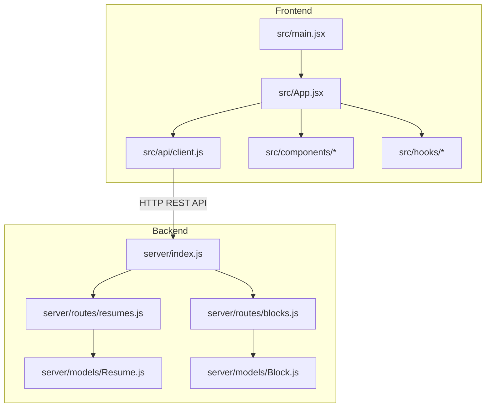
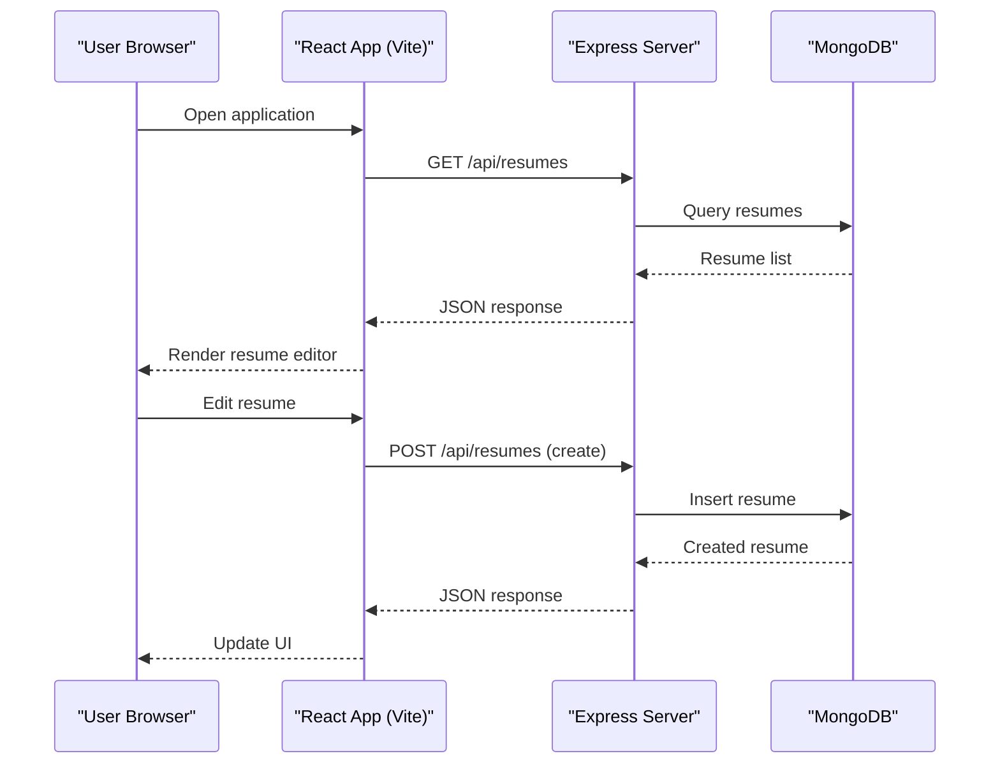
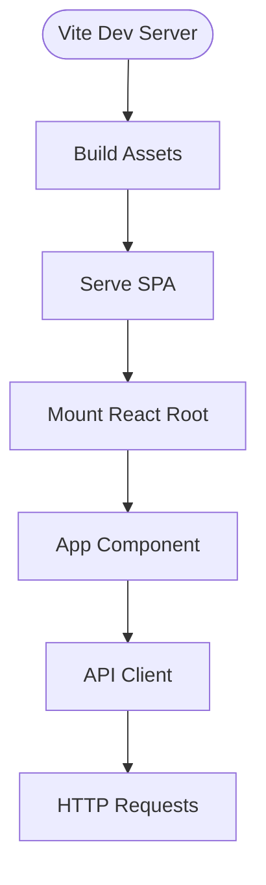
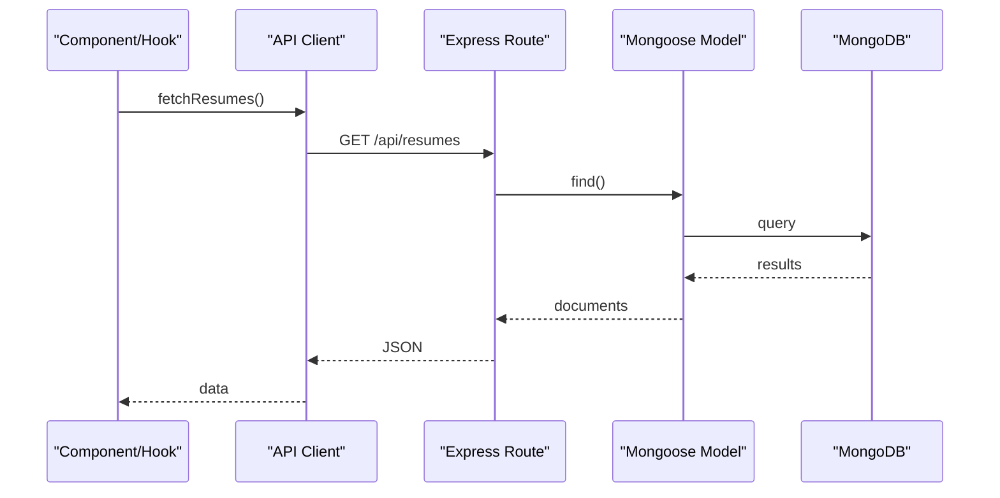
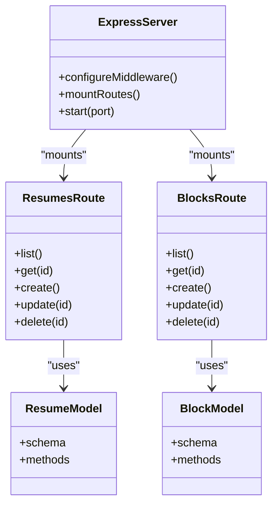
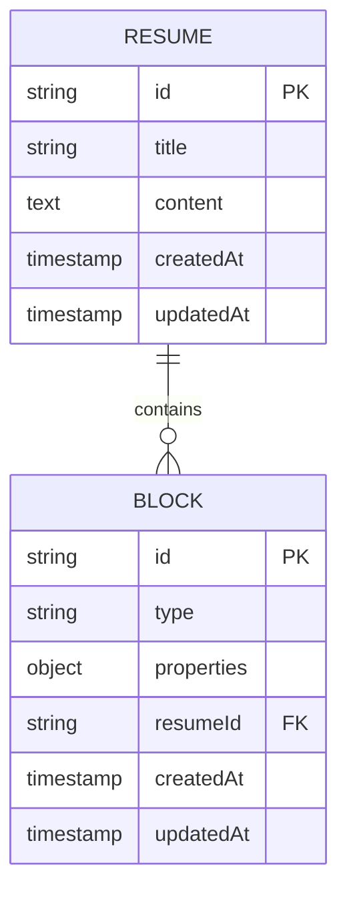
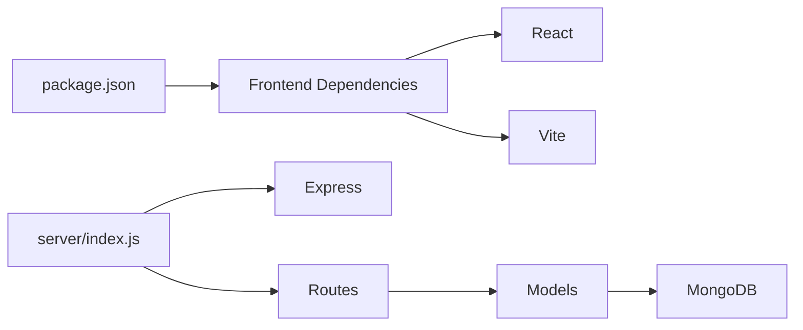

# System Architecture

<cite>
**Referenced Files in This Document**
- [package.json](file://package.json)
- [vite.config.js](file://vite.config.js)
- [server/index.js](file://server/index.js)
- [src/main.jsx](file://src/main.jsx)
- [src/App.jsx](file://src/App.jsx)
- [src/api/client.js](file://src/api/client.js)
- [server/models/Resume.js](file://server/models/Resume.js)
- [server/models/Block.js](file://server/models/Block.js)
- [server/routes/resumes.js](file://server/routes/resumes.js)
- [server/routes/blocks.js](file://server/routes/blocks.js)
</cite>

## Table of Contents
1. [Introduction](#introduction)
2. [Project Structure](#project-structure)
3. [Core Components](#core-components)
4. [Architecture Overview](#architecture-overview)
5. [Detailed Component Analysis](#detailed-component-analysis)
6. [Dependency Analysis](#dependency-analysis)
7. [Performance Considerations](#performance-considerations)
8. [Troubleshooting Guide](#troubleshooting-guide)
9. [Conclusion](#conclusion)

## Introduction
This document describes the system architecture of the Modular Resume Builder, a web application with a React frontend and an Express.js backend. The frontend is built with Vite and provides an interactive resume editor, while the backend exposes REST APIs to persist resumes and blocks to MongoDB. The system follows a client-server pattern where the browser-based UI communicates with the server over HTTP.

## Project Structure
The repository is organized into two primary layers:
- Frontend (React + Vite): Source code under src/, build configuration via vite.config.js, and package metadata in package.json.
- Backend (Node.js + Express): Server entry point and route handlers under server/, data models under server/models/.

**Diagram sources**
- [src/main.jsx](file://src/main.jsx)
- [src/App.jsx](file://src/App.jsx)
- [src/api/client.js](file://src/api/client.js)
- [server/index.js](file://server/index.js)
- [server/routes/resumes.js](file://server/routes/resumes.js)
- [server/routes/blocks.js](file://server/routes/blocks.js)
- [server/models/Resume.js](file://server/models/Resume.js)
- [server/models/Block.js](file://server/models/Block.js)

**Section sources**
- [package.json](file://package.json)
- [vite.config.js](file://vite.config.js)
- [src/main.jsx](file://src/main.jsx)
- [src/App.jsx](file://src/App.jsx)
- [server/index.js](file://server/index.js)

## Core Components
- Frontend Application Shell
  - Entry point initializes the React app and mounts it into the DOM.
  - App component orchestrates UI composition and integrates API client usage.
- API Client
  - Centralized HTTP client for calling backend endpoints.
  - Encapsulates base URL, headers, and error handling patterns used across components and hooks.
- Backend Server
  - Express application that configures middleware (e.g., CORS), mounts routes, and starts the HTTP server.
- Routes
  - Resumes route: CRUD operations for resumes.
  - Blocks route: CRUD operations for blocks associated with resumes.
- Data Models
  - Resume model: schema and persistence logic for resume documents.
  - Block model: schema and persistence logic for block documents.

**Section sources**
- [src/main.jsx](file://src/main.jsx)
- [src/App.jsx](file://src/App.jsx)
- [src/api/client.js](file://src/api/client.js)
- [server/index.js](file://server/index.js)
- [server/routes/resumes.js](file://server/routes/resumes.js)
- [server/routes/blocks.js](file://server/routes/blocks.js)
- [server/models/Resume.js](file://server/models/Resume.js)
- [server/models/Block.js](file://server/models/Block.js)

## Architecture Overview
High-level design:
- Browser runs the React/Vite-built SPA.
- SPA calls backend REST endpoints via HTTP.
- Backend validates requests, interacts with MongoDB through Mongoose models, and returns JSON responses.
- Build process compiles frontend assets; development server proxies or serves static files as configured.

**Diagram sources**
- [src/api/client.js](file://src/api/client.js)
- [server/index.js](file://server/index.js)
- [server/routes/resumes.js](file://server/routes/resumes.js)
- [server/models/Resume.js](file://server/models/Resume.js)

## Detailed Component Analysis

### Frontend Runtime and Build
- Development server and build tooling are defined by Vite configuration.
- The React app entrypoint bootstraps the UI tree and renders the root component.
- The top-level App component composes features and integrates the API client.

**Diagram sources**
- [vite.config.js](file://vite.config.js)
- [src/main.jsx](file://src/main.jsx)
- [src/App.jsx](file://src/App.jsx)
- [src/api/client.js](file://src/api/client.js)

**Section sources**
- [vite.config.js](file://vite.config.js)
- [src/main.jsx](file://src/main.jsx)
- [src/App.jsx](file://src/App.jsx)

### API Client and Communication Pattern
- The API client encapsulates base URLs and request options.
- Components and hooks call the client to perform REST operations against backend routes.
- Typical methods include GET, POST, PUT, DELETE for resource management.

**Diagram sources**
- [src/api/client.js](file://src/api/client.js)
- [server/routes/resumes.js](file://server/routes/resumes.js)
- [server/models/Resume.js](file://server/models/Resume.js)

**Section sources**
- [src/api/client.js](file://src/api/client.js)
- [server/routes/resumes.js](file://server/routes/resumes.js)
- [server/routes/blocks.js](file://server/routes/blocks.js)

### Backend Server and Routing
- The Express server initializes middleware, mounts route modules, and listens on a port.
- Routes implement REST endpoints for resumes and blocks.
- Each route delegates persistence to corresponding Mongoose models.

**Diagram sources**
- [server/index.js](file://server/index.js)
- [server/routes/resumes.js](file://server/routes/resumes.js)
- [server/routes/blocks.js](file://server/routes/blocks.js)
- [server/models/Resume.js](file://server/models/Resume.js)
- [server/models/Block.js](file://server/models/Block.js)

**Section sources**
- [server/index.js](file://server/index.js)
- [server/routes/resumes.js](file://server/routes/resumes.js)
- [server/routes/blocks.js](file://server/routes/blocks.js)
- [server/models/Resume.js](file://server/models/Resume.js)
- [server/models/Block.js](file://server/models/Block.js)

### Data Models
- Resume model defines fields and validation rules for resume entities.
- Block model defines fields and validation rules for block entities.
- Both models interact with MongoDB via Mongoose.

**Diagram sources**
- [server/models/Resume.js](file://server/models/Resume.js)
- [server/models/Block.js](file://server/models/Block.js)

**Section sources**
- [server/models/Resume.js](file://server/models/Resume.js)
- [server/models/Block.js](file://server/models/Block.js)

## Dependency Analysis
- Frontend dependencies are declared in package.json and include React and Vite tooling.
- Backend dependencies include Node.js runtime, Express, and MongoDB driver/Mongoose (as used by models).
- The API client depends on the backend’s route contracts.

**Diagram sources**
- [package.json](file://package.json)
- [server/index.js](file://server/index.js)
- [server/routes/resumes.js](file://server/routes/resumes.js)
- [server/routes/blocks.js](file://server/routes/blocks.js)
- [server/models/Resume.js](file://server/models/Resume.js)
- [server/models/Block.js](file://server/models/Block.js)

**Section sources**
- [package.json](file://package.json)
- [server/index.js](file://server/index.js)

## Performance Considerations
- Use efficient queries and indexes in Mongoose models to reduce database latency.
- Minimize payload sizes by selecting only necessary fields.
- Leverage caching strategies at the API layer when appropriate.
- Optimize frontend rendering by memoization and avoiding unnecessary re-renders.
- Configure Vite production builds for asset minification and code splitting.

[No sources needed since this section provides general guidance]

## Troubleshooting Guide
- CORS issues
  - Ensure the Express server allows the frontend origin during development and production.
  - Verify the API client base URL matches the deployed backend address.
- Database connectivity
  - Confirm MongoDB connection strings and network access rules.
  - Validate environment variables for database credentials and hostnames.
- Build and dev server
  - Check Vite configuration for correct proxy settings if using a dev proxy.
  - Ensure ports are not blocked and services are reachable from the browser.

**Section sources**
- [server/index.js](file://server/index.js)
- [vite.config.js](file://vite.config.js)
- [src/api/client.js](file://src/api/client.js)

## Conclusion
The Modular Resume Builder follows a clear separation of concerns with a React/Vite frontend and an Express.js backend. The frontend consumes REST APIs provided by the backend, which persists data to MongoDB via Mongoose models. Proper configuration of CORS, database connectivity, and build processes ensures reliable operation across development and production environments.