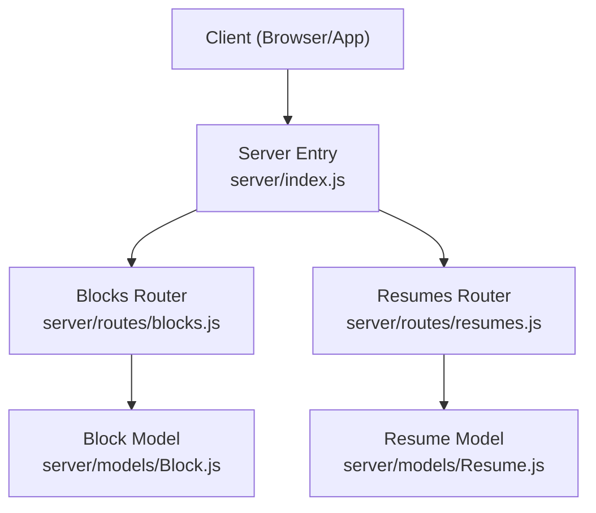
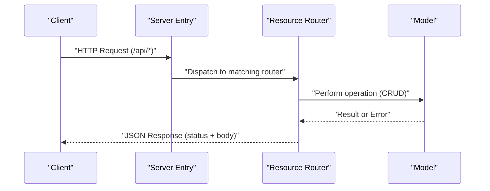
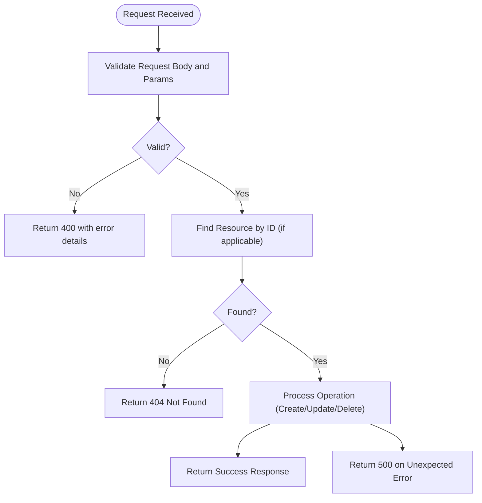
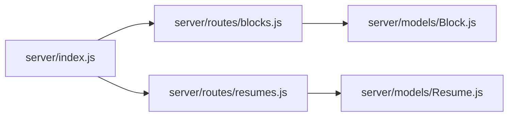

# API Endpoints and Routes

<cite>
**Referenced Files in This Document**
- [server/index.js](file://server/index.js)
- [server/routes/blocks.js](file://server/routes/blocks.js)
- [server/routes/resumes.js](file://server/routes/resumes.js)
- [server/models/Block.js](file://server/models/Block.js)
- [server/models/Resume.js](file://server/models/Resume.js)
- [src/api/client.js](file://src/api/client.js)
</cite>

## Table of Contents
1. [Introduction](#introduction)
2. [Project Structure](#project-structure)
3. [Core Components](#core-components)
4. [Architecture Overview](#architecture-overview)
5. [Detailed Component Analysis](#detailed-component-analysis)
6. [Dependency Analysis](#dependency-analysis)
7. [Performance Considerations](#performance-considerations)
8. [Troubleshooting Guide](#troubleshooting-guide)
9. [Conclusion](#conclusion)
10. [Appendices](#appendices)

## Introduction
This document provides comprehensive API endpoint documentation for the RESTful routes exposed by the server, focusing on Block management and Resume management resources. It includes route organization patterns, request validation expectations, response formatting conventions, error handling strategies, curl examples, and client integration guidance. The goal is to enable both backend and frontend developers to integrate with the API confidently and consistently.

## Project Structure
The API is implemented as a Node.js server with Express-style routing:
- Server entry point mounts resource-specific routers under /api.
- Resource routers define CRUD endpoints for Blocks and Resumes.
- Models represent data schemas used by the application.
- A frontend API client demonstrates how to call these endpoints from the browser.

**Diagram sources**
- [server/index.js](file://server/index.js)
- [server/routes/blocks.js](file://server/routes/blocks.js)
- [server/routes/resumes.js](file://server/routes/resumes.js)
- [server/models/Block.js](file://server/models/Block.js)
- [server/models/Resume.js](file://server/models/Resume.js)

**Section sources**
- [server/index.js](file://server/index.js)
- [server/routes/blocks.js](file://server/routes/blocks.js)
- [server/routes/resumes.js](file://server/routes/resumes.js)
- [server/models/Block.js](file://server/models/Block.js)
- [server/models/Resume.js](file://server/models/Resume.js)

## Core Components
- Server entry point: Mounts routers under /api and configures basic middleware such as JSON parsing.
- Blocks router: Implements GET, POST, PUT, DELETE for /api/blocks.
- Resumes router: Implements GET, POST, PUT, DELETE for /api/resumes.
- Models: Define the shape of Block and Resume entities used across routes.
- Frontend client: Provides helper methods to interact with the API endpoints.

Key responsibilities:
- Route handlers parse requests, validate inputs, perform business logic, and return standardized responses.
- Models encapsulate entity definitions and any shared validations or transformations.
- The client abstracts HTTP calls, headers, and base URL configuration.

**Section sources**
- [server/index.js](file://server/index.js)
- [server/routes/blocks.js](file://server/routes/blocks.js)
- [server/routes/resumes.js](file://server/routes/resumes.js)
- [server/models/Block.js](file://server/models/Block.js)
- [server/models/Resume.js](file://server/models/Resume.js)
- [src/api/client.js](file://src/api/client.js)

## Architecture Overview
The API follows a layered structure:
- Presentation layer: Express routers handle HTTP verbs and paths.
- Business layer: Route handlers orchestrate operations using models.
- Data layer: Models define schemas and may coordinate persistence.

**Diagram sources**
- [server/index.js](file://server/index.js)
- [server/routes/blocks.js](file://server/routes/blocks.js)
- [server/routes/resumes.js](file://server/routes/resumes.js)
- [server/models/Block.js](file://server/models/Block.js)
- [server/models/Resume.js](file://server/models/Resume.js)

## Detailed Component Analysis

### Global Conventions
- Base path: All endpoints are prefixed with /api.
- Content-Type: Clients should send JSON payloads with Content-Type: application/json.
- Authentication: If required by your deployment, include an Authorization header (e.g., Bearer token). Verify server-side requirements in the entry point and routers.
- Response format: Successful responses return JSON bodies with appropriate HTTP status codes. Errors return descriptive JSON with status codes indicating failure.

[No sources needed since this section provides general guidance]

### Block Management Endpoints

#### GET /api/blocks
- Purpose: Retrieve all blocks.
- Query parameters: None defined by default; extend as needed.
- Success response: 200 OK with JSON array of block objects.
- Error responses:
  - 500 Internal Server Error if an unexpected server error occurs.

curl example:
- curl -X GET http://localhost:PORT/api/blocks

Client integration snippet:
- Use the provided client method for listing blocks.

**Section sources**
- [server/routes/blocks.js](file://server/routes/blocks.js)
- [server/models/Block.js](file://server/models/Block.js)

#### POST /api/blocks
- Purpose: Create a new block.
- Request body: JSON object representing a block. Required fields are defined by the Block model.
- Success response: 201 Created with the created block object.
- Validation errors: 400 Bad Request with details about invalid fields.
- Conflict or duplicate handling: 409 Conflict if applicable.

curl example:
- curl -X POST http://localhost:PORT/api/blocks -H "Content-Type: application/json" -d '{"field": "value"}'

Client integration snippet:
- Use the provided client method for creating blocks.

**Section sources**
- [server/routes/blocks.js](file://server/routes/blocks.js)
- [server/models/Block.js](file://server/models/Block.js)

#### PUT /api/blocks/:id
- Purpose: Update an existing block by ID.
- Path parameter: id (string or number depending on implementation).
- Request body: JSON object with fields to update. Only provided fields should be applied.
- Success response: 200 OK with the updated block object.
- Not found: 404 Not Found if the block does not exist.
- Validation errors: 400 Bad Request with field-level details.

curl example:
- curl -X PUT http://localhost:PORT/api/blocks/ID -H "Content-Type: application/json" -d '{"field": "newValue"}'

Client integration snippet:
- Use the provided client method for updating blocks.

**Section sources**
- [server/routes/blocks.js](file://server/routes/blocks.js)
- [server/models/Block.js](file://server/models/Block.js)

#### DELETE /api/blocks/:id
- Purpose: Delete a block by ID.
- Path parameter: id (string or number depending on implementation).
- Success response: 204 No Content or 200 OK with a confirmation message.
- Not found: 404 Not Found if the block does not exist.

curl example:
- curl -X DELETE http://localhost:PORT/api/blocks/ID

Client integration snippet:
- Use the provided client method for deleting blocks.

**Section sources**
- [server/routes/blocks.js](file://server/routes/blocks.js)
- [server/models/Block.js](file://server/models/Block.js)

### Resume Management Endpoints

#### GET /api/resumes
- Purpose: Retrieve all resumes.
- Query parameters: None defined by default; extend as needed.
- Success response: 200 OK with JSON array of resume objects.
- Error responses:
  - 500 Internal Server Error if an unexpected server error occurs.

curl example:
- curl -X GET http://localhost:PORT/api/resumes

Client integration snippet:
- Use the provided client method for listing resumes.

**Section sources**
- [server/routes/resumes.js](file://server/routes/resumes.js)
- [server/models/Resume.js](file://server/models/Resume.js)

#### POST /api/resumes
- Purpose: Create a new resume.
- Request body: JSON object representing a resume. Required fields are defined by the Resume model.
- Success response: 201 Created with the created resume object.
- Validation errors: 400 Bad Request with details about invalid fields.
- Conflict or duplicate handling: 409 Conflict if applicable.

curl example:
- curl -X POST http://localhost:PORT/api/resumes -H "Content-Type: application/json" -d '{"field": "value"}'

Client integration snippet:
- Use the provided client method for creating resumes.

**Section sources**
- [server/routes/resumes.js](file://server/routes/resumes.js)
- [server/models/Resume.js](file://server/models/Resume.js)

#### PUT /api/resumes/:id
- Purpose: Update an existing resume by ID.
- Path parameter: id (string or number depending on implementation).
- Request body: JSON object with fields to update. Only provided fields should be applied.
- Success response: 200 OK with the updated resume object.
- Not found: 404 Not Found if the resume does not exist.
- Validation errors: 400 Bad Request with field-level details.

curl example:
- curl -X PUT http://localhost:PORT/api/resumes/ID -H "Content-Type: application/json" -d '{"field": "newValue"}'

Client integration snippet:
- Use the provided client method for updating resumes.

**Section sources**
- [server/routes/resumes.js](file://server/routes/resumes.js)
- [server/models/Resume.js](file://server/routes/resumes.js)

#### DELETE /api/resumes/:id
- Purpose: Delete a resume by ID.
- Path parameter: id (string or number depending on implementation).
- Success response: 204 No Content or 200 OK with a confirmation message.
- Not found: 404 Not Found if the resume does not exist.

curl example:
- curl -X DELETE http://localhost:PORT/api/resumes/ID

Client integration snippet:
- Use the provided client method for deleting resumes.

**Section sources**
- [server/routes/resumes.js](file://server/routes/resumes.js)
- [server/models/Resume.js](file://server/models/Resume.js)

### Request Validation and Error Handling Strategy
- Input validation: Enforce required fields and types at the route handler level using model constraints. Return 400 with structured error messages when validation fails.
- Not found handling: Return 404 when requested resources do not exist.
- Conflict handling: Return 409 for duplicate entries where applicable.
- Server errors: Return 500 with generic error messages; log detailed diagnostics server-side.
- Consistent error payload: Include code, message, and optional details to aid clients in handling errors gracefully.

**Diagram sources**
- [server/routes/blocks.js](file://server/routes/blocks.js)
- [server/routes/resumes.js](file://server/routes/resumes.js)

**Section sources**
- [server/routes/blocks.js](file://server/routes/blocks.js)
- [server/routes/resumes.js](file://server/routes/resumes.js)

### Authentication Requirements
- If authentication is enabled, include an Authorization header (e.g., Bearer token) with each request.
- Ensure the token is valid and has permissions to access the requested resource.
- Unauthorized requests should receive 401 Unauthorized; forbidden requests should receive 403 Forbidden.

[No sources needed since this section provides general guidance]

### Route Organization Patterns
- Resource-based routing: Each domain (blocks, resumes) has its own router file.
- Prefixing: All routes are mounted under /api to namespace API endpoints.
- CRUD consistency: Each resource exposes standard GET, POST, PUT, DELETE endpoints.

**Section sources**
- [server/index.js](file://server/index.js)
- [server/routes/blocks.js](file://server/routes/blocks.js)
- [server/routes/resumes.js](file://server/routes/resumes.js)

### Request Validation Details
- Blocks:
  - Required fields: Refer to the Block model for mandatory properties.
  - Types: Strings, numbers, booleans, arrays, or nested objects as defined by the model.
  - Constraints: Length limits, enums, or formats enforced by the model.
- Resumes:
  - Required fields: Refer to the Resume model for mandatory properties.
  - Types: Strings, numbers, booleans, arrays, or nested objects as defined by the model.
  - Constraints: Length limits, enums, or formats enforced by the model.

**Section sources**
- [server/models/Block.js](file://server/models/Block.js)
- [server/models/Resume.js](file://server/models/Resume.js)

### Response Formatting
- Success responses:
  - GET list: 200 OK with JSON array.
  - GET single: 200 OK with JSON object.
  - POST create: 201 Created with JSON object.
  - PUT update: 200 OK with JSON object.
  - DELETE: 204 No Content or 200 OK with confirmation.
- Error responses:
  - 400 Bad Request with structured error details.
  - 404 Not Found with a concise message.
  - 409 Conflict for duplicates.
  - 500 Internal Server Error for unexpected failures.

**Section sources**
- [server/routes/blocks.js](file://server/routes/blocks.js)
- [server/routes/resumes.js](file://server/routes/resumes.js)

### Client Integration Examples
- Listing blocks:
  - Use the client method that performs GET /api/blocks.
- Creating a block:
  - Use the client method that performs POST /api/blocks with a JSON body.
- Updating a block:
  - Use the client method that performs PUT /api/blocks/:id with partial updates.
- Deleting a block:
  - Use the client method that performs DELETE /api/blocks/:id.
- Listing resumes:
  - Use the client method that performs GET /api/resumes.
- Creating a resume:
  - Use the client method that performs POST /api/resumes with a JSON body.
- Updating a resume:
  - Use the client method that performs PUT /api/resumes/:id with partial updates.
- Deleting a resume:
  - Use the client method that performs DELETE /api/resumes/:id.

**Section sources**
- [src/api/client.js](file://src/api/client.js)

## Dependency Analysis
The following diagram shows how the server entry point wires routers and how routers depend on models.

**Diagram sources**
- [server/index.js](file://server/index.js)
- [server/routes/blocks.js](file://server/routes/blocks.js)
- [server/routes/resumes.js](file://server/routes/resumes.js)
- [server/models/Block.js](file://server/models/Block.js)
- [server/models/Resume.js](file://server/models/Resume.js)

**Section sources**
- [server/index.js](file://server/index.js)
- [server/routes/blocks.js](file://server/routes/blocks.js)
- [server/routes/resumes.js](file://server/routes/resumes.js)
- [server/models/Block.js](file://server/models/Block.js)
- [server/models/Resume.js](file://server/models/Resume.js)

## Performance Considerations
- Pagination: For large collections, implement pagination query parameters (e.g., page, limit) to reduce payload size.
- Filtering and sorting: Add query parameters to filter and sort lists efficiently.
- ETags and caching: Implement conditional requests (ETag/If-None-Match) to leverage browser caching.
- Idempotency: Ensure PUT and DELETE operations are idempotent to support retries safely.
- Rate limiting: Apply rate limiting at the server entry point to protect against abuse.

[No sources needed since this section provides general guidance]

## Troubleshooting Guide
Common issues and resolutions:
- 400 Bad Request:
  - Cause: Missing required fields or invalid data types.
  - Resolution: Review request body against model constraints and correct field values.
- 404 Not Found:
  - Cause: Resource ID does not exist.
  - Resolution: Verify the ID and ensure the resource was created successfully.
- 401 Unauthorized:
  - Cause: Missing or invalid authentication token.
  - Resolution: Provide a valid Authorization header.
- 403 Forbidden:
  - Cause: Insufficient permissions.
  - Resolution: Check user roles and permissions.
- 409 Conflict:
  - Cause: Duplicate resource creation.
  - Resolution: Adjust input to avoid conflicts or handle duplicates server-side.
- 500 Internal Server Error:
  - Cause: Unexpected server failure.
  - Resolution: Check server logs for stack traces and fix underlying issues.

**Section sources**
- [server/routes/blocks.js](file://server/routes/blocks.js)
- [server/routes/resumes.js](file://server/routes/resumes.js)

## Conclusion
The API provides consistent, resource-oriented endpoints for managing Blocks and Resumes. By adhering to the documented request/response schemas, validation rules, and error handling strategies, clients can integrate reliably. Extend the API with pagination, filtering, and authentication as needed while maintaining the established patterns.

[No sources needed since this section summarizes without analyzing specific files]

## Appendices

### Quick Reference: Endpoints Summary
- Blocks
  - GET /api/blocks
  - POST /api/blocks
  - PUT /api/blocks/:id
  - DELETE /api/blocks/:id
- Resumes
  - GET /api/resumes
  - POST /api/resumes
  - PUT /api/resumes/:id
  - DELETE /api/resumes/:id

[No sources needed since this section provides a summary]