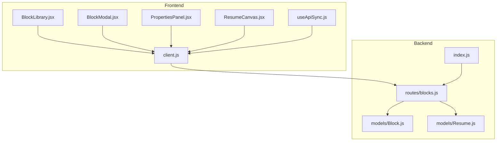
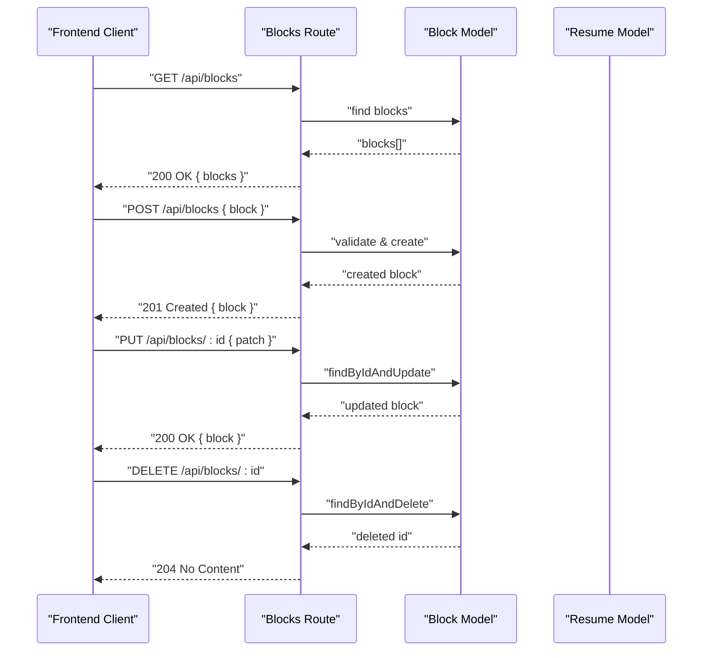
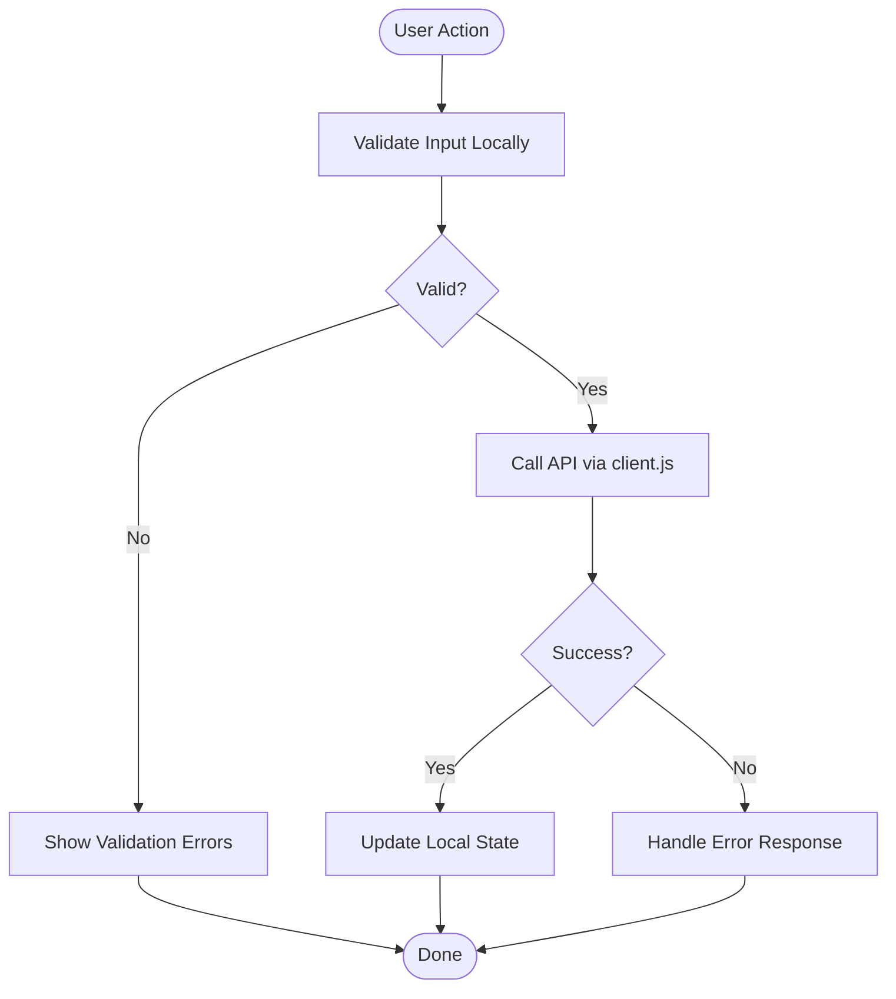
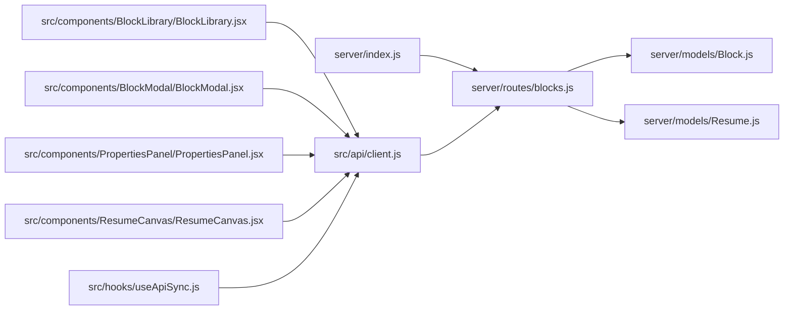

# Blocks API Endpoints

<cite>
**Referenced Files in This Document**
- [server/index.js](file://server/index.js)
- [server/routes/blocks.js](file://server/routes/blocks.js)
- [server/models/Block.js](file://server/models/Block.js)
- [server/models/Resume.js](file://server/models/Resume.js)
- [src/api/client.js](file://src/api/client.js)
- [src/components/BlockLibrary/BlockLibrary.jsx](file://src/components/BlockLibrary/BlockLibrary.jsx)
- [src/components/BlockModal/BlockModal.jsx](file://src/components/BlockModal/BlockModal.jsx)
- [src/components/PropertiesPanel/PropertiesPanel.jsx](file://src/components/PropertiesPanel/PropertiesPanel.jsx)
- [src/components/ResumeCanvas/ResumeCanvas.jsx](file://src/components/ResumeCanvas/ResumeCanvas.jsx)
- [src/hooks/useApiSync.js](file://src/hooks/useApiSync.js)
- [src/utils/constants.js](file://src/utils/constants.js)
- [src/utils/id.js](file://src/utils/id.js)
</cite>

## Table of Contents
1. [Introduction](#introduction)
2. [Project Structure](#project-structure)
3. [Core Components](#core-components)
4. [Architecture Overview](#architecture-overview)
5. [Detailed Component Analysis](#detailed-component-analysis)
6. [Dependency Analysis](#dependency-analysis)
7. [Performance Considerations](#performance-considerations)
8. [Troubleshooting Guide](#troubleshooting-guide)
9. [Conclusion](#conclusion)
10. [Appendices](#appendices)

## Introduction
This document provides detailed API documentation for Block management endpoints used by the Modular Resume Builder. It covers CRUD operations for blocks, request/response schemas, validation rules, business logic, curl examples, error formats, and integration patterns. It also documents the Block model schema including content type, properties, positioning data, and styling attributes.

## Project Structure
The backend is implemented with a Node.js server that exposes REST endpoints under /api. The frontend consumes these endpoints via an HTTP client and UI components.

**Diagram sources**
- [server/index.js](file://server/index.js)
- [server/routes/blocks.js](file://server/routes/blocks.js)
- [server/models/Block.js](file://server/models/Block.js)
- [server/models/Resume.js](file://server/models/Resume.js)
- [src/api/client.js](file://src/api/client.js)
- [src/components/BlockLibrary/BlockLibrary.jsx](file://src/components/BlockLibrary/BlockLibrary.jsx)
- [src/components/BlockModal/BlockModal.jsx](file://src/components/BlockModal/BlockModal.jsx)
- [src/components/PropertiesPanel/PropertiesPanel.jsx](file://src/components/PropertiesPanel/PropertiesPanel.jsx)
- [src/components/ResumeCanvas/ResumeCanvas.jsx](file://src/components/ResumeCanvas/ResumeCanvas.jsx)
- [src/hooks/useApiSync.js](file://src/hooks/useApiSync.js)

**Section sources**
- [server/index.js](file://server/index.js)
- [server/routes/blocks.js](file://server/routes/blocks.js)
- [server/models/Block.js](file://server/models/Block.js)
- [server/models/Resume.js](file://server/models/Resume.js)
- [src/api/client.js](file://src/api/client.js)
- [src/components/BlockLibrary/BlockLibrary.jsx](file://src/components/BlockLibrary/BlockLibrary.jsx)
- [src/components/BlockModal/BlockModal.jsx](file://src/components/BlockModal/BlockModal.jsx)
- [src/components/PropertiesPanel/PropertiesPanel.jsx](file://src/components/PropertiesPanel/PropertiesPanel.jsx)
- [src/components/ResumeCanvas/ResumeCanvas.jsx](file://src/components/ResumeCanvas/ResumeCanvas.jsx)
- [src/hooks/useApiSync.js](file://src/hooks/useApiSync.js)

## Core Components
- Server entrypoint mounts routes and middleware.
- Blocks route defines CRUD handlers for block resources.
- Block and Resume models define data structures and persistence behavior.
- Frontend client abstracts HTTP calls to /api/blocks.
- UI components orchestrate user interactions and state updates.

Key responsibilities:
- server/index.js: Express app setup, route mounting, global middleware.
- server/routes/blocks.js: GET, POST, PUT, DELETE handlers for blocks.
- server/models/Block.js: Block schema, validations, helper methods.
- server/models/Resume.js: Resume schema and relationships to blocks.
- src/api/client.js: Base URL configuration and HTTP helpers.
- src/hooks/useApiSync.js: Sync hooks for optimistic/pessimistic updates.
- src/components/*: UI flows for creating, editing, reordering, and deleting blocks.

**Section sources**
- [server/index.js](file://server/index.js)
- [server/routes/blocks.js](file://server/routes/blocks.js)
- [server/models/Block.js](file://server/models/Block.js)
- [server/models/Resume.js](file://server/models/Resume.js)
- [src/api/client.js](file://src/api/client.js)
- [src/hooks/useApiSync.js](file://src/hooks/useApiSync.js)
- [src/components/BlockLibrary/BlockLibrary.jsx](file://src/components/BlockLibrary/BlockLibrary.jsx)
- [src/components/BlockModal/BlockModal.jsx](file://src/components/BlockModal/BlockModal.jsx)
- [src/components/PropertiesPanel/PropertiesPanel.jsx](file://src/components/PropertiesPanel/PropertiesPanel.jsx)
- [src/components/ResumeCanvas/ResumeCanvas.jsx](file://src/components/ResumeCanvas/ResumeCanvas.jsx)

## Architecture Overview
The Blocks API follows a standard REST pattern. The frontend uses a typed client to call endpoints; the server validates inputs against the Block model and persists changes.

**Diagram sources**
- [server/routes/blocks.js](file://server/routes/blocks.js)
- [server/models/Block.js](file://server/models/Block.js)
- [server/models/Resume.js](file://server/models/Resume.js)

## Detailed Component Analysis

### Block Model Schema
The Block model defines the canonical shape of a block resource. Fields include identity, content, layout, positioning, and styling.

- Identity
  - id: string (unique identifier)
  - resumeId: string (foreign key to Resume)
- Content
  - type: enum (content type, e.g., text, image, list, table)
  - content: object or string (depends on type)
- Layout and Positioning
  - order: number (display order within a resume)
  - position: object { x: number, y: number }
  - size: object { width: number, height: number }
- Styling
  - style: object { color, backgroundColor, fontSize, fontFamily, textAlign, padding, margin, border, borderRadius, ... }
- Metadata
  - createdAt: timestamp
  - updatedAt: timestamp

Validation and business rules:
- type must be one of allowed values defined in constants.
- content must conform to the selected type’s schema.
- order must be a non-negative integer.
- position.x/y and size.width/height must be numbers >= 0.
- style fields are optional but validated if present.

**Section sources**
- [server/models/Block.js](file://server/models/Block.js)
- [src/utils/constants.js](file://src/utils/constants.js)

### Resume Model Relationship
Resumes contain ordered blocks. The Resume model references blocks and may enforce ordering constraints.

- Relationships
  - blocks: array of block ids
- Business rules
  - Deleting a block should remove it from the associated resume’s block list.
  - Reordering blocks may update resume-level metadata.

**Section sources**
- [server/models/Resume.js](file://server/models/Resume.js)

### Blocks API Endpoints

#### GET /api/blocks
Retrieves all blocks.

- Request
  - Method: GET
  - Path: /api/blocks
  - Headers: Content-Type: application/json
  - Query parameters: none required
- Response
  - 200 OK
  - Body: { blocks: Block[] }
- Validation
  - None at endpoint level; returns empty array if no blocks exist.
- Error responses
  - 500 Internal Server Error: unexpected server failure
- curl example
  - curl -X GET http://localhost:3000/api/blocks

**Section sources**
- [server/routes/blocks.js](file://server/routes/blocks.js)

#### POST /api/blocks
Creates a new block.

- Request
  - Method: POST
  - Path: /api/blocks
  - Headers: Content-Type: application/json
  - Body: Block (excluding id, createdAt, updatedAt)
- Response
  - 201 Created
  - Body: Block (including generated id and timestamps)
- Validation
  - Required fields: type, content, order, position, size, style (as per model).
  - Type-specific content validation enforced by model.
- Business logic
  - Assign default values for missing optional fields.
  - Ensure uniqueness of id generation.
- Error responses
  - 400 Bad Request: validation errors
  - 500 Internal Server Error: unexpected server failure
- curl example
  - curl -X POST http://localhost:3000/api/blocks -H "Content-Type: application/json" -d '{ "type": "text", "content": "...", "order": 0, "position": { "x": 0, "y": 0 }, "size": { "width": 200, "height": 100 }, "style": {} }'

**Section sources**
- [server/routes/blocks.js](file://server/routes/blocks.js)
- [server/models/Block.js](file://server/models/Block.js)

#### PUT /api/blocks/:id
Updates an existing block.

- Request
  - Method: PUT
  - Path: /api/blocks/:id
  - Headers: Content-Type: application/json
  - Body: Partial Block (fields to update)
- Response
  - 200 OK
  - Body: Updated Block
- Validation
  - :id must match an existing block.
  - Patched fields must satisfy model validation.
- Business logic
  - Update only provided fields.
  - Persist updated timestamps.
- Error responses
  - 404 Not Found: block not found
  - 400 Bad Request: validation errors
  - 500 Internal Server Error: unexpected server failure
- curl example
  - curl -X PUT http://localhost:3000/api/blocks/<block-id> -H "Content-Type: application/json" -d '{ "style": { "fontSize": 14 } }'

**Section sources**
- [server/routes/blocks.js](file://server/routes/blocks.js)
- [server/models/Block.js](file://server/models/Block.js)

#### DELETE /api/blocks/:id
Deletes a block.

- Request
  - Method: DELETE
  - Path: /api/blocks/:id
  - Headers: Content-Type: application/json
- Response
  - 204 No Content
- Validation
  - :id must match an existing block.
- Business logic
  - Remove block reference from associated resume if applicable.
- Error responses
  - 404 Not Found: block not found
  - 500 Internal Server Error: unexpected server failure
- curl example
  - curl -X DELETE http://localhost:3000/api/blocks/<block-id>

**Section sources**
- [server/routes/blocks.js](file://server/routes/blocks.js)
- [server/models/Resume.js](file://server/models/Resume.js)

### Request/Response Schemas

- Common response envelope
  - Success: { data?: any, message?: string }
  - Error: { error: string, details?: any }
- Block fields
  - id: string
  - resumeId: string
  - type: string (enum)
  - content: any (type-dependent)
  - order: number
  - position: { x: number, y: number }
  - size: { width: number, height: number }
  - style: object (optional)
  - createdAt: string (ISO timestamp)
  - updatedAt: string (ISO timestamp)

Validation highlights:
- type must be one of allowed values.
- content must match the schema for the given type.
- order must be >= 0.
- position.x/y and size.width/height must be >= 0.

**Section sources**
- [server/models/Block.js](file://server/models/Block.js)
- [src/utils/constants.js](file://src/utils/constants.js)

### Integration Patterns

- Frontend client usage
  - Use src/api/client.js to configure base URL and common headers.
  - Wrap calls with try/catch to handle network and server errors.
- Optimistic updates
  - Use src/hooks/useApiSync.js to apply local state changes before server confirmation.
- UI workflows
  - Create: open BlockModal, submit payload via client.
  - Edit: open PropertiesPanel, send PATCH/PUT to update fields.
  - Delete: confirm action, then call DELETE.
  - List: fetch all blocks on mount and refresh after mutations.

[No sources needed since this diagram shows conceptual workflow, not actual code structure]

**Section sources**
- [src/api/client.js](file://src/api/client.js)
- [src/hooks/useApiSync.js](file://src/hooks/useApiSync.js)
- [src/components/BlockModal/BlockModal.jsx](file://src/components/BlockModal/BlockModal.jsx)
- [src/components/PropertiesPanel/PropertiesPanel.jsx](file://src/components/PropertiesPanel/PropertiesPanel.jsx)
- [src/components/BlockLibrary/BlockLibrary.jsx](file://src/components/BlockLibrary/BlockLibrary.jsx)
- [src/components/ResumeCanvas/ResumeCanvas.jsx](file://src/components/ResumeCanvas/ResumeCanvas.jsx)

## Dependency Analysis
The Blocks API depends on the server entrypoint, route handlers, and models. The frontend depends on the client and UI components.

**Diagram sources**
- [server/index.js](file://server/index.js)
- [server/routes/blocks.js](file://server/routes/blocks.js)
- [server/models/Block.js](file://server/models/Block.js)
- [server/models/Resume.js](file://server/models/Resume.js)
- [src/api/client.js](file://src/api/client.js)
- [src/components/BlockLibrary/BlockLibrary.jsx](file://src/components/BlockLibrary/BlockLibrary.jsx)
- [src/components/BlockModal/BlockModal.jsx](file://src/components/BlockModal/BlockModal.jsx)
- [src/components/PropertiesPanel/PropertiesPanel.jsx](file://src/components/PropertiesPanel/PropertiesPanel.jsx)
- [src/components/ResumeCanvas/ResumeCanvas.jsx](file://src/components/ResumeCanvas/ResumeCanvas.jsx)
- [src/hooks/useApiSync.js](file://src/hooks/useApiSync.js)

**Section sources**
- [server/index.js](file://server/index.js)
- [server/routes/blocks.js](file://server/routes/blocks.js)
- [server/models/Block.js](file://server/models/Block.js)
- [server/models/Resume.js](file://server/models/Resume.js)
- [src/api/client.js](file://src/api/client.js)
- [src/components/BlockLibrary/BlockLibrary.jsx](file://src/components/BlockLibrary/BlockLibrary.jsx)
- [src/components/BlockModal/BlockModal.jsx](file://src/components/BlockModal/BlockModal.jsx)
- [src/components/PropertiesPanel/PropertiesPanel.jsx](file://src/components/PropertiesPanel/PropertiesPanel.jsx)
- [src/components/ResumeCanvas/ResumeCanvas.jsx](file://src/components/ResumeCanvas/ResumeCanvas.jsx)
- [src/hooks/useApiSync.js](file://src/hooks/useApiSync.js)

## Performance Considerations
- Batch operations: If supported, batch multiple block updates to reduce round trips.
- Pagination: For large resumes, consider paginating blocks.
- Indexing: Ensure database indexes on resumeId and order for efficient queries.
- Idempotency: Implement idempotent writes for retries.
- Caching: Cache GET /api/blocks responses where appropriate.

[No sources needed since this section provides general guidance]

## Troubleshooting Guide
Common issues and resolutions:
- 400 Bad Request: Check field types and required fields; ensure content matches type schema.
- 404 Not Found: Verify block id exists before update/delete.
- 500 Internal Server Error: Inspect server logs for stack traces; validate database connectivity.
- Network errors: Confirm base URL and CORS settings in server/index.js.
- State desync: Use useApiSync.js to reconcile optimistic updates with server responses.

**Section sources**
- [server/routes/blocks.js](file://server/routes/blocks.js)
- [server/index.js](file://server/index.js)
- [src/hooks/useApiSync.js](file://src/hooks/useApiSync.js)

## Conclusion
The Blocks API provides a clean, validated interface for managing resume blocks. By following the documented schemas and integration patterns, clients can reliably create, read, update, and delete blocks while maintaining consistent UI state.

[No sources needed since this section summarizes without analyzing specific files]

## Appendices

### Error Response Formats
- 400 Bad Request
  - Body: { error: "Validation failed", details: [...] }
- 404 Not Found
  - Body: { error: "Block not found" }
- 500 Internal Server Error
  - Body: { error: "Internal server error" }

**Section sources**
- [server/routes/blocks.js](file://server/routes/blocks.js)

### Utility References
- Constants for allowed block types and defaults.
- ID generator utilities for client-side placeholders.

**Section sources**
- [src/utils/constants.js](file://src/utils/constants.js)
- [src/utils/id.js](file://src/utils/id.js)