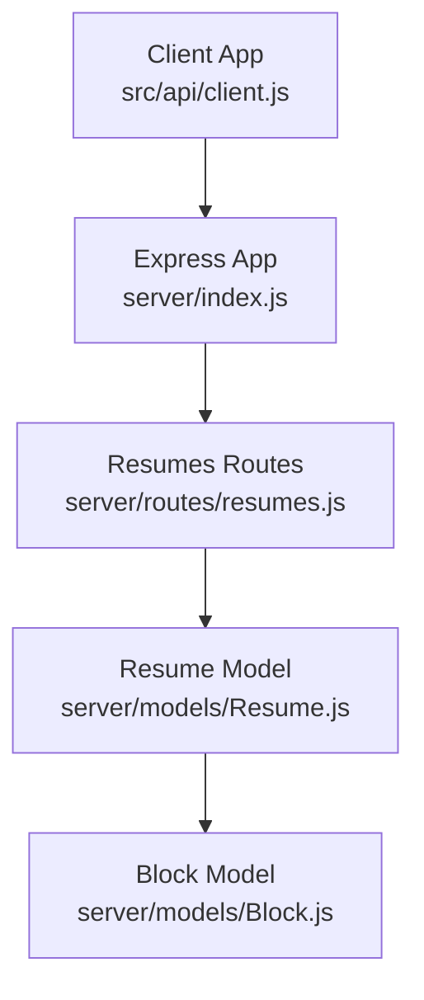
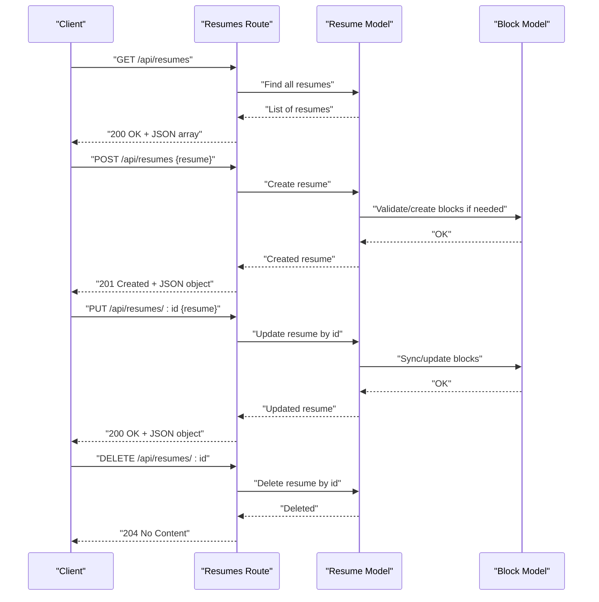
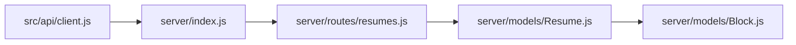

# Resumes API Endpoints

<cite>
**Referenced Files in This Document**
- [server/index.js](file://server/index.js)
- [server/routes/resumes.js](file://server/routes/resumes.js)
- [server/models/Resume.js](file://server/models/Resume.js)
- [server/models/Block.js](file://server/models/Block.js)
- [src/api/client.js](file://src/api/client.js)
</cite>

## Table of Contents
1. [Introduction](#introduction)
2. [Project Structure](#project-structure)
3. [Core Components](#core-components)
4. [Architecture Overview](#architecture-overview)
5. [Detailed Component Analysis](#detailed-component-analysis)
6. [Dependency Analysis](#dependency-analysis)
7. [Performance Considerations](#performance-considerations)
8. [Troubleshooting Guide](#troubleshooting-guide)
9. [Conclusion](#conclusion)
10. [Appendices](#appendices)

## Introduction
This document provides detailed API documentation for Resume management endpoints. It covers the full CRUD surface:
- GET /api/resumes (retrieve all resumes)
- POST /api/resumes (create a new resume)
- PUT /api/resumes/:id (update an existing resume)
- DELETE /api/resumes/:id (delete a resume)

It also documents the Resume model schema, including metadata, block collections, timestamps, and user associations, along with request/response schemas, validation rules, error formats, curl examples, and client integration patterns.

## Project Structure
The backend is organized into routes and models:
- server/index.js: Express application bootstrap and route registration
- server/routes/resumes.js: REST endpoints for resumes
- server/models/Resume.js: Resume data model definition
- server/models/Block.js: Block data model referenced by resumes
- src/api/client.js: Frontend HTTP client used to call the API

**Diagram sources**
- [server/index.js](file://server/index.js)
- [server/routes/resumes.js](file://server/routes/resumes.js)
- [server/models/Resume.js](file://server/models/Resume.js)
- [server/models/Block.js](file://server/models/Block.js)
- [src/api/client.js](file://src/api/client.js)

**Section sources**
- [server/index.js](file://server/index.js)
- [server/routes/resumes.js](file://server/routes/resumes.js)
- [server/models/Resume.js](file://server/models/Resume.js)
- [server/models/Block.js](file://server/models/Block.js)
- [src/api/client.js](file://src/api/client.js)

## Core Components
- Resumes Route: Implements CRUD operations for resumes under /api/resumes.
- Resume Model: Defines fields, relationships (including blocks), and timestamps.
- Block Model: Represents content blocks referenced by resumes.
- Client Integration: The frontend uses a centralized HTTP client to interact with the API.

Key responsibilities:
- Validate incoming payloads and enforce required fields.
- Persist or update resume records and related blocks.
- Return standardized success and error responses.

**Section sources**
- [server/routes/resumes.js](file://server/routes/resumes.js)
- [server/models/Resume.js](file://server/models/Resume.js)
- [server/models/Block.js](file://server/models/Block.js)
- [src/api/client.js](file://src/api/client.js)

## Architecture Overview
The API follows a standard MVC-like pattern:
- Routes handle HTTP verbs and URL parameters.
- Models encapsulate data structure and persistence logic.
- The client library abstracts HTTP calls from UI components.

**Diagram sources**
- [server/routes/resumes.js](file://server/routes/resumes.js)
- [server/models/Resume.js](file://server/models/Resume.js)
- [server/models/Block.js](file://server/models/Block.js)

## Detailed Component Analysis

### Resume Model Schema
The Resume model includes:
- Metadata fields such as title, summary, and optional user association.
- A collection of blocks that define the resume’s content sections.
- Timestamps for creation and updates.

Relationship mapping:
- Blocks are stored as a collection within the resume or linked via references.
- User association may be represented by a user identifier field.

Validation highlights:
- Required fields typically include identifiers and at least one block when creating or updating.
- Block entries must conform to the Block model schema.

**Section sources**
- [server/models/Resume.js](file://server/models/Resume.js)
- [server/models/Block.js](file://server/models/Block.js)

### Resumes API Endpoints

#### GET /api/resumes
- Purpose: Retrieve all resumes.
- Request: None.
- Response: Array of resume objects.
- Status codes:
  - 200 OK on success.
  - 500 Internal Server Error on unexpected failures.

curl example:
- curl -X GET http://localhost:PORT/api/resumes

Response schema:
- Type: Array
- Items: Resume object (see Resume Model Schema above)

**Section sources**
- [server/routes/resumes.js](file://server/routes/resumes.js)
- [server/models/Resume.js](file://server/models/Resume.js)

#### POST /api/resumes
- Purpose: Create a new resume.
- Request body: Resume object with metadata and blocks.
- Validation rules:
  - Title and at least one block are required.
  - Blocks must match the Block model schema.
- Response: Created resume object.
- Status codes:
  - 201 Created on success.
  - 400 Bad Request if validation fails.
  - 500 Internal Server Error on unexpected failures.

curl example:
- curl -X POST http://localhost:PORT/api/resumes -H "Content-Type: application/json" -d '{"title":"My Resume","blocks":[...]}'

Request schema:
- title: string (required)
- blocks: array of Block objects (required)
- Optional fields: summary, userId, etc., per model definition

Response schema:
- Resume object with created timestamp and assigned id.

**Section sources**
- [server/routes/resumes.js](file://server/routes/resumes.js)
- [server/models/Resume.js](file://server/models/Resume.js)
- [server/models/Block.js](file://server/models/Block.js)

#### PUT /api/resumes/:id
- Purpose: Update an existing resume by id.
- Path parameter: id (string or number depending on implementation).
- Request body: Partial or full resume object; only provided fields are updated.
- Validation rules:
  - If blocks are provided, they must conform to the Block model schema.
- Response: Updated resume object.
- Status codes:
  - 200 OK on success.
  - 404 Not Found if resume does not exist.
  - 400 Bad Request if validation fails.
  - 500 Internal Server Error on unexpected failures.

curl example:
- curl -X PUT http://localhost:PORT/api/resumes/RESUME_ID -H "Content-Type: application/json" -d '{"title":"Updated Title"}'

**Section sources**
- [server/routes/resumes.js](file://server/routes/resumes.js)
- [server/models/Resume.js](file://server/models/Resume.js)

#### DELETE /api/resumes/:id
- Purpose: Delete a resume by id.
- Path parameter: id (string or number depending on implementation).
- Response: No content on success.
- Status codes:
  - 204 No Content on success.
  - 404 Not Found if resume does not exist.
  - 500 Internal Server Error on unexpected failures.

curl example:
- curl -X DELETE http://localhost:PORT/api/resumes/RESUME_ID

**Section sources**
- [server/routes/resumes.js](file://server/routes/resumes.js)

### Error Response Formats
Standardized error responses include:
- status: numeric HTTP status code
- message: human-readable error description
- errors: optional array of field-level validation errors

Example shape:
- { "status": 400, "message": "Validation failed", "errors": [{ "field": "title", "message": "is required" }] }

**Section sources**
- [server/routes/resumes.js](file://server/routes/resumes.js)

### Client Integration Patterns
Recommended patterns using the frontend client:
- Use the centralized HTTP client to perform requests.
- Handle success and error branches based on response status.
- For list operations, map arrays to UI state.
- For create/update, merge returned objects into local state.
- For delete, remove items from local lists after successful deletion.

Integration steps:
- Import the client module.
- Call appropriate methods for each endpoint.
- Manage loading states and display errors to users.

**Section sources**
- [src/api/client.js](file://src/api/client.js)

## Dependency Analysis
The following diagram shows how components depend on each other:

**Diagram sources**
- [server/index.js](file://server/index.js)
- [server/routes/resumes.js](file://server/routes/resumes.js)
- [server/models/Resume.js](file://server/models/Resume.js)
- [server/models/Block.js](file://server/models/Block.js)
- [src/api/client.js](file://src/api/client.js)

**Section sources**
- [server/index.js](file://server/index.js)
- [server/routes/resumes.js](file://server/routes/resumes.js)
- [server/models/Resume.js](file://server/models/Resume.js)
- [server/models/Block.js](file://server/models/Block.js)
- [src/api/client.js](file://src/api/client.js)

## Performance Considerations
- Pagination: For large datasets, consider adding pagination query parameters to GET /api/resumes.
- ETags/Caching: Implement conditional requests to reduce bandwidth for unchanged resumes.
- Batch Updates: Allow partial updates to minimize payload size.
- Indexing: Ensure database indexes on frequently queried fields like userId and createdAt.

[No sources needed since this section provides general guidance]

## Troubleshooting Guide
Common issues and resolutions:
- 400 Bad Request: Check request body against validation rules; ensure required fields are present and correctly typed.
- 404 Not Found: Verify the resume id exists before performing updates or deletions.
- 500 Internal Server Error: Inspect server logs for stack traces; confirm database connectivity and permissions.

Operational tips:
- Log request payloads and responses during development.
- Use consistent error shapes across endpoints.
- Add health check endpoints to monitor service availability.

**Section sources**
- [server/routes/resumes.js](file://server/routes/resumes.js)

## Conclusion
The Resumes API provides a complete CRUD interface for managing resumes, with clear request/response schemas and robust error handling. By adhering to the documented validation rules and integration patterns, clients can reliably synchronize resume data and maintain consistency with the underlying models.

[No sources needed since this section summarizes without analyzing specific files]

## Appendices

### Request/Response Schemas Summary
- GET /api/resumes
  - Response: Array of Resume objects
- POST /api/resumes
  - Request: Resume object with required fields
  - Response: Created Resume object
- PUT /api/resumes/:id
  - Request: Partial or full Resume object
  - Response: Updated Resume object
- DELETE /api/resumes/:id
  - Response: No content

### Relationship Mapping to Blocks
- Each resume contains a collection of blocks.
- Blocks must adhere to the Block model schema.
- When updating blocks, ensure referential integrity and avoid duplicates.

**Section sources**
- [server/models/Resume.js](file://server/models/Resume.js)
- [server/models/Block.js](file://server/models/Block.js)