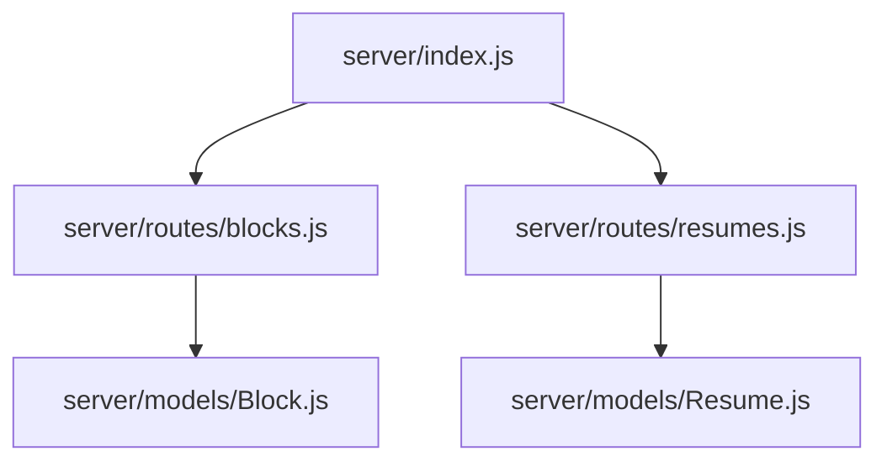
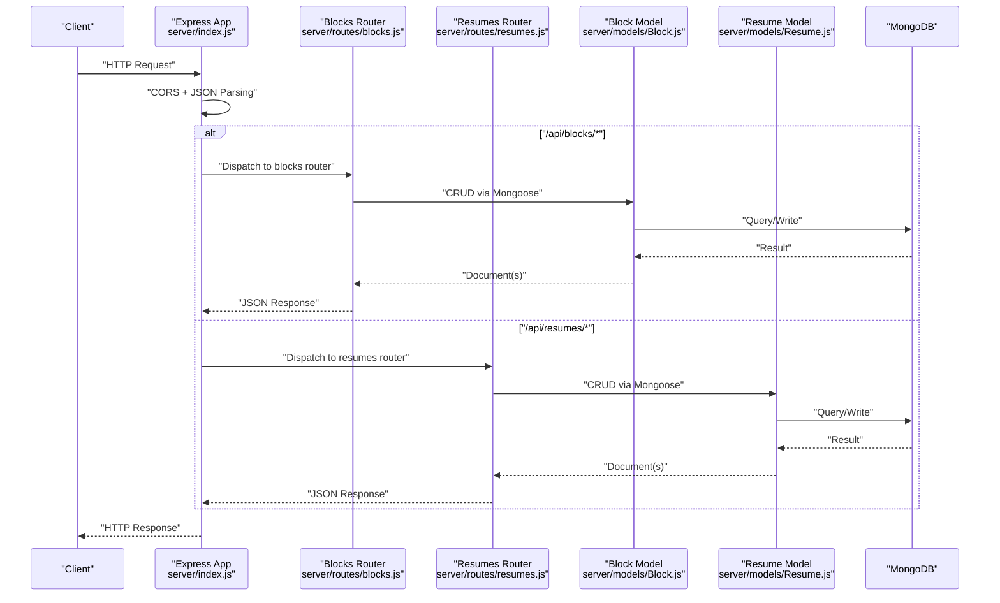
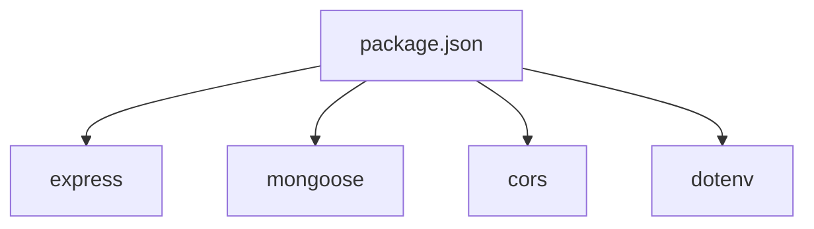

# Backend Architecture

<cite>
**Referenced Files in This Document**
- [server/index.js](file://server/index.js)
- [server/models/Block.js](file://server/models/Block.js)
- [server/models/Resume.js](file://server/models/Resume.js)
- [server/routes/blocks.js](file://server/routes/blocks.js)
- [server/routes/resumes.js](file://server/routes/resumes.js)
- [package.json](file://package.json)
</cite>

## Table of Contents
1. [Introduction](#introduction)
2. [Project Structure](#project-structure)
3. [Core Components](#core-components)
4. [Architecture Overview](#architecture-overview)
5. [Detailed Component Analysis](#detailed-component-analysis)
6. [Dependency Analysis](#dependency-analysis)
7. [Performance Considerations](#performance-considerions)
8. [Troubleshooting Guide](#troubleshooting-guide)
9. [Conclusion](#conclusion)

## Introduction
This document describes the backend architecture for the Modular Resume Builder. It focuses on the Express.js server setup, middleware stack (CORS, JSON parsing, error handling), RESTful API design, Mongoose ODM data modeling with schema validation and relationships, route organization for blocks and resumes endpoints, security considerations, input validation, error response patterns, database connection management, and performance optimization strategies.

## Project Structure
The backend is organized under the server directory with a clear separation of concerns:
- Entry point and server configuration
- Data models using Mongoose
- Route modules for domain resources (blocks and resumes)

**Diagram sources**
- [server/index.js](file://server/index.js)
- [server/routes/blocks.js](file://server/routes/blocks.js)
- [server/routes/resumes.js](file://server/routes/resumes.js)
- [server/models/Block.js](file://server/models/Block.js)
- [server/models/Resume.js](file://server/models/Resume.js)

**Section sources**
- [server/index.js](file://server/index.js)
- [server/routes/blocks.js](file://server/routes/blocks.js)
- [server/routes/resumes.js](file://server/routes/resumes.js)
- [server/models/Block.js](file://server/models/Block.js)
- [server/models/Resume.js](file://server/models/Resume.js)

## Core Components
- Server entrypoint: Initializes Express, configures middleware (CORS, JSON body parsing), mounts routes, starts the HTTP server, and wires global error handling.
- Routes:
  - Blocks: Resource-oriented endpoints for block entities.
  - Resumes: Resource-oriented endpoints for resume entities.
- Models:
  - Block: Schema definition for reusable resume content blocks.
  - Resume: Schema definition for resumes, including references to blocks.

Key responsibilities:
- server/index.js: Middleware stack, route mounting, server lifecycle, and error handling.
- server/routes/blocks.js: CRUD operations for blocks.
- server/routes/resumes.js: CRUD operations for resumes and relationship management with blocks.
- server/models/Block.js: Validation rules and default values for block fields.
- server/models/Resume.js: Validation rules, defaults, and reference mapping to blocks.

**Section sources**
- [server/index.js](file://server/index.js)
- [server/routes/blocks.js](file://server/routes/blocks.js)
- [server/routes/resumes.js](file://server/routes/resumes.js)
- [server/models/Block.js](file://server/models/Block.js)
- [server/models/Resume.js](file://server/models/Resume.js)

## Architecture Overview
High-level flow from client request to MongoDB and back:

**Diagram sources**
- [server/index.js](file://server/index.js)
- [server/routes/blocks.js](file://server/routes/blocks.js)
- [server/routes/resumes.js](file://server/routes/resumes.js)
- [server/models/Block.js](file://server/models/Block.js)
- [server/models/Resume.js](file://server/models/Resume.js)

## Detailed Component Analysis

### Server Entrypoint and Middleware Stack
Responsibilities:
- Create Express application instance.
- Configure CORS to allow frontend origins.
- Parse JSON request bodies.
- Mount resource routers under /api.
- Start listening on a configured port.
- Register global error-handling middleware.

Middleware order matters:
- CORS before routing.
- JSON parser before routing.
- Error handler after all routes.

Error handling strategy:
- Centralized error middleware captures unhandled errors and returns consistent JSON responses with appropriate status codes.

**Section sources**
- [server/index.js](file://server/index.js)

### RESTful API Design
Resource-oriented URL patterns:
- Blocks
  - GET /api/blocks
  - POST /api/blocks
  - GET /api/blocks/:id
  - PUT /api/blocks/:id
  - DELETE /api/blocks/:id
- Resumes
  - GET /api/resumes
  - POST /api/resumes
  - GET /api/resumes/:id
  - PUT /api/resumes/:id
  - DELETE /api/resumes/:id

Request/response conventions:
- Content-Type: application/json for requests and responses.
- Consistent JSON payloads with standardized success/error shapes.
- Proper HTTP status codes (200/201/400/404/500).

**Section sources**
- [server/routes/blocks.js](file://server/routes/blocks.js)
- [server/routes/resumes.js](file://server/routes/resumes.js)

### Mongoose Data Modeling and Relationships
Models:
- Block: Defines fields, types, required constraints, and defaults for reusable resume content blocks.
- Resume: Defines fields, types, required constraints, defaults, and references to Block documents.

Relationship mapping:
- Resume references one or more Block documents via ObjectId references.
- Use populate where necessary to resolve block details when returning resume data.

Schema validation:
- Field-level validators ensure data integrity at the model layer.
- Default values reduce boilerplate in route handlers.

**Section sources**
- [server/models/Block.js](file://server/models/Block.js)
- [server/models/Resume.js](file://server/models/Resume.js)

### Route Organization and Request/Response Handling
Blocks router:
- Implements CRUD operations for blocks.
- Validates inputs (e.g., required fields) and returns 400 for invalid payloads.
- Returns 404 when requested block does not exist.
- Responds with JSON documents or arrays.

Resumes router:
- Implements CRUD operations for resumes.
- Manages relationships by referencing Block IDs.
- Uses population to include related block details when appropriate.
- Applies same validation and error response patterns as blocks.

Error response pattern:
- Centralized error middleware formats errors into a consistent JSON structure.
- Includes message and optional details for debugging in development.

**Section sources**
- [server/routes/blocks.js](file://server/routes/blocks.js)
- [server/routes/resumes.js](file://server/routes/resumes.js)
- [server/index.js](file://server/index.js)

### Security Considerations
- CORS: Restrict allowed origins to known frontend domains.
- Input validation: Enforce schema-level validation in models; add route-level checks for critical fields.
- Sanitization: Avoid executing user-supplied strings; treat payload fields as plain data.
- Authentication/Authorization: Not implemented in current routes; consider adding JWT-based auth and role checks if needed.
- Secrets: Store sensitive configuration (e.g., DB URI) in environment variables.

[No sources needed since this section provides general guidance]

### Database Connection Management
- Connect to MongoDB using Mongoose.
- Handle connection events (connected, error, disconnected) for observability.
- Gracefully shut down the server on process signals to avoid dropping connections.

**Section sources**
- [server/index.js](file://server/index.js)

## Dependency Analysis
External dependencies relevant to the backend are declared in package.json. The server depends on Express, Mongoose, and likely cors and dotenv for runtime configuration.

**Diagram sources**
- [package.json](file://package.json)

**Section sources**
- [package.json](file://package.json)

## Performance Considerations
- Indexing: Add indexes on frequently queried fields (e.g., resume identifiers, block type tags).
- Population control: Populate only necessary fields to reduce payload size.
- Pagination: Implement skip/limit or cursor-based pagination for list endpoints.
- Connection pooling: Rely on Mongoose defaults; tune poolSize if needed.
- Compression: Enable gzip compression for large JSON responses.
- Caching: Cache read-heavy endpoints with short TTLs using an in-memory cache or Redis.

[No sources needed since this section provides general guidance]

## Troubleshooting Guide
Common issues and resolutions:
- CORS errors: Ensure the frontend origin matches the allowed CORS configuration.
- 400 Bad Request: Validate request body against schema; check required fields and types.
- 404 Not Found: Verify resource IDs and existence in the database.
- 500 Internal Server Error: Check server logs and centralized error handler output.
- Database connectivity: Confirm MongoDB URI and network access; inspect connection event logs.

Operational tips:
- Log request IDs for correlation across middleware and routes.
- Use structured logging for errors with context (endpoint, userId, requestId).
- Enable verbose logging in development only.

**Section sources**
- [server/index.js](file://server/index.js)

## Conclusion
The backend follows a clean, modular architecture with Express.js, Mongoose, and well-organized routes for blocks and resumes. The middleware stack ensures secure cross-origin access and robust JSON parsing, while centralized error handling standardizes responses. Schema validation and relationship mapping provide data integrity and flexibility. With additional indexing, pagination, and caching, the system can scale effectively for production workloads.