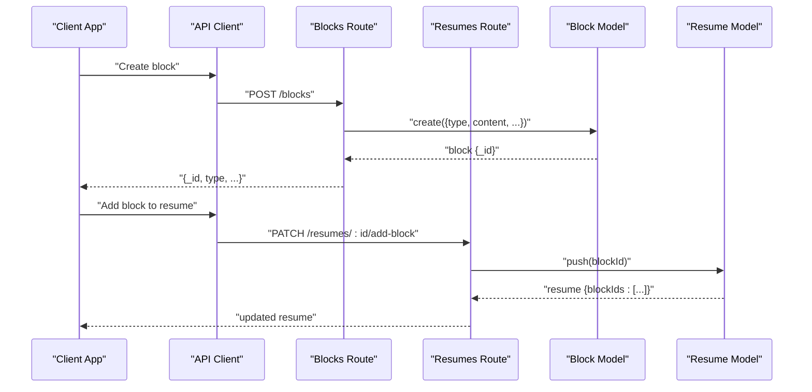
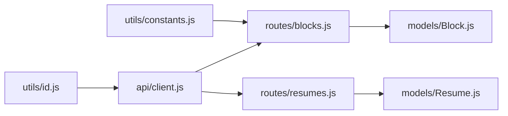

# Block Schema Definition

<cite>
**Referenced Files in This Document**
- [Block.js](file://server/models/Block.js)
- [Resume.js](file://server/models/Resume.js)
- [blocks.js](file://server/routes/blocks.js)
- [resumes.js](file://server/routes/resumes.js)
- [client.js](file://src/api/client.js)
- [constants.js](file://src/utils/constants.js)
- [id.js](file://src/utils/id.js)
</cite>

## Table of Contents
1. [Introduction](#introduction)
2. [Project Structure](#project-structure)
3. [Core Components](#core-components)
4. [Architecture Overview](#architecture-overview)
5. [Detailed Component Analysis](#detailed-component-analysis)
6. [Dependency Analysis](#dependency-analysis)
7. [Performance Considerations](#performance-considerations)
8. [Troubleshooting Guide](#troubleshooting-guide)
9. [Conclusion](#conclusion)
10. [Appendices](#appendices)

## Introduction
This document defines the data model for the Block schema used by the Modular Resume Builder. It specifies field definitions, types, validation rules, defaults, and required fields. It also explains how blocks relate to resumes, including reference patterns and query optimization strategies, and provides sample documents for common block types (text, image, experience, education). Finally, it outlines typical CRUD queries for managing blocks within resumes.

## Project Structure
The Block schema is implemented on the server side using a Mongoose-like model file and exposed via REST routes. The client interacts with these endpoints through an API client utility. Utility modules provide constants and ID generation helpers.

```mermaid
graph TB
subgraph "Server"
BModel["models/Block.js"]
RModel["models/Resume.js"]
BRoutes["routes/blocks.js"]
RRoutes["routes/resumes.js"]
end
subgraph "Client"
Client["api/client.js"]
CConst["utils/constants.js"]
CId["utils/id.js"]
end
Client --> BRoutes
Client --> RRoutes
BRoutes --> BModel
RRoutes --> RModel
Client --> CConst
Client --> CId
```

**Diagram sources**
- [Block.js](file://server/models/Block.js)
- [Resume.js](file://server/models/Resume.js)
- [blocks.js](file://server/routes/blocks.js)
- [resumes.js](file://server/routes/resumes.js)
- [client.js](file://src/api/client.js)
- [constants.js](file://src/utils/constants.js)
- [id.js](file://src/utils/id.js)

**Section sources**
- [Block.js](file://server/models/Block.js)
- [Resume.js](file://server/models/Resume.js)
- [blocks.js](file://server/routes/blocks.js)
- [resumes.js](file://server/routes/resumes.js)
- [client.js](file://src/api/client.js)
- [constants.js](file://src/utils/constants.js)
- [id.js](file://src/utils/id.js)

## Core Components
- Block model: Defines the canonical shape of a content block, including type, content payload, positioning, styling, and metadata.
- Resume model: Holds references to blocks and manages their ordering within a resume.
- Routes: Provide REST endpoints for creating, reading, updating, and deleting blocks and resumes.
- Client utilities: Encapsulate HTTP calls and shared configuration.
- Utilities: Provide constants (e.g., allowed block types) and deterministic ID generation.

Key responsibilities:
- Enforce schema constraints and defaults at the database layer.
- Maintain referential integrity between resumes and blocks.
- Expose consistent APIs for clients to manage blocks.

**Section sources**
- [Block.js](file://server/models/Block.js)
- [Resume.js](file://server/models/Resume.js)
- [blocks.js](file://server/routes/blocks.js)
- [resumes.js](file://server/routes/resumes.js)
- [client.js](file://src/api/client.js)
- [constants.js](file://src/utils/constants.js)
- [id.js](file://src/utils/id.js)

## Architecture Overview
The system follows a standard MVC-like pattern:
- Models define schemas and relationships.
- Routes implement controller logic and persistence operations.
- Client code consumes REST endpoints.



**Diagram sources**
- [blocks.js](file://server/routes/blocks.js)
- [resumes.js](file://server/routes/resumes.js)
- [Block.js](file://server/models/Block.js)
- [Resume.js](file://server/models/Resume.js)

## Detailed Component Analysis

### Block Schema
The Block schema represents a single unit of content within a resume. It includes:
- Type discriminator: Identifies the block kind (e.g., text, image, experience, education).
- Content payload: A flexible object whose structure depends on the block type.
- Positioning data: Controls placement and layout behavior.
- Styling attributes: Visual properties such as color, typography, spacing.
- Metadata: System fields like timestamps and versioning.

Field categories and guidance:
- Type
  - Purpose: Discriminator for rendering and validation.
  - Type: String enum.
  - Validation: Must be one of the allowed values defined in constants.
  - Default: Typically set when creating a new block if not provided.
  - Required: Yes.
- Content
  - Purpose: Holds type-specific data (e.g., title, description, dates, media URL).
  - Type: Mixed/Object.
  - Validation: Per-type rules enforced by route/model middleware or client-side validators.
  - Default: Empty object per type.
  - Required: Yes.
- Positioning
  - Purpose: Layout coordinates and sizing hints.
  - Type: Object with numeric fields (e.g., x, y, width, height).
  - Validation: Numeric ranges; non-negative dimensions.
  - Default: Centered or top-left origin depending on renderer.
  - Required: No (renderer may compute defaults).
- Styling
  - Purpose: Presentation attributes (colors, fonts, alignment).
  - Type: Object with string/number fields.
  - Validation: Allowed keys restricted by theme; value formats validated.
  - Default: Theme-based defaults.
  - Required: No.
- Metadata
  - Purpose: Audit and lifecycle tracking (created_at, updated_at, version).
  - Type: Timestamps and numbers.
  - Validation: Auto-managed by server.
  - Default: Server-generated timestamps.
  - Required: Yes (managed automatically).

Relationship to Resume:
- Resumes maintain an ordered list of block IDs.
- Blocks are referenced by ID from resumes; updates to blocks do not require reordering unless explicitly requested.
- Deletion of a block should cascade or remove references from resumes to avoid dangling pointers.

Sample Block Documents (by type):
- Text block
  - type: "text"
  - content: { title, body }
  - positioning: { x, y, width, height }
  - styling: { fontSize, fontWeight, color, textAlign }
  - metadata: { created_at, updated_at }
- Image block
  - type: "image"
  - content: { src, alt, caption }
  - positioning: { x, y, width, height }
  - styling: { borderRadius, borderColor }
  - metadata: { created_at, updated_at }
- Experience block
  - type: "experience"
  - content: { company, role, startDate, endDate, description }
  - positioning: { x, y, width, height }
  - styling: { headingStyle, bulletStyle }
  - metadata: { created_at, updated_at }
- Education block
  - type: "education"
  - content: { institution, degree, startDate, endDate, gpa }
  - positioning: { x, y, width, height }
  - styling: { headingStyle, bulletStyle }
  - metadata: { created_at, updated_at }

Notes:
- All samples include required metadata fields managed by the server.
- Positioning and styling are optional but recommended for precise control.
- Content fields vary by type; ensure client-side validation aligns with server expectations.

**Section sources**
- [Block.js](file://server/models/Block.js)
- [constants.js](file://src/utils/constants.js)

### Resume Model and Relationships
- Resume holds an ordered array of block IDs to preserve visual order.
- Reference pattern: resume.blockIds contains block._id values.
- Query strategy:
  - Use populate or join to fetch full block details when rendering.
  - Prefer projection to limit returned fields for performance.
  - Index resume.blockIds for fast lookups and reorder operations.

Common operations:
- Add block: push block._id into resume.blockIds.
- Reorder blocks: update indices in resume.blockIds.
- Remove block: filter out block._id from resume.blockIds and delete block.

**Section sources**
- [Resume.js](file://server/models/Resume.js)
- [resumes.js](file://server/routes/resumes.js)

### API Endpoints for Blocks
Typical endpoints exposed by the blocks route:
- Create block: POST /blocks
- Get block by ID: GET /blocks/:id
- Update block: PATCH /blocks/:id
- Delete block: DELETE /blocks/:id
- List blocks (optional): GET /blocks

These endpoints enforce schema validation and return standardized responses.

**Section sources**
- [blocks.js](file://server/routes/blocks.js)

### Client Integration
The client uses an API client module to call server endpoints. Shared constants and ID utilities support consistent request payloads and unique identifiers.

Responsibilities:
- Build requests with correct headers and bodies.
- Handle errors and retries.
- Normalize responses for UI consumption.

**Section sources**
- [client.js](file://src/api/client.js)
- [constants.js](file://src/utils/constants.js)
- [id.js](file://src/utils/id.js)

## Dependency Analysis
The following diagram shows key dependencies among models, routes, and client utilities.



**Diagram sources**
- [constants.js](file://src/utils/constants.js)
- [id.js](file://src/utils/id.js)
- [client.js](file://src/api/client.js)
- [blocks.js](file://server/routes/blocks.js)
- [resumes.js](file://server/routes/resumes.js)
- [Block.js](file://server/models/Block.js)
- [Resume.js](file://server/models/Resume.js)

**Section sources**
- [constants.js](file://src/utils/constants.js)
- [id.js](file://src/utils/id.js)
- [client.js](file://src/api/client.js)
- [blocks.js](file://server/routes/blocks.js)
- [resumes.js](file://server/routes/resumes.js)
- [Block.js](file://server/models/Block.js)
- [Resume.js](file://server/models/Resume.js)

## Performance Considerations
- Indexing:
  - Index resume.blockIds for efficient containment checks and reorder operations.
  - Consider compound indexes on frequently queried fields (e.g., type, resume_id).
- Projections:
  - Return only necessary fields for listing and preview scenarios.
- Population:
  - Use selective population to avoid over-fetching large content payloads.
- Batch operations:
  - Group multiple block updates into transactions where supported.
- Caching:
  - Cache static block templates and style presets on the client.

[No sources needed since this section provides general guidance]

## Troubleshooting Guide
Common issues and resolutions:
- Invalid block type:
  - Ensure type matches allowed values from constants.
  - Validate on both client and server sides.
- Missing required fields:
  - Verify content structure per block type before submission.
- Dangling references:
  - When deleting a block, remove its ID from all resumes that reference it.
- Ordering inconsistencies:
  - Always update resume.blockIds atomically during reorder operations.
- Styling conflicts:
  - Normalize styles against theme defaults before persisting.

Operational tips:
- Log validation errors with context (block id, type, offending fields).
- Implement optimistic UI updates with rollback on failure.
- Use version fields to detect concurrent edits.

**Section sources**
- [blocks.js](file://server/routes/blocks.js)
- [resumes.js](file://server/routes/resumes.js)
- [constants.js](file://src/utils/constants.js)

## Conclusion
The Block schema provides a flexible yet constrained foundation for modular resume content. By enforcing clear types, structured content payloads, and robust metadata, the system supports rich layouts while maintaining consistency. Proper indexing, projections, and atomic operations ensure scalability and reliability. Adhering to the documented reference patterns and query strategies will help keep the application performant and maintainable.

[No sources needed since this section summarizes without analyzing specific files]

## Appendices

### Common Query Patterns
- Retrieve a block by ID
  - Endpoint: GET /blocks/:id
  - Response: Full block document
- Create a new block
  - Endpoint: POST /blocks
  - Body: { type, content, positioning?, styling? }
- Update a block
  - Endpoint: PATCH /blocks/:id
  - Body: Partial fields to update
- Delete a block
  - Endpoint: DELETE /blocks/:id
  - Side effect: Remove block ID from any referencing resumes
- Add a block to a resume
  - Endpoint: PATCH /resumes/:id/add-block
  - Body: { blockId }
- Reorder blocks in a resume
  - Endpoint: PATCH /resumes/:id/reorder
  - Body: { blockIds: [ordered ids] }
- Fetch resume with populated blocks
  - Endpoint: GET /resumes/:id?populate=blocks
  - Response: Resume with full block details

**Section sources**
- [blocks.js](file://server/routes/blocks.js)
- [resumes.js](file://server/routes/resumes.js)