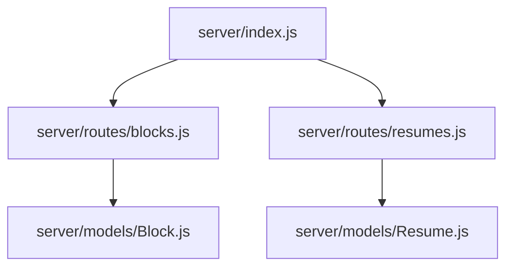
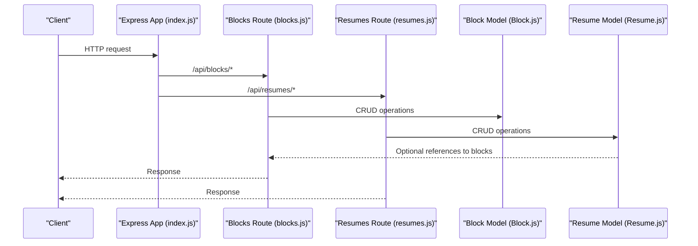
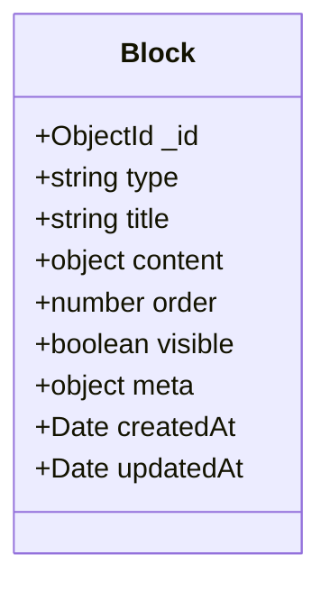
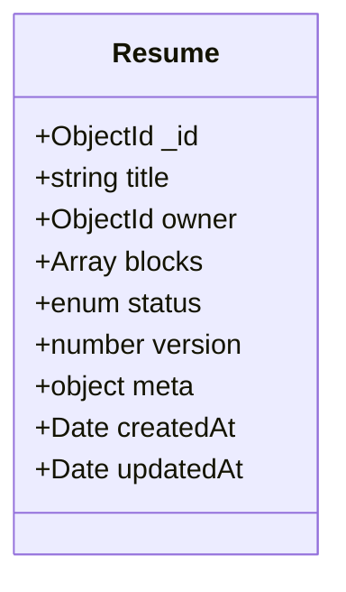
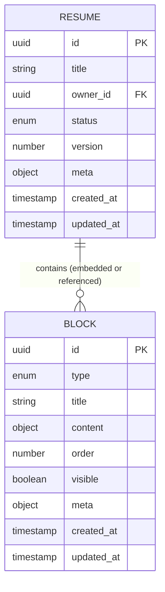
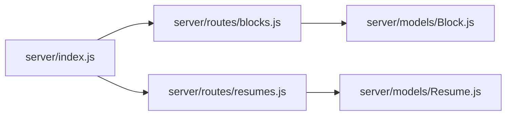

# Database Design and Models

<cite>
**Referenced Files in This Document**
- [Block.js](file://server/models/Block.js)
- [Resume.js](file://server/models/Resume.js)
- [blocks.js](file://server/routes/blocks.js)
- [resumes.js](file://server/routes/resumes.js)
- [index.js](file://server/index.js)
</cite>

## Table of Contents
1. [Introduction](#introduction)
2. [Project Structure](#project-structure)
3. [Core Components](#core-components)
4. [Architecture Overview](#architecture-overview)
5. [Detailed Component Analysis](#detailed-component-analysis)
6. [Dependency Analysis](#dependency-analysis)
7. [Performance Considerations](#performance-considerations)
8. [Troubleshooting Guide](#troubleshooting-guide)
9. [Conclusion](#conclusion)
10. [Appendices](#appendices)

## Introduction
This document provides comprehensive data model documentation for the MongoDB schemas implemented with Mongoose ODM in this project. It focuses on two core models: Block and Resume. The goal is to clarify field definitions, data types, validation rules, default values, relationships, timestamps, metadata fields, indexes, query optimization strategies, migration patterns, versioning considerations, backup procedures, sample documents, and common query patterns.

## Project Structure
The database-related code resides under server/models and server/routes. The main application entry point wires up routes and likely initializes the database connection.

**Diagram sources**
- [index.js](file://server/index.js)
- [blocks.js](file://server/routes/blocks.js)
- [resumes.js](file://server/routes/resumes.js)
- [Block.js](file://server/models/Block.js)
- [Resume.js](file://server/models/Resume.js)

**Section sources**
- [index.js](file://server/index.js)
- [blocks.js](file://server/routes/blocks.js)
- [resumes.js](file://server/routes/resumes.js)
- [Block.js](file://server/models/Block.js)
- [Resume.js](file://server/models/Resume.js)

## Core Components
This section summarizes the two primary Mongoose models used by the application:

- Block: Represents a reusable content block within a resume (for example, an experience entry, education entry, skills list, or custom section).
- Resume: Represents a complete resume composed of multiple blocks, including metadata and timestamps.

Key responsibilities:
- Define schema fields, types, validations, and defaults.
- Establish relationships between Resume and Block.
- Provide indexes for efficient querying.
- Expose methods or virtuals if needed for computed fields.

**Section sources**
- [Block.js](file://server/models/Block.js)
- [Resume.js](file://server/models/Resume.js)

## Architecture Overview
The data layer uses Mongoose models defined in server/models. Routes in server/routes consume these models to implement REST endpoints. The application entry point in server/index.js typically mounts routes and may initialize the database connection.

**Diagram sources**
- [index.js](file://server/index.js)
- [blocks.js](file://server/routes/blocks.js)
- [resumes.js](file://server/routes/resumes.js)
- [Block.js](file://server/models/Block.js)
- [Resume.js](file://server/models/Resume.js)

## Detailed Component Analysis

### Block Schema
Purpose:
- Stores individual resume sections or components that can be reused across resumes.

Typical fields and behaviors:
- Identifier: _id (ObjectId, auto-generated by Mongoose).
- Type discriminator: type (string; required; enum of allowed block types such as experience, education, skills, projects, etc.).
- Title: title (string; optional; human-readable heading).
- Content: content (mixed/object; holds structured data specific to the block type).
- Order: order (number; optional; determines display sequence within a resume).
- Visibility: visible (boolean; optional; default true; controls whether the block is shown).
- Metadata: meta (object; optional; stores arbitrary key-value pairs like author, source, or tags).
- Timestamps: createdAt, updatedAt (automatically managed by Mongoose timestamps).

Validation rules:
- Required fields: type must be present and match one of the allowed values.
- String constraints: title length limits if applicable.
- Number constraints: order must be non-negative if provided.
- Boolean defaults: visible defaults to true when not specified.
- Object shape: content should conform to a per-type schema or pass a custom validator.

Indexes:
- Single-field index on type for filtering blocks by category.
- Compound index on { resumeId: 1, order: 1 } if blocks are embedded or referenced with ordering.
- Text index on title and/or content if full-text search is needed.

Query optimization strategies:
- Use lean queries where possible to reduce overhead.
- Project only necessary fields to minimize payload size.
- Prefer sorting by pre-indexed fields (e.g., order).
- Avoid wildcard projections in hot paths.

Sample document structure:
- {
    "_id": "<ObjectId>",
    "type": "experience",
    "title": "Software Engineer",
    "content": { "company": "...", "role": "...", "startDate": "...", "endDate": "..." },
    "order": 1,
    "visible": true,
    "meta": { "tags": ["engineering", "fullstack"] },
    "createdAt": "<ISODate>",
    "updatedAt": "<ISODate>"
  }

Common query patterns:
- Find all blocks of a given type.
- Retrieve blocks ordered by their position.
- Filter blocks by visibility.
- Search blocks by text content (if text index exists).

**Section sources**
- [Block.js](file://server/models/Block.js)

#### Class Diagram: Block Model

**Diagram sources**
- [Block.js](file://server/models/Block.js)

### Resume Schema
Purpose:
- Represents a complete resume composed of multiple blocks, including metadata and timestamps.

Relationships:
- Option A (Embedded): blocks stored as an array of subdocuments within the resume document.
- Option B (Referenced): blocks stored in a separate collection with resumeId references.
Choose based on access patterns:
- Embedded is optimal for read-heavy scenarios where entire resumes are fetched together.
- Referenced is better for write-heavy scenarios or when blocks are shared across resumes.

Typical fields and behaviors:
- Identifier: _id (ObjectId, auto-generated).
- Title: title (string; optional; resume name or headline).
- Owner: owner (ObjectId; optional; reference to user if multi-user support exists).
- Blocks: blocks (array; either embedded subdocuments or ObjectId references depending on design).
- Status: status (enum; e.g., draft, published; optional).
- Version: version (number; optional; semantic versioning for schema evolution).
- Metadata: meta (object; optional; includes locale, theme, or export settings).
- Timestamps: createdAt, updatedAt (managed by Mongoose timestamps).

Validation rules:
- Required fields: title may be required; status may have a default value.
- Enumerations: status must be one of the allowed values.
- Array constraints: blocks array length limits if applicable.
- Versioning: increment version on schema changes or important updates.

Indexes:
- Single-field index on owner for user-scoped queries.
- Compound index on { owner: 1, status: 1 } for listing resumes by user and status.
- Text index on title and/or meta if searching resumes by content.

Query optimization strategies:
- For embedded blocks: populate only when needed; otherwise, use projection to exclude large arrays.
- For referenced blocks: use aggregation pipelines to join blocks efficiently.
- Cache frequently accessed resumes using an in-memory cache layer if appropriate.

Sample document structure (embedded blocks):
- {
    "_id": "<ObjectId>",
    "title": "John Doe - Resume",
    "owner": "<ObjectId>",
    "blocks": [
      { "type": "experience", "title": "...", "content": {...}, "order": 1, "visible": true, "meta": {} },
      { "type": "education", "title": "...", "content": {...}, "order": 2, "visible": true, "meta": {} }
    ],
    "status": "published",
    "version": 1,
    "meta": { "locale": "en-US", "theme": "minimal" },
    "createdAt": "<ISODate>",
    "updatedAt": "<ISODate>"
  }

Common query patterns:
- Find resumes by owner and status.
- Fetch a resume with its blocks (populate if referenced).
- Update resume metadata without rewriting blocks.
- Increment version on significant updates.

**Section sources**
- [Resume.js](file://server/models/Resume.js)

#### Class Diagram: Resume Model

**Diagram sources**
- [Resume.js](file://server/models/Resume.js)

#### Relationship Diagram: Resume and Block

**Diagram sources**
- [Resume.js](file://server/models/Resume.js)
- [Block.js](file://server/models/Block.js)

## Dependency Analysis
The following diagram shows how routes depend on models and how the application entry point wires them together.

**Diagram sources**
- [index.js](file://server/index.js)
- [blocks.js](file://server/routes/blocks.js)
- [resumes.js](file://server/routes/resumes.js)
- [Block.js](file://server/models/Block.js)
- [Resume.js](file://server/models/Resume.js)

**Section sources**
- [index.js](file://server/index.js)
- [blocks.js](file://server/routes/blocks.js)
- [resumes.js](file://server/routes/resumes.js)
- [Block.js](file://server/models/Block.js)
- [Resume.js](file://server/models/Resume.js)

## Performance Considerations
- Indexing: Ensure indexes exist for frequently filtered/sorted fields (type, owner, status, order).
- Projections: Return only necessary fields to reduce network payload.
- Population vs Embedding: Choose embedding for single-resume reads; referencing for cross-resume reuse and smaller writes.
- Aggregation: Use aggregation pipelines for complex joins and transformations instead of multiple round trips.
- Caching: Consider caching frequent reads at the application layer or via a cache store.
- Bulk Operations: Use bulkWrite for batch updates to reduce latency.

[No sources needed since this section provides general guidance]

## Troubleshooting Guide
Common issues and resolutions:
- Validation errors: Check required fields, enums, and custom validators. Review error messages from Mongoose to identify failing fields.
- Missing indexes: Slow queries often indicate missing indexes; add compound indexes matching query filters and sorts.
- Large payloads: If responses are too large, apply projections or switch from embedding to referencing for blocks.
- Version conflicts: Implement optimistic concurrency by checking version before update and retrying on conflict.
- Data consistency: When updating both resume and blocks, wrap operations in transactions if supported by your deployment.

**Section sources**
- [Block.js](file://server/models/Block.js)
- [Resume.js](file://server/models/Resume.js)

## Conclusion
The Block and Resume models provide a flexible foundation for building modular resumes. By carefully defining schemas, applying validations, designing appropriate indexes, and choosing the right relationship strategy, you can achieve both performance and maintainability. Adopt migration patterns and versioning to evolve schemas safely over time.

[No sources needed since this section summarizes without analyzing specific files]

## Appendices

### Schema Validation Rules Summary
- Block:
  - type: required, enum of allowed block types.
  - title: optional string with length constraints if enforced.
  - content: object validated per block type.
  - order: optional non-negative integer.
  - visible: boolean, default true.
  - meta: free-form object for additional attributes.
- Resume:
  - title: optional string.
  - owner: optional reference to user.
  - blocks: array (embedded or referenced).
  - status: enum with default value.
  - version: number for schema/version control.
  - meta: free-form object for resume-level settings.

**Section sources**
- [Block.js](file://server/models/Block.js)
- [Resume.js](file://server/models/Resume.js)

### Index Definitions Summary
- Block:
  - type: single-field index.
  - { resumeId: 1, order: 1 }: compound index for ordering within a resume (if referenced).
  - text index on searchable fields if needed.
- Resume:
  - owner: single-field index.
  - { owner: 1, status: 1 }: compound index for user-scoped listings.
  - text index on title/meta if searching resumes.

**Section sources**
- [Block.js](file://server/models/Block.js)
- [Resume.js](file://server/models/Resume.js)

### Query Optimization Strategies
- Use lean() for read-only queries.
- Apply projections to limit returned fields.
- Prefer sorting by indexed fields.
- Use aggregation for complex joins and transformations.
- Batch writes with bulkWrite.

**Section sources**
- [Block.js](file://server/models/Block.js)
- [Resume.js](file://server/models/Resume.js)

### Data Migration Patterns and Versioning
- Versioning:
  - Maintain a version field on Resume to track schema revisions.
  - Increment version on breaking changes; handle backward compatibility in migrations.
- Migration patterns:
  - Write idempotent migration scripts that check current state before applying changes.
  - Use background jobs to migrate large datasets without blocking requests.
  - Validate migrated documents post-migration.
- Rollback:
  - Keep backups and snapshots before major migrations.
  - Maintain reversible migration steps where feasible.

**Section sources**
- [Resume.js](file://server/models/Resume.js)

### Backup Procedures
- Regular snapshots of the database using native tools (mongodump/mongorestore or cloud provider snapshots).
- Export critical collections to JSON/CSV for archival.
- Test restore procedures periodically to ensure recoverability.
- Encrypt backups at rest and in transit.

[No sources needed since this section provides general guidance]

### Sample Documents
- Block sample:
  - {
      "_id": "<ObjectId>",
      "type": "skills",
      "title": "Technical Skills",
      "content": { "categories": [{ "name": "Frontend", "items": ["React", "TypeScript"] }] },
      "order": 3,
      "visible": true,
      "meta": { "lastUpdatedBy": "<ObjectId>" },
      "createdAt": "<ISODate>",
      "updatedAt": "<ISODate>"
    }
- Resume sample (referenced blocks):
  - {
      "_id": "<ObjectId>",
      "title": "Jane Smith - Resume",
      "owner": "<ObjectId>",
      "blockIds": ["<ObjectId>", "<ObjectId>"],
      "status": "draft",
      "version": 2,
      "meta": { "locale": "en-US" },
      "createdAt": "<ISODate>",
      "updatedAt": "<ISODate>"
    }

**Section sources**
- [Block.js](file://server/models/Block.js)
- [Resume.js](file://server/models/Resume.js)

### Common Query Patterns
- Find blocks by type and order:
  - Filter by type, sort by order, project minimal fields.
- List resumes by owner and status:
  - Filter by owner and status, sort by updatedAt.
- Fetch resume with blocks:
  - Populate block references or embed blocks directly.
- Update resume metadata:
  - Use $set on meta and version increments.

**Section sources**
- [Block.js](file://server/models/Block.js)
- [Resume.js](file://server/models/Resume.js)