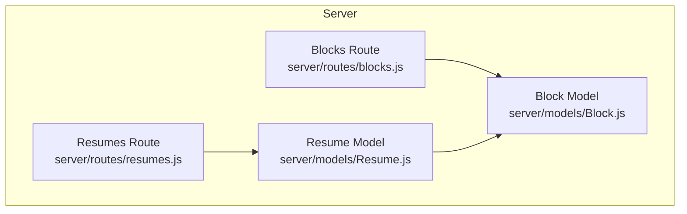
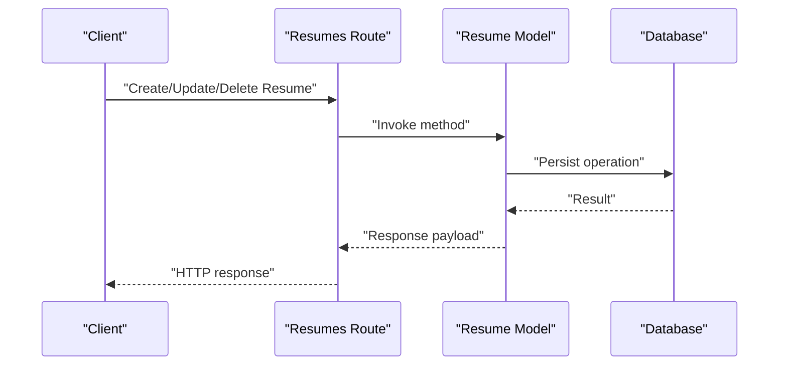
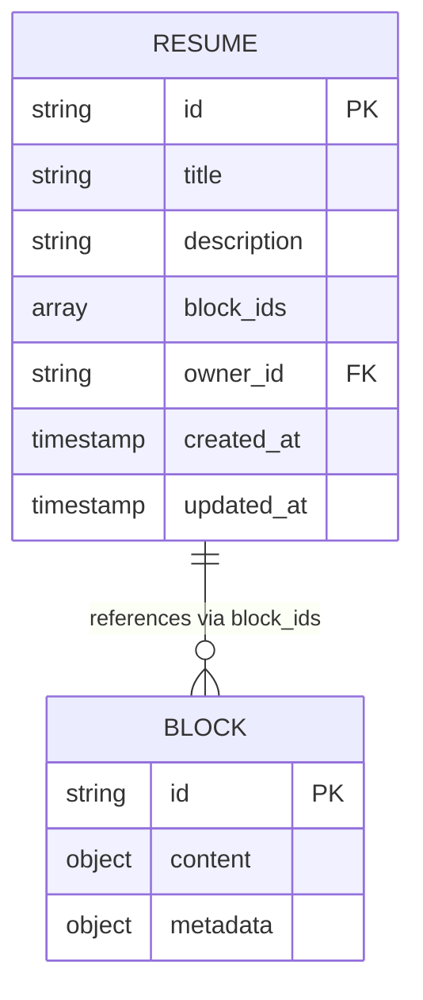
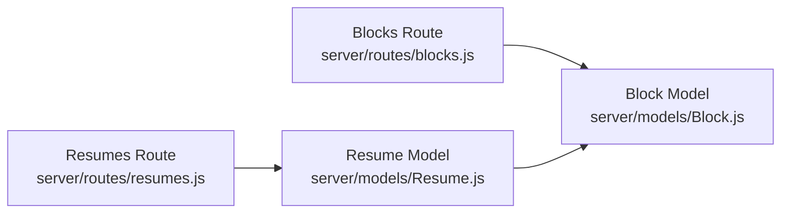

# Resume Schema Definition

<cite>
**Referenced Files in This Document**
- [Resume.js](file://server/models/Resume.js)
- [Block.js](file://server/models/Block.js)
- [resumes.js](file://server/routes/resumes.js)
- [blocks.js](file://server/routes/blocks.js)
</cite>

## Table of Contents
1. [Introduction](#introduction)
2. [Project Structure](#project-structure)
3. [Core Components](#core-components)
4. [Architecture Overview](#architecture-overview)
5. [Detailed Component Analysis](#detailed-component-analysis)
6. [Dependency Analysis](#dependency-analysis)
7. [Performance Considerations](#performance-considerations)
8. [Troubleshooting Guide](#troubleshooting-guide)
9. [Conclusion](#conclusion)

## Introduction
This document defines the data model for Resumes and their relationship with Blocks, focusing on schema fields, validation rules, indexing considerations, and query patterns. It explains how resumes reference blocks via an array-based structure and provides guidance for efficient CRUD operations and lifecycle management.

## Project Structure
The resume-related data model is implemented in server-side models and routes:
- Models define schemas and relationships for Resume and Block entities.
- Routes expose endpoints to create, read, update, delete resumes and manage block references within resumes.

**Diagram sources**
- [Resume.js](file://server/models/Resume.js)
- [Block.js](file://server/models/Block.js)
- [resumes.js](file://server/routes/resumes.js)
- [blocks.js](file://server/routes/blocks.js)

**Section sources**
- [Resume.js](file://server/models/Resume.js)
- [Block.js](file://server/models/Block.js)
- [resumes.js](file://server/routes/resumes.js)
- [blocks.js](file://server/routes/blocks.js)

## Core Components
- Resume entity represents a user’s resume document with metadata and ordered block references.
- Block entity represents reusable content units referenced by resumes.

Key responsibilities:
- Resume: stores title, description, ordered block references, ownership, timestamps.
- Block: stores block-specific content and metadata; referenced by resumes via IDs.

Relationship pattern:
- One-to-many from User to Resume (ownership).
- Many-to-many between Resume and Block via an ordered array of block IDs in Resume.

Validation and constraints:
- Required fields enforced at the schema level.
- Array ordering preserved for rendering sequence.
- Referential integrity managed through ID references.

Indexing considerations:
- Indexes on frequently queried fields such as owner/user association and timestamps.
- Optional indexes on title or status if used for filtering/search.

Query optimization:
- Use projection to fetch only needed fields.
- Prefer population or joins when retrieving resumes with block details.
- Batch updates for bulk block manipulations.

**Section sources**
- [Resume.js](file://server/models/Resume.js)
- [Block.js](file://server/models/Block.js)

## Architecture Overview
The resume system follows a simple layered architecture:
- Routes handle HTTP requests and orchestrate model operations.
- Models encapsulate schema definitions and business logic.
- Data persistence layer (database) stores Resume and Block documents.

**Diagram sources**
- [resumes.js](file://server/routes/resumes.js)
- [Resume.js](file://server/models/Resume.js)

## Detailed Component Analysis

### Resume Schema Fields
- Title: Human-readable name for the resume.
- Description: Free-text summary or notes about the resume.
- Blocks: Ordered array of block references (IDs) defining composition and render order.
- Owner/User Association: Reference to the user who owns the resume.
- Timestamps: Creation and modification times for audit and sorting.

Notes:
- The blocks field preserves order to control layout rendering.
- Ownership enables access control and scoped queries.
- Timestamps support sorting and change tracking.

**Section sources**
- [Resume.js](file://server/models/Resume.js)

### Block Schema Fields
- Content: Structured content for the block (e.g., text, sections).
- Metadata: Additional attributes like type, styling hints, or versioning.
- Identifier: Unique ID used by resumes to reference this block.

Notes:
- Blocks are reusable across multiple resumes.
- Stable identifiers ensure referential integrity.

**Section sources**
- [Block.js](file://server/models/Block.js)

### Relationship Pattern: Resume ↔ Block
- Resume contains an ordered array of block IDs.
- Rendering pipelines resolve these IDs to full block documents.
- Updates to blocks propagate to resumes that reference them.

**Diagram sources**
- [Resume.js](file://server/models/Resume.js)
- [Block.js](file://server/models/Block.js)

### Validation Rules
- Required fields:
  - Resume: title, owner/user association, blocks array.
  - Block: content and identifier.
- Constraints:
  - Blocks array must contain valid block IDs.
  - Order matters; insertions/deletions preserve sequence.
- Business rules:
  - Only the owner can modify resume metadata and block order.
  - Deleting a block should be prevented if referenced by any resume, or handled via cascade policy.

**Section sources**
- [Resume.js](file://server/models/Resume.js)
- [Block.js](file://server/models/Block.js)

### Indexing Considerations
- Primary keys:
  - Resume.id, Block.id.
- Secondary indexes:
  - Resume.owner_id for user-scoped queries.
  - Resume.created_at and Resume.updated_at for time-based sorting.
  - Resume.title if search/filter by title is required.
- Compound indexes:
  - (owner_id, created_at) for listing recent resumes per user.

**Section sources**
- [Resume.js](file://server/models/Resume.js)

### Query Optimization
- Projection:
  - Fetch only necessary fields (e.g., exclude large block payloads when not needed).
- Population/Joins:
  - When rendering resumes, populate block details efficiently.
- Ordering:
  - Use created_at or updated_at for pagination and sorting.
- Caching:
  - Cache frequently accessed resumes and blocks to reduce database load.

**Section sources**
- [Resume.js](file://server/models/Resume.js)
- [Block.js](file://server/models/Block.js)

### Sample Resume Documents
- Minimal resume:
  - Contains title, owner, empty blocks array, and timestamps.
- Full resume:
  - Includes title, description, ordered block IDs, owner, and timestamps.
- Archived resume:
  - Same structure but marked as archived (if supported by schema).

[No sources needed since this section describes conceptual examples]

### Common Query Patterns
- Create a new resume:
  - Insert a resume document with title, owner, and initial blocks array.
- Read a resume:
  - Retrieve by ID; optionally populate blocks for rendering.
- Update resume metadata:
  - Patch title/description while preserving blocks order.
- Manipulate blocks:
  - Append/prepend/move block IDs in the ordered array.
  - Remove a block ID from the array without deleting the block itself.
- Delete a resume:
  - Remove the resume document; consider orphaned blocks cleanup policy.

**Section sources**
- [resumes.js](file://server/routes/resumes.js)
- [blocks.js](file://server/routes/blocks.js)

## Dependency Analysis
The following diagram shows dependencies among models and routes:

**Diagram sources**
- [resumes.js](file://server/routes/resumes.js)
- [Resume.js](file://server/models/Resume.js)
- [blocks.js](file://server/routes/blocks.js)
- [Block.js](file://server/models/Block.js)

**Section sources**
- [resumes.js](file://server/routes/resumes.js)
- [Resume.js](file://server/models/Resume.js)
- [blocks.js](file://server/routes/blocks.js)
- [Block.js](file://server/models/Block.js)

## Performance Considerations
- Keep block payloads small; prefer referencing blocks rather than embedding full content in resumes.
- Use indexes on owner_id and timestamps to optimize list and sort operations.
- Batch operations for bulk block reordering to minimize round trips.
- Implement pagination for resume listings per user.

[No sources needed since this section provides general guidance]

## Troubleshooting Guide
Common issues and resolutions:
- Missing owner reference:
  - Ensure every resume has a valid owner_id before creation.
- Invalid block references:
  - Validate that all block IDs exist before updating resume blocks.
- Order inconsistencies:
  - Always use atomic operations to reorder blocks and avoid race conditions.
- Orphaned blocks:
  - Decide whether to allow deletion of referenced blocks or enforce dependency checks.

**Section sources**
- [Resume.js](file://server/models/Resume.js)
- [Block.js](file://server/models/Block.js)

## Conclusion
The Resume schema centers on a structured, ordered collection of block references, enabling flexible resume composition. Proper validation, indexing, and query strategies ensure reliable performance and maintainability. By adhering to the defined patterns, developers can implement robust CRUD operations and lifecycle management for resumes and their associated blocks.