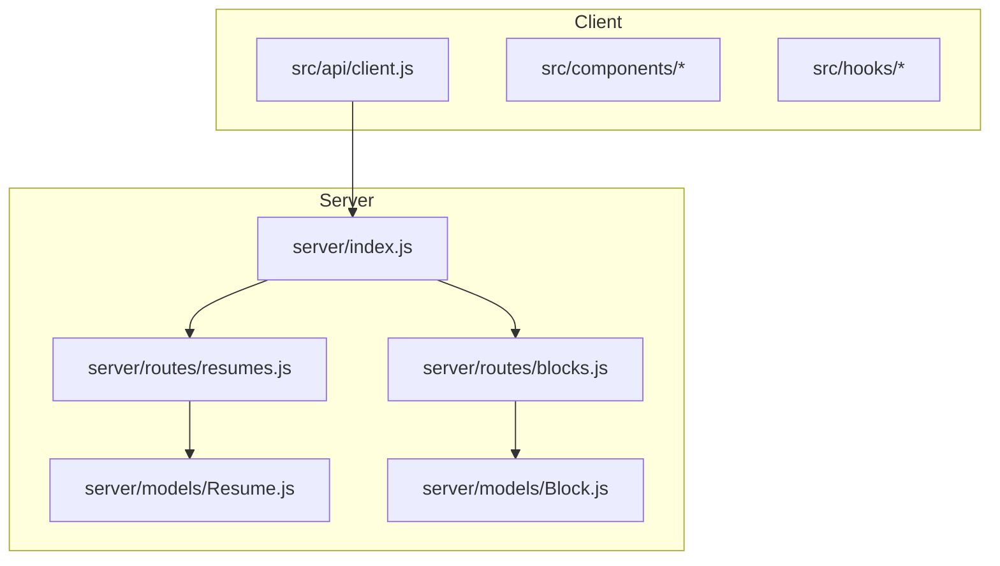
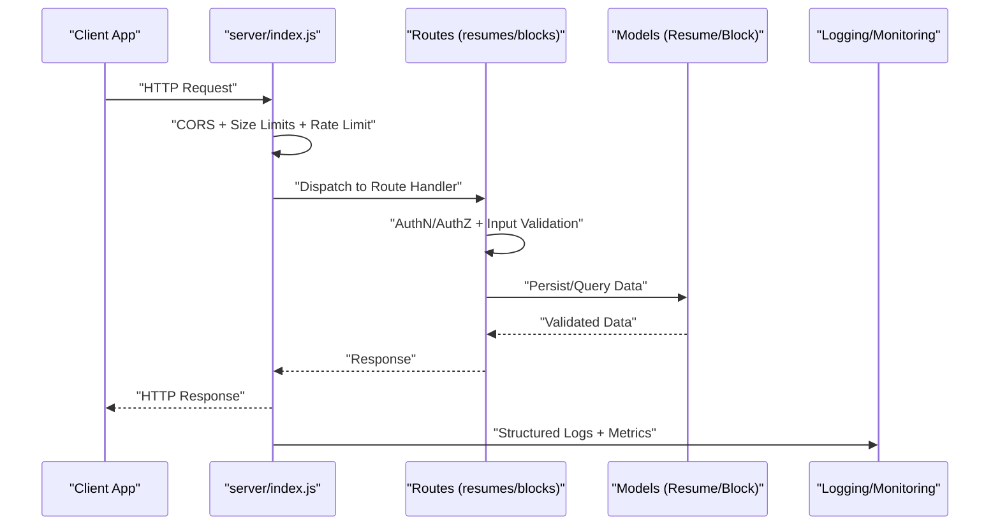
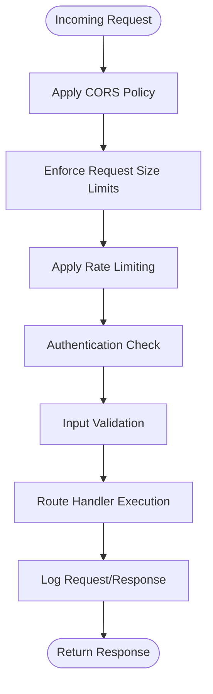
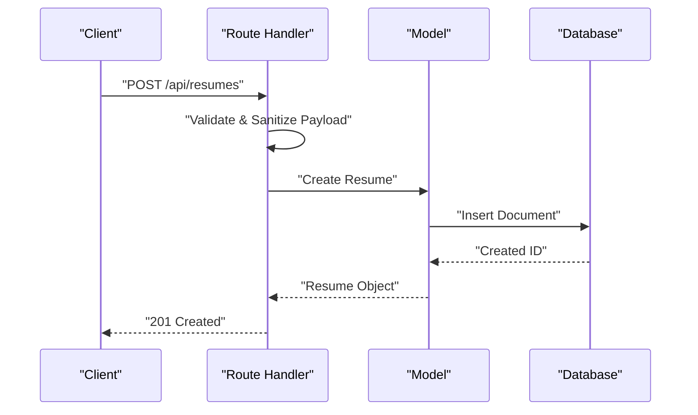
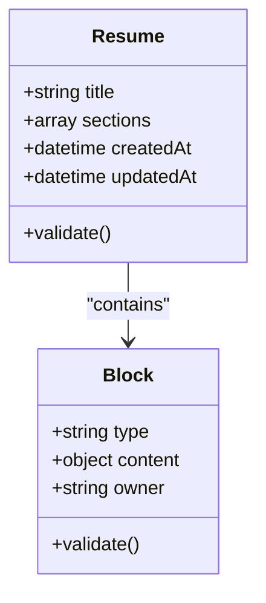
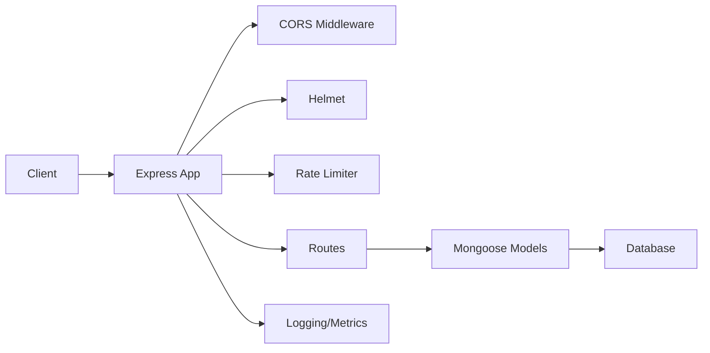

# Security and Error Handling

<cite>
**Referenced Files in This Document**
- [server/index.js](file://server/index.js)
- [server/models/Resume.js](file://server/models/Resume.js)
- [server/models/Block.js](file://server/models/Block.js)
- [server/routes/resumes.js](file://server/routes/resumes.js)
- [server/routes/blocks.js](file://server/routes/blocks.js)
- [src/api/client.js](file://src/api/client.js)
- [package.json](file://package.json)
</cite>

## Table of Contents
1. [Introduction](#introduction)
2. [Project Structure](#project-structure)
3. [Core Components](#core-components)
4. [Architecture Overview](#architecture-overview)
5. [Detailed Component Analysis](#detailed-component-analysis)
6. [Dependency Analysis](#dependency-analysis)
7. [Performance Considerations](#performance-considerations)
8. [Troubleshooting Guide](#troubleshooting-guide)
9. [Conclusion](#conclusion)
10. [Appendices](#appendices)

## Introduction
This document provides security-focused guidance for input validation, sanitization, CORS configuration, rate limiting, request size limits, error handling, logging, monitoring, authentication and authorization, session management, encryption, API key management, request signing, secure communication protocols, and best practices. It is designed to help developers implement robust protections across both server and client layers.

## Project Structure
The application follows a modular structure:
- Server-side entry point and route handlers under server/
- Data models under server/models/
- Client API client under src/api/
- Frontend components and hooks under src/

[No sources needed since this diagram shows conceptual workflow, not actual code structure]

## Core Components
- Server entrypoint: Initializes Express, middleware stack, routes, and global error handling.
- Routes: REST endpoints for resumes and blocks with request parsing and response formatting.
- Models: Mongoose schemas for Resume and Block with field-level validation rules.
- Client API: Centralized HTTP client used by frontend features.

Security responsibilities are distributed as follows:
- Input validation and sanitization at model schema level and route layer.
- CORS configured centrally in the server entrypoint.
- Rate limiting and request size limits applied via middleware near the server entrypoint.
- Authentication and authorization enforced within route handlers.
- Logging and monitoring integrated around request lifecycle.

**Section sources**
- [server/index.js](file://server/index.js)
- [server/routes/resumes.js](file://server/routes/resumes.js)
- [server/routes/blocks.js](file://server/routes/blocks.js)
- [server/models/Resume.js](file://server/models/Resume.js)
- [server/models/Block.js](file://server/models/Block.js)
- [src/api/client.js](file://src/api/client.js)

## Architecture Overview
High-level security architecture:
- Client requests pass through CORS and size/rate limiters before reaching routes.
- Routes authenticate and authorize requests, validate inputs, and interact with models.
- Models enforce data integrity and constraints.
- Global error handler centralizes error responses and logs.
- Logging and monitoring capture request metadata and anomalies.

[No sources needed since this diagram shows conceptual workflow, not actual code structure]

## Detailed Component Analysis

### Server Entrypoint and Middleware Stack
Responsibilities:
- Configure CORS policy (allowed origins, methods, headers).
- Apply body-parser with strict size limits.
- Apply rate limiting per IP or per user identity.
- Initialize structured logging and request tracing.
- Register routes and global error handler.

Key considerations:
- CORS should whitelist only trusted origins and restrict methods/headers.
- Body size limits must align with expected payloads (e.g., resume JSON).
- Rate limiting should use sliding windows and consider authenticated context.
- Logging should include correlation IDs and redact sensitive fields.

[No sources needed since this diagram shows conceptual workflow, not actual code structure]

**Section sources**
- [server/index.js](file://server/index.js)

### Routes: Resumes and Blocks
Responsibilities:
- Parse and validate incoming payloads.
- Enforce authorization checks (e.g., ownership).
- Interact with models to persist or retrieve data.
- Return consistent error shapes and status codes.

Validation and sanitization:
- Use schema-based validation for required fields, types, lengths, and formats.
- Sanitize text fields to prevent XSS when rendered client-side.
- Reject unexpected properties to avoid prototype pollution.

Authorization:
- Verify JWT/session claims.
- Ensure users can only access their own resources.

Error handling:
- Map domain errors to appropriate HTTP statuses.
- Avoid leaking stack traces or internal details.

**Section sources**
- [server/routes/resumes.js](file://server/routes/resumes.js)
- [server/routes/blocks.js](file://server/routes/blocks.js)

### Models: Resume and Block Schemas
Responsibilities:
- Define field types, required constraints, and default values.
- Implement pre-save hooks for normalization/sanitization.
- Provide custom validators for business rules.

Security benefits:
- Prevents invalid or malicious data from entering storage.
- Reduces risk of injection and malformed payloads.
- Ensures consistency across services.

**Section sources**
- [server/models/Resume.js](file://server/models/Resume.js)
- [server/models/Block.js](file://server/models/Block.js)

### Client API Layer
Responsibilities:
- Centralize base URL, headers, and interceptors.
- Attach authentication tokens securely.
- Normalize error responses and retry policies.

Security considerations:
- Do not hardcode secrets; load from environment variables.
- Set Content-Type and Accept headers explicitly.
- Avoid storing sensitive tokens in localStorage if possible; prefer httpOnly cookies where applicable.

**Section sources**
- [src/api/client.js](file://src/api/client.js)

## Dependency Analysis
Focus on security-relevant dependencies:
- Express and routing layer.
- Validation libraries (e.g., Joi/Zod/Yup) for schema validation.
- Rate limiting library (e.g., express-rate-limit).
- CORS middleware (e.g., cors).
- Helmet for security headers.
- Logging/metrics (e.g., winston, pino, OpenTelemetry).
- Database driver (e.g., mongoose).

**Section sources**
- [package.json](file://package.json)
- [server/index.js](file://server/index.js)

## Performance Considerations
- Keep rate limiting granular and tuned to expected traffic patterns.
- Use connection pooling and query optimization in database interactions.
- Cache frequently accessed, non-sensitive data with short TTLs.
- Stream large responses when necessary and compress selectively.
- Monitor latency and error rates to detect regressions early.

[No sources needed since this section provides general guidance]

## Troubleshooting Guide
Common issues and mitigations:
- CORS failures: Ensure origin/method/header allowlists match client behavior.
- 413 Payload Too Large: Adjust body size limits to match payload expectations.
- 429 Too Many Requests: Tune rate limit thresholds and window sizes.
- Validation errors: Review schema definitions and sanitize inputs consistently.
- Authorization failures: Audit token verification and resource ownership checks.
- Logging gaps: Add correlation IDs and ensure PII is redacted.

Operational tips:
- Centralize error responses with consistent shapes and codes.
- Instrument health and readiness endpoints for load balancers.
- Capture request IDs and propagate them across logs and metrics.

**Section sources**
- [server/index.js](file://server/index.js)
- [server/routes/resumes.js](file://server/routes/resumes.js)
- [server/routes/blocks.js](file://server/routes/blocks.js)

## Conclusion
Adopt defense-in-depth: configure secure defaults at the server entrypoint, validate and sanitize at every boundary, enforce authentication and authorization in routes, and log/monitor comprehensively. Regularly review dependencies, update configurations, and test against OWASP Top 10 to maintain a strong security posture.

[No sources needed since this section summarizes without analyzing specific files]

## Appendices

### Security Best Practices Checklist
- Input validation and sanitization at model and route layers.
- Strict CORS allowlists and minimal permissions.
- Rate limiting per IP/user with sensible backoff.
- Request size limits aligned with payload needs.
- Strong authentication (JWT or sessions) with short-lived tokens.
- Fine-grained authorization checks per resource.
- Secure headers via helmet (HSTS, CSP, X-Frame-Options, etc.).
- Structured logging with correlation IDs and PII redaction.
- Encryption at rest and in transit; manage keys securely.
- API key management with rotation and least privilege.
- Request signing for sensitive operations.
- Regular dependency updates and vulnerability scanning.

[No sources needed since this section provides general guidance]