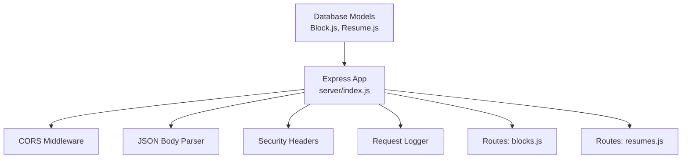
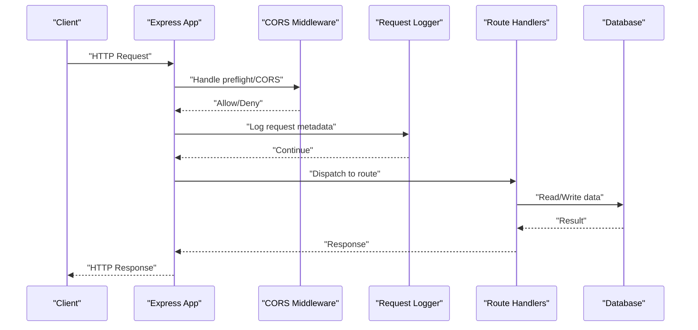
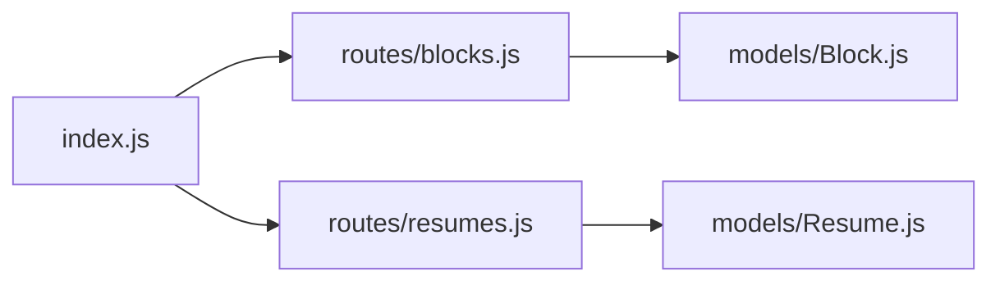

# Server Setup and Configuration

<cite>
**Referenced Files in This Document**
- [server/index.js](file://server/index.js)
- [package.json](file://package.json)
- [README.md](file://README.md)
- [server/models/Block.js](file://server/models/Block.js)
- [server/models/Resume.js](file://server/models/Resume.js)
- [server/routes/blocks.js](file://server/routes/blocks.js)
- [server/routes/resumes.js](file://server/routes/resumes.js)
</cite>

## Table of Contents
1. [Introduction](#introduction)
2. [Project Structure](#project-structure)
3. [Core Components](#core-components)
4. [Architecture Overview](#architecture-overview)
5. [Detailed Component Analysis](#detailed-component-analysis)
6. [Dependency Analysis](#dependency-analysis)
7. [Performance Considerations](#performance-considerations)
8. [Troubleshooting Guide](#troubleshooting-guide)
9. [Conclusion](#conclusion)

## Introduction
This document explains how the Express.js server is initialized and configured in this project. It covers environment variable configuration, port settings, database connection establishment, middleware stack (CORS, JSON body parsing, security headers, request logging), error handling, and differences between development and production environments. It also includes examples of custom middleware implementation and server startup scripts.

## Project Structure
The backend resides under the server directory and follows a modular layout:
- server/index.js: Express application bootstrap, middleware registration, route mounting, and server start
- server/models: Mongoose models for data persistence
- server/routes: Feature-based route modules for API endpoints

**Diagram sources**
- [server/index.js](file://server/index.js)
- [server/models/Block.js](file://server/models/Block.js)
- [server/models/Resume.js](file://server/models/Resume.js)
- [server/routes/blocks.js](file://server/routes/blocks.js)
- [server/routes/resumes.js](file://server/routes/resumes.js)

**Section sources**
- [server/index.js](file://server/index.js)
- [package.json](file://package.json)
- [README.md](file://README.md)

## Core Components
- Application entry point: Initializes Express, registers middleware, mounts routes, connects to the database, and starts listening on a configured port.
- Environment configuration: Reads environment variables for port, CORS origins, database URI, and feature flags.
- Database integration: Establishes a persistent connection using a MongoDB client via Mongoose.
- Middleware stack: Includes CORS, JSON parsing, security headers, and request logging.
- Error handling: Centralized error-handling middleware for consistent responses.
- Routes: Feature-specific route modules that implement RESTful endpoints.

**Section sources**
- [server/index.js](file://server/index.js)
- [server/models/Block.js](file://server/models/Block.js)
- [server/models/Resume.js](file://server/models/Resume.js)
- [server/routes/blocks.js](file://server/routes/blocks.js)
- [server/routes/resumes.js](file://server/routes/resumes.js)

## Architecture Overview
High-level flow from HTTP request to response:

**Diagram sources**
- [server/index.js](file://server/index.js)
- [server/routes/blocks.js](file://server/routes/blocks.js)
- [server/routes/resumes.js](file://server/routes/resumes.js)

## Detailed Component Analysis

### Server Initialization and Startup
- Creates the Express application instance.
- Loads environment variables for port, CORS origins, database URI, and other settings.
- Configures the database connection before starting the server.
- Starts listening on the configured port and logs readiness.

Key responsibilities:
- Port resolution with fallbacks
- Graceful shutdown hooks
- Health check or readiness signals (optional)

**Section sources**
- [server/index.js](file://server/index.js)
- [package.json](file://package.json)

### Environment Variables and Configuration
Commonly used variables:
- PORT: Server listen port
- NODE_ENV: Development vs production mode
- CORS_ORIGIN: Allowed origins for cross-origin requests
- DATABASE_URI: MongoDB connection string
- LOG_LEVEL: Logging verbosity

Configuration strategy:
- Read variables at startup
- Validate required values
- Provide defaults for non-critical settings
- Avoid committing secrets; use .env files locally

**Section sources**
- [server/index.js](file://server/index.js)
- [package.json](file://package.json)

### Middleware Stack
Order matters. Typical order:
1. CORS: Allow or deny cross-origin requests early
2. Security headers: Set secure defaults
3. Body parsers: Parse JSON bodies
4. Request logger: Record incoming requests
5. Route handlers: Business logic
6. Error handler: Catch unhandled errors

Notes:
- Place CORS before route handlers
- Ensure JSON parser runs after CORS
- Keep logging lightweight in production

**Section sources**
- [server/index.js](file://server/index.js)

#### CORS Configuration
- Configure allowed origins, methods, and headers
- Support preflight requests
- Enable credentials if needed

**Section sources**
- [server/index.js](file://server/index.js)

#### JSON Body Parsing
- Parse application/json payloads
- Handle malformed JSON gracefully
- Limit payload size if necessary

**Section sources**
- [server/index.js](file://server/index.js)

#### Security Headers
- Enforce HTTPS redirect in production
- Set Content-Security-Policy, X-Content-Type-Options, X-Frame-Options, Referrer-Policy, etc.
- Remove or minimize server version exposure

**Section sources**
- [server/index.js](file://server/index.js)

#### Request Logging
- Log method, path, status, duration, and user agent
- Exclude health checks or static assets in production
- Use structured logging for observability

**Section sources**
- [server/index.js](file://server/index.js)

### Error Handling Middleware
Centralized error handling should:
- Capture thrown and rejected errors
- Normalize error responses
- Mask internal details in production
- Preserve stack traces in development

Error types:
- Validation errors
- Not found
- Unauthorized/unauthenticated
- Internal server errors

**Section sources**
- [server/index.js](file://server/index.js)

### Database Connection Establishment
- Connect to MongoDB using a connection string
- Handle connection events (connected, error, disconnected)
- Retry or fail fast based on environment
- Close connections on process termination

Models:
- Block model
- Resume model

**Section sources**
- [server/models/Block.js](file://server/models/Block.js)
- [server/models/Resume.js](file://server/models/Resume.js)
- [server/index.js](file://server/index.js)

### Routes and Controllers
Feature-based routing:
- Blocks routes: CRUD operations for resume blocks
- Resumes routes: CRUD operations for resumes

Responsibilities:
- Validate input
- Interact with models
- Return consistent JSON responses
- Apply authorization where applicable

**Section sources**
- [server/routes/blocks.js](file://server/routes/blocks.js)
- [server/routes/resumes.js](file://server/routes/resumes.js)

### Custom Middleware Examples
Examples of useful custom middleware:
- Rate limiting per IP or user
- Authentication/authorization guard
- Request ID injection for tracing
- Input sanitization

Implementation pattern:
- Export a function that receives (req, res, next)
- Perform side effects or validations
- Call next() on success or send an error response

**Section sources**
- [server/index.js](file://server/index.js)

### Production vs Development Differences
Development:
- Verbose logging
- Relaxed CORS policy
- Detailed error messages
- Hot reload support (if applicable)

Production:
- Minimal logging
- Strict CORS and security headers
- Compact error responses
- Process manager integration (PM2, systemd)
- Graceful shutdown and health checks

**Section sources**
- [server/index.js](file://server/index.js)
- [package.json](file://package.json)

### Server Startup Scripts
Recommended npm scripts:
- dev: Start server with hot reload for development
- start: Run server in production mode
- build: Build frontend assets (if co-located)

Process management:
- Use a process manager in production
- Configure restart policies and resource limits

**Section sources**
- [package.json](file://package.json)

## Dependency Analysis
External dependencies commonly involved:
- express: Web framework
- cors: Cross-origin resource sharing
- helmet or similar: Security headers
- morgan or pino: Request logging
- mongoose: MongoDB ODM

Internal module relationships:
- index.js depends on routes and models
- routes depend on models
- models define schemas and helpers

**Diagram sources**
- [server/index.js](file://server/index.js)
- [server/routes/blocks.js](file://server/routes/blocks.js)
- [server/routes/resumes.js](file://server/routes/resumes.js)
- [server/models/Block.js](file://server/models/Block.js)
- [server/models/Resume.js](file://server/models/Resume.js)

**Section sources**
- [server/index.js](file://server/index.js)
- [server/routes/blocks.js](file://server/routes/blocks.js)
- [server/routes/resumes.js](file://server/routes/resumes.js)
- [server/models/Block.js](file://server/models/Block.js)
- [server/models/Resume.js](file://server/models/Resume.js)

## Performance Considerations
- Enable compression for large payloads
- Tune body-parser limits appropriately
- Use connection pooling for the database
- Cache frequent reads when safe
- Stream large responses if needed
- Monitor memory and CPU usage in production

[No sources needed since this section provides general guidance]

## Troubleshooting Guide
Common issues and resolutions:
- CORS failures: Verify allowed origins and methods; ensure CORS middleware precedes routes
- 404 Not Found: Check route prefixes and mount paths
- 413 Payload Too Large: Adjust body-parser limits
- Database connection errors: Validate DATABASE_URI and network access
- Port conflicts: Change PORT or kill conflicting processes
- Unhandled promise rejections: Add global rejection handlers and centralize error middleware

Operational tips:
- Inspect request logs for failing endpoints
- Use structured logs and correlation IDs
- Implement health checks for load balancers

**Section sources**
- [server/index.js](file://server/index.js)

## Conclusion
A robust Express.js server combines clear initialization, a well-ordered middleware stack, secure defaults, and resilient error handling. By separating concerns into routes and models, configuring environment-specific behavior, and integrating observability, the server remains maintainable and reliable across development and production.