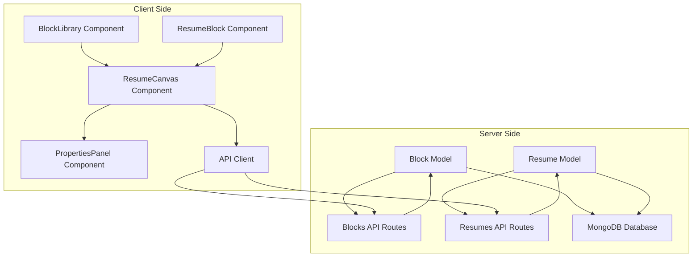
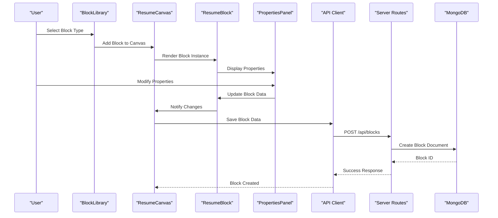
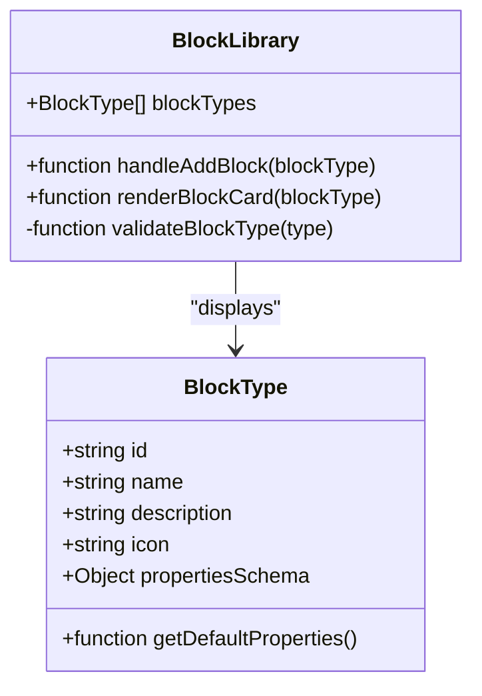
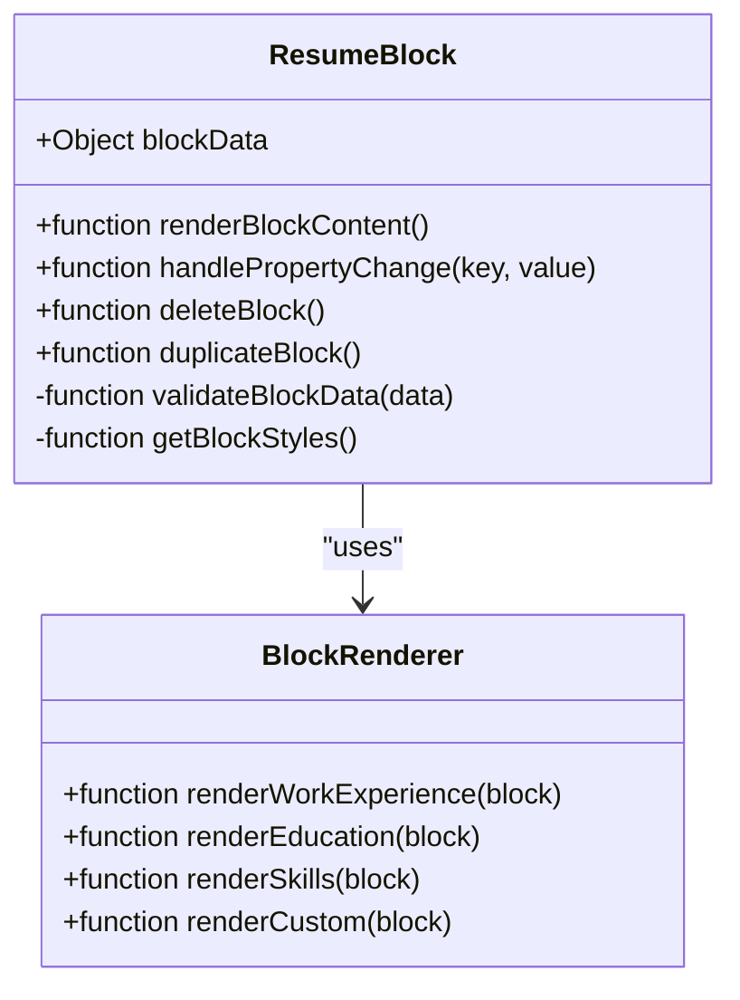
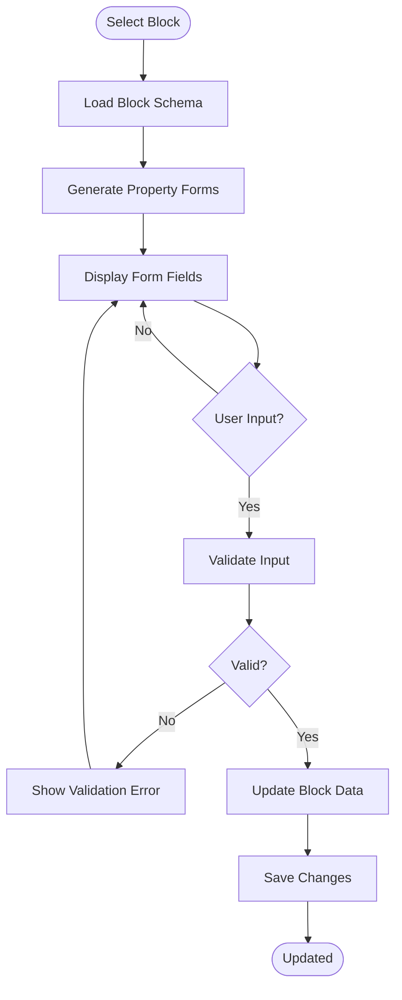
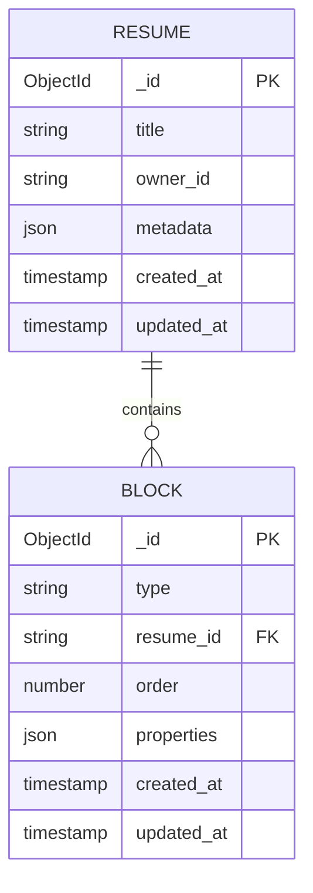
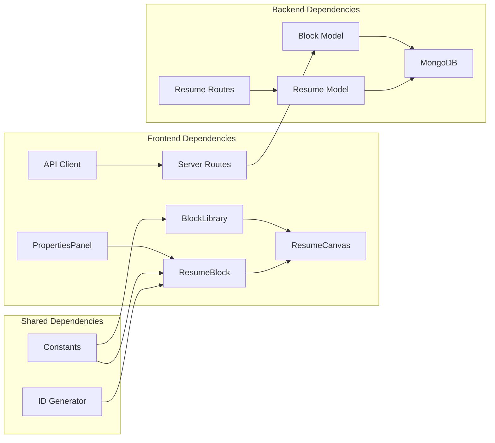

# Block System

<cite>
**Referenced Files in This Document**
- [Block.js](file://server/models/Block.js)
- [Resume.js](file://server/models/Resume.js)
- [blocks.js](file://server/routes/blocks.js)
- [resumes.js](file://server/routes/resumes.js)
- [BlockLibrary.jsx](file://src/components/BlockLibrary/BlockLibrary.jsx)
- [ResumeBlock.jsx](file://src/components/ResumeCanvas/ResumeBlock.jsx)
- [ResumeCanvas.jsx](file://src/components/ResumeCanvas/ResumeCanvas.jsx)
- [PropertiesPanel.jsx](file://src/components/PropertiesPanel/PropertiesPanel.jsx)
- [constants.js](file://src/utils/constants.js)
- [client.js](file://src/api/client.js)
</cite>

## Table of Contents
1. [Introduction](#introduction)
2. [Project Structure](#project-structure)
3. [Core Components](#core-components)
4. [Architecture Overview](#architecture-overview)
5. [Detailed Component Analysis](#detailed-component-analysis)
6. [Dependency Analysis](#dependency-analysis)
7. [Performance Considerations](#performance-considerations)
8. [Troubleshooting Guide](#troubleshooting-guide)
9. [Conclusion](#conclusion)

## Introduction

The Block System is a modular content management architecture designed for the Modular Resume Builder application. It enables users to create dynamic resumes by combining various content blocks, each representing different types of resume sections such as work experience, education, skills, or custom content. The system provides a flexible framework where blocks serve as reusable, configurable units that can be easily extended with new types and behaviors.

This documentation covers the complete block system architecture, including server-side data models, client-side components, validation rules, and lifecycle management.

## Project Structure

The block system is implemented across both server and client sides, following a clear separation of concerns:

**Diagram sources**
- [Block.js:1-200](file://server/models/Block.js#L1-L200)
- [Resume.js:1-200](file://server/models/Resume.js#L1-L200)
- [blocks.js:1-200](file://server/routes/blocks.js#L1-L200)
- [BlockLibrary.jsx:1-200](file://src/components/BlockLibrary/BlockLibrary.jsx#L1-L200)
- [ResumeBlock.jsx:1-200](file://src/components/ResumeCanvas/ResumeBlock.jsx#L1-L200)

**Section sources**
- [Block.js:1-200](file://server/models/Block.js#L1-L200)
- [Resume.js:1-200](file://server/models/Resume.js#L1-L200)
- [blocks.js:1-200](file://server/routes/blocks.js#L1-L200)
- [BlockLibrary.jsx:1-200](file://src/components/BlockLibrary/BlockLibrary.jsx#L1-L200)
- [ResumeBlock.jsx:1-200](file://src/components/ResumeCanvas/ResumeBlock.jsx#L1-L200)

## Core Components

### Server-Side Architecture

#### Block Model
The Block model defines the core data structure for all block types in the system. It includes Mongoose schema validation, property definitions, and relationship management with resumes.

#### Resume Model
The Resume model manages the collection of blocks and their ordering within a resume document.

#### API Routes
The blocks and resumes routes provide RESTful endpoints for CRUD operations on blocks and manage block-resume relationships.

### Client-Side Architecture

#### BlockLibrary Component
Displays available block types that users can add to their resume canvas.

#### ResumeBlock Component
Renders individual blocks on the resume canvas with editing capabilities.

#### PropertiesPanel Component
Provides an interface for configuring block properties and settings.

**Section sources**
- [Block.js:1-200](file://server/models/Block.js#L1-L200)
- [Resume.js:1-200](file://server/models/Resume.js#L1-L200)
- [blocks.js:1-200](file://server/routes/blocks.js#L1-L200)
- [BlockLibrary.jsx:1-200](file://src/components/BlockLibrary/BlockLibrary.jsx#L1-L200)
- [ResumeBlock.jsx:1-200](file://src/components/ResumeCanvas/ResumeBlock.jsx#L1-L200)
- [PropertiesPanel.jsx:1-200](file://src/components/PropertiesPanel/PropertiesPanel.jsx#L1-L200)

## Architecture Overview

The block system follows a component-based architecture with clear separation between presentation, business logic, and data persistence layers.

**Diagram sources**
- [BlockLibrary.jsx:1-200](file://src/components/BlockLibrary/BlockLibrary.jsx#L1-L200)
- [ResumeCanvas.jsx:1-200](file://src/components/ResumeCanvas/ResumeCanvas.jsx#L1-L200)
- [ResumeBlock.jsx:1-200](file://src/components/ResumeCanvas/ResumeBlock.jsx#L1-L200)
- [PropertiesPanel.jsx:1-200](file://src/components/PropertiesPanel/PropertiesPanel.jsx#L1-L200)
- [blocks.js:1-200](file://server/routes/blocks.js#L1-L200)
- [Block.js:1-200](file://server/models/Block.js#L1-L200)

## Detailed Component Analysis

### Block Library Component

The BlockLibrary component serves as the entry point for adding new blocks to a resume. It displays available block types with their descriptions and allows users to select which type to add.

**Diagram sources**
- [BlockLibrary.jsx:1-200](file://src/components/BlockLibrary/BlockLibrary.jsx#L1-L200)
- [constants.js:1-200](file://src/utils/constants.js#L1-L200)

### Resume Block Component

The ResumeBlock component renders individual block instances on the resume canvas. It handles block-specific rendering logic, property editing, and user interactions.

**Diagram sources**
- [ResumeBlock.jsx:1-200](file://src/components/ResumeCanvas/ResumeBlock.jsx#L1-L200)

### Properties Panel Component

The PropertiesPanel component provides a dynamic form interface for editing block properties based on the selected block's schema definition.

**Diagram sources**
- [PropertiesPanel.jsx:1-200](file://src/components/PropertiesPanel/PropertiesPanel.jsx#L1-L200)

### Server-Side Block Model

The Block model implements Mongoose schema validation and data persistence for block documents.

**Diagram sources**
- [Block.js:1-200](file://server/models/Block.js#L1-L200)
- [Resume.js:1-200](file://server/models/Resume.js#L1-L200)

**Section sources**
- [BlockLibrary.jsx:1-200](file://src/components/BlockLibrary/BlockLibrary.jsx#L1-L200)
- [ResumeBlock.jsx:1-200](file://src/components/ResumeCanvas/ResumeBlock.jsx#L1-L200)
- [PropertiesPanel.jsx:1-200](file://src/components/PropertiesPanel/PropertiesPanel.jsx#L1-L200)
- [Block.js:1-200](file://server/models/Block.js#L1-L200)
- [Resume.js:1-200](file://server/models/Resume.js#L1-L200)

## Dependency Analysis

The block system maintains clear dependency relationships between components and services:

**Diagram sources**
- [BlockLibrary.jsx:1-200](file://src/components/BlockLibrary/BlockLibrary.jsx#L1-L200)
- [ResumeCanvas.jsx:1-200](file://src/components/ResumeCanvas/ResumeCanvas.jsx#L1-L200)
- [ResumeBlock.jsx:1-200](file://src/components/ResumeCanvas/ResumeBlock.jsx#L1-L200)
- [PropertiesPanel.jsx:1-200](file://src/components/PropertiesPanel/PropertiesPanel.jsx#L1-L200)
- [client.js:1-200](file://src/api/client.js#L1-L200)
- [blocks.js:1-200](file://server/routes/blocks.js#L1-L200)
- [resumes.js:1-200](file://server/routes/resumes.js#L1-L200)
- [constants.js:1-200](file://src/utils/constants.js#L1-L200)

**Section sources**
- [client.js:1-200](file://src/api/client.js#L1-L200)
- [blocks.js:1-200](file://server/routes/blocks.js#L1-L200)
- [resumes.js:1-200](file://server/routes/resumes.js#L1-L200)
- [constants.js:1-200](file://src/utils/constants.js#L1-L200)

## Performance Considerations

The block system is designed with performance optimization in mind:

- **Lazy Loading**: Block components are loaded only when needed
- **Efficient Rendering**: React key props ensure optimal re-rendering
- **Database Indexing**: MongoDB indexes optimize block queries
- **Caching Strategy**: Frequently accessed block templates are cached
- **Batch Operations**: Multiple block updates are batched when possible

## Troubleshooting Guide

Common issues and their solutions:

### Block Validation Errors
- Check schema definitions in constants
- Verify property values match expected types
- Ensure required fields are populated

### Block Rendering Issues
- Verify block type exists in registry
- Check for missing dependencies
- Validate block data structure

### API Communication Problems
- Verify server connectivity
- Check authentication tokens
- Review error responses from server

**Section sources**
- [Block.js:1-200](file://server/models/Block.js#L1-L200)
- [blocks.js:1-200](file://server/routes/blocks.js#L1-L200)
- [ResumeBlock.jsx:1-200](file://src/components/ResumeCanvas/ResumeBlock.jsx#L1-L200)

## Conclusion

The Block System provides a robust, extensible foundation for the Modular Resume Builder. Its modular architecture enables easy addition of new block types while maintaining consistency in data structure and user experience. The system successfully balances flexibility with validation, allowing for creative resume layouts while ensuring data integrity and performance.

Key strengths include:
- Clear separation of concerns between frontend and backend
- Comprehensive validation and error handling
- Extensible design for custom block types
- Efficient data flow and state management
- Strong typing and schema enforcement