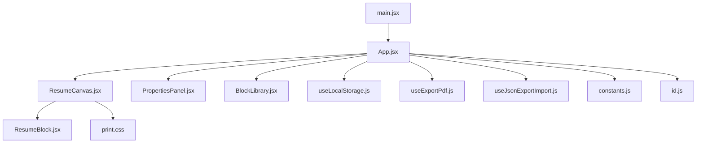
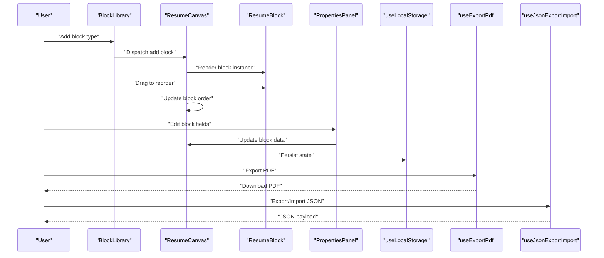
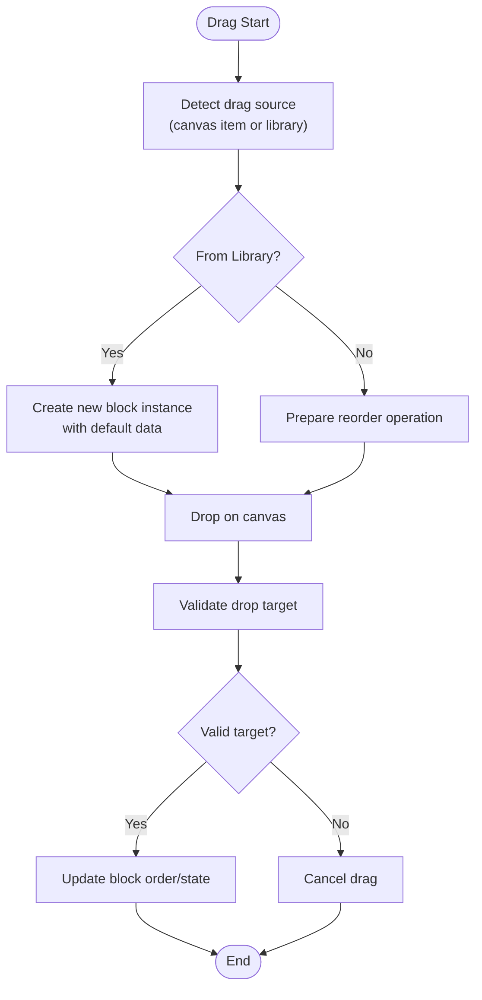
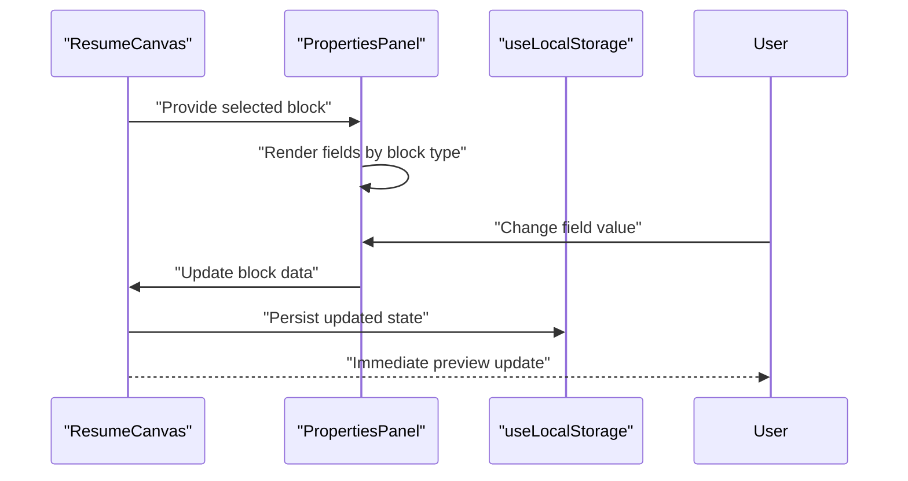
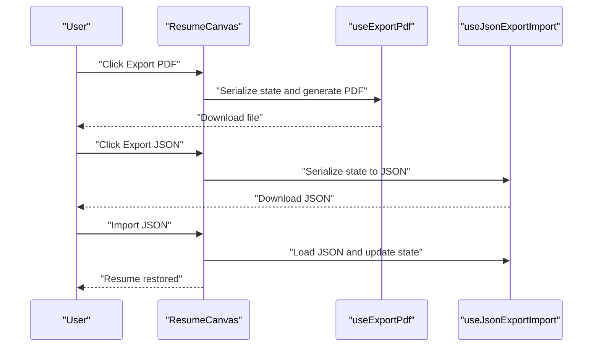
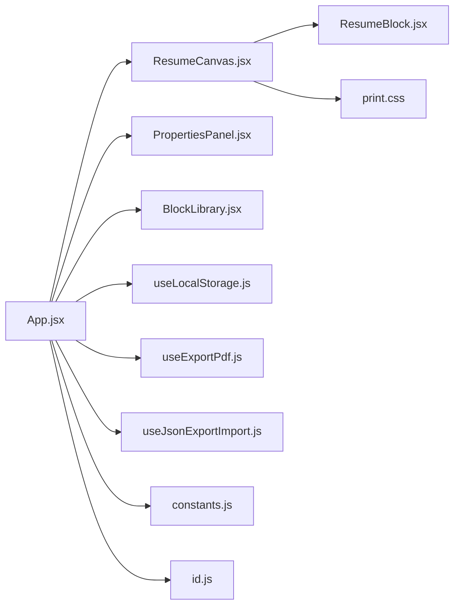

# Core Features

<cite>
**Referenced Files in This Document**
- [App.jsx](file://src/App.jsx)
- [main.jsx](file://src/main.jsx)
- [ResumeCanvas.jsx](file://src/components/ResumeCanvas/ResumeCanvas.jsx)
- [ResumeBlock.jsx](file://src/components/ResumeCanvas/ResumeBlock.jsx)
- [PropertiesPanel.jsx](file://src/components/PropertiesPanel/PropertiesPanel.jsx)
- [BlockLibrary.jsx](file://src/components/BlockLibrary/BlockLibrary.jsx)
- [useLocalStorage.js](file://src/hooks/useLocalStorage.js)
- [useExportPdf.js](file://src/hooks/useExportPdf.js)
- [useJsonExportImport.js](file://src/hooks/useJsonExportImport.js)
- [constants.js](file://src/utils/constants.js)
- [id.js](file://src/utils/id.js)
- [print.css](file://src/print.css)
</cite>

## Table of Contents
1. [Introduction](#introduction)
2. [Project Structure](#project-structure)
3. [Core Components](#core-components)
4. [Architecture Overview](#architecture-overview)
5. [Detailed Component Analysis](#detailed-component-analysis)
6. [Dependency Analysis](#dependency-analysis)
7. [Performance Considerations](#performance-considerations)
8. [Troubleshooting Guide](#troubleshooting-guide)
9. [Conclusion](#conclusion)

## Introduction
This document explains the core features of the Modular Resume Builder with a focus on:
- Block-based resume building system
- Drag-and-drop interface using React DnD for intuitive block arrangement
- Context-aware properties panel for editing selected blocks
- Export functionality including PDF generation and print optimization
- Real-time preview updates as users edit content
- Local storage persistence to automatically save progress

The goal is to provide both high-level understanding and code-level insights so that developers can extend, maintain, and troubleshoot the application effectively.

## Project Structure
At a high level, the application follows a component-based architecture with clear separation between UI components, hooks for state and side effects, and utilities for shared logic. The main entry point initializes the app and mounts it into the DOM. The canvas area renders draggable blocks, while the properties panel provides context-aware editing. A library panel exposes reusable block types. Persistence and export are implemented via dedicated hooks.

**Diagram sources**
- [main.jsx](file://src/main.jsx)
- [App.jsx](file://src/App.jsx)
- [ResumeCanvas.jsx](file://src/components/ResumeCanvas/ResumeCanvas.jsx)
- [ResumeBlock.jsx](file://src/components/ResumeCanvas/ResumeBlock.jsx)
- [PropertiesPanel.jsx](file://src/components/PropertiesPanel/PropertiesPanel.jsx)
- [BlockLibrary.jsx](file://src/components/BlockLibrary/BlockLibrary.jsx)
- [useLocalStorage.js](file://src/hooks/useLocalStorage.js)
- [useExportPdf.js](file://src/hooks/useExportPdf.js)
- [useJsonExportImport.js](file://src/hooks/useJsonExportImport.js)
- [constants.js](file://src/utils/constants.js)
- [id.js](file://src/utils/id.js)
- [print.css](file://src/print.css)

**Section sources**
- [main.jsx](file://src/main.jsx)
- [App.jsx](file://src/App.jsx)

## Core Components
- ResumeCanvas: Hosts the drag-and-drop surface, manages block order, selection, and rendering of individual blocks. It coordinates real-time updates and integrates with persistence and export hooks.
- ResumeBlock: Renders a single block instance based on its type and data. It participates in drag-and-drop operations and exposes handlers for selection and editing.
- PropertiesPanel: Displays editable fields for the currently selected block. It updates block data in response to user input and triggers immediate preview refresh.
- BlockLibrary: Provides a palette of available block types that users can add to the canvas. It supports adding new instances and may support drag-to-add workflows.
- Hooks:
  - useLocalStorage: Persists the current resume state (blocks and metadata) to browser local storage and restores it on load.
  - useExportPdf: Generates PDF output using jsPDF and applies print-friendly formatting.
  - useJsonExportImport: Exports the resume as JSON and imports previously exported JSON to restore state.
- Utilities:
  - constants.js: Shared configuration such as block type definitions and default values.
  - id.js: Unique ID generation for blocks and other entities.

These components collaborate to deliver a responsive, interactive resume builder with persistent state and robust export capabilities.

**Section sources**
- [ResumeCanvas.jsx](file://src/components/ResumeCanvas/ResumeCanvas.jsx)
- [ResumeBlock.jsx](file://src/components/ResumeCanvas/ResumeBlock.jsx)
- [PropertiesPanel.jsx](file://src/components/PropertiesPanel/PropertiesPanel.jsx)
- [BlockLibrary.jsx](file://src/components/BlockLibrary/BlockLibrary.jsx)
- [useLocalStorage.js](file://src/hooks/useLocalStorage.js)
- [useExportPdf.js](file://src/hooks/useExportPdf.js)
- [useJsonExportImport.js](file://src/hooks/useJsonExportImport.js)
- [constants.js](file://src/utils/constants.js)
- [id.js](file://src/utils/id.js)

## Architecture Overview
The application centers around a stateful canvas that holds an ordered list of blocks. Each block has a type and associated data. The properties panel reacts to the selected block to present relevant fields. Drag-and-drop reorders or adds blocks. Export hooks transform the current state into PDF or JSON formats. Local storage ensures continuity across sessions.

**Diagram sources**
- [BlockLibrary.jsx](file://src/components/BlockLibrary/BlockLibrary.jsx)
- [ResumeCanvas.jsx](file://src/components/ResumeCanvas/ResumeCanvas.jsx)
- [ResumeBlock.jsx](file://src/components/ResumeCanvas/ResumeBlock.jsx)
- [PropertiesPanel.jsx](file://src/components/PropertiesPanel/PropertiesPanel.jsx)
- [useLocalStorage.js](file://src/hooks/useLocalStorage.js)
- [useExportPdf.js](file://src/hooks/useExportPdf.js)
- [useJsonExportImport.js](file://src/hooks/useJsonExportImport.js)

## Detailed Component Analysis

### Block-Based Resume Building System
The resume is represented as an ordered collection of blocks. Each block includes:
- Type identifier used to determine rendering and editing behavior
- Data payload containing field values specific to the block type
- Optional metadata such as styling or layout hints

Key behaviors:
- Adding blocks from the library creates new instances with default data
- Reordering blocks changes their position in the array
- Deleting blocks removes them from the state
- Validation and defaults are enforced per block type

Implementation highlights:
- Block definitions and defaults are centralized in constants
- Unique IDs are generated for each block instance
- State updates trigger immediate re-renders for live preview

**Section sources**
- [constants.js](file://src/utils/constants.js)
- [id.js](file://src/utils/id.js)
- [ResumeCanvas.jsx](file://src/components/ResumeCanvas/ResumeCanvas.jsx)
- [ResumeBlock.jsx](file://src/components/ResumeCanvas/ResumeBlock.jsx)

### Drag-and-Drop Interface Using React DnD
The canvas uses React DnD to enable intuitive block manipulation:
- Dragging within the canvas reorders blocks
- Dragging from the library to the canvas adds new blocks
- Visual feedback indicates drop targets and active dragging states

Core responsibilities:
- Manage drag source and drop target contexts
- Update block order upon successful drops
- Maintain selection state during interactions
- Prevent invalid drops and handle edge cases

**Diagram sources**
- [ResumeCanvas.jsx](file://src/components/ResumeCanvas/ResumeCanvas.jsx)
- [ResumeBlock.jsx](file://src/components/ResumeCanvas/ResumeBlock.jsx)
- [BlockLibrary.jsx](file://src/components/BlockLibrary/BlockLibrary.jsx)

**Section sources**
- [ResumeCanvas.jsx](file://src/components/ResumeCanvas/ResumeCanvas.jsx)
- [ResumeBlock.jsx](file://src/components/ResumeCanvas/ResumeBlock.jsx)
- [BlockLibrary.jsx](file://src/components/BlockLibrary/BlockLibrary.jsx)

### Properties Panel System
The properties panel provides context-aware editing based on the selected block:
- Displays only fields relevant to the active block type
- Supports text inputs, toggles, selects, and other controls depending on schema
- Updates block data immediately on change
- Validates inputs and shows inline feedback when applicable

Integration points:
- Receives the selected block reference from the canvas
- Dispatches update actions back to the canvas state
- Triggers persistence and preview refresh

**Diagram sources**
- [PropertiesPanel.jsx](file://src/components/PropertiesPanel/PropertiesPanel.jsx)
- [ResumeCanvas.jsx](file://src/components/ResumeCanvas/ResumeCanvas.jsx)
- [useLocalStorage.js](file://src/hooks/useLocalStorage.js)

**Section sources**
- [PropertiesPanel.jsx](file://src/components/PropertiesPanel/PropertiesPanel.jsx)
- [ResumeCanvas.jsx](file://src/components/ResumeCanvas/ResumeCanvas.jsx)

### Export Functionality: PDF Generation and Print Optimization
Export features include:
- PDF generation using jsPDF to produce downloadable documents
- Print optimization via CSS media queries for clean page breaks and typography
- JSON export/import for backup and sharing

Workflow:
- Trigger export from UI
- Serialize current state
- Generate PDF or JSON
- Provide download or import dialog

**Diagram sources**
- [useExportPdf.js](file://src/hooks/useExportPdf.js)
- [useJsonExportImport.js](file://src/hooks/useJsonExportImport.js)
- [ResumeCanvas.jsx](file://src/components/ResumeCanvas/ResumeCanvas.jsx)
- [print.css](file://src/print.css)

**Section sources**
- [useExportPdf.js](file://src/hooks/useExportPdf.js)
- [useJsonExportImport.js](file://src/hooks/useJsonExportImport.js)
- [print.css](file://src/print.css)

### Real-Time Preview System
The preview updates instantly as users interact with blocks:
- Any state mutation (add, move, edit) triggers a re-render
- The canvas reflects changes without requiring manual refresh
- Debouncing or batching may be applied to expensive operations if needed

Key mechanisms:
- Centralized state management in the canvas component
- Immediate propagation of updates to child components
- Efficient re-renders leveraging React’s reconciliation

**Section sources**
- [ResumeCanvas.jsx](file://src/components/ResumeCanvas/ResumeCanvas.jsx)
- [ResumeBlock.jsx](file://src/components/ResumeCanvas/ResumeBlock.jsx)
- [PropertiesPanel.jsx](file://src/components/PropertiesPanel/PropertiesPanel.jsx)

### Local Storage Persistence
Local storage ensures work continuity:
- On mount, the app loads saved state from local storage
- On every meaningful state change, the app persists the latest state
- Auto-save reduces risk of data loss and improves UX

Behavioral notes:
- Handles serialization and deserialization safely
- Gracefully handles missing or corrupted entries
- Avoids excessive writes by debouncing or throttling if necessary

**Section sources**
- [useLocalStorage.js](file://src/hooks/useLocalStorage.js)
- [ResumeCanvas.jsx](file://src/components/ResumeCanvas/ResumeCanvas.jsx)

## Dependency Analysis
The following diagram illustrates key dependencies among core modules:

**Diagram sources**
- [App.jsx](file://src/App.jsx)
- [ResumeCanvas.jsx](file://src/components/ResumeCanvas/ResumeCanvas.jsx)
- [ResumeBlock.jsx](file://src/components/ResumeCanvas/ResumeBlock.jsx)
- [PropertiesPanel.jsx](file://src/components/PropertiesPanel/PropertiesPanel.jsx)
- [BlockLibrary.jsx](file://src/components/BlockLibrary/BlockLibrary.jsx)
- [useLocalStorage.js](file://src/hooks/useLocalStorage.js)
- [useExportPdf.js](file://src/hooks/useExportPdf.js)
- [useJsonExportImport.js](file://src/hooks/useJsonExportImport.js)
- [constants.js](file://src/utils/constants.js)
- [id.js](file://src/utils/id.js)
- [print.css](file://src/print.css)

**Section sources**
- [App.jsx](file://src/App.jsx)
- [ResumeCanvas.jsx](file://src/components/ResumeCanvas/ResumeCanvas.jsx)
- [PropertiesPanel.jsx](file://src/components/PropertiesPanel/PropertiesPanel.jsx)
- [BlockLibrary.jsx](file://src/components/BlockLibrary/BlockLibrary.jsx)
- [useLocalStorage.js](file://src/hooks/useLocalStorage.js)
- [useExportPdf.js](file://src/hooks/useExportPdf.js)
- [useJsonExportImport.js](file://src/hooks/useJsonExportImport.js)
- [constants.js](file://src/utils/constants.js)
- [id.js](file://src/utils/id.js)
- [print.css](file://src/print.css)

## Performance Considerations
- Minimize unnecessary re-renders by keeping block data immutable and updating only changed fields
- Use stable keys for block lists to optimize reconciliation
- Debounce heavy operations like PDF generation or large JSON exports
- Keep block schemas lean; avoid storing redundant derived data in state
- Leverage CSS print rules to reduce layout thrashing during print/PDF export

[No sources needed since this section provides general guidance]

## Troubleshooting Guide
Common issues and resolutions:
- Blocks not saving: Verify local storage hook integration and ensure state updates trigger persistence
- Drag-and-drop not working: Confirm drag source and drop target bindings and check for event conflicts
- Properties panel not updating: Ensure selected block reference is passed correctly and updates propagate to canvas
- PDF export fails: Check jsPDF initialization and print CSS rules; validate that content fits page boundaries
- Import JSON errors: Validate JSON structure against expected schema and handle malformed data gracefully

**Section sources**
- [useLocalStorage.js](file://src/hooks/useLocalStorage.js)
- [useExportPdf.js](file://src/hooks/useExportPdf.js)
- [useJsonExportImport.js](file://src/hooks/useJsonExportImport.js)
- [print.css](file://src/print.css)

## Conclusion
The Modular Resume Builder delivers a flexible, extensible platform for creating resumes through reusable blocks. Its drag-and-drop interface, context-aware editing, real-time preview, robust export options, and automatic persistence combine to provide a smooth user experience. By adhering to the patterns outlined here, teams can confidently add new block types, enhance export capabilities, and refine performance characteristics.