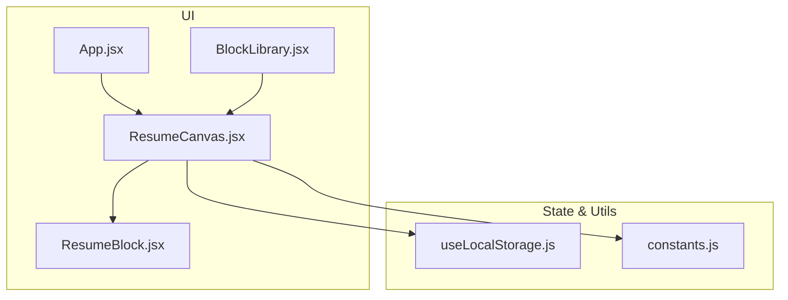
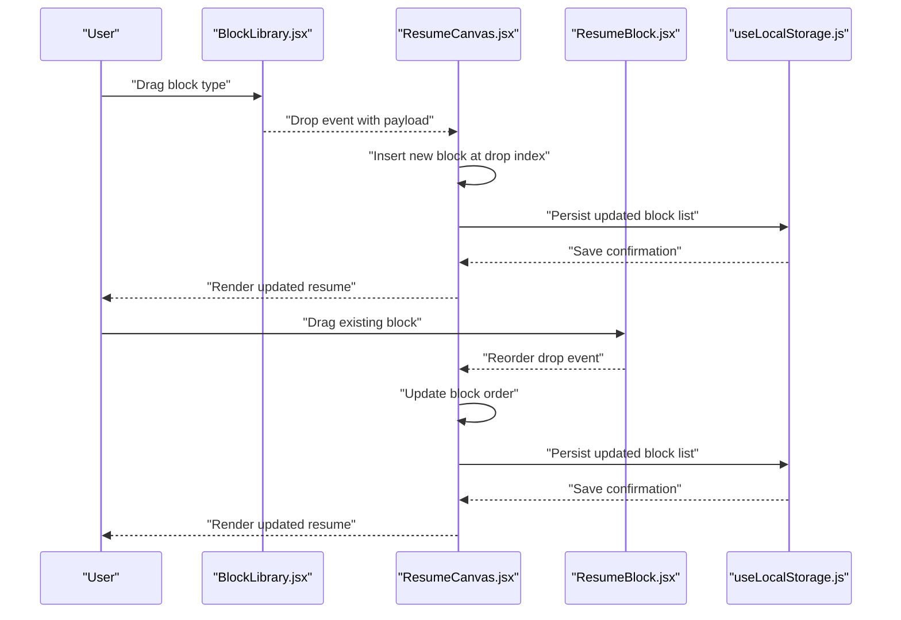
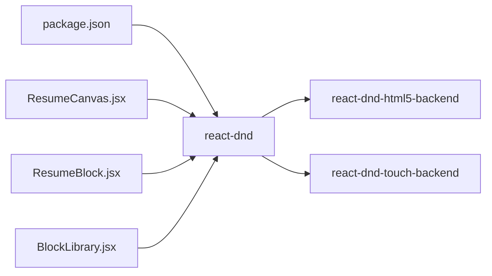

# Drag-and-Drop Interface

<cite>
**Referenced Files in This Document**
- [ResumeCanvas.jsx](file://src/components/ResumeCanvas/ResumeCanvas.jsx)
- [ResumeBlock.jsx](file://src/components/ResumeCanvas/ResumeBlock.jsx)
- [BlockLibrary.jsx](file://src/components/BlockLibrary/BlockLibrary.jsx)
- [package.json](file://package.json)
- [App.jsx](file://src/App.jsx)
- [useLocalStorage.js](file://src/hooks/useLocalStorage.js)
- [constants.js](file://src/utils/constants.js)
</cite>

## Table of Contents
1. [Introduction](#introduction)
2. [Project Structure](#project-structure)
3. [Core Components](#core-components)
4. [Architecture Overview](#architecture-overview)
5. [Detailed Component Analysis](#detailed-component-analysis)
6. [Dependency Analysis](#dependency-analysis)
7. [Performance Considerations](#performance-considerations)
8. [Troubleshooting Guide](#troubleshooting-guide)
9. [Conclusion](#conclusion)

## Introduction
This document explains the drag-and-drop interface implemented for the Modular Resume Builder using React DnD. It focuses on how users can add, reorder, and remove blocks through intuitive drag operations, how the ResumeCanvas component manages block positioning, touch support for mobile devices, accessibility considerations for keyboard navigation, visual feedback during drag operations, and implementation patterns for handling drop events and maintaining block order state. It also includes guidance for optimizing performance for large resumes and addressing common issues such as drag conflicts, boundary detection, and cross-browser compatibility.

## Project Structure
The drag-and-drop functionality is primarily implemented within the following components:
- ResumeCanvas: The main drop zone that renders the resume layout and manages block ordering.
- ResumeBlock: A draggable and droppable block rendered inside the canvas.
- BlockLibrary: A source panel where new blocks are added by dragging into the canvas.

**Diagram sources**
- [App.jsx](file://src/App.jsx)
- [ResumeCanvas.jsx](file://src/components/ResumeCanvas/ResumeCanvas.jsx)
- [ResumeBlock.jsx](file://src/components/ResumeCanvas/ResumeBlock.jsx)
- [BlockLibrary.jsx](file://src/components/BlockLibrary/BlockLibrary.jsx)
- [useLocalStorage.js](file://src/hooks/useLocalStorage.js)
- [constants.js](file://src/utils/constants.js)

**Section sources**
- [ResumeCanvas.jsx](file://src/components/ResumeCanvas/ResumeCanvas.jsx)
- [ResumeBlock.jsx](file://src/components/ResumeCanvas/ResumeBlock.jsx)
- [BlockLibrary.jsx](file://src/components/BlockLibrary/BlockLibrary.jsx)
- [App.jsx](file://src/App.jsx)
- [useLocalStorage.js](file://src/hooks/useLocalStorage.js)
- [constants.js](file://src/utils/constants.js)

## Core Components
- ResumeCanvas
  - Acts as the primary drop zone for blocks.
  - Manages the ordered list of blocks and updates state when blocks are dropped or reordered.
  - Provides visual cues for valid drop targets and highlights insertion points.
  - Integrates with persistence hooks to save changes.
- ResumeBlock
  - Wraps each block content with drag-and-drop behavior.
  - Supports reordering via drag handles and inline actions (e.g., removal).
  - Exposes accessibility attributes for keyboard navigation and screen readers.
- BlockLibrary
  - Presents available block types for adding new blocks to the resume.
  - Implements drag-to-add behavior so users can drag a block type into the canvas.

Key responsibilities and interactions:
- Adding blocks: Drag from BlockLibrary into ResumeCanvas; the canvas inserts a new block at the drop location.
- Reordering blocks: Drag a ResumeBlock to a new position; the canvas updates the block order accordingly.
- Removing blocks: Use an action within ResumeBlock to remove it from the canvas state.

**Section sources**
- [ResumeCanvas.jsx](file://src/components/ResumeCanvas/ResumeCanvas.jsx)
- [ResumeBlock.jsx](file://src/components/ResumeCanvas/ResumeBlock.jsx)
- [BlockLibrary.jsx](file://src/components/BlockLibrary/BlockLibrary.jsx)

## Architecture Overview
The drag-and-drop architecture uses React DnD to coordinate drag sources and drop targets across components. The flow centers around the ResumeCanvas as the authoritative state holder for block order, while individual blocks and library items act as drag sources. Drop events update the centralized state, which then re-renders the canvas with the updated order.

**Diagram sources**
- [BlockLibrary.jsx](file://src/components/BlockLibrary/BlockLibrary.jsx)
- [ResumeCanvas.jsx](file://src/components/ResumeCanvas/ResumeCanvas.jsx)
- [ResumeBlock.jsx](file://src/components/ResumeCanvas/ResumeBlock.jsx)
- [useLocalStorage.js](file://src/hooks/useLocalStorage.js)

## Detailed Component Analysis

### ResumeCanvas: Drop Zone and Ordering Logic
Responsibilities:
- Maintains the canonical array of blocks and their order.
- Registers itself as a drop target for both library items and existing blocks.
- Computes insertion indices based on drop coordinates and current block positions.
- Applies visual feedback (e.g., highlight zones) to guide users during drag operations.
- Persists changes to local storage after successful drops.

Implementation patterns:
- Centralized state management for block order.
- Event-driven updates triggered by drop handlers.
- Index-based insertion and reordering logic to maintain stable ordering.
- Integration with persistence hooks to ensure durability across sessions.

Accessibility considerations:
- Ensure focus management when inserting or removing blocks.
- Provide aria labels and roles for drop zones and actionable controls.
- Support keyboard shortcuts for moving and deleting blocks.

Touch support:
- Enable touch-based drag gestures for mobile devices.
- Provide clear visual indicators for active drag states and drop targets.

Visual feedback:
- Highlight insertion points and valid drop areas.
- Show ghost previews during drag operations.

**Section sources**
- [ResumeCanvas.jsx](file://src/components/ResumeCanvas/ResumeCanvas.jsx)
- [useLocalStorage.js](file://src/hooks/useLocalStorage.js)

### ResumeBlock: Draggable Item and Inline Actions
Responsibilities:
- Wraps block content with drag-and-drop capabilities.
- Exposes a drag handle for reordering.
- Provides inline actions such as removal.
- Announces block role and status to assistive technologies.

Implementation patterns:
- Encapsulates drag props and drop behaviors per block instance.
- Emits reorder events to the parent canvas.
- Uses stable identifiers to track blocks across re-renders.

Accessibility considerations:
- Keyboard operability for move up/down and delete actions.
- Proper labeling for screen readers.

Touch support:
- Gesture handling for long-press and drag on mobile.

Visual feedback:
- Visual state changes for hover, drag, and active states.

**Section sources**
- [ResumeBlock.jsx](file://src/components/ResumeCanvas/ResumeBlock.jsx)

### BlockLibrary: Source for New Blocks
Responsibilities:
- Displays available block types.
- Enables drag-to-add behavior into the canvas.
- Supplies metadata required to instantiate a new block.

Implementation patterns:
- Each item acts as a drag source with a defined data shape.
- Coordinates with the canvas drop handler to insert new blocks.

Accessibility considerations:
- Keyboard selection and activation to add blocks.
- Clear labels describing block types.

Touch support:
- Touch gestures to initiate drag from library items.

**Section sources**
- [BlockLibrary.jsx](file://src/components/BlockLibrary/BlockLibrary.jsx)

### State Persistence and Utilities
- useLocalStorage hook: Persists block order and content between sessions.
- constants: Shared configuration values used across components (e.g., default block templates).

Integration points:
- ResumeCanvas reads and writes to local storage via the hook.
- Constants inform default behaviors and UI strings.

**Section sources**
- [useLocalStorage.js](file://src/hooks/useLocalStorage.js)
- [constants.js](file://src/utils/constants.js)

## Dependency Analysis
The drag-and-drop system depends on React DnD for core drag/drop primitives. The package manifest indicates the inclusion of react-dnd and related adapters.

**Diagram sources**
- [package.json](file://package.json)
- [ResumeCanvas.jsx](file://src/components/ResumeCanvas/ResumeCanvas.jsx)
- [ResumeBlock.jsx](file://src/components/ResumeCanvas/ResumeBlock.jsx)
- [BlockLibrary.jsx](file://src/components/BlockLibrary/BlockLibrary.jsx)

**Section sources**
- [package.json](file://package.json)

## Performance Considerations
For large resumes with many blocks:
- Minimize re-renders by memoizing expensive computations and stabilizing keys.
- Avoid deep object cloning on every drop; prefer immutable updates with efficient array operations.
- Debounce persistence writes if necessary to reduce I/O overhead.
- Virtualize the canvas if the number of blocks becomes very large.
- Keep drag preview rendering lightweight to avoid jank.

[No sources needed since this section provides general guidance]

## Troubleshooting Guide
Common issues and resolutions:
- Drag conflicts:
  - Ensure only one drag source is active at a time.
  - Prevent nested drop targets from intercepting events unintentionally.
  - Verify that drag handles do not conflict with other interactive elements.
- Boundary detection:
  - Implement precise hit testing to determine insertion indices.
  - Handle edge cases when dropping before the first or after the last block.
- Cross-browser compatibility:
  - Confirm backend configuration supports both mouse and touch inputs.
  - Test on iOS Safari and Android Chrome for gesture differences.
- Accessibility regressions:
  - Validate keyboard navigation and screen reader announcements after changes.
  - Ensure focus moves logically after insert/delete operations.
- State synchronization:
  - Guard against race conditions when multiple drops occur rapidly.
  - Persist state consistently after successful operations.

[No sources needed since this section provides general guidance]

## Conclusion
The drag-and-drop interface leverages React DnD to provide an intuitive experience for adding, reordering, and removing resume blocks. The ResumeCanvas serves as the central orchestrator for block positioning and state, while ResumeBlock and BlockLibrary encapsulate reusable drag behaviors. With attention to touch support, accessibility, visual feedback, and performance optimizations, the system delivers a robust and user-friendly editing experience.

[No sources needed since this section summarizes without analyzing specific files]