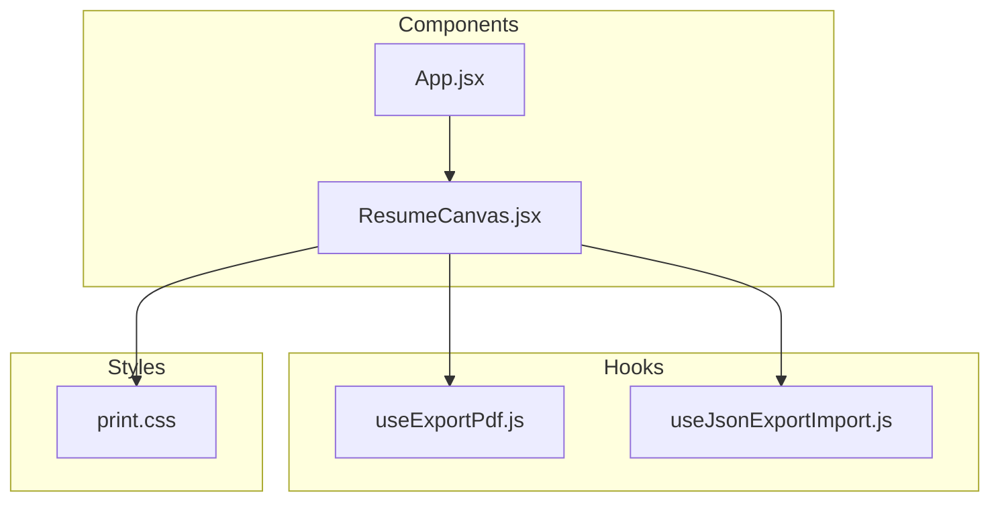
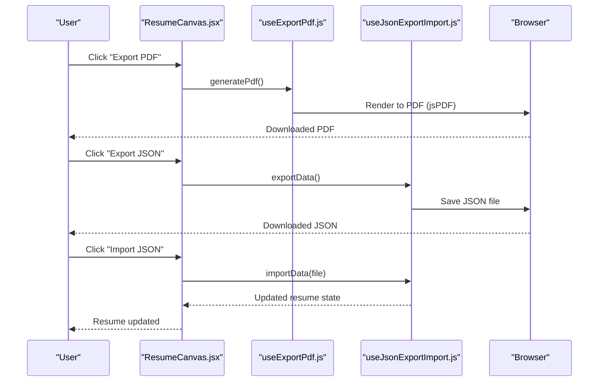
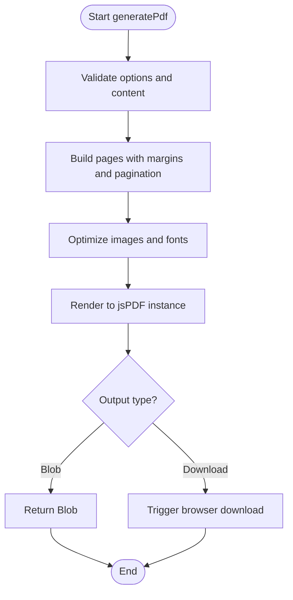
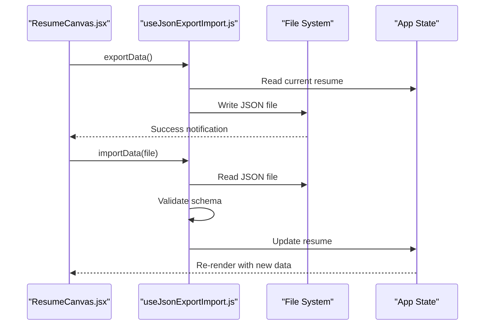
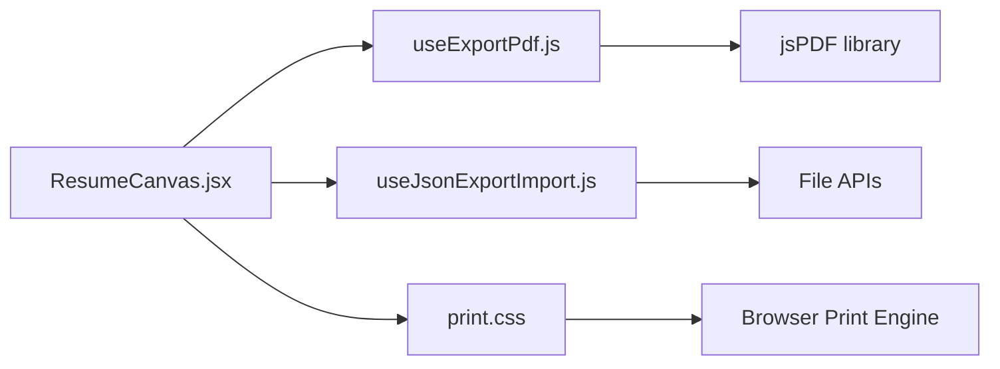

# Export Functionality

<cite>
**Referenced Files in This Document**
- [useExportPdf.js](file://src/hooks/useExportPdf.js)
- [useJsonExportImport.js](file://src/hooks/useJsonExportImport.js)
- [print.css](file://src/print.css)
- [package.json](file://package.json)
- [ResumeCanvas.jsx](file://src/components/ResumeCanvas/ResumeCanvas.jsx)
- [App.jsx](file://src/App.jsx)
</cite>

## Table of Contents
1. [Introduction](#introduction)
2. [Project Structure](#project-structure)
3. [Core Components](#core-components)
4. [Architecture Overview](#architecture-overview)
5. [Detailed Component Analysis](#detailed-component-analysis)
6. [Dependency Analysis](#dependency-analysis)
7. [Performance Considerations](#performance-considerations)
8. [Troubleshooting Guide](#troubleshooting-guide)
9. [Conclusion](#conclusion)

## Introduction
This document explains the export capabilities of the application, focusing on PDF generation via jsPDF, JSON import/export for data backup and sharing, and print stylesheet optimizations for browser printing. It also covers configuration options for PDF quality, page layouts, branding customization, file size optimization, browser compatibility, and fallback strategies.

## Project Structure
The export features are implemented as reusable hooks and styles:
- useExportPdf.js: Hook to generate PDFs using jsPDF
- useJsonExportImport.js: Hook to serialize/deserialize resume data to/from JSON
- print.css: Print-specific CSS rules for proper rendering when printing from the browser
- Integration points in components (e.g., ResumeCanvas) and App entry point

[No sources needed since this diagram shows conceptual workflow, not actual code structure]

## Core Components
- useExportPdf hook: Provides functions to render the resume into a high-quality PDF using jsPDF, including page layout, margins, fonts, and image handling.
- useJsonExportImport hook: Exposes methods to export current resume state to JSON and import JSON back into the app, enabling backup, sharing, and template creation.
- print.css: Defines print-only styles that ensure content fits pages, hides UI chrome, and preserves typography and spacing.

Key responsibilities:
- PDF generation: Capture DOM or build content programmatically, paginate, optimize images, and produce downloadable files.
- JSON serialization: Convert internal resume model to a stable schema and vice versa, with validation and migration support.
- Print styling: Use @media print rules to control page breaks, colors, backgrounds, and visibility.

**Section sources**
- [useExportPdf.js](file://src/hooks/useExportPdf.js)
- [useJsonExportImport.js](file://src/hooks/useJsonExportImport.js)
- [print.css](file://src/print.css)

## Architecture Overview
The export architecture centers around two hooks that encapsulate complex logic and expose simple APIs to components. The component layer triggers exports, while the hooks manage dependencies, state, and side effects.

**Diagram sources**
- [ResumeCanvas.jsx](file://src/components/ResumeCanvas/ResumeCanvas.jsx)
- [useExportPdf.js](file://src/hooks/useExportPdf.js)
- [useJsonExportImport.js](file://src/hooks/useJsonExportImport.js)

## Detailed Component Analysis

### useExportPdf Hook
Purpose:
- Generate professional PDF resumes using jsPDF.
- Provide configuration for page size, orientation, margins, font embedding, and image compression.
- Offer utilities to trigger downloads and handle errors gracefully.

Typical API surface:
- generatePdf(options): Creates and returns a Blob or triggers download.
- setOptions(config): Updates PDF settings at runtime.
- resetDefaults(): Restores default configuration.

Configuration options:
- Page layout:
  - pageSize: e.g., "a4", "letter"
  - orientation: "portrait" | "landscape"
  - margin: { top, right, bottom, left }
- Quality:
  - imageQuality: number (0–1)
  - compressImages: boolean
  - embedFonts: boolean
- Branding:
  - headerText, footerText
  - logoUrl (optional)
  - color overrides (text, accents)

Processing flow:
- Collect resume content (DOM snapshot or structured data).
- Normalize content to fit page dimensions and margins.
- Paginate long sections and avoid awkward page breaks.
- Optimize images and embed fonts if configured.
- Produce final PDF and trigger download.

Error handling:
- Graceful fallback when jsPDF is unavailable or unsupported.
- Network error handling for external assets (fonts, logos).
- User-friendly notifications for failures.

**Diagram sources**
- [useExportPdf.js](file://src/hooks/useExportPdf.js)

**Section sources**
- [useExportPdf.js](file://src/hooks/useExportPdf.js)

### useJsonExportImport Hook
Purpose:
- Serialize the current resume state to a JSON file for backup, sharing, and templates.
- Import JSON to restore or initialize resume data.
- Ensure schema stability and provide migration helpers if needed.

Typical API surface:
- exportData(): Returns JSON string or triggers download.
- importData(jsonString): Validates and updates internal state.
- getSchemaVersion(): Returns current schema version for migrations.

Data model considerations:
- Stable field names and types across versions.
- Optional fields for future expansion.
- Validation on import to reject malformed data.

Usage scenarios:
- Backup: Periodic export to local storage or cloud.
- Sharing: Send JSON to collaborators; they import to reconstruct the resume.
- Templates: Create base JSON structures that users import and customize.

**Diagram sources**
- [useJsonExportImport.js](file://src/hooks/useJsonExportImport.js)
- [ResumeCanvas.jsx](file://src/components/ResumeCanvas/ResumeCanvas.jsx)

**Section sources**
- [useJsonExportImport.js](file://src/hooks/useJsonExportImport.js)

### Print Stylesheet Optimizations (print.css)
Purpose:
- Ensure accurate rendering when users print directly from the browser.
- Hide non-essential UI elements and adjust layout for paper.
- Control page breaks, colors, and backgrounds.

Key techniques:
- @media print blocks to override screen styles.
- Visibility toggles for toolbars and panels.
- Page-break-inside: avoid for blocks like experience entries.
- Force background graphics where appropriate.
- Adjust font sizes and line heights for readability.

Best practices:
- Test across browsers to verify consistent output.
- Avoid heavy images in print mode to reduce file size.
- Use relative units for scalable typography.

**Section sources**
- [print.css](file://src/print.css)

### Integration Points
- ResumeCanvas.jsx: Triggers export actions and displays status feedback.
- App.jsx: May provide global configuration or context for export behavior.

**Section sources**
- [ResumeCanvas.jsx](file://src/components/ResumeCanvas/ResumeCanvas.jsx)
- [App.jsx](file://src/App.jsx)

## Dependency Analysis
External dependencies relevant to export:
- jsPDF: Used by useExportPdf for PDF generation.
- File APIs: Used by both hooks for reading/writing JSON files.
- CSS @media print: Used by print.css for browser printing.

**Diagram sources**
- [useExportPdf.js](file://src/hooks/useExportPdf.js)
- [useJsonExportImport.js](file://src/hooks/useJsonExportImport.js)
- [print.css](file://src/print.css)
- [ResumeCanvas.jsx](file://src/components/ResumeCanvas/ResumeCanvas.jsx)

**Section sources**
- [package.json](file://package.json)

## Performance Considerations
- Image optimization:
  - Compress images before embedding in PDF.
  - Limit resolution to match target DPI (e.g., 150–200 DPI for print).
- Font management:
  - Embed only necessary glyphs to reduce file size.
  - Prefer web-safe or preloaded fonts.
- Pagination:
  - Avoid large single-page blocks; split content logically.
- Memory usage:
  - Stream or chunk large documents if supported.
  - Clean up temporary objects after export.
- Browser compatibility:
  - Detect jsPDF availability and provide fallbacks.
  - Use standard File APIs with graceful degradation.

[No sources needed since this section provides general guidance]

## Troubleshooting Guide
Common issues and resolutions:
- PDF blank or truncated:
  - Check margins and page size configuration.
  - Ensure all content is rendered before generating PDF.
- Large file size:
  - Reduce image quality and enable compression.
  - Remove unnecessary assets and fonts.
- Fonts missing in PDF:
  - Enable font embedding and verify font paths.
- Print output misaligned:
  - Review print.css rules for page breaks and visibility.
  - Test with different printers and drivers.
- JSON import fails:
  - Validate schema version and required fields.
  - Provide migration steps for older schemas.

**Section sources**
- [useExportPdf.js](file://src/hooks/useExportPdf.js)
- [useJsonExportImport.js](file://src/hooks/useJsonExportImport.js)
- [print.css](file://src/print.css)

## Conclusion
The export functionality combines robust PDF generation, reliable JSON serialization, and careful print styling to deliver a seamless user experience. By leveraging the useExportPdf and useJsonExportImport hooks, developers can implement flexible export workflows with clear configuration options. Following the performance and troubleshooting recommendations ensures high-quality outputs across devices and browsers.