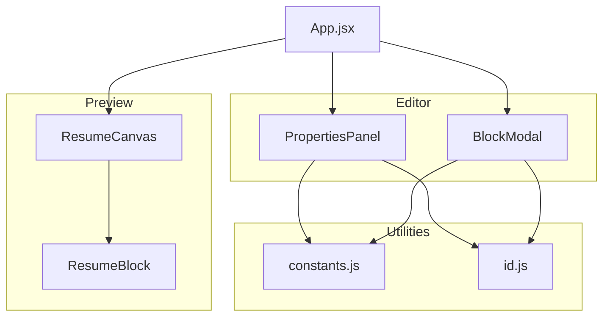
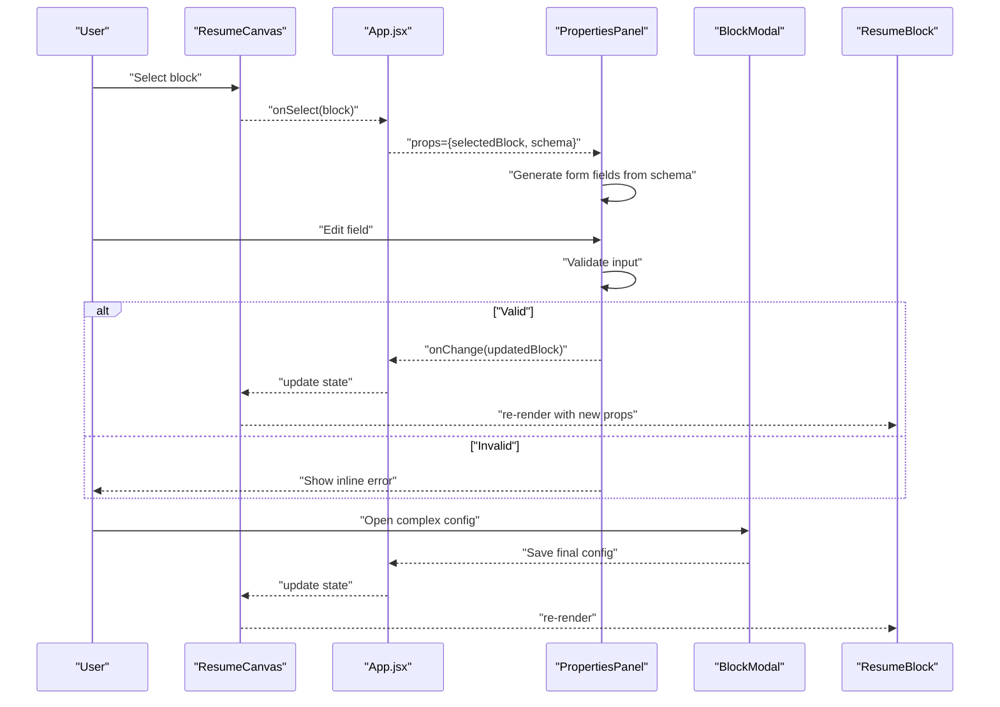
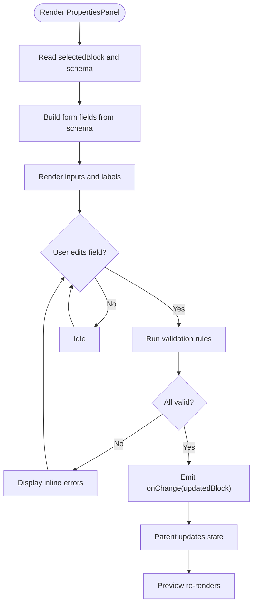
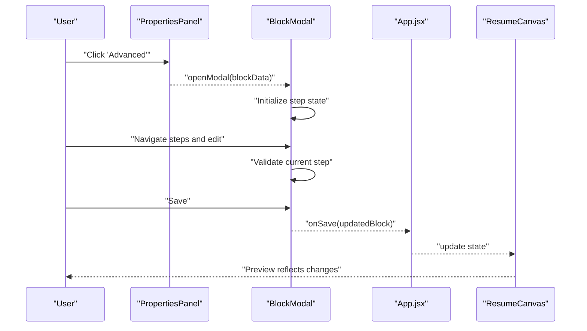
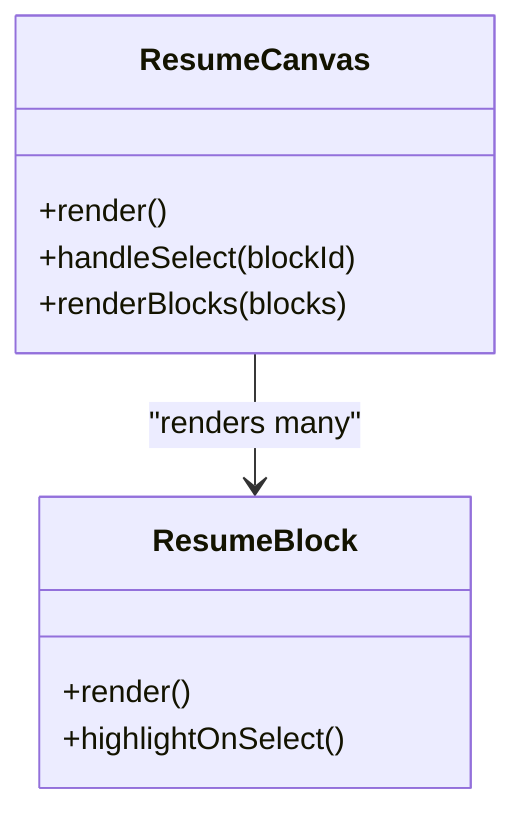
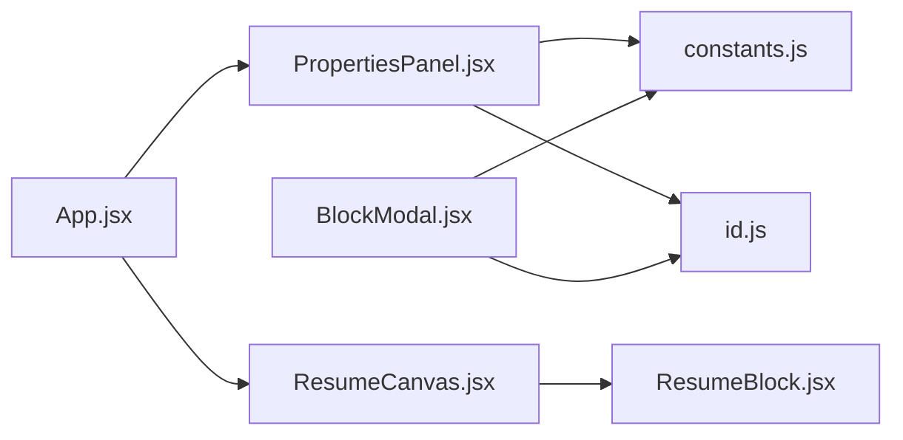

# Properties Panel

<cite>
**Referenced Files in This Document**
- [PropertiesPanel.jsx](file://src/components/PropertiesPanel/PropertiesPanel.jsx)
- [PropertiesPanel.module.css](file://src/components/PropertiesPanel/PropertiesPanel.module.css)
- [BlockModal.jsx](file://src/components/BlockModal/BlockModal.jsx)
- [BlockModal.module.css](file://src/components/BlockModal/BlockModal.module.css)
- [ResumeCanvas.jsx](file://src/components/ResumeCanvas/ResumeCanvas.jsx)
- [ResumeCanvas.module.css](file://src/components/ResumeCanvas/ResumeCanvas.module.css)
- [ResumeBlock.jsx](file://src/components/ResumeCanvas/ResumeBlock.jsx)
- [ResumeBlock.module.css](file://src/components/ResumeCanvas/ResumeBlock.module.css)
- [constants.js](file://src/utils/constants.js)
- [id.js](file://src/utils/id.js)
- [App.jsx](file://src/App.jsx)
- [useLocalStorage.js](file://src/hooks/useLocalStorage.js)
</cite>

## Table of Contents
1. [Introduction](#introduction)
2. [Project Structure](#project-structure)
3. [Core Components](#core-components)
4. [Architecture Overview](#architecture-overview)
5. [Detailed Component Analysis](#detailed-component-analysis)
6. [Dependency Analysis](#dependency-analysis)
7. [Performance Considerations](#performance-considerations)
8. [Troubleshooting Guide](#troubleshooting-guide)
9. [Conclusion](#conclusion)
10. [Appendices](#appendices)

## Introduction
This document explains the Properties Panel system that provides context-aware editing interfaces for blocks in the resume builder. It covers how the PropertiesPanel dynamically generates forms based on selected block types and their property schemas, the real-time update mechanism that reflects changes immediately in the preview, and the BlockModal component used for complex block configuration workflows. It also includes guidance on adding new property types, implementing validation rules, creating custom property editors, form state management, error handling, and responsive design considerations across screen sizes.

## Project Structure
The Properties Panel is implemented as a React feature with associated styles and utilities:
- PropertiesPanel: dynamic form generator and editor for block properties
- BlockModal: modal workflow for complex block configuration
- ResumeCanvas and ResumeBlock: live preview components that react to property changes
- Utilities: constants and ID generation helpers
- App: orchestrates state and coordinates panel/modal interactions
- Hooks: persistence and export utilities (contextual)

**Diagram sources**
- [PropertiesPanel.jsx](file://src/components/PropertiesPanel/PropertiesPanel.jsx)
- [BlockModal.jsx](file://src/components/BlockModal/BlockModal.jsx)
- [ResumeCanvas.jsx](file://src/components/ResumeCanvas/ResumeCanvas.jsx)
- [ResumeBlock.jsx](file://src/components/ResumeCanvas/ResumeBlock.jsx)
- [constants.js](file://src/utils/constants.js)
- [id.js](file://src/utils/id.js)
- [App.jsx](file://src/App.jsx)

**Section sources**
- [PropertiesPanel.jsx](file://src/components/PropertiesPanel/PropertiesPanel.jsx)
- [BlockModal.jsx](file://src/components/BlockModal/BlockModal.jsx)
- [ResumeCanvas.jsx](file://src/components/ResumeCanvas/ResumeCanvas.jsx)
- [ResumeBlock.jsx](file://src/components/ResumeCanvas/ResumeBlock.jsx)
- [constants.js](file://src/utils/constants.js)
- [id.js](file://src/utils/id.js)
- [App.jsx](file://src/App.jsx)

## Core Components
- PropertiesPanel: Renders a dynamic form based on the currently selected block’s schema. It manages local form state, validates inputs, emits change events, and persists updates to the parent via callbacks.
- BlockModal: Provides a full-screen or overlay interface for complex block configuration, including multi-step flows, advanced options, and confirmation actions.
- ResumeCanvas and ResumeBlock: Render the live preview and respond to property changes in real time.

Key responsibilities:
- Dynamic form generation from block type and schema
- Real-time synchronization between editor and preview
- Validation and error display
- Responsive layout and accessibility

**Section sources**
- [PropertiesPanel.jsx](file://src/components/PropertiesPanel/PropertiesPanel.jsx)
- [BlockModal.jsx](file://src/components/BlockModal/BlockModal.jsx)
- [ResumeCanvas.jsx](file://src/components/ResumeCanvas/ResumeCanvas.jsx)
- [ResumeBlock.jsx](file://src/components/ResumeCanvas/ResumeBlock.jsx)

## Architecture Overview
The Properties Panel integrates with the app state to provide immediate feedback in the preview. The flow typically follows these steps:
- User selects a block in the canvas
- PropertiesPanel receives the selected block and its schema
- Form fields are generated dynamically
- On input change, validation runs and errors are displayed
- Validated changes are propagated to the parent state
- Preview re-renders instantly with updated values

**Diagram sources**
- [ResumeCanvas.jsx](file://src/components/ResumeCanvas/ResumeCanvas.jsx)
- [App.jsx](file://src/App.jsx)
- [PropertiesPanel.jsx](file://src/components/PropertiesPanel/PropertiesPanel.jsx)
- [BlockModal.jsx](file://src/components/BlockModal/BlockModal.jsx)
- [ResumeBlock.jsx](file://src/components/ResumeCanvas/ResumeBlock.jsx)

## Detailed Component Analysis

### PropertiesPanel
Responsibilities:
- Reads selected block and schema from props
- Builds a form by mapping schema entries to UI controls
- Manages local form state and validation
- Emits validated changes upward to the parent
- Displays contextual help and error messages
- Adapts layout for different screen sizes

Dynamic form generation:
- Schema-driven rendering: each property defines label, type, default value, options, and validation rules
- Field mapping: text, number, select, toggle, textarea, color, file, etc., mapped to appropriate inputs
- Conditional fields: show/hide based on other field values
- Grouped sections: organize related properties into collapsible sections

Real-time updates:
- On-change handlers compute next state, validate, and call parent callback
- Debounced or throttled updates can be used for heavy operations
- Immediate preview refresh via React state propagation

Validation:
- Inline validation per field
- Cross-field validation when needed
- Error aggregation and display near relevant fields

Responsive design:
- CSS modules adjust spacing, font sizes, and grid layouts
- Touch-friendly controls on mobile

Extensibility:
- Add new property types by extending the field mapper
- Implement custom editors by registering a component for a given type
- Centralize validation rules in a reusable validator registry

**Diagram sources**
- [PropertiesPanel.jsx](file://src/components/PropertiesPanel/PropertiesPanel.jsx)
- [ResumeCanvas.jsx](file://src/components/ResumeCanvas/ResumeCanvas.jsx)
- [ResumeBlock.jsx](file://src/components/ResumeCanvas/ResumeBlock.jsx)

**Section sources**
- [PropertiesPanel.jsx](file://src/components/PropertiesPanel/PropertiesPanel.jsx)
- [PropertiesPanel.module.css](file://src/components/PropertiesPanel/PropertiesPanel.module.css)

### BlockModal
Responsibilities:
- Encapsulates complex configuration workflows for blocks
- Supports multi-step flows, advanced options, and confirmations
- Integrates with PropertiesPanel for simple edits and opens when deeper customization is required
- Persists changes atomically after validation and user confirmation

Workflow highlights:
- Open modal with current block data
- Present step-by-step configuration
- Validate at each step
- Commit changes back to parent state on save
- Cancel discards unsaved changes

**Diagram sources**
- [BlockModal.jsx](file://src/components/BlockModal/BlockModal.jsx)
- [PropertiesPanel.jsx](file://src/components/PropertiesPanel/PropertiesPanel.jsx)
- [App.jsx](file://src/App.jsx)
- [ResumeCanvas.jsx](file://src/components/ResumeCanvas/ResumeCanvas.jsx)

**Section sources**
- [BlockModal.jsx](file://src/components/BlockModal/BlockModal.jsx)
- [BlockModal.module.css](file://src/components/BlockModal/BlockModal.module.css)

### ResumeCanvas and ResumeBlock
- ResumeCanvas renders the list of blocks and handles selection events
- ResumeBlock renders an individual block using its properties
- Both respond to state changes from the parent to reflect edits in real time

**Diagram sources**
- [ResumeCanvas.jsx](file://src/components/ResumeCanvas/ResumeCanvas.jsx)
- [ResumeBlock.jsx](file://src/components/ResumeCanvas/ResumeBlock.jsx)

**Section sources**
- [ResumeCanvas.jsx](file://src/components/ResumeCanvas/ResumeCanvas.jsx)
- [ResumeCanvas.module.css](file://src/components/ResumeCanvas/ResumeCanvas.module.css)
- [ResumeBlock.jsx](file://src/components/ResumeCanvas/ResumeBlock.jsx)
- [ResumeBlock.module.css](file://src/components/ResumeCanvas/ResumeBlock.module.css)

### Utilities
- constants.js: Defines block types, property schemas, and shared configuration
- id.js: Generates unique IDs for new blocks and fields

Usage patterns:
- Import constants to map block types to schemas
- Use ID generator to create stable identifiers for new items

**Section sources**
- [constants.js](file://src/utils/constants.js)
- [id.js](file://src/utils/id.js)

### App Orchestration
- Coordinates state for selected block and block list
- Passes props to PropertiesPanel and ResumeCanvas
- Handles save/update callbacks from both panels and modals

**Section sources**
- [App.jsx](file://src/App.jsx)

## Dependency Analysis
The following diagram shows key dependencies among components and utilities involved in the Properties Panel system.

**Diagram sources**
- [App.jsx](file://src/App.jsx)
- [PropertiesPanel.jsx](file://src/components/PropertiesPanel/PropertiesPanel.jsx)
- [BlockModal.jsx](file://src/components/BlockModal/BlockModal.jsx)
- [ResumeCanvas.jsx](file://src/components/ResumeCanvas/ResumeCanvas.jsx)
- [ResumeBlock.jsx](file://src/components/ResumeCanvas/ResumeBlock.jsx)
- [constants.js](file://src/utils/constants.js)
- [id.js](file://src/utils/id.js)

**Section sources**
- [App.jsx](file://src/App.jsx)
- [PropertiesPanel.jsx](file://src/components/PropertiesPanel/PropertiesPanel.jsx)
- [BlockModal.jsx](file://src/components/BlockModal/BlockModal.jsx)
- [ResumeCanvas.jsx](file://src/components/ResumeCanvas/ResumeCanvas.jsx)
- [ResumeBlock.jsx](file://src/components/ResumeCanvas/ResumeBlock.jsx)
- [constants.js](file://src/utils/constants.js)
- [id.js](file://src/utils/id.js)

## Performance Considerations
- Minimize re-renders by updating only changed properties
- Use memoization for expensive computations in form validation
- Debounce rapid input changes if they trigger heavy operations
- Keep schema definitions immutable to avoid unnecessary recalculations
- Prefer controlled inputs with efficient state updates

[No sources needed since this section provides general guidance]

## Troubleshooting Guide
Common issues and resolutions:
- Property not updating in preview
  - Ensure onChange is called with the correct updated block object
  - Verify parent state is being set and passed down to ResumeCanvas
- Validation errors not clearing
  - Confirm validation logic resets errors on successful input
  - Check cross-field validation triggers on dependent fields
- Modal not saving changes
  - Validate onSave callback is invoked and returns a complete block object
  - Inspect network or persistence hooks if integrated
- Responsive layout issues
  - Review CSS modules for breakpoints and flex/grid behavior
  - Test on multiple devices and orientations

**Section sources**
- [PropertiesPanel.jsx](file://src/components/PropertiesPanel/PropertiesPanel.jsx)
- [BlockModal.jsx](file://src/components/BlockModal/BlockModal.jsx)
- [ResumeCanvas.jsx](file://src/components/ResumeCanvas/ResumeCanvas.jsx)
- [ResumeBlock.jsx](file://src/components/ResumeCanvas/ResumeBlock.jsx)
- [PropertiesPanel.module.css](file://src/components/PropertiesPanel/PropertiesPanel.module.css)
- [BlockModal.module.css](file://src/components/BlockModal/BlockModal.module.css)
- [ResumeCanvas.module.css](file://src/components/ResumeCanvas/ResumeCanvas.module.css)
- [ResumeBlock.module.css](file://src/components/ResumeCanvas/ResumeBlock.module.css)

## Conclusion
The Properties Panel system delivers a flexible, schema-driven editing experience with immediate visual feedback. By centralizing form generation, validation, and state synchronization, it enables rapid iteration over block configurations while maintaining a consistent user experience across devices. Extending the system involves adding new property types, validators, and custom editors through well-defined integration points.

[No sources needed since this section summarizes without analyzing specific files]

## Appendices

### Adding a New Property Type
Steps:
- Define the property metadata in constants (label, type, default, options, validation)
- Extend the field mapper in PropertiesPanel to render the corresponding input
- Register any custom validation rules
- If needed, add a custom editor component and wire it into the mapper
- Test responsiveness and accessibility

**Section sources**
- [constants.js](file://src/utils/constants.js)
- [PropertiesPanel.jsx](file://src/components/PropertiesPanel/PropertiesPanel.jsx)

### Implementing Validation Rules
Approach:
- Inline per-field validation functions
- Cross-field validation for dependent properties
- Aggregate errors and display them near relevant fields
- Provide clear, actionable error messages

**Section sources**
- [PropertiesPanel.jsx](file://src/components/PropertiesPanel/PropertiesPanel.jsx)

### Creating Custom Property Editors
Approach:
- Create a component that accepts value and onChange props
- Integrate with the field mapper by type name
- Ensure keyboard navigation and ARIA attributes for accessibility
- Handle edge cases like empty values and large datasets

**Section sources**
- [PropertiesPanel.jsx](file://src/components/PropertiesPanel/PropertiesPanel.jsx)

### Form State Management
Guidelines:
- Maintain local form state during editing
- Normalize values before validation
- Emit minimal diffs to parent to reduce re-renders
- Persist draft state if necessary using hooks

**Section sources**
- [PropertiesPanel.jsx](file://src/components/PropertiesPanel/PropertiesPanel.jsx)
- [useLocalStorage.js](file://src/hooks/useLocalStorage.js)

### Error Handling Patterns
Patterns:
- Graceful fallbacks for missing schema fields
- Non-blocking validation errors that do not prevent navigation
- Clear error boundaries around modal workflows

**Section sources**
- [BlockModal.jsx](file://src/components/BlockModal/BlockModal.jsx)
- [PropertiesPanel.jsx](file://src/components/PropertiesPanel/PropertiesPanel.jsx)

### Responsive Design Considerations
Recommendations:
- Use CSS modules to adapt spacing, typography, and layout
- Ensure touch targets meet minimum size guidelines
- Collapse sections on small screens and expand on larger ones
- Test on common breakpoints and device orientations

**Section sources**
- [PropertiesPanel.module.css](file://src/components/PropertiesPanel/PropertiesPanel.module.css)
- [BlockModal.module.css](file://src/components/BlockModal/BlockModal.module.css)
- [ResumeCanvas.module.css](file://src/components/ResumeCanvas/ResumeCanvas.module.css)
- [ResumeBlock.module.css](file://src/components/ResumeCanvas/ResumeBlock.module.css)