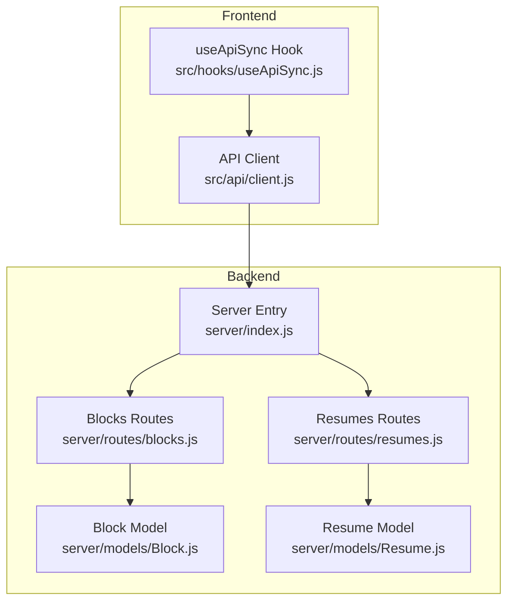
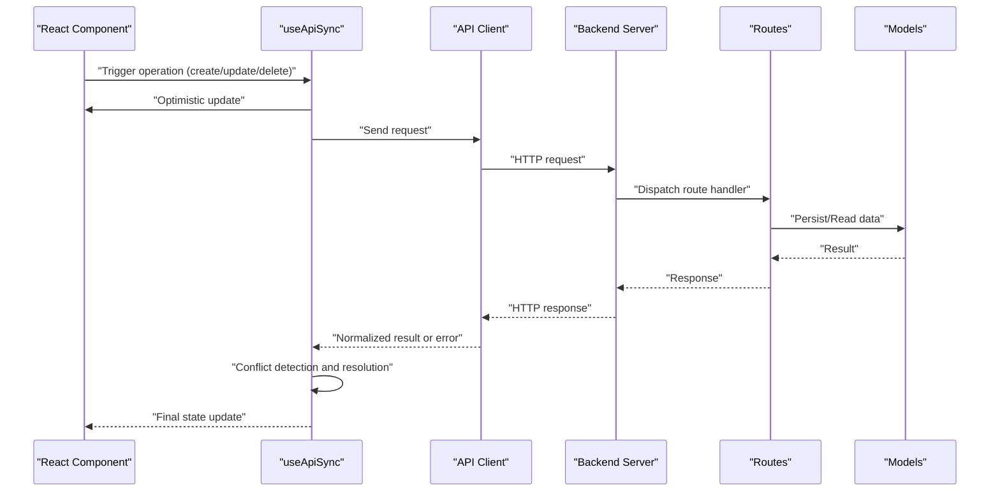
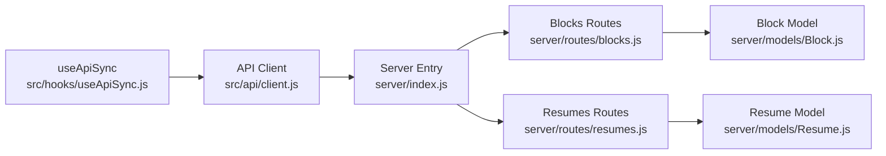

# API Integration

<cite>
**Referenced Files in This Document**
- [client.js](file://src/api/client.js)
- [useApiSync.js](file://src/hooks/useApiSync.js)
- [blocks.js](file://server/routes/blocks.js)
- [resumes.js](file://server/routes/resumes.js)
- [Block.js](file://server/models/Block.js)
- [Resume.js](file://server/models/Resume.js)
- [index.js](file://server/index.js)
</cite>

## Table of Contents
1. [Introduction](#introduction)
2. [Project Structure](#project-structure)
3. [Core Components](#core-components)
4. [Architecture Overview](#architecture-overview)
5. [Detailed Component Analysis](#detailed-component-analysis)
6. [Dependency Analysis](#dependency-analysis)
7. [Performance Considerations](#performance-considerations)
8. [Troubleshooting Guide](#troubleshooting-guide)
9. [Conclusion](#conclusion)

## Introduction
This document describes the frontend-backend communication layer for the application, focusing on:
- RESTful API client implementation and request/response handling
- Error management and retry mechanisms
- The useApiSync hook for optimistic updates, background synchronization, and conflict resolution
- Authentication handling, request interceptors, response caching strategies, and performance optimizations
- Common API operations, error handling patterns, and debugging techniques

The goal is to provide a clear, practical guide for integrating with the backend services while maintaining a responsive user experience and robust data consistency.

## Project Structure
The relevant parts of the project are organized as follows:
- Frontend API client: src/api/client.js
- Synchronization hook: src/hooks/useApiSync.js
- Backend routes: server/routes/blocks.js, server/routes/resumes.js
- Backend models: server/models/Block.js, server/models/Resume.js
- Server entrypoint: server/index.js

**Diagram sources**
- [client.js](file://src/api/client.js)
- [useApiSync.js](file://src/hooks/useApiSync.js)
- [index.js](file://server/index.js)
- [blocks.js](file://server/routes/blocks.js)
- [resumes.js](file://server/routes/resumes.js)
- [Block.js](file://server/models/Block.js)
- [Resume.js](file://server/models/Resume.js)

**Section sources**
- [client.js](file://src/api/client.js)
- [useApiSync.js](file://src/hooks/useApiSync.js)
- [index.js](file://server/index.js)
- [blocks.js](file://server/routes/blocks.js)
- [resumes.js](file://server/routes/resumes.js)
- [Block.js](file://server/models/Block.js)
- [Resume.js](file://server/models/Resume.js)

## Core Components
- API Client (src/api/client.js): Centralized HTTP client that encapsulates base URL configuration, headers, authentication injection, request/response interceptors, error normalization, retries, and optional caching.
- useApiSync Hook (src/hooks/useApiSync.js): React hook that coordinates optimistic UI updates, background synchronization with the server, conflict detection and resolution, and consistent state shape across components.

Key responsibilities:
- Request lifecycle: build requests, attach auth tokens, handle errors, apply retries, cache responses when appropriate.
- Sync lifecycle: optimistic update, background fetch, merge conflicts, rollback or reconcile state.
- Observability: structured logging and error reporting for debugging.

**Section sources**
- [client.js](file://src/api/client.js)
- [useApiSync.js](file://src/hooks/useApiSync.js)

## Architecture Overview
The frontend uses a thin API client to communicate with backend routes. The useApiSync hook orchestrates optimistic updates and background sync, ensuring the UI remains responsive while keeping local and server data consistent.

**Diagram sources**
- [useApiSync.js](file://src/hooks/useApiSync.js)
- [client.js](file://src/api/client.js)
- [index.js](file://server/index.js)
- [blocks.js](file://server/routes/blocks.js)
- [resumes.js](file://server/routes/resumes.js)
- [Block.js](file://server/models/Block.js)
- [Resume.js](file://server/models/Resume.js)

## Detailed Component Analysis

### API Client (src/api/client.js)
Responsibilities:
- Base configuration: base URL, default headers, timeouts.
- Authentication: injects tokens into Authorization header; supports token refresh flows.
- Interceptors:
  - Request: normalize payloads, add correlation IDs, attach auth, set content types.
  - Response: parse JSON, normalize success/error envelopes, map status codes to typed errors.
- Retry mechanism: exponential backoff with jitter for transient failures (network errors, 5xx).
- Caching strategy: GET request caching with TTL and invalidation keys; cache-first reads with background revalidation.
- Error management: standardized error objects with message, code, details, and retry hints.

Common usage patterns:
- get(path, options)
- post(path, payload, options)
- put(path, payload, options)
- patch(path, payload, options)
- delete(path, options)

Error handling:
- Network errors: retryable with backoff.
- 401 Unauthorized: trigger token refresh flow if available; otherwise redirect to login.
- 409 Conflict: surface to caller for conflict resolution.
- 4xx/5xx: map to typed errors; include server messages and stack traces where safe.

Caching:
- Cache key derivation from path + query params + auth context.
- Stale-while-revalidate pattern for improved perceived performance.
- Manual invalidation helpers for write operations.

Authentication:
- Reads token from secure storage or session store.
- Attaches Bearer token to Authorization header.
- Handles token expiration by refreshing before retrying failed requests.

Interceptors:
- Request: adds correlation ID, sets Accept/Content-Type, attaches token.
- Response: unwraps envelope, normalizes errors, logs metrics.

Retry:
- Configurable max attempts and delay factors.
- Idempotent methods (GET, PUT, DELETE) are retried; POST may be retried only if idempotency key is provided.

**Section sources**
- [client.js](file://src/api/client.js)

### useApiSync Hook (src/hooks/useApiSync.js)
Responsibilities:
- Optimistic updates: immediately reflect intended changes in local state.
- Background synchronization: send mutations to server after optimistic update.
- Conflict resolution: detect mismatches between local and server state; propose merges or rollbacks.
- State shape: returns { data, loading, error, mutate } for consistent consumption.

Lifecycle:
- On mutation:
  - Compute optimistic delta.
  - Apply delta to local state.
  - Queue background sync.
  - On success: finalize state.
  - On failure: rollback or reconcile based on conflict type.
- On read:
  - Return cached data if fresh.
  - Fetch in background if stale.
  - Merge server response with local deltas.

Conflict resolution:
- Field-level diffs to determine which side wins.
- Strategy selection: last-write-wins, server-wins, or custom merge function.
- User prompts for ambiguous conflicts.

Idempotency:
- For non-idempotent writes, generate idempotency keys to prevent duplicate mutations.

Observability:
- Logs operations, durations, and outcomes.
- Exposes debug flags for detailed tracing.

Typical API:
- const { data, loading, error, mutate } = useApiSync({ endpoint, initialData, strategy })
- mutate(payload) triggers optimistic update and background sync.

**Section sources**
- [useApiSync.js](file://src/hooks/useApiSync.js)

### Backend Endpoints and Data Models
- Blocks:
  - CRUD endpoints for blocks under /api/blocks.
  - Uses Block model for persistence.
- Resumes:
  - CRUD endpoints for resumes under /api/resumes.
  - Uses Resume model for persistence.
- Server entrypoint wires routes and middleware (e.g., CORS, body parsing, auth).

Request/Response contracts:
- Standardized envelope with data, meta, and error fields.
- Consistent error format with code, message, and details.

Example operations:
- Create block: POST /api/blocks
- Update block: PATCH /api/blocks/:id
- Delete block: DELETE /api/blocks/:id
- Get resume: GET /api/resumes/:id
- Update resume: PATCH /api/resumes/:id

**Section sources**
- [blocks.js](file://server/routes/blocks.js)
- [resumes.js](file://server/routes/resumes.js)
- [Block.js](file://server/models/Block.js)
- [Resume.js](file://server/models/Resume.js)
- [index.js](file://server/index.js)

## Dependency Analysis
The following diagram shows how the frontend client and hook depend on backend routes and models.

**Diagram sources**
- [client.js](file://src/api/client.js)
- [useApiSync.js](file://src/hooks/useApiSync.js)
- [index.js](file://server/index.js)
- [blocks.js](file://server/routes/blocks.js)
- [resumes.js](file://server/routes/resumes.js)
- [Block.js](file://server/models/Block.js)
- [Resume.js](file://server/models/Resume.js)

**Section sources**
- [client.js](file://src/api/client.js)
- [useApiSync.js](file://src/hooks/useApiSync.js)
- [index.js](file://server/index.js)
- [blocks.js](file://server/routes/blocks.js)
- [resumes.js](file://server/routes/resumes.js)
- [Block.js](file://server/models/Block.js)
- [Resume.js](file://server/models/Resume.js)

## Performance Considerations
- Use GET caching with stale-while-revalidate to reduce network calls and improve responsiveness.
- Debounce rapid mutations to avoid excessive background syncs.
- Prefer PATCH over full-body PUT when updating partial fields.
- Batch small updates when possible at the API layer.
- Limit payload sizes; paginate large lists.
- Enable compression on the server and ensure proper Content-Encoding.
- Monitor and log latency percentiles to identify slow endpoints.

[No sources needed since this section provides general guidance]

## Troubleshooting Guide
Common issues and resolutions:
- 401 Unauthorized:
  - Ensure token is present and not expired.
  - Implement token refresh flow in the client interceptor.
- 409 Conflict:
  - Detect field-level differences and prompt user to choose resolution strategy.
- Network errors:
  - Verify connectivity and CORS settings.
  - Check retry configuration and backoff parameters.
- Stale cache:
  - Invalidate cache keys after mutations.
  - Force refetch when necessary.
- Debugging:
  - Enable verbose logging in development.
  - Inspect request/response envelopes and correlation IDs.
  - Use browser dev tools to trace timing and payloads.

**Section sources**
- [client.js](file://src/api/client.js)
- [useApiSync.js](file://src/hooks/useApiSync.js)

## Conclusion
The API integration layer combines a robust HTTP client with a synchronization hook to deliver a responsive, resilient user experience. By leveraging optimistic updates, background sync, and conflict resolution, the system maintains data consistency while minimizing perceived latency. Proper authentication, interceptors, caching, and retry policies further enhance reliability and performance.

[No sources needed since this section summarizes without analyzing specific files]