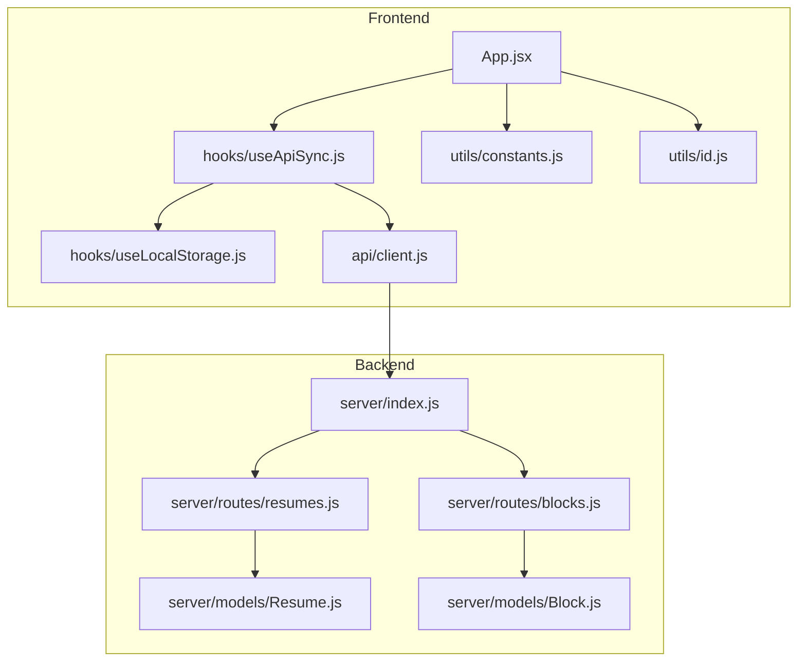
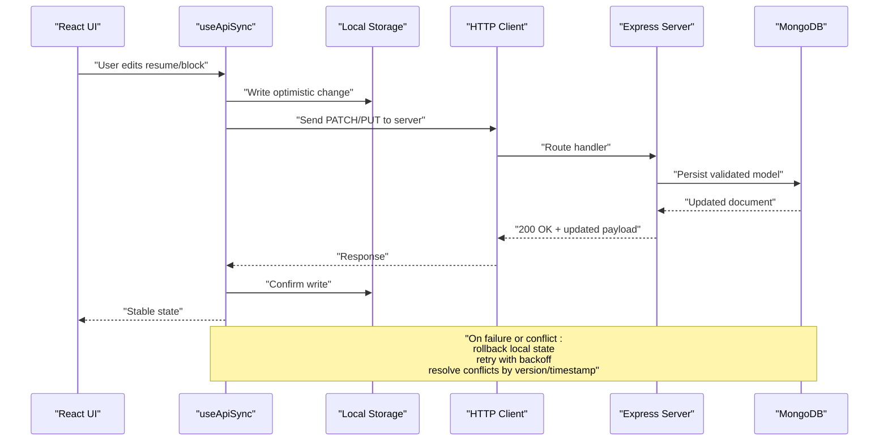
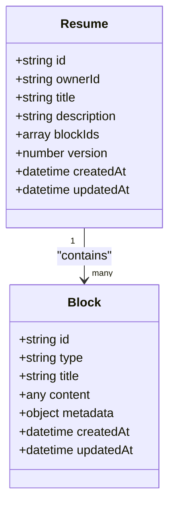
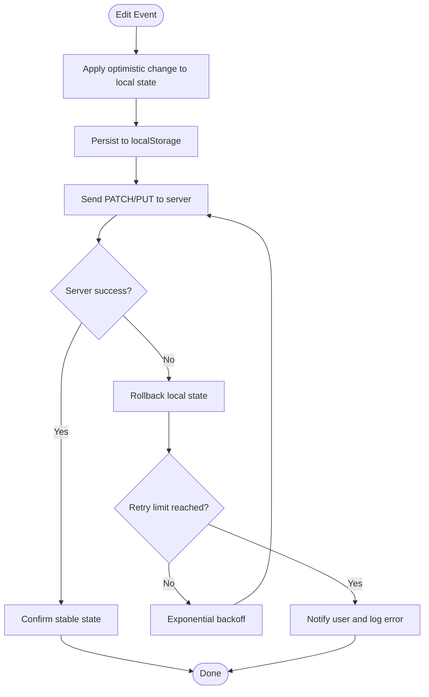
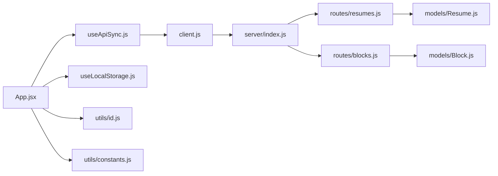

# Data Management

<cite>
**Referenced Files in This Document**
- [Block.js](file://server/models/Block.js)
- [Resume.js](file://server/models/Resume.js)
- [blocks.js](file://server/routes/blocks.js)
- [resumes.js](file://server/routes/resumes.js)
- [index.js](file://server/index.js)
- [client.js](file://src/api/client.js)
- [useApiSync.js](file://src/hooks/useApiSync.js)
- [useLocalStorage.js](file://src/hooks/useLocalStorage.js)
- [constants.js](file://src/utils/constants.js)
- [id.js](file://src/utils/id.js)
- [App.jsx](file://src/App.jsx)
</cite>

## Table of Contents
1. [Introduction](#introduction)
2. [Project Structure](#project-structure)
3. [Core Components](#core-components)
4. [Architecture Overview](#architecture-overview)
5. [Detailed Component Analysis](#detailed-component-analysis)
6. [Dependency Analysis](#dependency-analysis)
7. [Performance Considerations](#performance-considerations)
8. [Troubleshooting Guide](#troubleshooting-guide)
9. [Conclusion](#conclusion)
10. [Appendices](#appendices)

## Introduction
This document describes the data management strategy for the Modular Resume Builder. It covers:
- Data models (Block and Resume) with field definitions, validation rules, and relationships
- Dual persistence combining local browser storage for immediate feedback and MongoDB for cloud synchronization
- API synchronization mechanism supporting optimistic updates, conflict resolution, and error recovery
- Data migration strategies and backup/recovery procedures
- Caching approach and performance optimizations for large resume datasets
- Client and server-side validation practices

## Project Structure
The project is organized into a Node.js backend and a React frontend:
- Backend: Express routes and Mongoose models for Blocks and Resumes
- Frontend: React components and hooks for UI, local storage, and API synchronization

**Diagram sources**
- [App.jsx](file://src/App.jsx)
- [useApiSync.js](file://src/hooks/useApiSync.js)
- [useLocalStorage.js](file://src/hooks/useLocalStorage.js)
- [client.js](file://src/api/client.js)
- [constants.js](file://src/utils/constants.js)
- [id.js](file://src/utils/id.js)
- [index.js](file://server/index.js)
- [resumes.js](file://server/routes/resumes.js)
- [blocks.js](file://server/routes/blocks.js)
- [Resume.js](file://server/models/Resume.js)
- [Block.js](file://server/models/Block.js)

**Section sources**
- [index.js](file://server/index.js)
- [resumes.js](file://server/routes/resumes.js)
- [blocks.js](file://server/routes/blocks.js)
- [Resume.js](file://server/models/Resume.js)
- [Block.js](file://server/models/Block.js)
- [client.js](file://src/api/client.js)
- [useApiSync.js](file://src/hooks/useApiSync.js)
- [useLocalStorage.js](file://src/hooks/useLocalStorage.js)
- [constants.js](file://src/utils/constants.js)
- [id.js](file://src/utils/id.js)
- [App.jsx](file://src/App.jsx)

## Core Components
- Server models define the canonical schema for Block and Resume entities and enforce validation at the database layer.
- Routes expose REST endpoints to create, read, update, and delete resumes and blocks.
- The client provides an HTTP client wrapper and a synchronization hook that coordinates optimistic UI updates, local storage persistence, and server sync.
- Utilities provide constants and ID generation used across the app.

Key responsibilities:
- Models: Field types, required fields, enums, and cross-field validations
- Routes: Request parsing, model operations, error handling, and status codes
- Client: Base URL configuration, request/response normalization, and retry/backoff helpers
- Sync Hook: Optimistic state transitions, conflict detection, rollback, and background reconciliation
- Local Storage: Immediate persistence for offline-first UX and fast rehydration

**Section sources**
- [Resume.js](file://server/models/Resume.js)
- [Block.js](file://server/models/Block.js)
- [resumes.js](file://server/routes/resumes.js)
- [blocks.js](file://server/routes/blocks.js)
- [client.js](file://src/api/client.js)
- [useApiSync.js](file://src/hooks/useApiSync.js)
- [useLocalStorage.js](file://src/hooks/useLocalStorage.js)
- [constants.js](file://src/utils/constants.js)
- [id.js](file://src/utils/id.js)

## Architecture Overview
The system uses a dual-persistence architecture:
- Local browser storage ensures instant feedback and offline capability
- MongoDB persists durable state and enables multi-device synchronization
- An API synchronization layer orchestrates optimistic updates and conflict resolution

**Diagram sources**
- [useApiSync.js](file://src/hooks/useApiSync.js)
- [useLocalStorage.js](file://src/hooks/useLocalStorage.js)
- [client.js](file://src/api/client.js)
- [index.js](file://server/index.js)
- [resumes.js](file://server/routes/resumes.js)
- [blocks.js](file://server/routes/blocks.js)
- [Resume.js](file://server/models/Resume.js)
- [Block.js](file://server/models/Block.js)

## Detailed Component Analysis

### Data Models: Block and Resume
- Block
  - Purpose: Represents a modular content unit within a resume (e.g., experience, education, skills).
  - Typical fields: Identifier, type discriminator, title, body/content, metadata, timestamps.
  - Validation: Required fields enforced; type-specific constraints via schema validators.
- Resume
  - Purpose: Aggregates ordered blocks and global metadata.
  - Typical fields: Identifier, owner reference, title, description, block references or embedded blocks, ordering index, timestamps, versioning.
  - Relationships: One-to-many with Block; ordering preserved via indices or arrays.

Validation rules are defined at the model level to ensure consistency before writes reach the database. Cross-field validations can be applied where necessary (for example, ensuring unique titles per section type).

**Section sources**
- [Block.js](file://server/models/Block.js)
- [Resume.js](file://server/models/Resume.js)

#### Class Diagram

**Diagram sources**
- [Block.js](file://server/models/Block.js)
- [Resume.js](file://server/models/Resume.js)

### API Endpoints and Route Handlers
- Resumes
  - GET /api/resumes: List resumes
  - GET /api/resumes/:id: Fetch a resume
  - POST /api/resumes: Create a resume
  - PUT /api/resumes/:id: Update a resume
  - DELETE /api/resumes/:id: Delete a resume
- Blocks
  - GET /api/blocks: List blocks
  - GET /api/blocks/:id: Fetch a block
  - POST /api/blocks: Create a block
  - PUT /api/blocks/:id: Update a block
  - DELETE /api/blocks/:id: Delete a block

Each route validates input against the corresponding model and returns appropriate HTTP status codes. Errors are normalized to include message and code for client handling.

**Section sources**
- [resumes.js](file://server/routes/resumes.js)
- [blocks.js](file://server/routes/blocks.js)

#### Sequence Diagram: Update Resume Flow

```mermaid
sequenceDiagram
participant FE as "Frontend"
participant RT as "resumes.js"
participant MD as "Resume.js"
participant DB as "MongoDB"
FE->>RT : "PUT /api/resumes/ : id"
RT->>MD : "Validate and save"
MD->>DB : "Update document"
DB-->>MD : "Updated resume"
MD-->>RT : "Model instance"
RT-->>FE : "200 OK + resume"
```

**Diagram sources**
- [resumes.js](file://server/routes/resumes.js)
- [Resume.js](file://server/models/Resume.js)

### Client-Side Persistence and Synchronization
- useLocalStorage
  - Provides reactive key-value access to localStorage
  - Serializes/deserializes JSON safely
  - Exposes getters/setters with optional default values
- useApiSync
  - Manages optimistic updates: applies changes locally first, then synchronizes with the server
  - Handles failures by rolling back local state and retrying with exponential backoff
  - Detects conflicts using version/timestamp fields and resolves them by merging or prompting user action
  - Rehydrates from local storage on app start to ensure continuity

**Diagram sources**
- [useApiSync.js](file://src/hooks/useApiSync.js)
- [useLocalStorage.js](file://src/hooks/useLocalStorage.js)
- [client.js](file://src/api/client.js)

**Section sources**
- [useApiSync.js](file://src/hooks/useApiSync.js)
- [useLocalStorage.js](file://src/hooks/useLocalStorage.js)
- [client.js](file://src/api/client.js)

### Utility Layer: Constants and IDs
- constants.js
  - Centralizes feature flags, endpoint prefixes, and domain constants
- id.js
  - Generates stable identifiers for new blocks/resumes when needed before server assignment

These utilities support consistent behavior across components and reduce duplication.

**Section sources**
- [constants.js](file://src/utils/constants.js)
- [id.js](file://src/utils/id.js)

### Application Entry and Integration
- App.jsx
  - Wires up providers, initializes sync hooks, and mounts UI components
  - Ensures local storage rehydration and initial API fetch if needed

**Section sources**
- [App.jsx](file://src/App.jsx)

## Dependency Analysis
The following diagram shows how modules depend on each other:

**Diagram sources**
- [App.jsx](file://src/App.jsx)
- [useApiSync.js](file://src/hooks/useApiSync.js)
- [useLocalStorage.js](file://src/hooks/useLocalStorage.js)
- [client.js](file://src/api/client.js)
- [index.js](file://server/index.js)
- [resumes.js](file://server/routes/resumes.js)
- [blocks.js](file://server/routes/blocks.js)
- [Resume.js](file://server/models/Resume.js)
- [Block.js](file://server/models/Block.js)
- [constants.js](file://src/utils/constants.js)
- [id.js](file://src/utils/id.js)

**Section sources**
- [index.js](file://server/index.js)
- [resumes.js](file://server/routes/resumes.js)
- [blocks.js](file://server/routes/blocks.js)
- [Resume.js](file://server/models/Resume.js)
- [Block.js](file://server/models/Block.js)
- [client.js](file://src/api/client.js)
- [useApiSync.js](file://src/hooks/useApiSync.js)
- [useLocalStorage.js](file://src/hooks/useLocalStorage.js)
- [constants.js](file://src/utils/constants.js)
- [id.js](file://src/utils/id.js)
- [App.jsx](file://src/App.jsx)

## Performance Considerations
- Local-first reads: Use localStorage to avoid network latency for frequent reads and edits.
- Batched updates: Coalesce rapid edits into debounced writes to reduce server load.
- Pagination and selective fetching: For large resumes, fetch only changed sections or implement cursor-based pagination for blocks.
- ETags/versioning: Leverage version fields to minimize unnecessary transfers and enable efficient conflict detection.
- Compression: Enable gzip/deflate on the server for larger payloads.
- Connection pooling: Ensure the database connection pool is sized appropriately for concurrent requests.
- Memoization: Cache computed views in the frontend to prevent redundant recalculations.

[No sources needed since this section provides general guidance]

## Troubleshooting Guide
Common issues and resolutions:
- Network errors during sync
  - Symptom: UI reverts after failed server response
  - Resolution: Verify retry/backoff logic and check server logs for validation errors
- Conflict errors
  - Symptom: Server rejects update due to stale version
  - Resolution: Implement merge strategy based on last-modified timestamps or prompt user to choose incoming vs. outgoing changes
- Local storage quota exceeded
  - Symptom: Write failures to localStorage
  - Resolution: Purge unused drafts or migrate heavy assets to server storage
- Schema validation failures
  - Symptom: 422 responses from server
  - Resolution: Inspect model validation rules and ensure client payloads conform

Operational checks:
- Confirm environment variables for server URL and database connectivity
- Validate CORS settings between frontend and backend
- Monitor error rates and latency metrics for API endpoints

**Section sources**
- [useApiSync.js](file://src/hooks/useApiSync.js)
- [resumes.js](file://server/routes/resumes.js)
- [blocks.js](file://server/routes/blocks.js)
- [Resume.js](file://server/models/Resume.js)
- [Block.js](file://server/models/Block.js)

## Conclusion
The Modular Resume Builder employs a robust data management strategy centered on local-first persistence and reliable cloud synchronization. Strong model-level validation, optimistic UI updates, and clear conflict resolution policies ensure a responsive and consistent user experience. With careful attention to performance and operational hygiene, the system scales well to large resume datasets and multi-device usage.

[No sources needed since this section summarizes without analyzing specific files]

## Appendices

### Data Migration Strategy
- Versioned schemas: Maintain a schemaVersion field in documents and apply migrations on startup or on-demand.
- Backward compatibility: Support multiple versions during transition periods.
- Rollback plan: Keep migration scripts reversible and test on staging before production rollout.

[No sources needed since this section provides general guidance]

### Backup and Recovery Procedures
- Periodic exports: Export resumes and blocks to JSON for archival.
- Restore workflow: Import backups into a clean database and verify integrity.
- Point-in-time recovery: Use database snapshots for disaster recovery scenarios.

[No sources needed since this section provides general guidance]

### Client and Server Validation Checklist
- Client
  - Enforce required fields before sending requests
  - Normalize inputs (trimming, casing)
  - Display actionable error messages
- Server
  - Validate all inputs against models
  - Return structured error responses with codes and messages
  - Log validation failures for diagnostics

[No sources needed since this section provides general guidance]