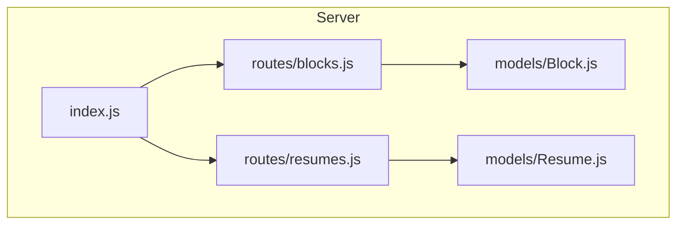
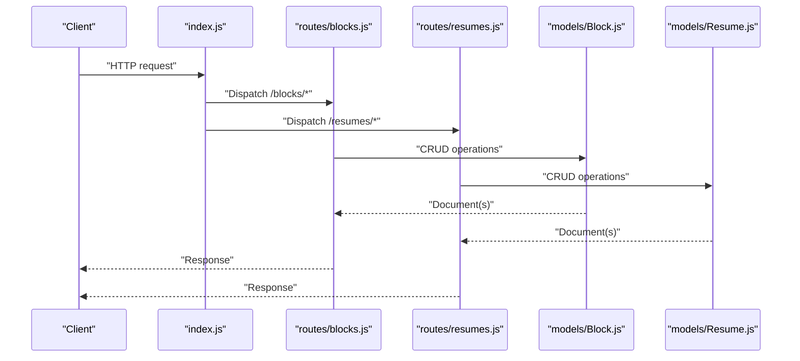
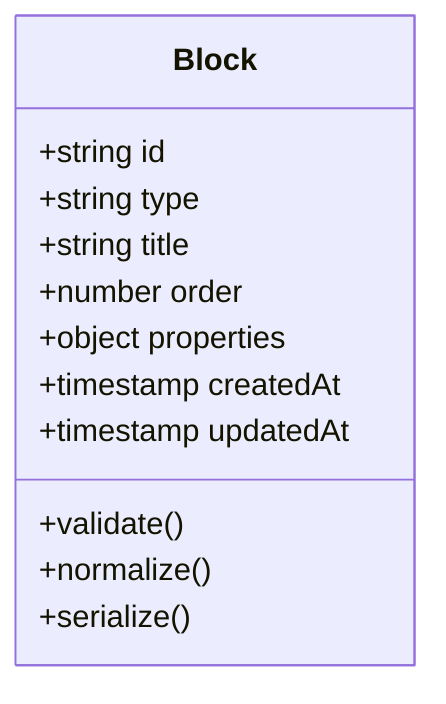
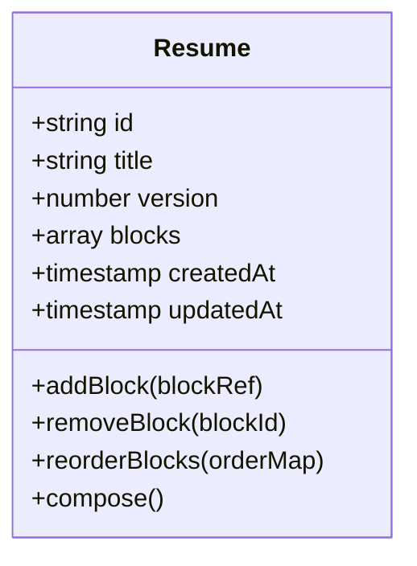
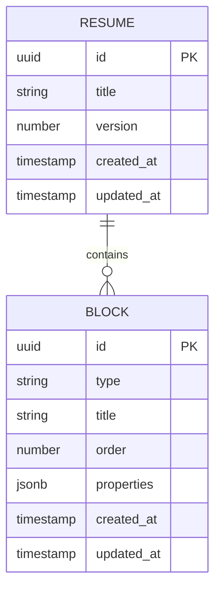
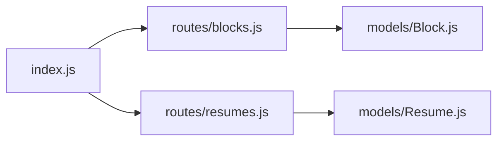

# Data Models

<cite>
**Referenced Files in This Document**
- [Block.js](file://server/models/Block.js)
- [Resume.js](file://server/models/Resume.js)
- [blocks.js](file://server/routes/blocks.js)
- [resumes.js](file://server/routes/resumes.js)
- [index.js](file://server/index.js)
</cite>

## Table of Contents
1. [Introduction](#introduction)
2. [Project Structure](#project-structure)
3. [Core Components](#core-components)
4. [Architecture Overview](#architecture-overview)
5. [Detailed Component Analysis](#detailed-component-analysis)
6. [Dependency Analysis](#dependency-analysis)
7. [Performance Considerations](#performance-considerations)
8. [Troubleshooting Guide](#troubleshooting-guide)
9. [Conclusion](#conclusion)
10. [Appendices](#appendices)

## Introduction
This document provides comprehensive data model documentation for the Modular Resume Builder’s database schemas. It focuses on the Mongoose models that represent Blocks and Resumes, including field definitions, data types, validation rules, relationships, schema design decisions, indexing strategies, query optimization patterns, examples of document structures, common queries, and data integrity measures. It also explains how block properties are stored and retrieved, resume composition logic, and schema evolution patterns with migration strategies for future enhancements.

## Project Structure
The backend is organized around a small set of server-side modules:
- Models define the data schemas and behavior (Mongoose models).
- Routes expose REST endpoints to create, read, update, and delete resources.
- The application entry point wires routes and starts the HTTP server.

**Diagram sources**
- [index.js](file://server/index.js)
- [blocks.js](file://server/routes/blocks.js)
- [resumes.js](file://server/routes/resumes.js)
- [Block.js](file://server/models/Block.js)
- [Resume.js](file://server/models/Resume.js)

**Section sources**
- [index.js](file://server/index.js)
- [blocks.js](file://server/routes/blocks.js)
- [resumes.js](file://server/routes/resumes.js)
- [Block.js](file://server/models/Block.js)
- [Resume.js](file://server/models/Resume.js)

## Core Components
This section summarizes the two core Mongoose models used by the system: Block and Resume.

- Block
  - Purpose: Represents a reusable content unit within a resume (e.g., summary, experience, education, skills).
  - Key responsibilities: Define typed fields, validate inputs, support flexible property storage via an embedded properties object, and provide helper methods for serialization and rendering hints.
  - Typical fields: Identifier, type discriminator, display metadata, and a properties map for dynamic content.

- Resume
  - Purpose: Represents a user’s assembled resume composed of ordered blocks.
  - Key responsibilities: Maintain ordering and references to blocks, enforce structural constraints, and provide convenience methods for composing and exporting the final structure.
  - Typical fields: Identifier, title, versioning metadata, and an ordered collection of block references or embedded block snapshots.

These components work together to enable modular resume creation while preserving data integrity and flexibility.

**Section sources**
- [Block.js](file://server/models/Block.js)
- [Resume.js](file://server/models/Resume.js)

## Architecture Overview
The data layer follows a clear separation between schema definition (models) and API exposure (routes). The models encapsulate validation and business logic, while routes handle HTTP requests and orchestrate model operations.

**Diagram sources**
- [index.js](file://server/index.js)
- [blocks.js](file://server/routes/blocks.js)
- [resumes.js](file://server/routes/resumes.js)
- [Block.js](file://server/models/Block.js)
- [Resume.js](file://server/models/Resume.js)

## Detailed Component Analysis

### Block Model
The Block model defines the schema for individual resume sections. It typically includes:
- Identification and metadata fields (e.g., id, type, timestamps).
- A structured properties object to store block-specific content.
- Validation rules ensuring required fields and correct types.
- Helper methods for normalization and serialization.

Design considerations:
- Type discrimination: A type field distinguishes different block kinds (e.g., summary, experience), enabling polymorphic handling in routes and UI.
- Flexible properties: An embedded properties object allows each block to carry its own schema-less payload while still being validated at write time.
- Immutability aids: Methods can return normalized copies to avoid accidental mutation.

Common usage patterns:
- Creating a new block instance with validated properties.
- Updating specific properties without overwriting the entire block.
- Serializing to JSON for export or preview.

Example document structure (illustrative):
- id: string
- type: enum-like string
- title: string
- order: number
- properties: object (block-specific key-value pairs)
- createdAt: timestamp
- updatedAt: timestamp

Validation constraints (examples):
- Required fields such as type and title.
- Properties must conform to expected keys per block type.
- Numeric fields constrained to valid ranges.

Indexing strategy:
- Indexes on frequently queried fields like type and order to optimize listing and filtering.
- Compound indexes for composite queries (e.g., type + order).

Query optimization patterns:
- Projection to fetch only needed fields when rendering previews.
- Aggregation pipelines for computed summaries (e.g., counts by type).

Data integrity measures:
- Schema-level validation prevents invalid documents from persisting.
- Pre-save hooks normalize values and ensure consistent formatting.

**Section sources**
- [Block.js](file://server/models/Block.js)

#### Class Diagram: Block

**Diagram sources**
- [Block.js](file://server/models/Block.js)

### Resume Model
The Resume model represents a complete resume composed of multiple blocks. It typically includes:
- Identification and metadata fields (e.g., id, title, version).
- An ordered list of block references or embedded block snapshots.
- Validation rules ensuring structural integrity and consistency.
- Helper methods for composing, reordering, and exporting the resume.

Design considerations:
- Composition vs. embedding: Depending on access patterns, resumes may either reference blocks by id or embed block snapshots for portability.
- Ordering: Maintaining explicit order ensures deterministic rendering and stable exports.
- Versioning: Metadata supports schema evolution and rollback scenarios.

Common usage patterns:
- Adding, removing, and reordering blocks.
- Validating the overall resume structure before saving.
- Exporting a fully composed document for PDF generation.

Example document structure (illustrative):
- id: string
- title: string
- version: number
- blocks: array of block references or embedded objects
- createdAt: timestamp
- updatedAt: timestamp

Validation constraints (examples):
- At least one block present.
- Unique ordering across blocks.
- Referenced blocks exist if using external references.

Indexing strategy:
- Indexes on title and version for lookup and history.
- Compound indexes on owner/user context if multi-tenant.

Query optimization patterns:
- Populate referenced blocks efficiently when needed.
- Use projections to exclude heavy nested payloads during listing.

Data integrity measures:
- Pre-save hooks verify ordering uniqueness and referential integrity.
- Post-save hooks can compute derived metadata (e.g., last modified block).

**Section sources**
- [Resume.js](file://server/models/Resume.js)

#### Class Diagram: Resume

**Diagram sources**
- [Resume.js](file://server/models/Resume.js)

### Relationship Between Block and Resume
The relationship is compositional: a Resume contains multiple Blocks. Depending on implementation, this can be:
- Embedded: Blocks are stored directly within the Resume document for fast reads and simple transactions.
- Referenced: Blocks are stored separately and linked by id, promoting reuse and reducing duplication.

**Diagram sources**
- [Resume.js](file://server/models/Resume.js)
- [Block.js](file://server/models/Block.js)

## Dependency Analysis
The server entry point wires routes to controllers and mounts them under appropriate paths. Routes depend on models for persistence and validation.

**Diagram sources**
- [index.js](file://server/index.js)
- [blocks.js](file://server/routes/blocks.js)
- [resumes.js](file://server/routes/resumes.js)
- [Block.js](file://server/models/Block.js)
- [Resume.js](file://server/models/Resume.js)

**Section sources**
- [index.js](file://server/index.js)
- [blocks.js](file://server/routes/blocks.js)
- [resumes.js](file://server/routes/resumes.js)
- [Block.js](file://server/models/Block.js)
- [Resume.js](file://server/models/Resume.js)

## Performance Considerations
- Indexing: Add targeted indexes on high-cardinality and frequently filtered fields (e.g., type, title, version). For compound queries, use compound indexes to avoid sorting overhead.
- Projections: Always project only necessary fields in listing endpoints to reduce payload size and memory usage.
- Population vs. Embedding: If blocks are large and rarely accessed together with resumes, prefer referencing to keep resume documents compact. If reads dominate and co-location improves performance, consider embedding.
- Transactions: Use atomic operations for updates that modify multiple blocks or reorder lists to maintain consistency.
- Pagination: Implement cursor-based pagination for large collections to avoid deep offset scans.

[No sources needed since this section provides general guidance]

## Troubleshooting Guide
Common issues and resolutions:
- Validation errors: Ensure all required fields are provided and match expected types. Check pre-save normalization hooks for unexpected transformations.
- Duplicate ordering: When reordering blocks, verify uniqueness constraints and apply transactional updates.
- Missing references: If using external block references, confirm referential integrity and handle orphaned references gracefully.
- Serialization inconsistencies: Normalize block properties consistently before saving; use helper methods to avoid ad-hoc mutations.

Operational checks:
- Inspect index coverage for slow queries using explain plans.
- Monitor document sizes to prevent exceeding MongoDB limits.
- Log validation failures with contextual details to aid debugging.

**Section sources**
- [Block.js](file://server/models/Block.js)
- [Resume.js](file://server/models/Resume.js)

## Conclusion
The Block and Resume models provide a flexible yet robust foundation for the Modular Resume Builder. By leveraging typed fields, validation, and helper methods, the system enforces data integrity while supporting extensibility through properties and composition. Thoughtful indexing, projection, and transaction strategies ensure performance and reliability as the application scales.

[No sources needed since this section summarizes without analyzing specific files]

## Appendices

### Examples of Document Structures
- Block example:
  - id: string
  - type: string
  - title: string
  - order: number
  - properties: object
  - createdAt: timestamp
  - updatedAt: timestamp

- Resume example:
  - id: string
  - title: string
  - version: number
  - blocks: array
  - createdAt: timestamp
  - updatedAt: timestamp

[No sources needed since this section provides conceptual examples]

### Common Queries
- Find all blocks of a given type:
  - Filter by type field and project minimal fields.
- Retrieve a resume with its blocks:
  - Either populate references or include embedded blocks depending on schema choice.
- Reorder blocks atomically:
  - Use a single update operation to adjust orders and timestamps.

[No sources needed since this section provides conceptual examples]

### Schema Evolution and Migration Strategies
- Introduce new block types by adding discriminators or extending properties with optional fields.
- Version resumes to track schema changes and allow rollbacks.
- Backfill existing data using migration scripts that normalize legacy formats.
- Maintain backward compatibility by keeping deprecated fields until full rollout.

[No sources needed since this section provides conceptual guidance]