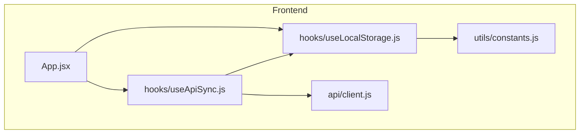
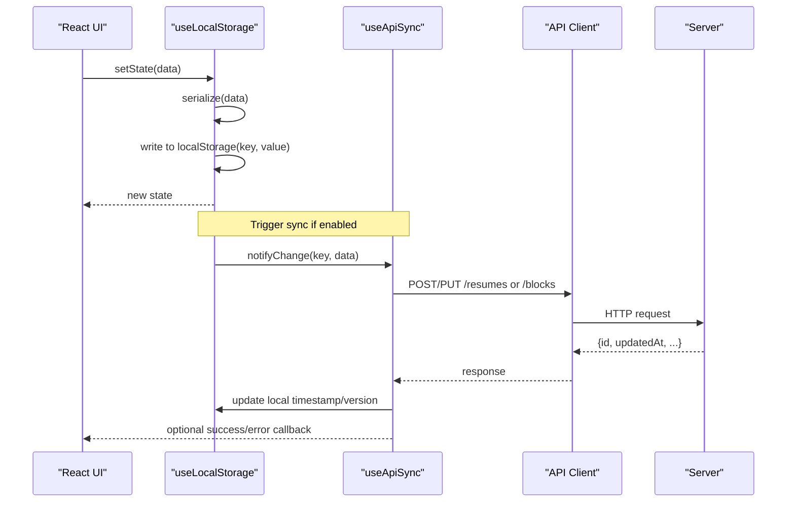
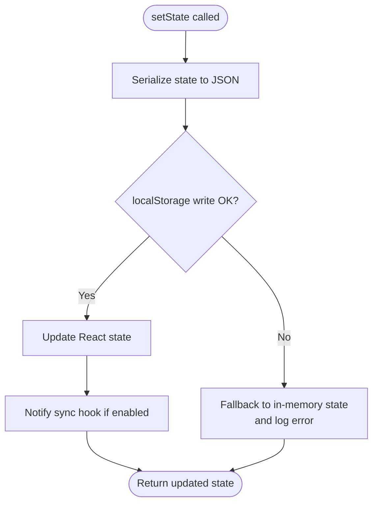
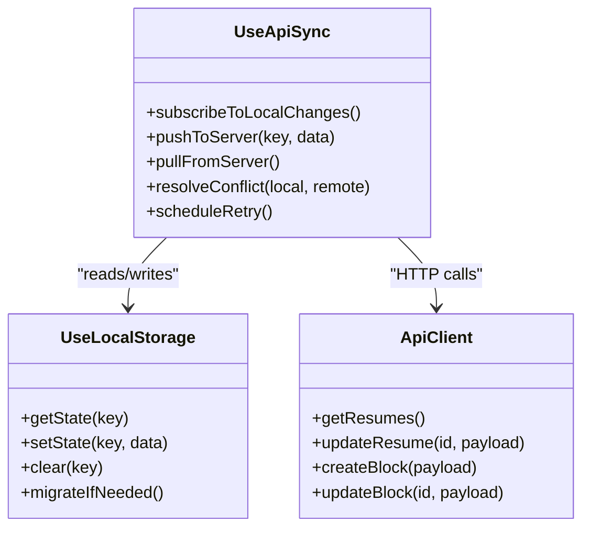
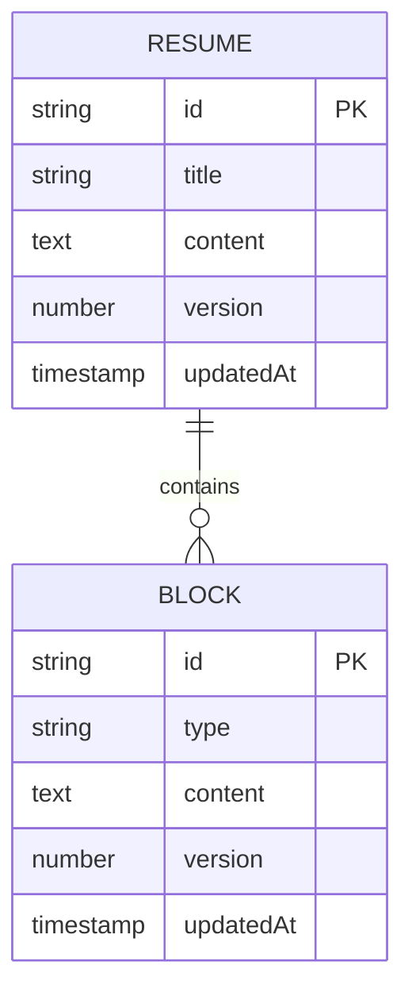
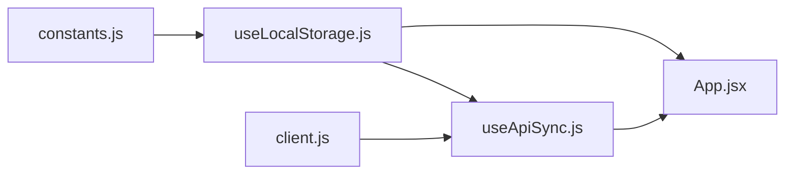

# Local Storage

<cite>
**Referenced Files in This Document**
- [useLocalStorage.js](file://src/hooks/useLocalStorage.js)
- [useApiSync.js](file://src/hooks/useApiSync.js)
- [constants.js](file://src/utils/constants.js)
- [App.jsx](file://src/App.jsx)
- [client.js](file://src/api/client.js)
</cite>

## Table of Contents
1. [Introduction](#introduction)
2. [Project Structure](#project-structure)
3. [Core Components](#core-components)
4. [Architecture Overview](#architecture-overview)
5. [Detailed Component Analysis](#detailed-component-analysis)
6. [Dependency Analysis](#dependency-analysis)
7. [Performance Considerations](#performance-considerations)
8. [Troubleshooting Guide](#troubleshooting-guide)
9. [Conclusion](#conclusion)
10. [Appendices](#appendices)

## Introduction
This document describes the local storage persistence system used by the application. It focuses on the useLocalStorage hook implementation, including data serialization, automatic save mechanisms, and browser storage quotas. It also explains the dual persistence strategy that provides immediate user feedback while maintaining cloud sync capabilities, along with backup and recovery procedures, storage optimization techniques, cross-browser compatibility considerations, data migration strategies, and cleanup approaches for unused data.

## Project Structure
The local storage persistence system is implemented primarily through a custom React hook and supporting utilities. The key files involved include:
- A custom hook for local storage state management
- An API synchronization hook for cloud sync
- Utility constants for keys and configuration
- Application-level integration points

**Diagram sources**
- [App.jsx](file://src/App.jsx)
- [useLocalStorage.js](file://src/hooks/useLocalStorage.js)
- [useApiSync.js](file://src/hooks/useApiSync.js)
- [constants.js](file://src/utils/constants.js)
- [client.js](file://src/api/client.js)

**Section sources**
- [App.jsx](file://src/App.jsx)
- [useLocalStorage.js](file://src/hooks/useLocalStorage.js)
- [useApiSync.js](file://src/hooks/useApiSync.js)
- [constants.js](file://src/utils/constants.js)
- [client.js](file://src/api/client.js)

## Core Components
- useLocalStorage: Provides a React state-like interface over localStorage with automatic persistence, JSON serialization/deserialization, and optional change listeners.
- useApiSync: Orchestrates synchronization between local state and remote server, handling conflict resolution and background updates.
- Constants: Centralizes storage keys, versioning metadata, and feature flags related to persistence.
- API Client: Encapsulates HTTP requests for resume and block resources.

Key responsibilities:
- Immediate local writes for responsive UI
- Background or debounced sync to the server
- Safe parsing and error handling around JSON
- Version-aware migration and cleanup

**Section sources**
- [useLocalStorage.js](file://src/hooks/useLocalStorage.js)
- [useApiSync.js](file://src/hooks/useApiSync.js)
- [constants.js](file://src/utils/constants.js)
- [client.js](file://src/api/client.js)

## Architecture Overview
The system implements a dual persistence strategy:
- Primary: localStorage for instant reads/writes and offline resilience
- Secondary: Remote server via REST API for collaboration and multi-device access

**Diagram sources**
- [useLocalStorage.js](file://src/hooks/useLocalStorage.js)
- [useApiSync.js](file://src/hooks/useApiSync.js)
- [client.js](file://src/api/client.js)

## Detailed Component Analysis

### useLocalStorage Hook
Responsibilities:
- Initialize state from localStorage with safe JSON.parse fallbacks
- Persist state changes to localStorage automatically
- Provide getters/setters with optional debounce/throttle
- Expose utility methods for clearing, migrating, and exporting/importing data
- Handle quota exceeded errors gracefully

Implementation highlights:
- Serialization: JSON.stringify/JSON.parse with try/catch and default values
- Automatic save: useEffect-based persistence triggered by state changes
- Quota handling: catch quota errors and degrade to in-memory state
- Migration: apply versioned transforms keyed by storage schema version
- Cleanup: remove obsolete keys and normalize legacy formats

**Diagram sources**
- [useLocalStorage.js](file://src/hooks/useLocalStorage.js)

**Section sources**
- [useLocalStorage.js](file://src/hooks/useLocalStorage.js)

### useApiSync Hook
Responsibilities:
- Listen for local changes and push to server
- Pull latest server state on app start or periodically
- Resolve conflicts using timestamps or version numbers
- Queue retries and handle network failures
- Debounce frequent writes to reduce server load

Integration points:
- Subscribes to changes emitted by useLocalStorage
- Uses API client to call server endpoints
- Updates local state with server responses to maintain consistency

**Diagram sources**
- [useApiSync.js](file://src/hooks/useApiSync.js)
- [useLocalStorage.js](file://src/hooks/useLocalStorage.js)
- [client.js](file://src/api/client.js)

**Section sources**
- [useApiSync.js](file://src/hooks/useApiSync.js)
- [client.js](file://src/api/client.js)

### Data Models and Keys
Storage keys and schema versions are centralized to ensure consistent usage across components and migrations.

**Diagram sources**
- [constants.js](file://src/utils/constants.js)
- [client.js](file://src/api/client.js)

**Section sources**
- [constants.js](file://src/utils/constants.js)
- [client.js](file://src/api/client.js)

## Dependency Analysis
- useLocalStorage depends on:
  - Browser localStorage API
  - Utility constants for keys and versions
- useApiSync depends on:
  - useLocalStorage for local state
  - API client for HTTP communication
- App integrates both hooks to coordinate UI, local persistence, and cloud sync

**Diagram sources**
- [constants.js](file://src/utils/constants.js)
- [useLocalStorage.js](file://src/hooks/useLocalStorage.js)
- [useApiSync.js](file://src/hooks/useApiSync.js)
- [client.js](file://src/api/client.js)
- [App.jsx](file://src/App.jsx)

**Section sources**
- [constants.js](file://src/utils/constants.js)
- [useLocalStorage.js](file://src/hooks/useLocalStorage.js)
- [useApiSync.js](file://src/hooks/useApiSync.js)
- [client.js](file://src/api/client.js)
- [App.jsx](file://src/App.jsx)

## Performance Considerations
- Debounce or throttle saves to avoid excessive localStorage writes during rapid edits
- Batch updates where possible to minimize re-renders and sync triggers
- Avoid storing large binary blobs; prefer references or external storage for heavy assets
- Use selective syncing: only push changed fields or diffs when supported by the server
- Monitor storage usage and warn users when approaching browser quotas

[No sources needed since this section provides general guidance]

## Troubleshooting Guide
Common issues and resolutions:
- QuotaExceededError: Detect and fall back to in-memory state; prompt user to clear old data or upgrade plan
- Corrupted JSON: Catch parse errors, reset to defaults, and offer import/export recovery
- Sync conflicts: Use last-write-wins with timestamps or merge strategies; surface conflicts to the user for manual resolution
- Network failures: Implement retry with exponential backoff and queue failed operations
- Cross-browser inconsistencies: Normalize behavior for Safari private mode and older browsers; detect availability and disable features accordingly

Operational checks:
- Verify storage keys match constants
- Confirm version field increments on schema changes
- Ensure timestamps are ISO strings and timezone-safe

**Section sources**
- [useLocalStorage.js](file://src/hooks/useLocalStorage.js)
- [useApiSync.js](file://src/hooks/useApiSync.js)
- [constants.js](file://src/utils/constants.js)

## Conclusion
The local storage persistence system combines fast, reliable local writes with robust cloud synchronization. By centralizing keys and versions, implementing safe serialization, and providing clear migration and recovery paths, the system ensures a smooth user experience across devices and environments.

[No sources needed since this section summarizes without analyzing specific files]

## Appendices

### Backup and Recovery Procedures
- Export: Generate a JSON snapshot of current state and trigger a download
- Import: Validate incoming JSON against expected schema and migrate if necessary
- Restore: Replace local state with imported data and re-sync with server to reconcile differences

**Section sources**
- [useLocalStorage.js](file://src/hooks/useLocalStorage.js)
- [useApiSync.js](file://src/hooks/useApiSync.js)

### Storage Optimization Techniques
- Normalize data structures to reduce duplication
- Remove deprecated fields during migration
- Compress or chunk large payloads before persisting if needed
- Use lazy initialization for heavy sections

**Section sources**
- [useLocalStorage.js](file://src/hooks/useLocalStorage.js)
- [constants.js](file://src/utils/constants.js)

### Cross-Browser Compatibility Considerations
- Detect localStorage availability and gracefully degrade
- Handle Safari private mode restrictions
- Normalize date/time formats to UTC
- Test edge cases for very long strings and nested objects

**Section sources**
- [useLocalStorage.js](file://src/hooks/useLocalStorage.js)

### Data Migration and Cleanup Strategies
- Maintain a schema version per storage key
- On startup, compare stored version with current and run migration functions
- Clean up obsolete keys and deprecated fields after successful migration
- Log migration outcomes for observability

**Section sources**
- [useLocalStorage.js](file://src/hooks/useLocalStorage.js)
- [constants.js](file://src/utils/constants.js)