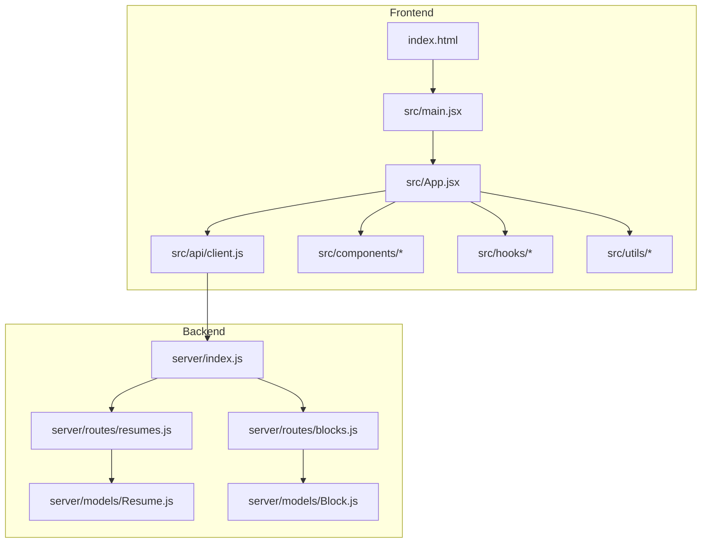
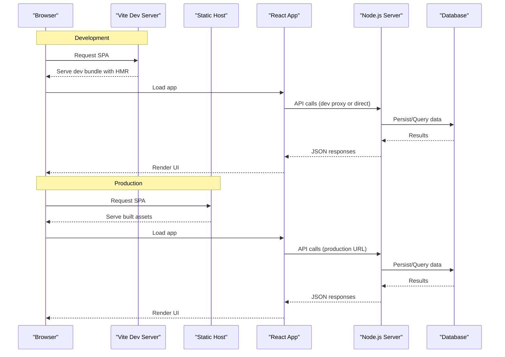
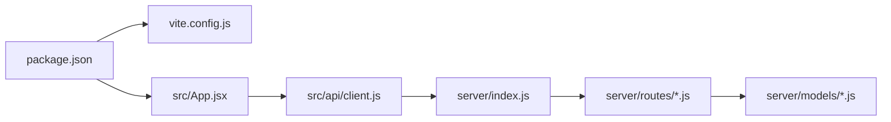

# Deployment Guide

<cite>
**Referenced Files in This Document**
- [package.json](file://package.json)
- [vite.config.js](file://vite.config.js)
- [index.html](file://index.html)
- [server/index.js](file://server/index.js)
- [server/models/Resume.js](file://server/models/Resume.js)
- [server/models/Block.js](file://server/models/Block.js)
- [server/routes/resumes.js](file://server/routes/resumes.js)
- [server/routes/blocks.js](file://server/routes/blocks.js)
- [src/main.jsx](file://src/main.jsx)
- [src/App.jsx](file://src/App.jsx)
- [src/api/client.js](file://src/api/client.js)
- [README.md](file://README.md)
</cite>

## Table of Contents
1. [Introduction](#introduction)
2. [Project Structure](#project-structure)
3. [Core Components](#core-components)
4. [Architecture Overview](#architecture-overview)
5. [Detailed Component Analysis](#detailed-component-analysis)
6. [Dependency Analysis](#dependency-analysis)
7. [Performance Considerations](#performance-considerations)
8. [Troubleshooting Guide](#troubleshooting-guide)
9. [Conclusion](#conclusion)
10. [Appendices](#appendices)

## Introduction
This guide provides comprehensive deployment instructions for the Modular Resume Builder, covering both frontend and backend components. It explains build differences between development and production using Vite, environment variable configuration, database setup, containerization with Docker, CI/CD pipeline setup, automated testing, monitoring considerations, troubleshooting, and performance tuning recommendations.

The project consists of:
- A React-based frontend built with Vite
- A Node.js backend server with Express-like routing and Mongoose models
- Static assets and print styles for PDF export workflows

## Project Structure
At a high level, the repository is organized into:
- Frontend source under src/, including application entry points, components, hooks, utilities, and API client
- Backend server under server/, including routes, models, and the main server entry point
- Build and runtime configuration files at the root (package.json, vite.config.js, index.html)

**Diagram sources**
- [index.html:1-20](file://index.html#L1-L20)
- [src/main.jsx:1-20](file://src/main.jsx#L1-L20)
- [src/App.jsx:1-20](file://src/App.jsx#L1-L20)
- [src/api/client.js:1-20](file://src/api/client.js#L1-L20)
- [server/index.js:1-20](file://server/index.js#L1-L20)
- [server/routes/resumes.js:1-20](file://server/routes/resumes.js#L1-L20)
- [server/routes/blocks.js:1-20](file://server/routes/blocks.js#L1-L20)
- [server/models/Resume.js:1-20](file://server/models/Resume.js#L1-L20)
- [server/models/Block.js:1-20](file://server/models/Block.js#L1-L20)

**Section sources**
- [README.md:1-50](file://README.md#L1-L50)
- [package.json:1-50](file://package.json#L1-L50)

## Core Components
- Frontend entry and app shell:
  - Entry point initializes the React application and mounts it to the DOM.
  - App component orchestrates UI state and integrates with the API client.
- API client:
  - Centralized HTTP client used by the frontend to communicate with the backend.
- Backend server:
  - Main server file sets up middleware, routes, and starts listening on a port.
  - Routes handle resume and block CRUD operations.
  - Models define data schemas for resumes and blocks.

Key responsibilities:
- Frontend builds static assets via Vite and consumes backend APIs through the configured base URL.
- Backend exposes REST endpoints and persists data using Mongoose models.

**Section sources**
- [src/main.jsx:1-40](file://src/main.jsx#L1-L40)
- [src/App.jsx:1-60](file://src/App.jsx#L1-L60)
- [src/api/client.js:1-60](file://src/api/client.js#L1-L60)
- [server/index.js:1-80](file://server/index.js#L1-L80)
- [server/routes/resumes.js:1-80](file://server/routes/resumes.js#L1-L80)
- [server/routes/blocks.js:1-80](file://server/routes/blocks.js#L1-L80)
- [server/models/Resume.js:1-60](file://server/models/Resume.js#L1-L60)
- [server/models/Block.js:1-60](file://server/models/Block.js#L1-L60)

## Architecture Overview
The system follows a typical SPA + API architecture:
- The frontend is a React SPA built with Vite, producing static assets served by any static host or the backend.
- The backend is a Node.js service exposing REST endpoints for resumes and blocks.
- Data persistence is handled via Mongoose models, typically backed by MongoDB.

**Diagram sources**
- [vite.config.js:1-40](file://vite.config.js#L1-L40)
- [src/api/client.js:1-60](file://src/api/client.js#L1-L60)
- [server/index.js:1-80](file://server/index.js#L1-L80)

## Detailed Component Analysis

### Build System and Environment Differences (Vite)
- Development vs Production:
  - Development uses a dev server with hot module replacement and unminified output for faster iteration.
  - Production builds optimized, minified assets and configures caching headers where applicable.
- Base path and asset handling:
  - Configure base path if deploying under a subpath.
  - Ensure public assets are correctly referenced in production.
- Proxying during development:
  - Optionally configure a dev proxy to forward API requests to the backend.

Recommended steps:
- Review and adjust Vite configuration for production optimizations such as code splitting and asset hashing.
- Set environment variables for API base URLs per environment.

**Section sources**
- [vite.config.js:1-60](file://vite.config.js#L1-L60)
- [package.json:1-60](file://package.json#L1-L60)
- [index.html:1-20](file://index.html#L1-L20)

### Frontend Deployment (Static Hosting)
- Netlify:
  - Build command: use the package script that runs the Vite build.
  - Publish directory: set to the Vite output directory.
  - Environment variables: configure API base URL and other frontend-specific variables.
  - Redirects: add SPA fallback rules to route all paths to index.html.
- Vercel:
  - Framework preset: Vite or React.
  - Build command: run the Vite build script.
  - Output directory: set to the Vite output directory.
  - Environment variables: configure API base URL and other frontend-specific variables.
  - Rewrites: ensure SPA rewrites to index.html.

Environment variables:
- Define variables for the API base URL and any feature flags required by the frontend.
- Use environment-specific values for development, staging, and production.

**Section sources**
- [package.json:1-60](file://package.json#L1-L60)
- [src/api/client.js:1-60](file://src/api/client.js#L1-L60)
- [vite.config.js:1-60](file://vite.config.js#L1-L60)

### Backend Deployment (Node.js Hosting Services)
- Heroku:
  - Procfile: define a web process running the Node.js server.
  - Node version: specify a compatible Node.js version.
  - Environment variables: configure database connection string, CORS settings, and any secrets.
  - Buildpacks: use the Node.js buildpack.
- AWS:
  - Options include EC2, Elastic Beanstalk, or Lambda with API Gateway.
  - For EC2/Elastic Beanstalk: install dependencies, set environment variables, and start the server.
  - For Lambda: consider packaging the serverless-compatible entry point and configuring runtime.

Environment variables:
- Database connection string (e.g., MongoDB URI).
- Port binding (if not provided by platform).
- CORS origins and security-related settings.
- Logging and monitoring configuration.

Database setup:
- Ensure the database is reachable from the hosting environment.
- Initialize collections and indexes as needed by the models.
- Seed initial data if required by your workflow.

**Section sources**
- [server/index.js:1-120](file://server/index.js#L1-L120)
- [server/models/Resume.js:1-60](file://server/models/Resume.js#L1-L60)
- [server/models/Block.js:1-60](file://server/models/Block.js#L1-L60)
- [server/routes/resumes.js:1-120](file://server/routes/resumes.js#L1-L120)
- [server/routes/blocks.js:1-120](file://server/routes/blocks.js#L1-L120)

### Containerization with Docker
- Multi-stage build:
  - Stage 1: Install frontend dependencies and build static assets with Vite.
  - Stage 2: Create a minimal runtime image serving static files and/or running the backend.
- Serving static assets:
  - Option A: Use a lightweight static server (e.g., Nginx) to serve the frontend build output.
  - Option B: Serve static assets from the Node.js backend by configuring the server to serve the build directory.
- Environment variables in containers:
  - Pass database connection strings and other secrets via environment variables or secret managers.
- Health checks and readiness:
  - Implement a health endpoint for load balancers and orchestration platforms.

Example structure:
- Dockerfile at the repository root defining multi-stage build.
- .dockerignore to exclude unnecessary files.
- docker-compose.yml for local development and integration tests.

**Section sources**
- [server/index.js:1-120](file://server/index.js#L1-L120)
- [package.json:1-60](file://package.json#L1-L60)
- [vite.config.js:1-60](file://vite.config.js#L1-L60)

### CI/CD Pipeline Setup
- Version control:
  - Push to main triggers CI pipelines.
- Automated testing:
  - Run unit and integration tests for both frontend and backend.
  - Lint and type-check code before building.
- Build artifacts:
  - Build frontend with Vite and upload static assets.
  - Package backend for deployment.
- Deployment:
  - Deploy frontend to static hosting platforms.
  - Deploy backend to Node.js hosting services or container registries.
- Security scanning:
  - Perform dependency vulnerability scans and report results.

Suggested stages:
- Install dependencies
- Lint and test
- Build frontend and backend
- Upload artifacts
- Deploy to target environments

**Section sources**
- [package.json:1-60](file://package.json#L1-L60)
- [README.md:1-50](file://README.md#L1-L50)

### Monitoring and Observability
- Application metrics:
  - Track request counts, error rates, and latency.
- Logging:
  - Centralize logs with structured formats.
  - Include correlation IDs for tracing across frontend and backend.
- Error tracking:
  - Integrate error reporting tools for frontend and backend.
- Uptime monitoring:
  - Configure synthetic checks and alerts.

**Section sources**
- [server/index.js:1-120](file://server/index.js#L1-L120)
- [src/api/client.js:1-60](file://src/api/client.js#L1-L60)

## Dependency Analysis
The frontend depends on Vite for building and may rely on React ecosystem packages. The backend depends on Node.js runtime and likely uses Express-like routing and Mongoose for data modeling.

**Diagram sources**
- [package.json:1-60](file://package.json#L1-L60)
- [vite.config.js:1-60](file://vite.config.js#L1-L60)
- [src/App.jsx:1-60](file://src/App.jsx#L1-L60)
- [src/api/client.js:1-60](file://src/api/client.js#L1-L60)
- [server/index.js:1-120](file://server/index.js#L1-L120)
- [server/routes/resumes.js:1-120](file://server/routes/resumes.js#L1-L120)
- [server/routes/blocks.js:1-120](file://server/routes/blocks.js#L1-L120)
- [server/models/Resume.js:1-60](file://server/models/Resume.js#L1-L60)
- [server/models/Block.js:1-60](file://server/models/Block.js#L1-L60)

**Section sources**
- [package.json:1-60](file://package.json#L1-L60)
- [vite.config.js:1-60](file://vite.config.js#L1-L60)
- [server/index.js:1-120](file://server/index.js#L1-L120)

## Performance Considerations
- Frontend optimizations:
  - Enable code splitting and lazy loading for large components.
  - Minimize bundle size by removing unused dependencies.
  - Configure asset caching and compression.
- Backend optimizations:
  - Use efficient queries and indexes in the database.
  - Apply rate limiting and input validation.
  - Enable gzip/brotli compression for responses.
- Network and CDN:
  - Serve static assets via CDN for improved global performance.
  - Use HTTP/2 and keep-alive connections.

[No sources needed since this section provides general guidance]

## Troubleshooting Guide
Common issues and resolutions:
- SPA routing errors on static hosts:
  - Ensure redirects/rewrites point all routes to index.html.
- API connectivity problems:
  - Verify environment variables for API base URL and CORS settings.
  - Check network policies and firewall rules.
- Build failures:
  - Confirm Node.js version compatibility and dependency installation.
  - Validate Vite configuration for correct base path and asset references.
- Database connection errors:
  - Validate connection strings and credentials.
  - Ensure the database is accessible from the deployment environment.
- Container startup issues:
  - Inspect container logs for missing environment variables or misconfigured ports.
  - Verify health endpoints respond correctly.

**Section sources**
- [vite.config.js:1-60](file://vite.config.js#L1-L60)
- [src/api/client.js:1-60](file://src/api/client.js#L1-L60)
- [server/index.js:1-120](file://server/index.js#L1-L120)

## Conclusion
This guide outlines how to build, deploy, and operate the Modular Resume Builder across multiple environments and platforms. By following the recommended steps for environment configuration, containerization, CI/CD, monitoring, and performance tuning, you can achieve reliable and scalable deployments for both frontend and backend components.

[No sources needed since this section summarizes without analyzing specific files]

## Appendices

### Environment Variables Reference
- Frontend:
  - API base URL
  - Feature flags
- Backend:
  - Database connection string
  - Port binding
  - CORS origins
  - Logging and monitoring settings

[No sources needed since this section provides general guidance]

### Example Deployment Workflows
- Static hosting (Netlify/Vercel):
  - Configure build commands and publish directories.
  - Set environment variables and SPA fallback rules.
- Node.js hosting (Heroku/AWS):
  - Define process types and environment variables.
  - Prepare database and seed data if necessary.
- Docker:
  - Build multi-stage images and push to registry.
  - Orchestrate with compose or Kubernetes.

[No sources needed since this section provides general guidance]