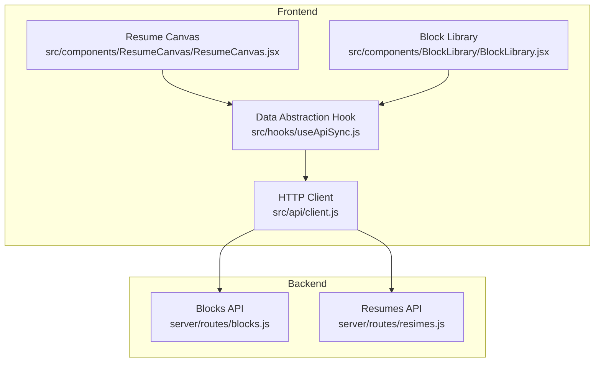
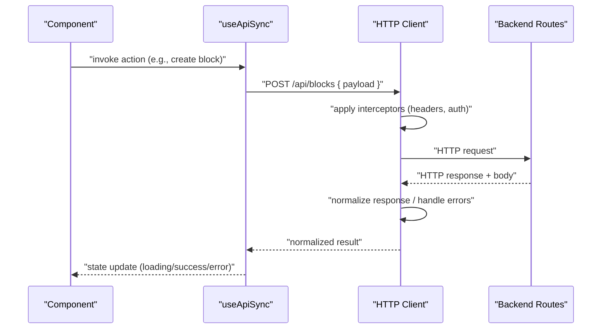
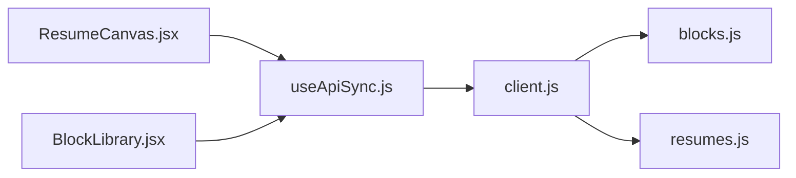
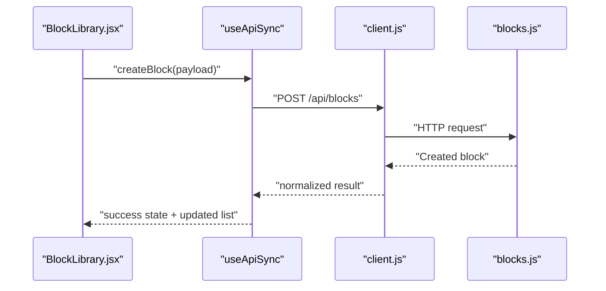
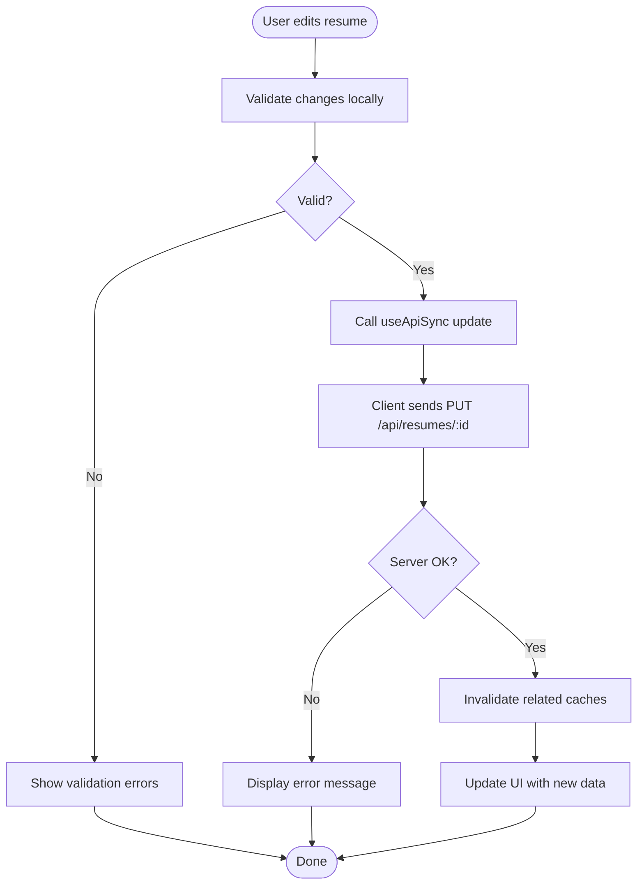

# API Integration Layer

<cite>
**Referenced Files in This Document**
- [client.js](file://src/api/client.js)
- [useApiSync.js](file://src/hooks/useApiSync.js)
- [ResumeCanvas.jsx](file://src/components/ResumeCanvas/ResumeCanvas.jsx)
- [BlockLibrary.jsx](file://src/components/BlockLibrary/BlockLibrary.jsx)
- [blocks.js](file://server/routes/blocks.js)
- [resumes.js](file://server/routes/resumes.js)
</cite>

## Table of Contents
1. [Introduction](#introduction)
2. [Project Structure](#project-structure)
3. [Core Components](#core-components)
4. [Architecture Overview](#architecture-overview)
5. [Detailed Component Analysis](#detailed-component-analysis)
6. [Dependency Analysis](#dependency-analysis)
7. [Performance Considerations](#performance-considerations)
8. [Troubleshooting Guide](#troubleshooting-guide)
9. [Conclusion](#conclusion)
10. [Appendices](#appendices)

## Introduction
This document describes the frontend API integration layer for the application. It focuses on the centralized HTTP client configuration, the abstraction layer that shields UI components from direct network calls, and the RESTful communication patterns used across the app. It also covers authentication handling, request retry mechanisms, caching strategies, error boundaries, and user feedback patterns for failed requests. Guidance is provided to integrate new endpoints consistently and handle varied response formats.

## Project Structure
The frontend organizes API concerns into a small, focused set of modules:
- A centralized HTTP client under src/api for base URL setup, interceptors, and shared error handling.
- A React hook under src/hooks that abstracts common data fetching and mutation patterns.
- Feature components that consume the hook rather than calling the HTTP client directly.

**Diagram sources**
- [client.js](file://src/api/client.js)
- [useApiSync.js](file://src/hooks/useApiSync.js)
- [ResumeCanvas.jsx](file://src/components/ResumeCanvas/ResumeCanvas.jsx)
- [BlockLibrary.jsx](file://src/components/BlockLibrary/BlockLibrary.jsx)
- [blocks.js](file://server/routes/blocks.js)
- [resumes.js](file://server/routes/resumes.js)

**Section sources**
- [client.js](file://src/api/client.js)
- [useApiSync.js](file://src/hooks/useApiSync.js)
- [ResumeCanvas.jsx](file://src/components/ResumeCanvas/ResumeCanvas.jsx)
- [BlockLibrary.jsx](file://src/components/BlockLibrary/BlockLibrary.jsx)
- [blocks.js](file://server/routes/blocks.js)
- [resumes.js](file://server/routes/resumes.js)

## Core Components
- Centralized HTTP client
  - Base URL configuration for consistent endpoint resolution.
  - Request/response interceptors for headers, logging, and normalization.
  - Error handling strategy that maps server errors to user-friendly messages and standardizes response shapes.
- Data abstraction hook
  - Encapsulates GET, POST, PUT, DELETE operations behind a simple interface.
  - Manages loading, success, and error states for each operation.
  - Provides optional retry and caching hooks (when enabled).
- UI components
  - Consume the abstraction hook to perform actions like creating blocks, updating resumes, or fetching lists.
  - Avoid direct imports of the HTTP client to keep business logic decoupled from transport details.

**Section sources**
- [client.js](file://src/api/client.js)
- [useApiSync.js](file://src/hooks/useApiSync.js)
- [ResumeCanvas.jsx](file://src/components/ResumeCanvas/ResumeCanvas.jsx)
- [BlockLibrary.jsx](file://src/components/BlockLibrary/BlockLibrary.jsx)

## Architecture Overview
The integration layer follows a layered approach:
- Presentation layer (components) calls the data abstraction hook.
- The hook coordinates with the centralized HTTP client.
- The client applies interceptors and forwards requests to backend routes.
- Responses are normalized by the client and returned as predictable objects consumed by the hook and components.

**Diagram sources**
- [useApiSync.js](file://src/hooks/useApiSync.js)
- [client.js](file://src/api/client.js)
- [blocks.js](file://server/routes/blocks.js)

## Detailed Component Analysis

### Centralized HTTP Client (client.js)
Responsibilities:
- Base URL setup for all endpoints.
- Interceptors for:
  - Attaching authentication tokens to outgoing requests.
  - Logging and timing metrics.
  - Normalizing responses into a consistent shape.
  - Centralized error mapping for user-facing messages.
- Shared configuration options such as timeouts and default headers.

Error handling strategy:
- Network failures are caught and surfaced as generic user messages.
- Server errors are mapped to actionable feedback where possible.
- Non-2xx responses are rejected with structured error payloads.

Retry mechanism:
- Optional automatic retries for transient failures (e.g., network flakiness).
- Configurable backoff and maximum attempts.

Caching strategy:
- Read-through cache for idempotent GET requests when enabled.
- Cache invalidation on mutations (POST/PUT/DELETE) affecting related resources.

Integration points:
- Used exclusively by the data abstraction hook; components should not import it directly.

**Section sources**
- [client.js](file://src/api/client.js)

### Data Abstraction Hook (useApiSync.js)
Responsibilities:
- Provide a uniform API for CRUD operations against backend resources.
- Manage local state for loading, data, and errors per operation.
- Coordinate retries and cache behavior based on configuration.
- Normalize different response formats into a single contract.

Supported operations:
- GET: fetch resource(s) with optional query parameters.
- POST: create a new resource with payload validation.
- PUT: update an existing resource by identifier.
- DELETE: remove a resource by identifier.

Usage pattern:
- Components call the hook with an action name and parameters.
- The hook returns a function to trigger the operation and reactive state.
- On success, the hook updates state and optionally refreshes dependent queries.

Example usage paths:
- Resume canvas triggers resume-related mutations via the hook.
- Block library creates and manages blocks through the hook.

**Section sources**
- [useApiSync.js](file://src/hooks/useApiSync.js)
- [ResumeCanvas.jsx](file://src/components/ResumeCanvas/ResumeCanvas.jsx)
- [BlockLibrary.jsx](file://src/components/BlockLibrary/BlockLibrary.jsx)

### Backend Endpoints (RESTful Patterns)
The frontend communicates with two primary resource groups:
- Blocks: manage individual content blocks used in resumes.
- Resumes: manage resume documents composed of blocks.

Typical operations:
- GET /api/blocks — list blocks
- POST /api/blocks — create a block
- PUT /api/blocks/:id — update a block
- DELETE /api/blocks/:id — delete a block
- GET /api/resumes — list resumes
- POST /api/resumes — create a resume
- PUT /api/resumes/:id — update a resume
- DELETE /api/resumes/:id — delete a resume

These patterns are implemented on the server and consumed by the frontend via the abstraction hook.

**Section sources**
- [blocks.js](file://server/routes/blocks.js)
- [resumes.js](file://server/routes/resumes.js)

### Authentication Handling
- Tokens are attached to outgoing requests by the client’s request interceptor.
- If a token is missing or expired, the client can prompt re-authentication or redirect to login.
- Protected endpoints return standardized error codes that the client maps to user feedback.

**Section sources**
- [client.js](file://src/api/client.js)

### Request Retry Mechanisms
- Automatic retries are applied to non-idempotent-safe operations only when configured.
- Exponential backoff reduces load during transient outages.
- Retries are skipped for certain status codes (e.g., 4xx client errors).

**Section sources**
- [client.js](file://src/api/client.js)

### Caching Strategies
- GET requests can be cached with configurable TTL.
- Mutations invalidate relevant cache entries automatically.
- Stale-while-revalidate patterns improve perceived performance.

**Section sources**
- [client.js](file://src/api/client.js)

### Integrating New API Endpoints
Steps to add a new endpoint:
1. Define the backend route following existing REST conventions.
2. Add a corresponding method in the abstraction hook if needed.
3. Use the hook in components instead of importing the HTTP client.
4. Ensure error messages and loading states are handled uniformly.

Response format handling:
- The client normalizes responses so components receive a consistent structure regardless of backend variations.
- For legacy endpoints, adapters can map fields to the current contract.

**Section sources**
- [useApiSync.js](file://src/hooks/useApiSync.js)
- [client.js](file://src/api/client.js)

### Error Boundaries and User Feedback
- Global error boundary catches rendering errors and shows a friendly fallback UI.
- Network-level errors are surfaced via toast notifications or inline messages near the affected component.
- Validation errors from the server are displayed next to relevant inputs.

Patterns:
- Loading spinners during pending requests.
- Success confirmations after mutations.
- Retry buttons for failed operations.

**Section sources**
- [client.js](file://src/api/client.js)
- [useApiSync.js](file://src/hooks/useApiSync.js)

## Dependency Analysis
The frontend dependency graph emphasizes low coupling between UI and transport layers.

**Diagram sources**
- [ResumeCanvas.jsx](file://src/components/ResumeCanvas/ResumeCanvas.jsx)
- [BlockLibrary.jsx](file://src/components/BlockLibrary/BlockLibrary.jsx)
- [useApiSync.js](file://src/hooks/useApiSync.js)
- [client.js](file://src/api/client.js)
- [blocks.js](file://server/routes/blocks.js)
- [resumes.js](file://server/routes/resumes.js)

**Section sources**
- [ResumeCanvas.jsx](file://src/components/ResumeCanvas/ResumeCanvas.jsx)
- [BlockLibrary.jsx](file://src/components/BlockLibrary/BlockLibrary.jsx)
- [useApiSync.js](file://src/hooks/useApiSync.js)
- [client.js](file://src/api/client.js)
- [blocks.js](file://server/routes/blocks.js)
- [resumes.js](file://server/routes/resumes.js)

## Performance Considerations
- Prefer GET caching for frequently accessed resources.
- Debounce rapid mutations to avoid excessive network traffic.
- Use pagination for large lists to reduce payload sizes.
- Minimize re-renders by memoizing derived data in components.

[No sources needed since this section provides general guidance]

## Troubleshooting Guide
Common issues and resolutions:
- 401 Unauthorized: ensure the token exists and is valid; refresh flow may be required.
- 404 Not Found: verify resource IDs and endpoint paths.
- 500 Server Error: check server logs; consider enabling retries for transient failures.
- Network Errors: validate connectivity and CORS settings.

Diagnostic tips:
- Enable request logging in development via the client’s interceptor.
- Inspect normalized response shapes to identify mismatches.
- Use browser dev tools to monitor network timings and payloads.

**Section sources**
- [client.js](file://src/api/client.js)
- [useApiSync.js](file://src/hooks/useApiSync.js)

## Conclusion
The API integration layer centralizes HTTP concerns, abstracts data access behind a consistent hook, and enforces uniform error handling and user feedback. By adhering to RESTful patterns and leveraging caching and retries, the application achieves maintainability, resilience, and a smooth user experience.

[No sources needed since this section summarizes without analyzing specific files]

## Appendices

### Example Flows

#### Creating a Block

**Diagram sources**
- [BlockLibrary.jsx](file://src/components/BlockLibrary/BlockLibrary.jsx)
- [useApiSync.js](file://src/hooks/useApiSync.js)
- [client.js](file://src/api/client.js)
- [blocks.js](file://server/routes/blocks.js)

#### Updating a Resume

**Diagram sources**
- [ResumeCanvas.jsx](file://src/components/ResumeCanvas/ResumeCanvas.jsx)
- [useApiSync.js](file://src/hooks/useApiSync.js)
- [client.js](file://src/api/client.js)
- [resumes.js](file://server/routes/resumes.js)