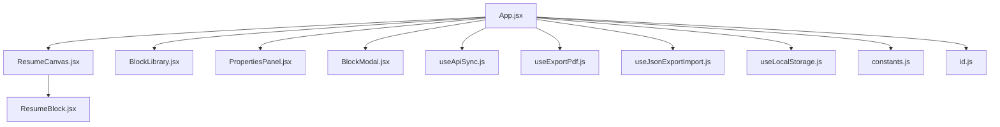
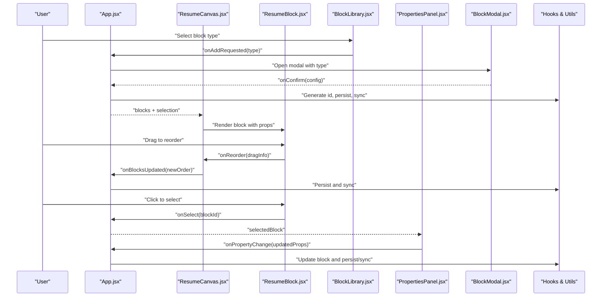
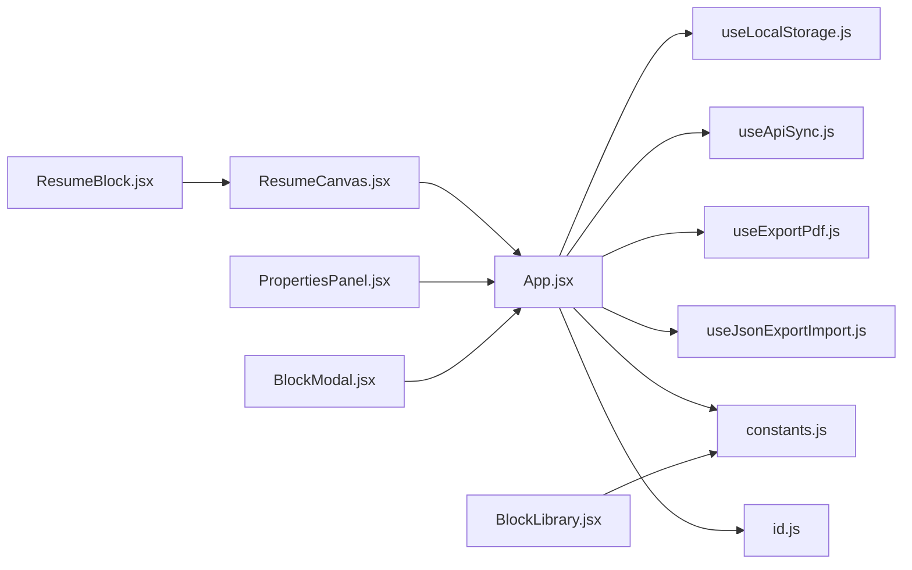

# Component System

<cite>
**Referenced Files in This Document**
- [App.jsx](file://src/App.jsx)
- [ResumeCanvas.jsx](file://src/components/ResumeCanvas/ResumeCanvas.jsx)
- [ResumeBlock.jsx](file://src/components/ResumeCanvas/ResumeBlock.jsx)
- [BlockLibrary.jsx](file://src/components/BlockLibrary/BlockLibrary.jsx)
- [PropertiesPanel.jsx](file://src/components/PropertiesPanel/PropertiesPanel.jsx)
- [BlockModal.jsx](file://src/components/BlockModal/BlockModal.jsx)
- [useApiSync.js](file://src/hooks/useApiSync.js)
- [useExportPdf.js](file://src/hooks/useExportPdf.js)
- [useJsonExportImport.js](file://src/hooks/useJsonExportImport.js)
- [useLocalStorage.js](file://src/hooks/useLocalStorage.js)
- [constants.js](file://src/utils/constants.js)
- [id.js](file://src/utils/id.js)
</cite>

## Table of Contents
1. [Introduction](#introduction)
2. [Project Structure](#project-structure)
3. [Core Components](#core-components)
4. [Architecture Overview](#architecture-overview)
5. [Detailed Component Analysis](#detailed-component-analysis)
6. [Dependency Analysis](#dependency-analysis)
7. [Performance Considerations](#performance-considerations)
8. [Troubleshooting Guide](#troubleshooting-guide)
9. [Conclusion](#conclusion)

## Introduction
This document explains the React component system architecture for the Modular Resume Builder. It focuses on how the application is composed from a top-level container and several core UI components that collaborate to provide an interactive resume editing experience. The documentation covers:
- The main App component as the application container
- Core components: ResumeCanvas, BlockLibrary, PropertiesPanel, BlockModal, and ResumeBlock
- Props interfaces, event handling patterns, state management, and composition strategies
- Communication between components via props and events
- Separation between presentation and business logic through hooks and utilities

## Project Structure
The frontend codebase is organized by feature directories under src/components, with shared hooks under src/hooks and shared utilities under src/utils. The entry point renders the root App component, which composes the primary UI modules.

**Diagram sources**
- [App.jsx](file://src/App.jsx)
- [ResumeCanvas.jsx](file://src/components/ResumeCanvas/ResumeCanvas.jsx)
- [ResumeBlock.jsx](file://src/components/ResumeCanvas/ResumeBlock.jsx)
- [BlockLibrary.jsx](file://src/components/BlockLibrary/BlockLibrary.jsx)
- [PropertiesPanel.jsx](file://src/components/PropertiesPanel/PropertiesPanel.jsx)
- [BlockModal.jsx](file://src/components/BlockModal/BlockModal.jsx)
- [useApiSync.js](file://src/hooks/useApiSync.js)
- [useExportPdf.js](file://src/hooks/useExportPdf.js)
- [useJsonExportImport.js](file://src/hooks/useJsonExportImport.js)
- [useLocalStorage.js](file://src/hooks/useLocalStorage.js)
- [constants.js](file://src/utils/constants.js)
- [id.js](file://src/utils/id.js)

**Section sources**
- [App.jsx](file://src/App.jsx)
- [ResumeCanvas.jsx](file://src/components/ResumeCanvas/ResumeCanvas.jsx)
- [ResumeBlock.jsx](file://src/components/ResumeCanvas/ResumeBlock.jsx)
- [BlockLibrary.jsx](file://src/components/BlockLibrary/BlockLibrary.jsx)
- [PropertiesPanel.jsx](file://src/components/PropertiesPanel/PropertiesPanel.jsx)
- [BlockModal.jsx](file://src/components/BlockModal/BlockModal.jsx)
- [useApiSync.js](file://src/hooks/useApiSync.js)
- [useExportPdf.js](file://src/hooks/useExportPdf.js)
- [useJsonExportImport.js](file://src/hooks/useJsonExportImport.js)
- [useLocalStorage.js](file://src/hooks/useLocalStorage.js)
- [constants.js](file://src/utils/constants.js)
- [id.js](file://src/utils/id.js)

## Core Components
This section outlines the responsibilities and interactions of the core components.

- App (Application Container)
  - Role: Orchestrates global state, composes child components, wires up persistence and API sync, and exposes callbacks for block operations.
  - Responsibilities:
    - Manage blocks collection and selection state
    - Provide handlers for adding, updating, reordering, and deleting blocks
    - Coordinate modal visibility and current editing context
    - Integrate export/import and PDF export capabilities
    - Persist data across sessions using local storage and/or API synchronization

- ResumeCanvas (Interactive Editing Surface)
  - Role: Renders the list of blocks in a drag-and-drop enabled layout and handles canvas-level interactions such as selection and drop targets.
  - Responsibilities:
    - Render each ResumeBlock with appropriate props
    - Handle drag-and-drop events to reorder or insert blocks
    - Forward selection changes to parent via callback
    - Provide visual feedback for active selections and drop zones

- ResumeBlock (Individual Block Renderer)
  - Role: Represents a single editable block instance within the canvas.
  - Responsibilities:
    - Display block content based on its type and properties
    - Expose drag handles and selection indicators
    - Emit events for updates, deletion, and focus/selection
    - Delegate property editing to the PropertiesPanel when selected

- BlockLibrary (Block Catalog Management)
  - Role: Presents available block types and allows users to add new blocks to the resume.
  - Responsibilities:
    - List supported block types from constants
    - Trigger creation workflows via callbacks passed from App
    - Optionally open BlockModal for additional configuration before insertion

- PropertiesPanel (Dynamic Property Editor)
  - Role: Provides a form-like interface to edit the properties of the currently selected block.
  - Responsibilities:
    - Render dynamic fields based on the selected block’s schema
    - Validate inputs and emit change events with updated values
    - Support saving, canceling, and clearing edits
    - Reflect read-only or disabled states when no block is selected

- BlockModal (Block Creation Dialog)
  - Role: Modal dialog used to configure and confirm creation of a new block.
  - Responsibilities:
    - Collect initial configuration for the new block
    - Confirm or cancel creation via callbacks
    - Close automatically after successful creation or explicit cancellation

**Section sources**
- [App.jsx](file://src/App.jsx)
- [ResumeCanvas.jsx](file://src/components/ResumeCanvas/ResumeCanvas.jsx)
- [ResumeBlock.jsx](file://src/components/ResumeCanvas/ResumeBlock.jsx)
- [BlockLibrary.jsx](file://src/components/BlockLibrary/BlockLibrary.jsx)
- [PropertiesPanel.jsx](file://src/components/PropertiesPanel/PropertiesPanel.jsx)
- [BlockModal.jsx](file://src/components/BlockModal/BlockModal.jsx)

## Architecture Overview
The application follows a unidirectional data flow pattern. App holds the source of truth for blocks and selection, passing down immutable data and callbacks. Child components remain largely presentational and communicate back to App via events. Shared behavior is extracted into hooks for persistence, API sync, and export functionality.

**Diagram sources**
- [App.jsx](file://src/App.jsx)
- [ResumeCanvas.jsx](file://src/components/ResumeCanvas/ResumeCanvas.jsx)
- [ResumeBlock.jsx](file://src/components/ResumeCanvas/ResumeBlock.jsx)
- [BlockLibrary.jsx](file://src/components/BlockLibrary/BlockLibrary.jsx)
- [PropertiesPanel.jsx](file://src/components/PropertiesPanel/PropertiesPanel.jsx)
- [BlockModal.jsx](file://src/components/BlockModal/BlockModal.jsx)
- [useApiSync.js](file://src/hooks/useApiSync.js)
- [useExportPdf.js](file://src/hooks/useExportPdf.js)
- [useJsonExportImport.js](file://src/hooks/useJsonExportImport.js)
- [useLocalStorage.js](file://src/hooks/useLocalStorage.js)
- [constants.js](file://src/utils/constants.js)
- [id.js](file://src/utils/id.js)

## Detailed Component Analysis

### App (Application Container)
- Responsibilities:
  - Centralizes state for blocks and selected block
  - Provides handlers for CRUD operations on blocks
  - Coordinates modal visibility and current editing context
  - Integrates persistence and API synchronization
  - Exports data to JSON and PDF
- Composition strategy:
  - Passes blocks and selection state to ResumeCanvas
  - Passes library items and add handler to BlockLibrary
  - Passes selected block and update handler to PropertiesPanel
  - Manages modal open/close and confirmation callbacks for BlockModal
- Event handling patterns:
  - Uses callback props to receive user actions from children
  - Normalizes and validates incoming updates before applying state
  - Triggers side effects (persistence, sync, export) after state changes
- State management:
  - Local state for UI concerns (modal visibility, selection)
  - Persists blocks via useLocalStorage and optionally syncs via useApiSync
  - Delegates ID generation to id utility and uses constants for defaults

**Section sources**
- [App.jsx](file://src/App.jsx)
- [useLocalStorage.js](file://src/hooks/useLocalStorage.js)
- [useApiSync.js](file://src/hooks/useApiSync.js)
- [useExportPdf.js](file://src/hooks/useExportPdf.js)
- [useJsonExportImport.js](file://src/hooks/useJsonExportImport.js)
- [constants.js](file://src/utils/constants.js)
- [id.js](file://src/utils/id.js)

### ResumeCanvas (Interactive Editing Surface)
- Responsibilities:
  - Renders ordered list of ResumeBlock instances
  - Handles drag-and-drop reordering and insertion
  - Forwards selection events to App
  - Provides visual cues for active selection and drop targets
- Props interface highlights:
  - blocks: array of block objects
  - selectedBlockId: identifier of the currently selected block
  - onSelect: callback invoked when a block is selected
  - onReorder: callback invoked with new order after drag-and-drop
- Event handling patterns:
  - Uses HTML5 drag-and-drop APIs or a compatible library to manage drag start, over, and end
  - Computes target index and dispatches normalized reorder payload
  - Prevents default behaviors and manages drag ghost visuals
- State management:
  - Mostly presentational; relies on props for data and callbacks for mutations
  - May maintain temporary UI state for drag preview and drop zone highlighting

**Section sources**
- [ResumeCanvas.jsx](file://src/components/ResumeCanvas/ResumeCanvas.jsx)
- [ResumeBlock.jsx](file://src/components/ResumeCanvas/ResumeBlock.jsx)

### ResumeBlock (Individual Block Renderer)
- Responsibilities:
  - Displays block content according to its type and properties
  - Exposes drag handle and selection indicator
  - Emits events for updates, deletion, and selection
- Props interface highlights:
  - block: object containing type, id, and properties
  - isSelected: boolean indicating selection status
  - onUpdate: callback to apply property changes
  - onDelete: callback to remove the block
  - onSelect: callback to set this block as selected
- Event handling patterns:
  - Emits standardized events with minimal payloads (e.g., { id, changes })
  - Supports keyboard navigation and accessibility attributes
  - Integrates with canvas-level drag-and-drop by exposing draggable attributes
- State management:
  - Presentational; delegates mutation to parent via callbacks
  - May hold transient UI state for inline editing previews

**Section sources**
- [ResumeBlock.jsx](file://src/components/ResumeCanvas/ResumeBlock.jsx)

### BlockLibrary (Block Catalog Management)
- Responsibilities:
  - Lists available block types from constants
  - Initiates creation workflow by requesting App to open BlockModal
- Props interface highlights:
  - onAddRequested: callback invoked with the chosen block type
- Event handling patterns:
  - Click handlers trigger onAddRequested with type metadata
  - Optional filtering/searching by category or name
- State management:
  - Presentational; reads static catalog from constants and emits events

**Section sources**
- [BlockLibrary.jsx](file://src/components/BlockLibrary/BlockLibrary.jsx)
- [constants.js](file://src/utils/constants.js)

### PropertiesPanel (Dynamic Property Editor)
- Responsibilities:
  - Renders dynamic fields based on the selected block’s schema
  - Validates input and emits change events with updated values
  - Supports save/cancel actions and reflects read-only states
- Props interface highlights:
  - selectedBlock: object with type and properties
  - onChange: callback invoked with partial or full property updates
  - onSave: optional callback to commit changes immediately
  - onCancel: optional callback to discard changes
- Event handling patterns:
  - Normalizes field changes into structured updates
  - Debounces frequent updates if needed to reduce re-renders
  - Emits validation errors via controlled UI feedback
- State management:
  - Maintains local draft state for the current edit session
  - Syncs draft to parent via onChange and persists on save

**Section sources**
- [PropertiesPanel.jsx](file://src/components/PropertiesPanel/PropertiesPanel.jsx)

### BlockModal (Block Creation Dialog)
- Responsibilities:
  - Collects initial configuration for a new block
  - Confirms or cancels creation via callbacks
  - Closes automatically after successful creation or explicit cancellation
- Props interface highlights:
  - isOpen: boolean controlling visibility
  - blockType: metadata describing the type being created
  - onConfirm: callback invoked with initial configuration
  - onCancel: callback invoked to dismiss the modal
- Event handling patterns:
  - Focus management and escape key handling for accessibility
  - Form validation before confirming creation
- State management:
  - Holds local form state until confirmation
  - Resets state on close to avoid leaking previous inputs

**Section sources**
- [BlockModal.jsx](file://src/components/BlockModal/BlockModal.jsx)

## Dependency Analysis
The following diagram shows how components depend on hooks and utilities to implement cross-cutting concerns like persistence, synchronization, and export.

**Diagram sources**
- [App.jsx](file://src/App.jsx)
- [ResumeCanvas.jsx](file://src/components/ResumeCanvas/ResumeCanvas.jsx)
- [ResumeBlock.jsx](file://src/components/ResumeCanvas/ResumeBlock.jsx)
- [BlockLibrary.jsx](file://src/components/BlockLibrary/BlockLibrary.jsx)
- [PropertiesPanel.jsx](file://src/components/PropertiesPanel/PropertiesPanel.jsx)
- [BlockModal.jsx](file://src/components/BlockModal/BlockModal.jsx)
- [useLocalStorage.js](file://src/hooks/useLocalStorage.js)
- [useApiSync.js](file://src/hooks/useApiSync.js)
- [useExportPdf.js](file://src/hooks/useExportPdf.js)
- [useJsonExportImport.js](file://src/hooks/useJsonExportImport.js)
- [constants.js](file://src/utils/constants.js)
- [id.js](file://src/utils/id.js)

**Section sources**
- [App.jsx](file://src/App.jsx)
- [ResumeCanvas.jsx](file://src/components/ResumeCanvas/ResumeCanvas.jsx)
- [ResumeBlock.jsx](file://src/components/ResumeCanvas/ResumeBlock.jsx)
- [BlockLibrary.jsx](file://src/components/BlockLibrary/BlockLibrary.jsx)
- [PropertiesPanel.jsx](file://src/components/PropertiesPanel/PropertiesPanel.jsx)
- [BlockModal.jsx](file://src/components/BlockModal/BlockModal.jsx)
- [useLocalStorage.js](file://src/hooks/useLocalStorage.js)
- [useApiSync.js](file://src/hooks/useApiSync.js)
- [useExportPdf.js](file://src/hooks/useExportPdf.js)
- [useJsonExportImport.js](file://src/hooks/useJsonExportImport.js)
- [constants.js](file://src/utils/constants.js)
- [id.js](file://src/utils/id.js)

## Performance Considerations
- Minimize re-renders:
  - Memoize expensive computations and derived data in App where possible
  - Use stable references for callbacks to prevent unnecessary child re-renders
- Drag-and-drop optimization:
  - Avoid heavy work during drag events; compute indices efficiently
  - Debounce or throttle frequent property updates in PropertiesPanel
- Rendering large lists:
  - Consider virtualization if the number of blocks grows significantly
- Persistence and sync:
  - Batch updates before writing to local storage or sending to the API
  - Coalesce rapid successive changes to reduce I/O overhead

[No sources needed since this section provides general guidance]

## Troubleshooting Guide
Common issues and resolutions:
- Blocks not persisting:
  - Verify local storage integration and ensure App invokes persistence hooks after state changes
  - Check for serialization constraints and ensure all block properties are serializable
- API sync failures:
  - Inspect error handling in the API sync hook and retry/backoff strategies
  - Ensure network requests include required headers and payloads
- Drag-and-drop anomalies:
  - Confirm that drag events are properly prevented and normalized
  - Validate that reorder payloads contain correct indices and IDs
- Modal not closing:
  - Ensure isOpen prop is correctly toggled and that confirm/cancel callbacks are wired
- Property updates not reflected:
  - Verify that PropertiesPanel emits normalized updates and App applies them to the correct block by ID

**Section sources**
- [useLocalStorage.js](file://src/hooks/useLocalStorage.js)
- [useApiSync.js](file://src/hooks/useApiSync.js)
- [useExportPdf.js](file://src/hooks/useExportPdf.js)
- [useJsonExportImport.js](file://src/hooks/useJsonExportImport.js)
- [App.jsx](file://src/App.jsx)
- [ResumeCanvas.jsx](file://src/components/ResumeCanvas/ResumeCanvas.jsx)
- [PropertiesPanel.jsx](file://src/components/PropertiesPanel/PropertiesPanel.jsx)
- [BlockModal.jsx](file://src/components/BlockModal/BlockModal.jsx)

## Conclusion
The component system is designed around a clear separation of concerns: App orchestrates state and side effects, while child components remain focused on presentation and user interaction. Communication flows through well-defined props and events, and shared behaviors are encapsulated in reusable hooks and utilities. This structure supports scalability, testability, and maintainability as the resume builder evolves.

[No sources needed since this section summarizes without analyzing specific files]