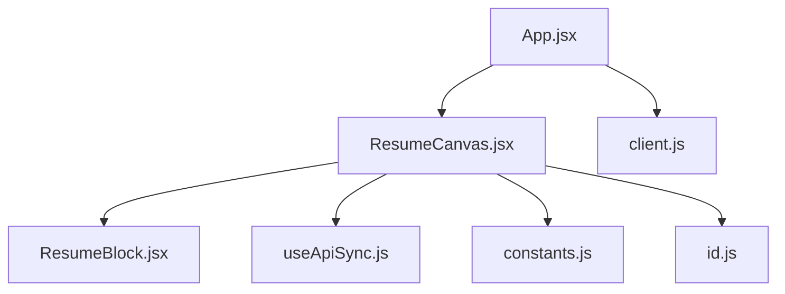
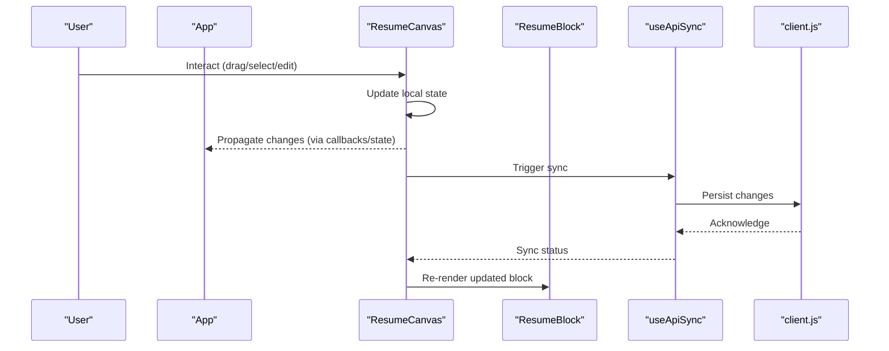
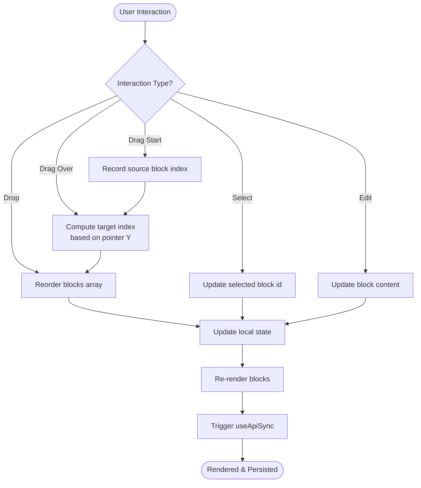
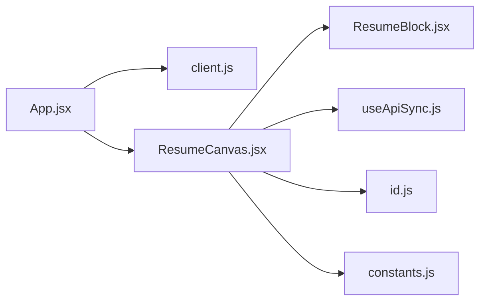

# Core Components

<cite>
**Referenced Files in This Document**
- [App.jsx](file://src/App.jsx)
- [ResumeCanvas.jsx](file://src/components/ResumeCanvas/ResumeCanvas.jsx)
- [ResumeBlock.jsx](file://src/components/ResumeCanvas/ResumeBlock.jsx)
- [client.js](file://src/api/client.js)
- [useApiSync.js](file://src/hooks/useApiSync.js)
- [constants.js](file://src/utils/constants.js)
- [id.js](file://src/utils/id.js)
</cite>

## Table of Contents
1. [Introduction](#introduction)
2. [Project Structure](#project-structure)
3. [Core Components](#core-components)
4. [Architecture Overview](#architecture-overview)
5. [Detailed Component Analysis](#detailed-component-analysis)
6. [Dependency Analysis](#dependency-analysis)
7. [Performance Considerations](#performance-considerations)
8. [Troubleshooting Guide](#troubleshooting-guide)
9. [Conclusion](#conclusion)

## Introduction
This document explains the core application components that form the foundation of the resume builder: the App container and the ResumeCanvas editing surface. It focuses on state orchestration, global configuration, component composition, drag-and-drop implementation, block rendering logic, canvas positioning, real-time preview behavior, prop interfaces, event handling patterns, and integration points with the backend API.

## Project Structure
The frontend is organized around a small set of focused modules:
- Application root and layout: src/App.jsx
- Canvas and blocks: src/components/ResumeCanvas/*
- API client: src/api/client.js
- Shared hooks for persistence and sync: src/hooks/*
- Utilities for constants and IDs: src/utils/*

**Diagram sources**
- [App.jsx](file://src/App.jsx)
- [ResumeCanvas.jsx](file://src/components/ResumeCanvas/ResumeCanvas.jsx)
- [ResumeBlock.jsx](file://src/components/ResumeCanvas/ResumeBlock.jsx)
- [client.js](file://src/api/client.js)
- [useApiSync.js](file://src/hooks/useApiSync.js)
- [constants.js](file://src/utils/constants.js)
- [id.js](file://src/utils/id.js)

**Section sources**
- [App.jsx](file://src/App.jsx)
- [ResumeCanvas.jsx](file://src/components/ResumeCanvas/ResumeCanvas.jsx)
- [ResumeBlock.jsx](file://src/components/ResumeCanvas/ResumeBlock.jsx)
- [client.js](file://src/api/client.js)
- [useApiSync.js](file://src/hooks/useApiSync.js)
- [constants.js](file://src/utils/constants.js)
- [id.js](file://src/utils/id.js)

## Core Components
- App: The top-level container responsible for composing the UI, holding global configuration, and coordinating data flow between child components. It typically initializes shared state (e.g., resume content), wires up API synchronization, and provides context or props to children.
- ResumeCanvas: The interactive editing surface where users add, reorder, and edit resume blocks. It manages the list of blocks, handles drag-and-drop interactions, renders each block via ResumeBlock, and coordinates real-time updates and previews.

Key responsibilities:
- State orchestration: Centralized management of resume structure and selected item state.
- Global configuration: Access to theme/layout constants and ID generation utilities.
- Integration points: Calls to the API client for persistence and syncing with the server.

**Section sources**
- [App.jsx](file://src/App.jsx)
- [ResumeCanvas.jsx](file://src/components/ResumeCanvas/ResumeCanvas.jsx)
- [client.js](file://src/api/client.js)
- [constants.js](file://src/utils/constants.js)
- [id.js](file://src/utils/id.js)

## Architecture Overview
The runtime architecture centers on a unidirectional data flow:
- App holds the canonical resume state and passes it down to ResumeCanvas.
- ResumeCanvas orchestrates user interactions (drag-and-drop, selection, edits).
- ResumeBlock renders individual sections and exposes editable fields.
- useApiSync and client.js coordinate persistence and server communication.

**Diagram sources**
- [App.jsx](file://src/App.jsx)
- [ResumeCanvas.jsx](file://src/components/ResumeCanvas/ResumeCanvas.jsx)
- [ResumeBlock.jsx](file://src/components/ResumeCanvas/ResumeBlock.jsx)
- [useApiSync.js](file://src/hooks/useApiSync.js)
- [client.js](file://src/api/client.js)

## Detailed Component Analysis

### App Component
Role:
- Main application container and orchestrator of global state.
- Provides configuration and composed UI to children.
- Wires up API synchronization and ensures consistent state across the app.

Responsibilities:
- Initialize and maintain global resume state.
- Compose child components (including ResumeCanvas).
- Provide access to shared utilities (constants, ID generator) and API client.
- Manage lifecycle events such as initial load and cleanup.

Integration points:
- Uses the API client to fetch and persist resume data.
- May integrate with hooks for persistence and export features.

Prop interfaces:
- Typically receives minimal props from the entry point and configures internal state.

Event handling patterns:
- Exposes callback handlers to children for state mutations.
- Coordinates side effects through hooks and API calls.

**Section sources**
- [App.jsx](file://src/App.jsx)
- [client.js](file://src/api/client.js)

### ResumeCanvas Component
Role:
- Interactive editing surface for the resume.
- Manages the ordered list of blocks and selection state.
- Implements drag-and-drop reordering and real-time preview updates.

Responsibilities:
- Maintain the blocks array and active selection.
- Handle drag-and-drop events to reorder blocks.
- Render each block using ResumeBlock with appropriate props.
- Coordinate with useApiSync for persistence and with client.js for API calls.
- Provide real-time preview by updating the DOM efficiently.

Drag-and-drop implementation:
- Listens to drag start, drag over, and drop events on the canvas.
- Computes new order based on pointer position and target block boundaries.
- Updates the blocks array immutably and triggers re-render.

Block rendering logic:
- Maps the blocks array to ResumeBlock instances.
- Passes per-block props including id, type, content, and handlers.
- Applies styling and layout based on constants.

Canvas positioning system:
- Uses CSS-based positioning within a constrained viewport.
- Ensures blocks are laid out vertically with consistent spacing.
- Supports responsive adjustments via constants and media queries.

Real-time preview functionality:
- Immediately reflects user edits in the canvas without requiring save.
- Debounces or batches updates when necessary to avoid excessive re-renders.
- Integrates with print styles for accurate print preview.

Prop interfaces:
- Blocks: Ordered list of block objects.
- Selection: Currently selected block identifier.
- Handlers: Callbacks for adding, removing, moving, and editing blocks.
- Configuration: Layout constants and theme settings.

Event handling patterns:
- Drag-and-drop: onDragStart, onDragOver, onDrop.
- Selection: onClick to focus a block.
- Editing: onChange handlers forwarded to ResumeBlock.

Integration points:
- useApiSync: Triggers persistence after meaningful changes.
- client.js: Performs HTTP requests for saving/resuming resume data.
- constants.js: Supplies layout and style values.
- id.js: Generates unique identifiers for new blocks.

**Diagram sources**
- [ResumeCanvas.jsx](file://src/components/ResumeCanvas/ResumeCanvas.jsx)
- [useApiSync.js](file://src/hooks/useApiSync.js)
- [client.js](file://src/api/client.js)
- [constants.js](file://src/utils/constants.js)
- [id.js](file://src/utils/id.js)

**Section sources**
- [ResumeCanvas.jsx](file://src/components/ResumeCanvas/ResumeCanvas.jsx)
- [ResumeBlock.jsx](file://src/components/ResumeCanvas/ResumeBlock.jsx)
- [useApiSync.js](file://src/hooks/useApiSync.js)
- [client.js](file://src/api/client.js)
- [constants.js](file://src/utils/constants.js)
- [id.js](file://src/utils/id.js)

### ResumeBlock Component
Role:
- Renders an individual resume section with editable fields.
- Responds to selection and editing events from the canvas.

Responsibilities:
- Display content based on block type and data.
- Forward change events to parent for state updates.
- Apply visual feedback for selection and hover states.

Integration points:
- Receives props from ResumeCanvas including id, type, content, and handlers.
- Uses constants for layout and styling.

**Section sources**
- [ResumeBlock.jsx](file://src/components/ResumeCanvas/ResumeBlock.jsx)
- [ResumeCanvas.jsx](file://src/components/ResumeCanvas/ResumeCanvas.jsx)
- [constants.js](file://src/utils/constants.js)

## Dependency Analysis
High-level dependencies among core components and utilities:

**Diagram sources**
- [App.jsx](file://src/App.jsx)
- [ResumeCanvas.jsx](file://src/components/ResumeCanvas/ResumeCanvas.jsx)
- [ResumeBlock.jsx](file://src/components/ResumeCanvas/ResumeBlock.jsx)
- [client.js](file://src/api/client.js)
- [useApiSync.js](file://src/hooks/useApiSync.js)
- [constants.js](file://src/utils/constants.js)
- [id.js](file://src/utils/id.js)

**Section sources**
- [App.jsx](file://src/App.jsx)
- [ResumeCanvas.jsx](file://src/components/ResumeCanvas/ResumeCanvas.jsx)
- [ResumeBlock.jsx](file://src/components/ResumeCanvas/ResumeBlock.jsx)
- [client.js](file://src/api/client.js)
- [useApiSync.js](file://src/hooks/useApiSync.js)
- [constants.js](file://src/utils/constants.js)
- [id.js](file://src/utils/id.js)

## Performance Considerations
- Minimize re-renders by keeping block updates localized and using immutable updates.
- Debounce heavy operations like API calls triggered by frequent edits.
- Avoid unnecessary recalculations during drag-and-drop; compute indices only when needed.
- Leverage stable keys for block lists to optimize diffing.
- Use CSS transforms for smooth dragging visuals where applicable.

## Troubleshooting Guide
Common issues and resolutions:
- Drag-and-drop not reordering: Verify drag event handlers are attached and that the computed target index respects block boundaries.
- Edits not persisting: Ensure useApiSync is invoked after state updates and that client.js endpoints return success acknowledgments.
- Duplicate block IDs: Confirm id.js generates unique identifiers and that new blocks receive fresh IDs.
- Layout misalignment: Check constants for correct spacing and verify CSS classes applied by ResumeCanvas and ResumeBlock.

**Section sources**
- [ResumeCanvas.jsx](file://src/components/ResumeCanvas/ResumeCanvas.jsx)
- [useApiSync.js](file://src/hooks/useApiSync.js)
- [client.js](file://src/api/client.js)
- [id.js](file://src/utils/id.js)
- [constants.js](file://src/utils/constants.js)

## Conclusion
The App component serves as the central orchestrator for global state and configuration, while ResumeCanvas provides the interactive editing experience with robust drag-and-drop, block rendering, and real-time preview. Together with ResumeBlock, useApiSync, client.js, constants, and id utilities, these components form a cohesive, maintainable foundation for the resume builder. Following the documented prop interfaces, event patterns, and integration points will ensure consistent behavior and reliable persistence across the application.