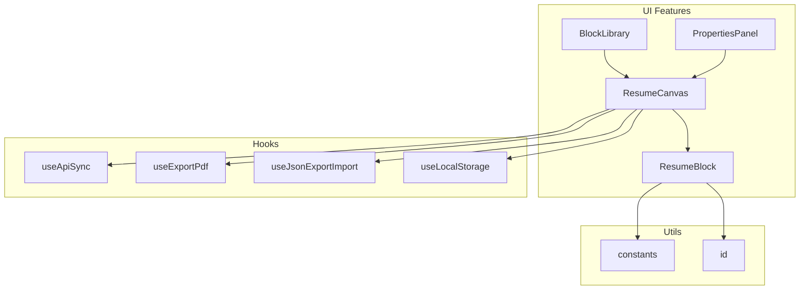
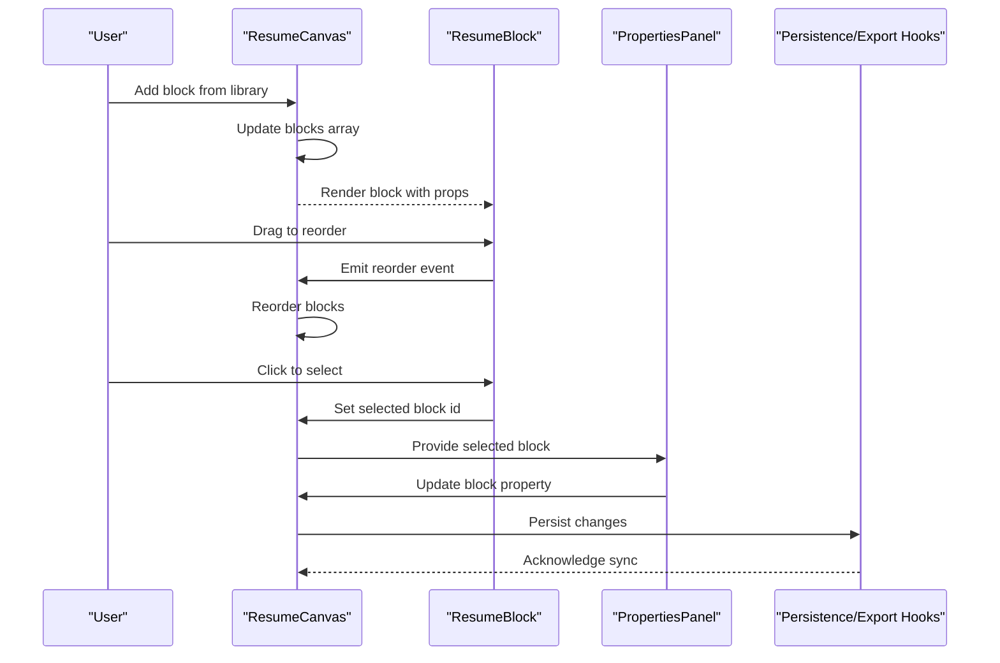
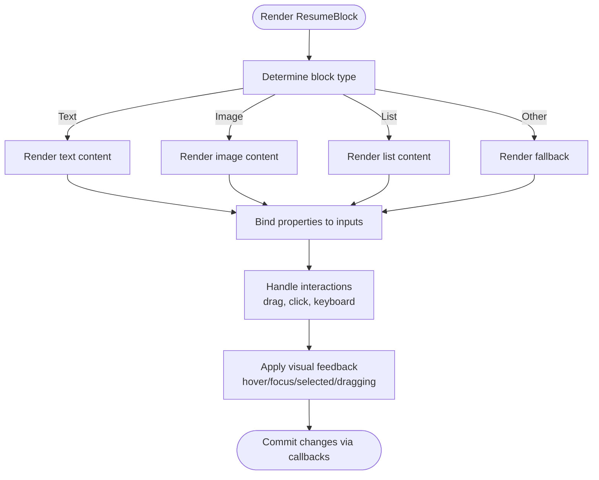
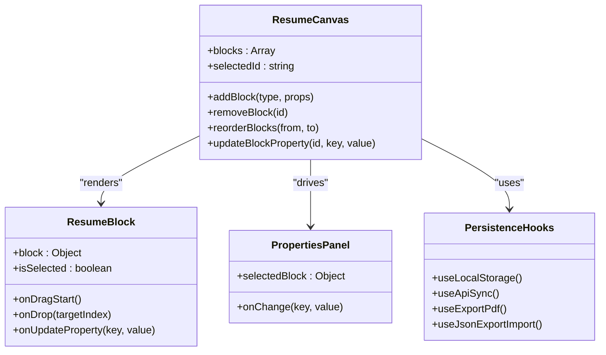
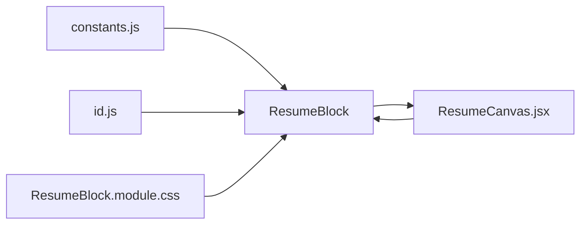

# Specialized Components

<cite>
**Referenced Files in This Document**
- [ResumeBlock.jsx](file://src/components/ResumeCanvas/ResumeBlock.jsx)
- [ResumeBlock.module.css](file://src/components/ResumeCanvas/ResumeBlock.module.css)
- [ResumeCanvas.jsx](file://src/components/ResumeCanvas/ResumeCanvas.jsx)
- [ResumeCanvas.module.css](file://src/components/ResumeCanvas/ResumeCanvas.module.css)
- [BlockLibrary.jsx](file://src/components/BlockLibrary/BlockLibrary.jsx)
- [BlockLibrary.module.css](file://src/components/BlockLibrary/BlockLibrary.module.css)
- [PropertiesPanel.jsx](file://src/components/PropertiesPanel/PropertiesPanel.jsx)
- [PropertiesPanel.module.css](file://src/components/PropertiesPanel/PropertiesPanel.module.css)
- [useApiSync.js](file://src/hooks/useApiSync.js)
- [useExportPdf.js](file://src/hooks/useExportPdf.js)
- [useJsonExportImport.js](file://src/hooks/useJsonExportImport.js)
- [useLocalStorage.js](file://src/hooks/useLocalStorage.js)
- [constants.js](file://src/utils/constants.js)
- [id.js](file://src/utils/id.js)
- [App.jsx](file://src/App.jsx)
- [main.jsx](file://src/main.jsx)
</cite>

## Table of Contents
1. [Introduction](#introduction)
2. [Project Structure](#project-structure)
3. [Core Components](#core-components)
4. [Architecture Overview](#architecture-overview)
5. [Detailed Component Analysis](#detailed-component-analysis)
6. [Dependency Analysis](#dependency-analysis)
7. [Performance Considerations](#performance-considerations)
8. [Troubleshooting Guide](#troubleshooting-guide)
9. [Conclusion](#conclusion)
10. [Appendices](#appendices)

## Introduction
This document focuses on specialized components that implement complex business logic and interactions within the resume builder, with a deep dive into the ResumeBlock component. It explains how individual resume blocks are rendered inside the canvas, how drag-and-drop behavior is integrated, how block-specific rendering and property binding work, and how visual feedback is provided during user interactions. It also covers lifecycle considerations, performance optimizations for large resumes, memory management strategies, customization patterns, handling different content types, extending functionality, and addressing common issues such as re-rendering optimization and event propagation.

## Project Structure
The project follows a feature-based organization under src/components, with shared hooks under src/hooks and utilities under src/utils. The ResumeBlock component lives within the ResumeCanvas feature and interacts with the BlockLibrary and PropertiesPanel to support adding, editing, and persisting blocks.

**Diagram sources**
- [ResumeCanvas.jsx](file://src/components/ResumeCanvas/ResumeCanvas.jsx)
- [ResumeBlock.jsx](file://src/components/ResumeCanvas/ResumeBlock.jsx)
- [BlockLibrary.jsx](file://src/components/BlockLibrary/BlockLibrary.jsx)
- [PropertiesPanel.jsx](file://src/components/PropertiesPanel/PropertiesPanel.jsx)
- [useApiSync.js](file://src/hooks/useApiSync.js)
- [useExportPdf.js](file://src/hooks/useExportPdf.js)
- [useJsonExportImport.js](file://src/hooks/useJsonExportImport.js)
- [useLocalStorage.js](file://src/hooks/useLocalStorage.js)
- [constants.js](file://src/utils/constants.js)
- [id.js](file://src/utils/id.js)

**Section sources**
- [ResumeCanvas.jsx](file://src/components/ResumeCanvas/ResumeCanvas.jsx)
- [ResumeBlock.jsx](file://src/components/ResumeCanvas/ResumeBlock.jsx)
- [BlockLibrary.jsx](file://src/components/BlockLibrary/BlockLibrary.jsx)
- [PropertiesPanel.jsx](file://src/components/PropertiesPanel/PropertiesPanel.jsx)
- [useApiSync.js](file://src/hooks/useApiSync.js)
- [useExportPdf.js](file://src/hooks/useExportPdf.js)
- [useJsonExportImport.js](file://src/hooks/useJsonExportImport.js)
- [useLocalStorage.js](file://src/hooks/useLocalStorage.js)
- [constants.js](file://src/utils/constants.js)
- [id.js](file://src/utils/id.js)

## Core Components
- ResumeBlock: Renders an individual block within the canvas, handles block-specific display, binds properties, and participates in drag-and-drop operations. It applies visual feedback (e.g., hover, focus, selected states) and delegates persistence and synchronization via hooks.
- ResumeCanvas: Orchestrates the list of blocks, manages selection state, coordinates drag-and-drop across blocks, and integrates with persistence and export hooks.
- BlockLibrary: Provides draggable items to add new blocks to the canvas.
- PropertiesPanel: Displays and edits properties of the currently selected block, updating the underlying data model.

Key responsibilities:
- Rendering: Conditional rendering based on block type and properties.
- Interaction: Drag-and-drop integration, selection, keyboard navigation, and accessibility.
- State: Local UI state vs. global state; memoization to avoid unnecessary re-renders.
- Persistence: Syncing changes to local storage and API using hooks.

**Section sources**
- [ResumeBlock.jsx](file://src/components/ResumeCanvas/ResumeBlock.jsx)
- [ResumeCanvas.jsx](file://src/components/ResumeCanvas/ResumeCanvas.jsx)
- [BlockLibrary.jsx](file://src/components/BlockLibrary/BlockLibrary.jsx)
- [PropertiesPanel.jsx](file://src/components/PropertiesPanel/PropertiesPanel.jsx)

## Architecture Overview
The system centers around a unidirectional data flow:
- User interactions update local or global state.
- ResumeCanvas holds the authoritative list of blocks and selection.
- ResumeBlock renders a single block and emits events for updates.
- PropertiesPanel reads/writes selected block properties.
- Hooks handle side effects like syncing to storage and exporting.

**Diagram sources**
- [ResumeCanvas.jsx](file://src/components/ResumeCanvas/ResumeCanvas.jsx)
- [ResumeBlock.jsx](file://src/components/ResumeCanvas/ResumeBlock.jsx)
- [PropertiesPanel.jsx](file://src/components/PropertiesPanel/PropertiesPanel.jsx)
- [useApiSync.js](file://src/hooks/useApiSync.js)
- [useExportPdf.js](file://src/hooks/useExportPdf.js)
- [useJsonExportImport.js](file://src/hooks/useJsonExportImport.js)
- [useLocalStorage.js](file://src/hooks/useLocalStorage.js)

## Detailed Component Analysis

### ResumeBlock Component
ResumeBlock is responsible for rendering a single block and managing its interactive behaviors. It receives block metadata and properties via props, renders content conditionally by block type, and participates in drag-and-drop operations orchestrated by the parent canvas.

Key aspects:
- Rendering logic: Branches on block type to render appropriate content.
- Property binding: Two-way binding through callbacks to update the selected block’s properties.
- Visual feedback: Applies CSS classes for hover, focus, selected, and dragging states.
- Accessibility: Supports keyboard navigation and screen reader labels.
- Event handling: Delegates drag start/move/end to the parent canvas and emits change events for property updates.

Lifecycle highlights:
- Mount: Initialize any local UI state needed for interaction (e.g., edit mode).
- Update: React to prop changes (block data, selection state) and adjust visuals accordingly.
- Unmount: Clean up listeners or temporary references if necessary.

Performance considerations:
- Memoize expensive computations derived from block properties.
- Avoid creating new objects/functions per render; pass stable references.
- Use CSS modules for scoped styles to minimize layout thrashing.

Customization and extension:
- Extend appearance by overriding CSS variables or class names.
- Support new block types by adding a branch in the renderer and registering it in constants.
- Integrate custom editors via the properties panel interface.

Common pitfalls:
- Re-render loops caused by unstable callback references.
- Event propagation conflicts when nested interactive elements exist.
- Memory leaks from missing cleanup of event listeners or timers.

**Diagram sources**
- [ResumeBlock.jsx](file://src/components/ResumeCanvas/ResumeBlock.jsx)
- [ResumeBlock.module.css](file://src/components/ResumeCanvas/ResumeBlock.module.css)
- [constants.js](file://src/utils/constants.js)

**Section sources**
- [ResumeBlock.jsx](file://src/components/ResumeCanvas/ResumeBlock.jsx)
- [ResumeBlock.module.css](file://src/components/ResumeCanvas/ResumeBlock.module.css)
- [constants.js](file://src/utils/constants.js)

### ResumeCanvas Integration
ResumeCanvas manages the collection of blocks, selection, and drag-and-drop orchestration. It provides:
- Block ordering and insertion/removal.
- Selection state to drive PropertiesPanel updates.
- Drag-and-drop handlers that coordinate between blocks and the library.
- Integration with persistence hooks to save changes.

Integration points:
- Uses useLocalStorage for client-side persistence.
- Uses useApiSync for server synchronization.
- Uses useExportPdf and useJsonExportImport for export/import workflows.

**Diagram sources**
- [ResumeCanvas.jsx](file://src/components/ResumeCanvas/ResumeCanvas.jsx)
- [ResumeBlock.jsx](file://src/components/ResumeCanvas/ResumeBlock.jsx)
- [PropertiesPanel.jsx](file://src/components/PropertiesPanel/PropertiesPanel.jsx)
- [useApiSync.js](file://src/hooks/useApiSync.js)
- [useExportPdf.js](file://src/hooks/useExportPdf.js)
- [useJsonExportImport.js](file://src/hooks/useJsonExportImport.js)
- [useLocalStorage.js](file://src/hooks/useLocalStorage.js)

**Section sources**
- [ResumeCanvas.jsx](file://src/components/ResumeCanvas/ResumeCanvas.jsx)
- [ResumeBlock.jsx](file://src/components/ResumeCanvas/ResumeBlock.jsx)
- [PropertiesPanel.jsx](file://src/components/PropertiesPanel/PropertiesPanel.jsx)
- [useApiSync.js](file://src/hooks/useApiSync.js)
- [useExportPdf.js](file://src/hooks/useExportPdf.js)
- [useJsonExportImport.js](file://src/hooks/useJsonExportImport.js)
- [useLocalStorage.js](file://src/hooks/useLocalStorage.js)

### BlockLibrary and PropertiesPanel
- BlockLibrary: Presents available block types and initiates drag-to-add flows into the canvas.
- PropertiesPanel: Reads the selected block and exposes editable fields; writes back changes through callbacks to the canvas.

These components collaborate with ResumeCanvas to maintain a consistent data model and provide intuitive UX for building resumes.

**Section sources**
- [BlockLibrary.jsx](file://src/components/BlockLibrary/BlockLibrary.jsx)
- [BlockLibrary.module.css](file://src/components/BlockLibrary/BlockLibrary.module.css)
- [PropertiesPanel.jsx](file://src/components/PropertiesPanel/PropertiesPanel.jsx)
- [PropertiesPanel.module.css](file://src/components/PropertiesPanel/PropertiesPanel.module.css)

## Dependency Analysis
ResumeBlock depends on:
- Constants for block type definitions and default properties.
- Utility functions for generating unique IDs and formatting values.
- CSS modules for styling and visual feedback.

It communicates with ResumeCanvas via callbacks for:
- Updating properties.
- Handling drag-and-drop events.
- Reporting selection changes.

**Diagram sources**
- [ResumeBlock.jsx](file://src/components/ResumeCanvas/ResumeBlock.jsx)
- [ResumeCanvas.jsx](file://src/components/ResumeCanvas/ResumeCanvas.jsx)
- [constants.js](file://src/utils/constants.js)
- [id.js](file://src/utils/id.js)
- [ResumeBlock.module.css](file://src/components/ResumeCanvas/ResumeBlock.module.css)

**Section sources**
- [ResumeBlock.jsx](file://src/components/ResumeCanvas/ResumeBlock.jsx)
- [ResumeCanvas.jsx](file://src/components/ResumeCanvas/ResumeCanvas.jsx)
- [constants.js](file://src/utils/constants.js)
- [id.js](file://src/utils/id.js)
- [ResumeBlock.module.css](file://src/components/ResumeCanvas/ResumeBlock.module.css)

## Performance Considerations
- Memoization: Wrap expensive computations and derived values with memoization to prevent unnecessary recalculations.
- Stable references: Ensure callbacks and configuration objects passed to ResumeBlock are stable to avoid re-renders.
- Virtualization: For very large resumes, consider virtualizing the block list to render only visible blocks.
- Batched updates: Group multiple property updates to reduce re-renders.
- CSS containment: Use CSS containment where appropriate to isolate layout and paint costs.
- Image optimization: Lazy-load images and cache thumbnails to improve perceived performance.

[No sources needed since this section provides general guidance]

## Troubleshooting Guide
Common issues and resolutions:
- Excessive re-renders:
  - Verify that props passed to ResumeBlock are stable and not recreated each render.
  - Check for inline object/function creation in parent components.
- Drag-and-drop conflicts:
  - Ensure pointer events do not bubble unexpectedly; stop propagation at the correct level.
  - Confirm that drop targets are correctly computed relative to the canvas container.
- Event propagation problems:
  - Use explicit event.stopPropagation() only where necessary to avoid breaking parent handlers.
  - Validate keyboard navigation order and focus management.
- Memory leaks:
  - Remove event listeners and cancel timers on unmount.
  - Avoid retaining large DOM references in closures.
- Styling anomalies:
  - Inspect CSS module scoping and ensure no conflicting global styles.
  - Validate that dynamic class names reflect current interaction states.

**Section sources**
- [ResumeBlock.jsx](file://src/components/ResumeCanvas/ResumeBlock.jsx)
- [ResumeCanvas.jsx](file://src/components/ResumeCanvas/ResumeCanvas.jsx)
- [ResumeBlock.module.css](file://src/components/ResumeCanvas/ResumeBlock.module.css)
- [ResumeCanvas.module.css](file://src/components/ResumeCanvas/ResumeCanvas.module.css)

## Conclusion
ResumeBlock is a focused, extensible component that renders individual resume blocks with robust interaction support. By combining clear separation of concerns, stable prop interfaces, and careful performance practices, it scales well even for large resumes. Integrating with the canvas, properties panel, and persistence hooks ensures a cohesive user experience while maintaining modularity and testability.

[No sources needed since this section summarizes without analyzing specific files]

## Appendices

### Customization Examples
- Change block appearance:
  - Override CSS variables or extend class names defined in the block’s stylesheet.
  - Adjust spacing, borders, and typography via CSS modules.
- Handle different content types:
  - Add a new branch in the renderer to support additional block types.
  - Register defaults and validation rules in constants.
- Extend functionality:
  - Implement custom editors in the properties panel for advanced block options.
  - Integrate third-party libraries via refs and effect hooks, ensuring proper cleanup.

**Section sources**
- [ResumeBlock.jsx](file://src/components/ResumeCanvas/ResumeBlock.jsx)
- [ResumeBlock.module.css](file://src/components/ResumeCanvas/ResumeBlock.module.css)
- [constants.js](file://src/utils/constants.js)

### Entry Points and App Wiring
The application bootstraps in main.jsx and wires features in App.jsx, including providers for context and hooks used by ResumeCanvas and related components.

**Section sources**
- [main.jsx](file://src/main.jsx)
- [App.jsx](file://src/App.jsx)