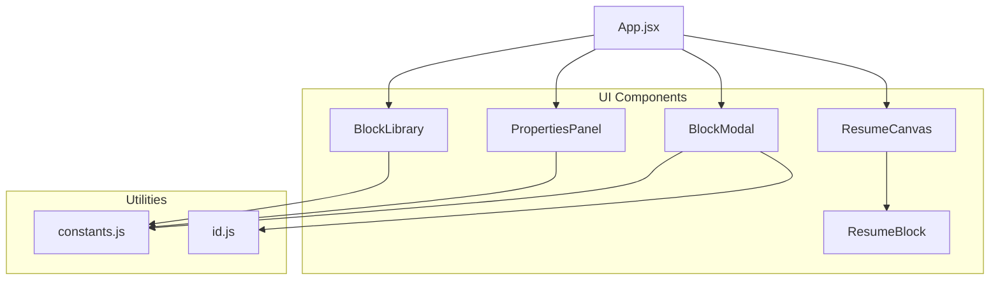
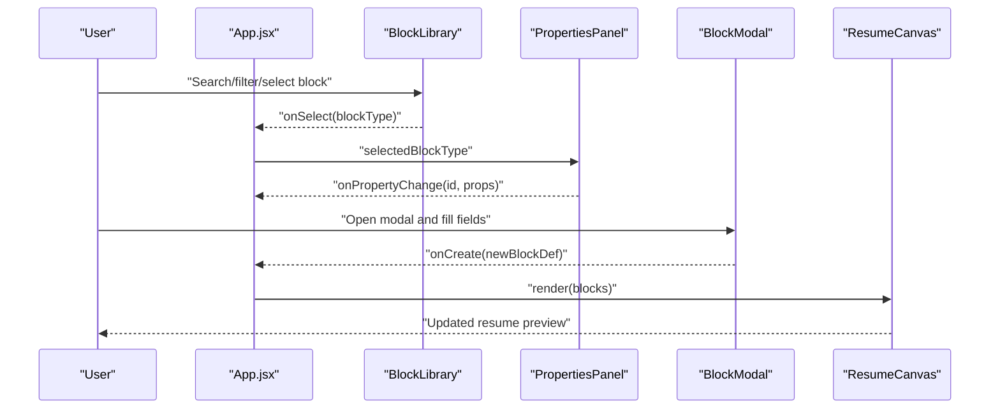
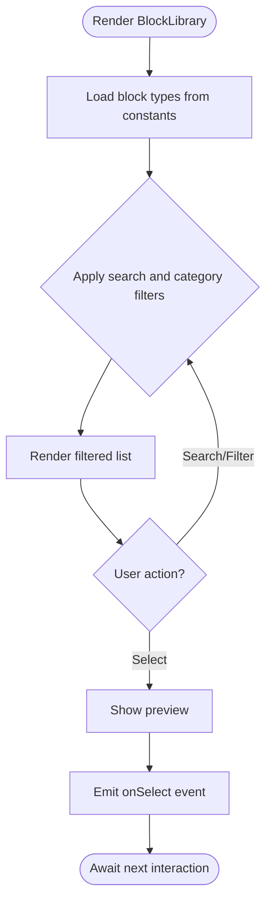
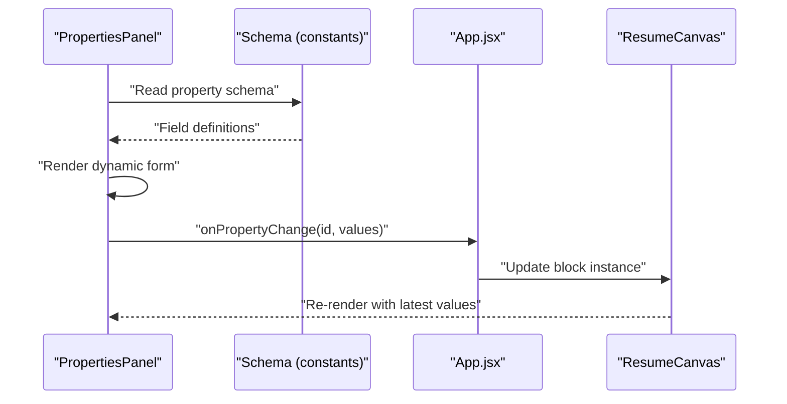
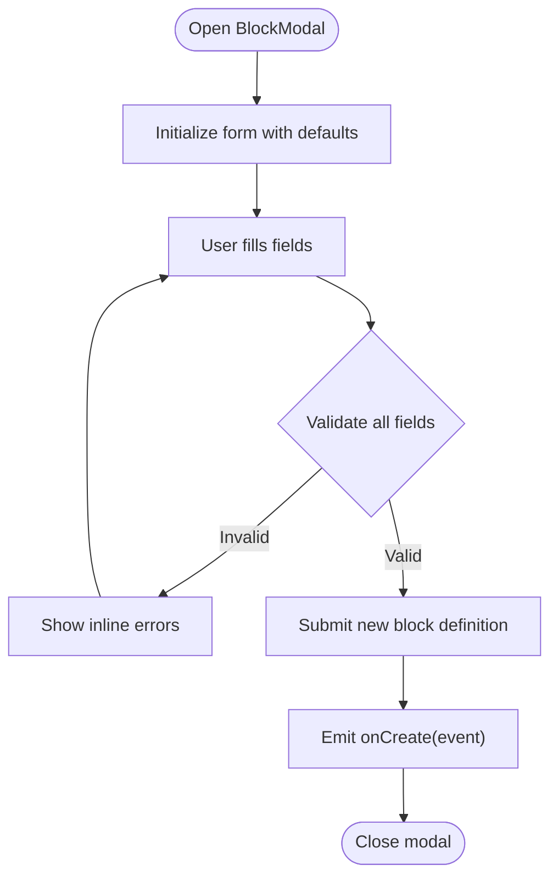
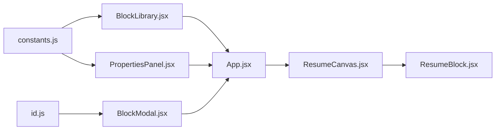

# UI Components

<cite>
**Referenced Files in This Document**
- [BlockLibrary.jsx](file://src/components/BlockLibrary/BlockLibrary.jsx)
- [BlockLibrary.module.css](file://src/components/BlockLibrary/BlockLibrary.module.css)
- [PropertiesPanel.jsx](file://src/components/PropertiesPanel/PropertiesPanel.jsx)
- [PropertiesPanel.module.css](file://src/components/PropertiesPanel/PropertiesPanel.module.css)
- [BlockModal.jsx](file://src/components/BlockModal/BlockModal.jsx)
- [BlockModal.module.css](file://src/components/BlockModal/BlockModal.module.css)
- [ResumeCanvas.jsx](file://src/components/ResumeCanvas/ResumeCanvas.jsx)
- [ResumeCanvas.module.css](file://src/components/ResumeCanvas/ResumeCanvas.module.css)
- [ResumeBlock.jsx](file://src/components/ResumeCanvas/ResumeBlock.jsx)
- [ResumeBlock.module.css](file://src/components/ResumeCanvas/ResumeBlock.module.css)
- [App.jsx](file://src/App.jsx)
- [constants.js](file://src/utils/constants.js)
- [id.js](file://src/utils/id.js)
</cite>

## Table of Contents
1. [Introduction](#introduction)
2. [Project Structure](#project-structure)
3. [Core Components](#core-components)
4. [Architecture Overview](#architecture-overview)
5. [Detailed Component Analysis](#detailed-component-analysis)
6. [Dependency Analysis](#dependency-analysis)
7. [Performance Considerations](#performance-considerations)
8. [Troubleshooting Guide](#troubleshooting-guide)
9. [Conclusion](#conclusion)

## Introduction
This document describes the user interface components that power the interactive resume builder. It focuses on:
- BlockLibrary for browsing and selecting block types, including filtering and search, with preview capabilities.
- PropertiesPanel for dynamic property editing based on the selected block type, including form generation, validation, and real-time updates.
- BlockModal for creating new blocks through guided dialogs, including form handling and data validation.
It also covers styling approaches using CSS modules, responsive design patterns, accessibility considerations, and user interaction flows.

## Project Structure
The UI is organized by feature folders under src/components. Each component has a corresponding CSS module for scoped styles. Utilities provide shared constants and ID generation. The application root wires these components together.

**Diagram sources**
- [App.jsx](file://src/App.jsx)
- [BlockLibrary.jsx](file://src/components/BlockLibrary/BlockLibrary.jsx)
- [PropertiesPanel.jsx](file://src/components/PropertiesPanel/PropertiesPanel.jsx)
- [BlockModal.jsx](file://src/components/BlockModal/BlockModal.jsx)
- [ResumeCanvas.jsx](file://src/components/ResumeCanvas/ResumeCanvas.jsx)
- [ResumeBlock.jsx](file://src/components/ResumeCanvas/ResumeBlock.jsx)
- [constants.js](file://src/utils/constants.js)
- [id.js](file://src/utils/id.js)

**Section sources**
- [App.jsx](file://src/App.jsx)
- [BlockLibrary.jsx](file://src/components/BlockLibrary/BlockLibrary.jsx)
- [PropertiesPanel.jsx](file://src/components/PropertiesPanel/PropertiesPanel.jsx)
- [BlockModal.jsx](file://src/components/BlockModal/BlockModal.jsx)
- [ResumeCanvas.jsx](file://src/components/ResumeCanvas/ResumeCanvas.jsx)
- [ResumeBlock.jsx](file://src/components/ResumeCanvas/ResumeBlock.jsx)
- [constants.js](file://src/utils/constants.js)
- [id.js](file://src/utils/id.js)

## Core Components
- BlockLibrary: Presents available block types with search and filter controls, and previews when a block is selected or hovered.
- PropertiesPanel: Renders a dynamic form tailored to the currently selected block’s schema, validates inputs, and pushes changes back to the canvas state.
- BlockModal: Provides a guided dialog to create new blocks, including field definitions and validation rules, then persists the new block definition.

These components are styled via CSS modules, use responsive layouts, and follow accessibility best practices such as keyboard navigation and ARIA attributes.

**Section sources**
- [BlockLibrary.jsx](file://src/components/BlockLibrary/BlockLibrary.jsx)
- [BlockLibrary.module.css](file://src/components/BlockLibrary/BlockLibrary.module.css)
- [PropertiesPanel.jsx](file://src/components/PropertiesPanel/PropertiesPanel.jsx)
- [PropertiesPanel.module.css](file://src/components/PropertiesPanel/PropertiesPanel.module.css)
- [BlockModal.jsx](file://src/components/BlockModal/BlockModal.jsx)
- [BlockModal.module.css](file://src/components/BlockModal/BlockModal.module.css)

## Architecture Overview
The UI follows a unidirectional data flow pattern:
- App holds global state (blocks, selection).
- BlockLibrary emits selection events and optional creation requests.
- PropertiesPanel reacts to selection and updates properties in place.
- BlockModal creates new block definitions and returns them to App.
- ResumeCanvas renders the current set of blocks; ResumeBlock renders individual blocks.

**Diagram sources**
- [App.jsx](file://src/App.jsx)
- [BlockLibrary.jsx](file://src/components/BlockLibrary/BlockLibrary.jsx)
- [PropertiesPanel.jsx](file://src/components/PropertiesPanel/PropertiesPanel.jsx)
- [BlockModal.jsx](file://src/components/BlockModal/BlockModal.jsx)
- [ResumeCanvas.jsx](file://src/components/ResumeCanvas/ResumeCanvas.jsx)

## Detailed Component Analysis

### BlockLibrary
Responsibilities:
- Display available block types from shared constants.
- Filter and search by name or category.
- Show a preview of the selected block type.
- Emit selection events to the parent.

Key behaviors:
- Search input filters the list in real time.
- Category chips or dropdown refine results.
- Selected item highlights and shows a preview panel.
- Clicking a block triggers selection callback.

Styling and responsiveness:
- Uses CSS modules for scoped styles.
- Grid layout adapts to screen size; preview area reflows on small screens.

Accessibility:
- Keyboard navigable list with focus indicators.
- ARIA roles for listbox/listitem and live regions for filtered count.

**Diagram sources**
- [BlockLibrary.jsx](file://src/components/BlockLibrary/BlockLibrary.jsx)
- [constants.js](file://src/utils/constants.js)

**Section sources**
- [BlockLibrary.jsx](file://src/components/BlockLibrary/BlockLibrary.jsx)
- [BlockLibrary.module.css](file://src/components/BlockLibrary/BlockLibrary.module.css)
- [constants.js](file://src/utils/constants.js)

### PropertiesPanel
Responsibilities:
- Generate a form dynamically based on the selected block’s property schema.
- Validate inputs and display errors inline.
- Push real-time updates to the parent state.

Key behaviors:
- Reads schema from shared constants or resolved block metadata.
- Maps schema fields to appropriate input widgets (text, number, select, etc.).
- Debounced or immediate updates depending on field type.
- Supports undo-friendly incremental updates.

Styling and responsiveness:
- CSS modules for consistent spacing and typography.
- Stacked layout on narrow viewports; two-column on wider screens.

Accessibility:
- Labels associated with inputs.
- Error messages announced via ARIA attributes.
- Focus management on invalid submissions.

**Diagram sources**
- [PropertiesPanel.jsx](file://src/components/PropertiesPanel/PropertiesPanel.jsx)
- [constants.js](file://src/utils/constants.js)
- [App.jsx](file://src/App.jsx)
- [ResumeCanvas.jsx](file://src/components/ResumeCanvas/ResumeCanvas.jsx)

**Section sources**
- [PropertiesPanel.jsx](file://src/components/PropertiesPanel/PropertiesPanel.jsx)
- [PropertiesPanel.module.css](file://src/components/PropertiesPanel/PropertiesPanel.module.css)
- [constants.js](file://src/utils/constants.js)

### BlockModal
Responsibilities:
- Provide a guided dialog to define a new block.
- Collect required metadata (name, category, icon, default properties).
- Validate inputs before submission.
- Return the new block definition to the parent.

Key behaviors:
- Modal open/close controlled by parent.
- Step-by-step or single-form approach depending on complexity.
- Validation feedback and disabled submit until valid.
- On success, emits an event with the new block definition.

Styling and responsiveness:
- CSS modules for modal overlay, card layout, and button states.
- Centered modal with scrollable content on small screens.

Accessibility:
- Focus trapped within modal while open.
- Escape key closes modal.
- Descriptive labels and error summaries.

**Diagram sources**
- [BlockModal.jsx](file://src/components/BlockModal/BlockModal.jsx)
- [id.js](file://src/utils/id.js)

**Section sources**
- [BlockModal.jsx](file://src/components/BlockModal/BlockModal.jsx)
- [BlockModal.module.css](file://src/components/BlockModal/BlockModal.module.css)
- [id.js](file://src/utils/id.js)

### ResumeCanvas and ResumeBlock
Responsibilities:
- ResumeCanvas renders the ordered list of blocks and handles drag-and-drop if implemented.
- ResumeBlock renders a single block instance using its properties.

Key behaviors:
- Receives blocks array and selected id from parent.
- Highlights selected block for editing.
- Delegates rendering to specific block renderers based on type.

Styling and responsiveness:
- CSS modules for page layout and block spacing.
- Print-friendly adjustments via separate stylesheet.

**Section sources**
- [ResumeCanvas.jsx](file://src/components/ResumeCanvas/ResumeCanvas.jsx)
- [ResumeCanvas.module.css](file://src/components/ResumeCanvas/ResumeCanvas.module.css)
- [ResumeBlock.jsx](file://src/components/ResumeCanvas/ResumeBlock.jsx)
- [ResumeBlock.module.css](file://src/components/ResumeCanvas/ResumeBlock.module.css)

## Dependency Analysis
Component-level dependencies:
- BlockLibrary depends on shared constants for available block types.
- PropertiesPanel depends on schema definitions to generate forms.
- BlockModal uses utility functions for generating unique IDs and may reference constants for default structures.
- ResumeCanvas composes ResumeBlock instances.

**Diagram sources**
- [constants.js](file://src/utils/constants.js)
- [id.js](file://src/utils/id.js)
- [BlockLibrary.jsx](file://src/components/BlockLibrary/BlockLibrary.jsx)
- [PropertiesPanel.jsx](file://src/components/PropertiesPanel/PropertiesPanel.jsx)
- [BlockModal.jsx](file://src/components/BlockModal/BlockModal.jsx)
- [App.jsx](file://src/App.jsx)
- [ResumeCanvas.jsx](file://src/components/ResumeCanvas/ResumeCanvas.jsx)
- [ResumeBlock.jsx](file://src/components/ResumeCanvas/ResumeBlock.jsx)

**Section sources**
- [constants.js](file://src/utils/constants.js)
- [id.js](file://src/utils/id.js)
- [BlockLibrary.jsx](file://src/components/BlockLibrary/BlockLibrary.jsx)
- [PropertiesPanel.jsx](file://src/components/PropertiesPanel/PropertiesPanel.jsx)
- [BlockModal.jsx](file://src/components/BlockModal/BlockModal.jsx)
- [App.jsx](file://src/App.jsx)
- [ResumeCanvas.jsx](file://src/components/ResumeCanvas/ResumeCanvas.jsx)
- [ResumeBlock.jsx](file://src/components/ResumeCanvas/ResumeBlock.jsx)

## Performance Considerations
- Memoize expensive computations in BlockLibrary (e.g., filtered lists) to avoid unnecessary re-renders.
- Debounce rapid property updates in PropertiesPanel to reduce state churn.
- Use stable keys for block lists to optimize reconciliation.
- Lazy-load heavy block previews if needed.
- Keep CSS modules scoped to minimize style recalculation.

[No sources needed since this section provides general guidance]

## Troubleshooting Guide
Common issues and resolutions:
- Search not updating: Ensure the search handler updates local state and that the filter logic references the correct field names.
- Form not submitting: Verify validation flags and that onSubmit is wired to the parent callback.
- Modal not closing: Confirm escape key handler and close button callbacks are bound.
- Styles not applied: Check CSS module imports and class name usage.
- Accessibility warnings: Add aria-labels, ensure focus management, and associate labels with inputs.

**Section sources**
- [BlockLibrary.jsx](file://src/components/BlockLibrary/BlockLibrary.jsx)
- [PropertiesPanel.jsx](file://src/components/PropertiesPanel/PropertiesPanel.jsx)
- [BlockModal.jsx](file://src/components/BlockModal/BlockModal.jsx)

## Conclusion
The UI components implement a clear separation of concerns: BlockLibrary for discovery, PropertiesPanel for configuration, and BlockModal for creation. They leverage CSS modules for maintainable styling, support responsive layouts, and incorporate accessibility features. The unidirectional data flow ensures predictable behavior and easy debugging.

[No sources needed since this section summarizes without analyzing specific files]