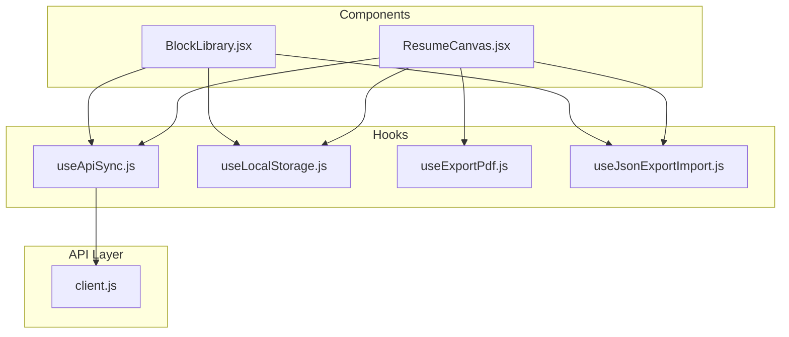
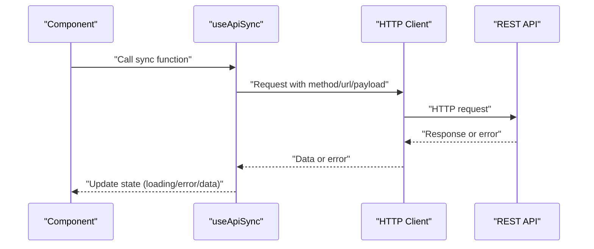
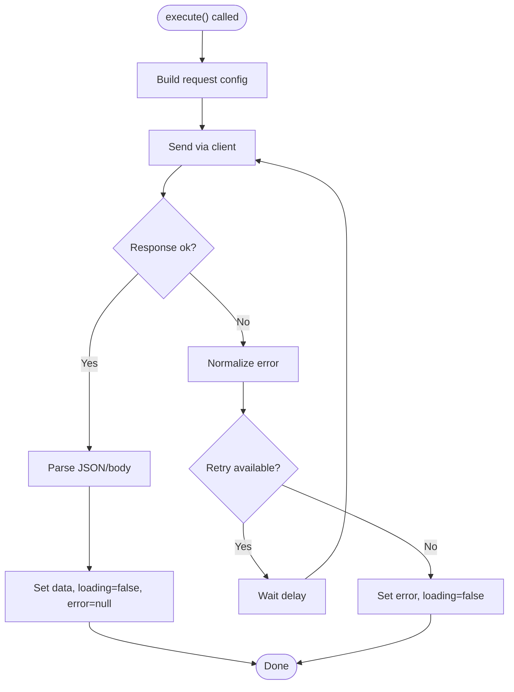
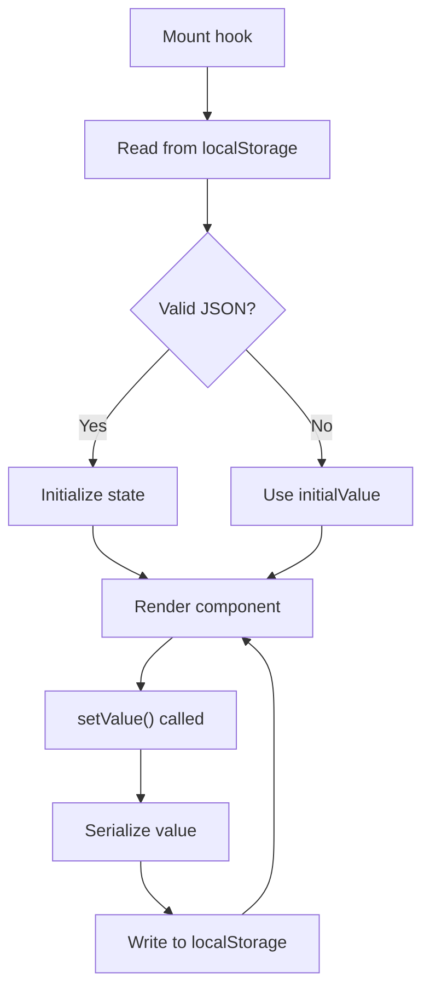
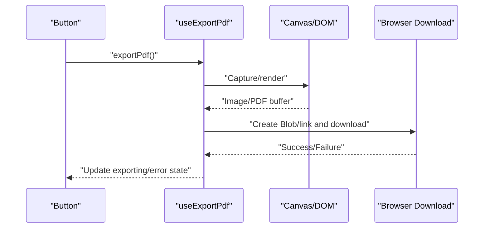
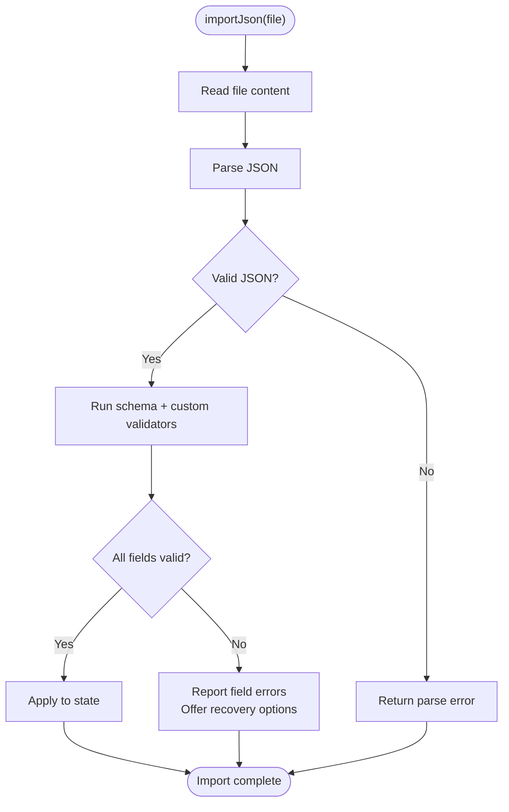
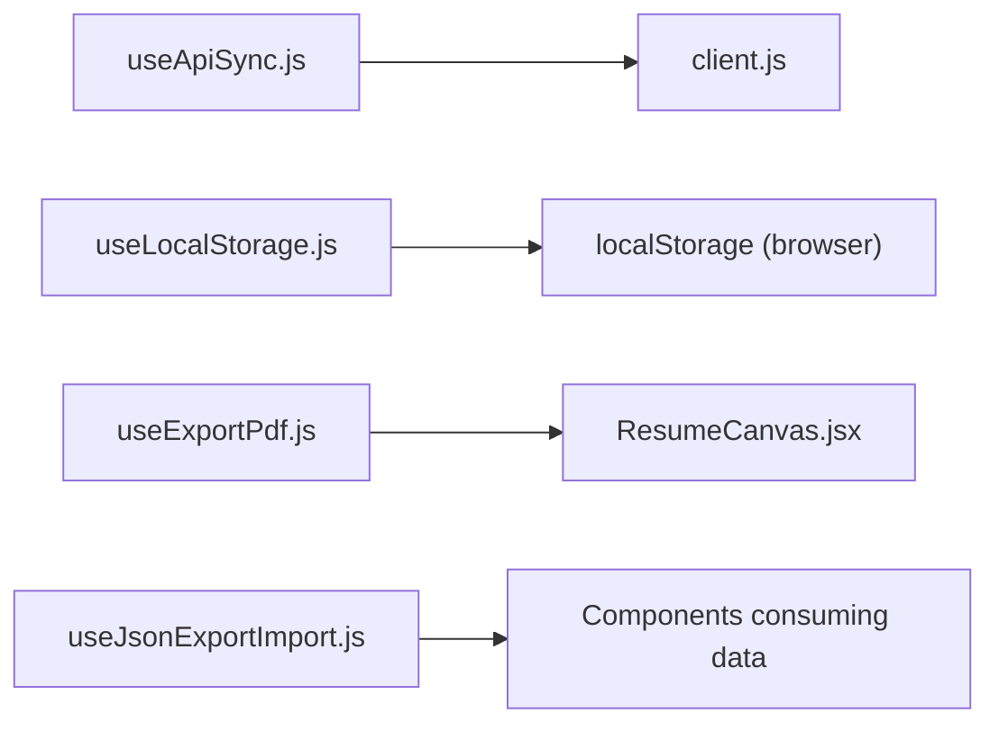

# Custom Hooks

<cite>
**Referenced Files in This Document**
- [useApiSync.js](file://src/hooks/useApiSync.js)
- [useLocalStorage.js](file://src/hooks/useLocalStorage.js)
- [useExportPdf.js](file://src/hooks/useExportPdf.js)
- [useJsonExportImport.js](file://src/hooks/useJsonExportImport.js)
- [client.js](file://src/api/client.js)
- [ResumeCanvas.jsx](file://src/components/ResumeCanvas/ResumeCanvas.jsx)
- [BlockLibrary.jsx](file://src/components/BlockLibrary/BlockLibrary.jsx)
</cite>

## Table of Contents
1. [Introduction](#introduction)
2. [Project Structure](#project-structure)
3. [Core Components](#core-components)
4. [Architecture Overview](#architecture-overview)
5. [Detailed Component Analysis](#detailed-component-analysis)
6. [Dependency Analysis](#dependency-analysis)
7. [Performance Considerations](#performance-considerations)
8. [Troubleshooting Guide](#troubleshooting-guide)
9. [Conclusion](#conclusion)
10. [Appendices](#appendices)

## Introduction
This document provides comprehensive documentation for the custom React hooks implemented in the application. It focuses on:
- useApiSync: RESTful API integration with error handling and loading states
- useLocalStorage: Browser storage operations with automatic serialization and deserialization
- useExportPdf: PDF generation including canvas rendering and file download handling
- useJsonExportImport: Data import/export capabilities with validation and error recovery

For each hook, you will find parameter specifications, return values, usage examples, error handling patterns, integration guidelines, best practices for composition, and testing strategies.

## Project Structure
The hooks are located under src/hooks and are consumed by components such as ResumeCanvas and BlockLibrary. The API client is centralized under src/api/client.js.

**Diagram sources**
- [useApiSync.js](file://src/hooks/useApiSync.js)
- [useLocalStorage.js](file://src/hooks/useLocalStorage.js)
- [useExportPdf.js](file://src/hooks/useExportPdf.js)
- [useJsonExportImport.js](file://src/hooks/useJsonExportImport.js)
- [client.js](file://src/api/client.js)
- [ResumeCanvas.jsx](file://src/components/ResumeCanvas/ResumeCanvas.jsx)
- [BlockLibrary.jsx](file://src/components/BlockLibrary/BlockLibrary.jsx)

**Section sources**
- [useApiSync.js](file://src/hooks/useApiSync.js)
- [useLocalStorage.js](file://src/hooks/useLocalStorage.js)
- [useExportPdf.js](file://src/hooks/useExportPdf.js)
- [useJsonExportImport.js](file://src/hooks/useJsonExportImport.js)
- [client.js](file://src/api/client.js)
- [ResumeCanvas.jsx](file://src/components/ResumeCanvas/ResumeCanvas.jsx)
- [BlockLibrary.jsx](file://src/components/BlockLibrary/BlockLibrary.jsx)

## Core Components
This section summarizes the responsibilities and contracts of each custom hook.

- useApiSync
  - Purpose: Centralized RESTful data synchronization with loading and error states.
  - Typical usage: Fetching resumes/blocks, creating/updating resources, and persisting changes.
  - Integration point: Uses a centralized HTTP client to abstract network calls.

- useLocalStorage
  - Purpose: Persist state to localStorage with automatic JSON serialization/deserialization.
  - Typical usage: Saving draft resumes or UI preferences across sessions.

- useExportPdf
  - Purpose: Generate PDFs from rendered content (e.g., resume canvas).
  - Typical usage: Triggering export via user action, capturing canvas, and downloading the file.

- useJsonExportImport
  - Purpose: Export current app data to JSON and import JSON back into the app with validation and recovery.
  - Typical usage: Backup/restore workflows and data migration.

**Section sources**
- [useApiSync.js](file://src/hooks/useApiSync.js)
- [useLocalStorage.js](file://src/hooks/useLocalStorage.js)
- [useExportPdf.js](file://src/hooks/useExportPdf.js)
- [useJsonExportImport.js](file://src/hooks/useJsonExportImport.js)
- [client.js](file://src/api/client.js)

## Architecture Overview
The hooks form a cohesive layer between UI components and external systems (browser storage, file system, and backend APIs).

**Diagram sources**
- [useApiSync.js](file://src/hooks/useApiSync.js)
- [client.js](file://src/api/client.js)

## Detailed Component Analysis

### useApiSync
Centralizes RESTful interactions, exposing a single synchronous-looking API while managing asynchronous lifecycle internally.

- Parameters
  - options: Object
    - url: string — Target endpoint path
    - method: string — HTTP method (GET, POST, PUT, PATCH, DELETE)
    - body?: any — Request payload (optional)
    - headers?: object — Additional headers (optional)
    - enabled?: boolean — Toggle execution (default true)
    - onSuccess?: (data) => void — Callback on success
    - onError?: (error) => void — Callback on failure
    - initialData?: any — Initial value before first fetch
    - retry?: number — Number of retries on transient errors
    - retryDelay?: number — Delay between retries in ms

- Return Values
  - data: any — Latest successful response
  - loading: boolean — True during pending requests
  - error: Error | null — Last encountered error
  - execute: (overrides?) => Promise — Invoke the request; accepts partial overrides for this call
  - reset: () => void — Reset state to initial

- Behavior
  - Automatically serializes bodies and parses JSON responses.
  - Normalizes network and parsing errors into a consistent error object.
  - Supports optional retries with exponential backoff when configured.
  - Exposes an imperative execute() for one-off calls and declarative auto-execution when enabled.

- Usage Example
  - Declarative fetch: Provide url/method and let the hook run automatically.
  - Imperative call: Call execute() from a button click handler with dynamic parameters.

- Error Handling Patterns
  - Network failures set error and loading=false.
  - Non-2xx responses map to structured errors with status codes.
  - Retry attempts update loading accordingly; final failure triggers onError if provided.

- Integration Guidelines
  - Prefer using the centralized client for base URL and interceptors.
  - Keep endpoints and methods close to the API surface; avoid ad-hoc fetch calls.
  - Use enabled flag to gate expensive queries behind user actions or feature flags.

- Best Practices
  - Memoize options objects to prevent unnecessary re-runs.
  - Separate read-only queries from mutations for clarity.
  - Debounce rapid successive calls if needed at the component level.

- Testing Strategy
  - Mock the HTTP client to return success, error, and timeout scenarios.
  - Assert loading transitions and final data/error states.
  - Verify retry behavior and that callbacks are invoked correctly.

**Diagram sources**
- [useApiSync.js](file://src/hooks/useApiSync.js)
- [client.js](file://src/api/client.js)

**Section sources**
- [useApiSync.js](file://src/hooks/useApiSync.js)
- [client.js](file://src/api/client.js)

### useLocalStorage
Provides a React state backed by localStorage with automatic JSON serialization and deserialization.

- Parameters
  - key: string — Storage key
  - initialValue: any — Default value if key is missing or invalid
  - serializer?: (value) => string — Custom serializer (optional)
  - deserializer?: (raw) => any — Custom deserializer (optional)

- Return Values
  - value: any — Current stored value
  - setValue: (nextValue | updater) => void — Update value and persist
  - remove: () => void — Remove key from storage
  - clear: () => void — Clear entire storage (if used globally)

- Behavior
  - On mount, reads from localStorage and deserializes safely.
  - On setValue, serializes and writes to localStorage synchronously.
  - Handles malformed JSON gracefully by falling back to initialValue.

- Usage Example
  - Persist a resume draft keyed by resume id.
  - Store UI preferences like theme or layout toggles.

- Error Handling Patterns
  - Invalid JSON falls back to initialValue without throwing.
  - Storage quota exceeded can be caught and handled by resetting to minimal state.

- Integration Guidelines
  - Ensure keys are unique per feature to avoid collisions.
  - Avoid storing large payloads; prefer pagination or incremental saves.

- Best Practices
  - Wrap complex objects with stable serializers/deserializers.
  - Debounce frequent updates if writing heavy data.

- Testing Strategy
  - Mock localStorage to verify persistence and fallback behavior.
  - Assert correct serialization/deserialization paths.
  - Simulate storage errors and confirm graceful degradation.

**Diagram sources**
- [useLocalStorage.js](file://src/hooks/useLocalStorage.js)

**Section sources**
- [useLocalStorage.js](file://src/hooks/useLocalStorage.js)

### useExportPdf
Generates PDFs from rendered content, typically capturing a canvas element and triggering a download.

- Parameters
  - elementRef: RefObject — Reference to the DOM element or canvas to capture
  - options?: object
    - filename?: string — Output filename (default derived from context)
    - format?: string — Image/PDF format (e.g., "png", "pdf")
    - quality?: number — Quality for lossy formats
    - scale?: number — Capture scale factor for higher resolution
    - backgroundColor?: string — Background color for transparent areas
    - pageWidth?: number — Page width in px (PDF)
    - pageHeight?: number — Page height in px (PDF)

- Return Values
  - exporting: boolean — True while generating/saving
  - error: Error | null — Last error during export
  - exportPdf: () => Promise<void> — Trigger export flow

- Behavior
  - Captures the referenced element (canvas or HTML) into an image or PDF buffer.
  - Applies scaling and background settings for visual fidelity.
  - Creates a temporary link or Blob to trigger browser download.

- Usage Example
  - Attach exportPdf to a toolbar button to save the current resume view.

- Error Handling Patterns
  - Canvas access errors (e.g., tainted canvas) result in a descriptive error.
  - Download failures fall back to logging and user feedback.

- Integration Guidelines
  - Ensure the target element is fully rendered before export.
  - For large canvases, consider progressive rendering or tiling.

- Best Practices
  - Debounce repeated exports.
  - Provide user feedback during long-running captures.

- Testing Strategy
  - Mock canvas APIs and file download mechanisms.
  - Validate scaling and format options.
  - Assert error paths for tainted canvas and unsupported features.

**Diagram sources**
- [useExportPdf.js](file://src/hooks/useExportPdf.js)
- [ResumeCanvas.jsx](file://src/components/ResumeCanvas/ResumeCanvas.jsx)

**Section sources**
- [useExportPdf.js](file://src/hooks/useExportPdf.js)
- [ResumeCanvas.jsx](file://src/components/ResumeCanvas/ResumeCanvas.jsx)

### useJsonExportImport
Handles exporting the application’s data model to JSON and importing JSON back with validation and recovery.

- Parameters
  - schemaVersion?: string — Expected schema version for compatibility checks
  - validators?: object — Field-level validators for imported data
  - onValidateError?: (errors) => void — Callback for validation issues
  - onImportComplete?: (data) => void — Callback after successful import

- Return Values
  - data: any — Current application data snapshot
  - exporting: boolean — Export in progress
  - importing: boolean — Import in progress
  - error: Error | null — Last error
  - exportJson: () => Promise<void> — Export current data to a downloadable JSON file
  - importJson: (fileOrText) => Promise<void> — Import JSON from file or text blob

- Behavior
  - Serializes the current data model to JSON for export.
  - Parses and validates incoming JSON against expected schema and custom validators.
  - Provides recovery strategies (partial import, rollback, or safe defaults).

- Usage Example
  - Add “Export” and “Import” buttons to the toolbar for backup and restore.

- Error Handling Patterns
  - Malformed JSON returns a parse error with position hints.
  - Schema mismatches produce field-level errors; users can choose to proceed with defaults.
  - File read errors are surfaced with actionable messages.

- Integration Guidelines
  - Version your data schema and enforce compatibility checks.
  - Keep validators focused and fast; offload heavy checks to async where possible.

- Best Practices
  - Offer a preview of differences before applying imports.
  - Log detailed diagnostics for failed imports to aid debugging.

- Testing Strategy
  - Supply valid, invalid, and edge-case JSON fixtures.
  - Assert validation results and recovery behaviors.
  - Verify exported files match expected structure and encoding.

**Diagram sources**
- [useJsonExportImport.js](file://src/hooks/useJsonExportImport.js)

**Section sources**
- [useJsonExportImport.js](file://src/hooks/useJsonExportImport.js)

## Dependency Analysis
The hooks depend on shared utilities and components as follows:

**Diagram sources**
- [useApiSync.js](file://src/hooks/useApiSync.js)
- [client.js](file://src/api/client.js)
- [useLocalStorage.js](file://src/hooks/useLocalStorage.js)
- [useExportPdf.js](file://src/hooks/useExportPdf.js)
- [ResumeCanvas.jsx](file://src/components/ResumeCanvas/ResumeCanvas.jsx)
- [useJsonExportImport.js](file://src/hooks/useJsonExportImport.js)

**Section sources**
- [useApiSync.js](file://src/hooks/useApiSync.js)
- [client.js](file://src/api/client.js)
- [useLocalStorage.js](file://src/hooks/useLocalStorage.js)
- [useExportPdf.js](file://src/hooks/useExportPdf.js)
- [ResumeCanvas.jsx](file://src/components/ResumeCanvas/ResumeCanvas.jsx)
- [useJsonExportImport.js](file://src/hooks/useJsonExportImport.js)

## Performance Considerations
- Batch updates: Combine multiple local state changes to reduce re-renders.
- Memoization: Memoize options passed to useApiSync and useLocalStorage to avoid redundant work.
- Lazy exports: Defer PDF generation until the next animation frame or after user interaction completes.
- Backpressure: Limit concurrent API calls and debounce rapid imports/exports.
- Memory: Revoke object URLs and release large buffers after downloads.

[No sources needed since this section provides general guidance]

## Troubleshooting Guide
Common issues and resolutions:
- API failures
  - Symptom: Persistent loading or repeated errors.
  - Action: Check network connectivity, inspect server status codes, and review retry configuration.
- LocalStorage errors
  - Symptom: State resets unexpectedly.
  - Action: Validate JSON integrity, check storage quotas, and ensure consistent keys.
- PDF export problems
  - Symptom: Blank or distorted output.
  - Action: Confirm element visibility, adjust scale/background, and handle tainted canvas restrictions.
- Import validation failures
  - Symptom: Import rejected with field errors.
  - Action: Review validator rules, provide default values, and guide users to fix inputs.

**Section sources**
- [useApiSync.js](file://src/hooks/useApiSync.js)
- [useLocalStorage.js](file://src/hooks/useLocalStorage.js)
- [useExportPdf.js](file://src/hooks/useExportPdf.js)
- [useJsonExportImport.js](file://src/hooks/useJsonExportImport.js)

## Conclusion
These four hooks encapsulate core cross-cutting concerns—network synchronization, persistent storage, PDF export, and data import/export—into reusable, testable units. By following the integration guidelines, error handling patterns, and testing strategies outlined here, teams can compose robust features with predictable behavior and maintainable code.

[No sources needed since this section summarizes without analyzing specific files]

## Appendices

### Hook Composition Examples
- Compose useApiSync with useLocalStorage to cache API responses locally and show optimistic UI.
- Chain useJsonExportImport with useLocalStorage to auto-backup drafts on change.
- Gate useExportPdf behind a successful useApiSync load to ensure full content is available.

[No sources needed since this section doesn't analyze specific files]

### Testing Utilities and Patterns
- Mock fetch/HTTP client to control responses and errors.
- Stub localStorage and file APIs for deterministic tests.
- Use snapshot testing for exported JSON structures.
- Assert loading/error transitions with timers for retries and delays.

[No sources needed since this section doesn't analyze specific files]