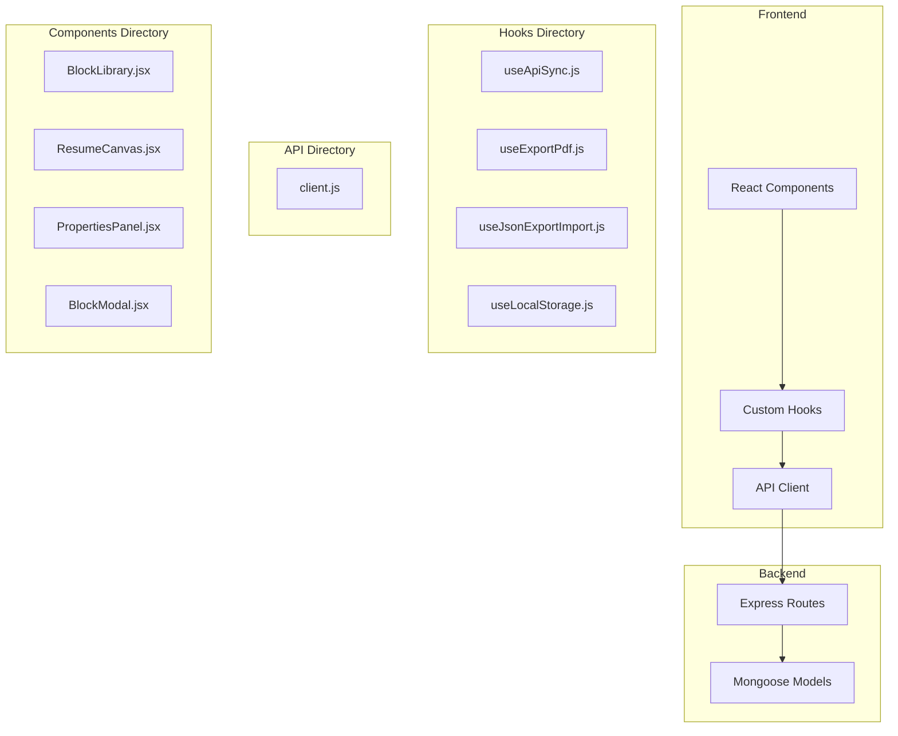
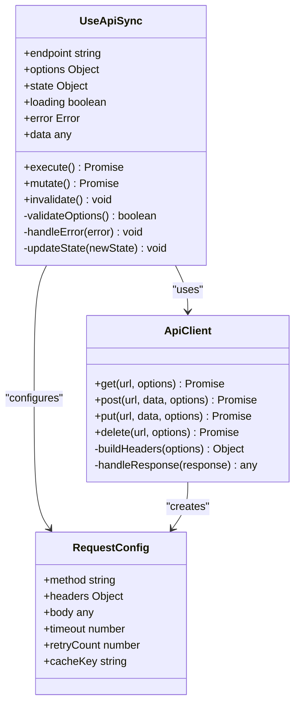
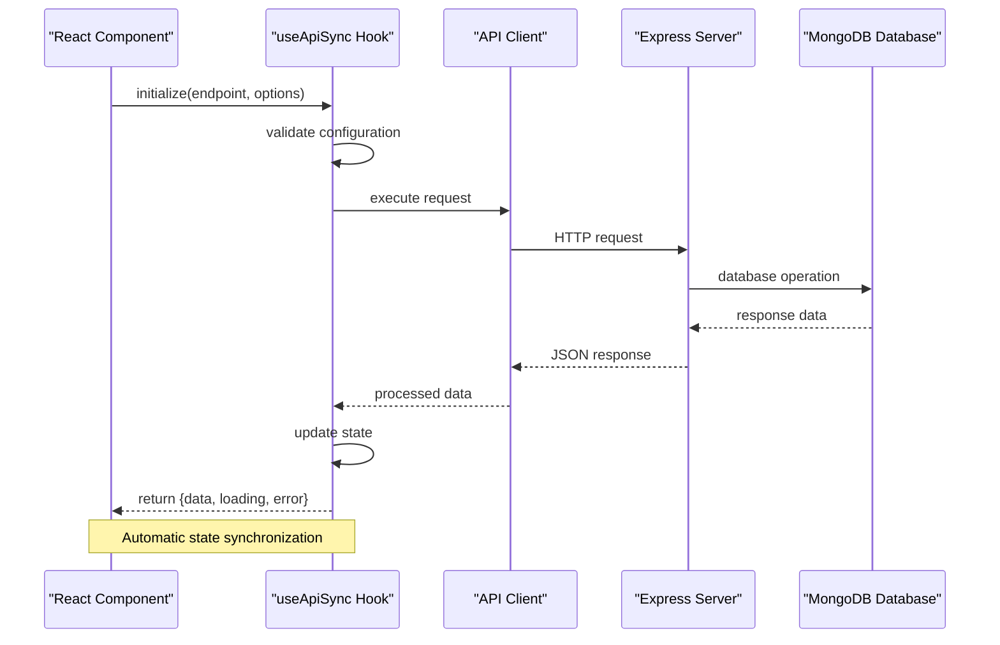
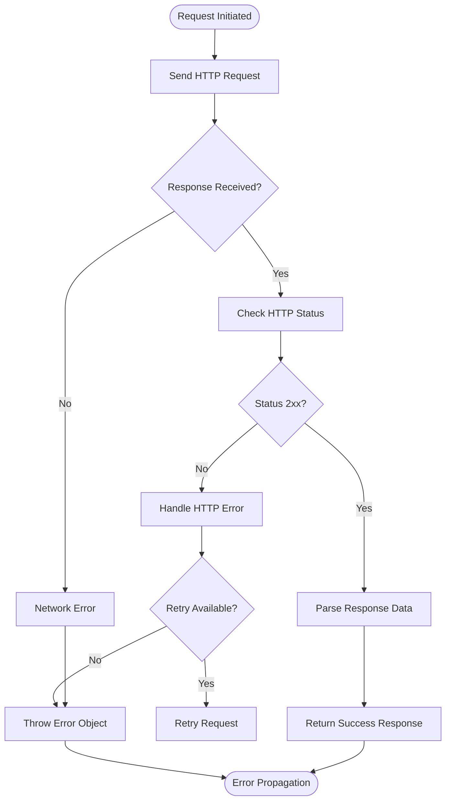
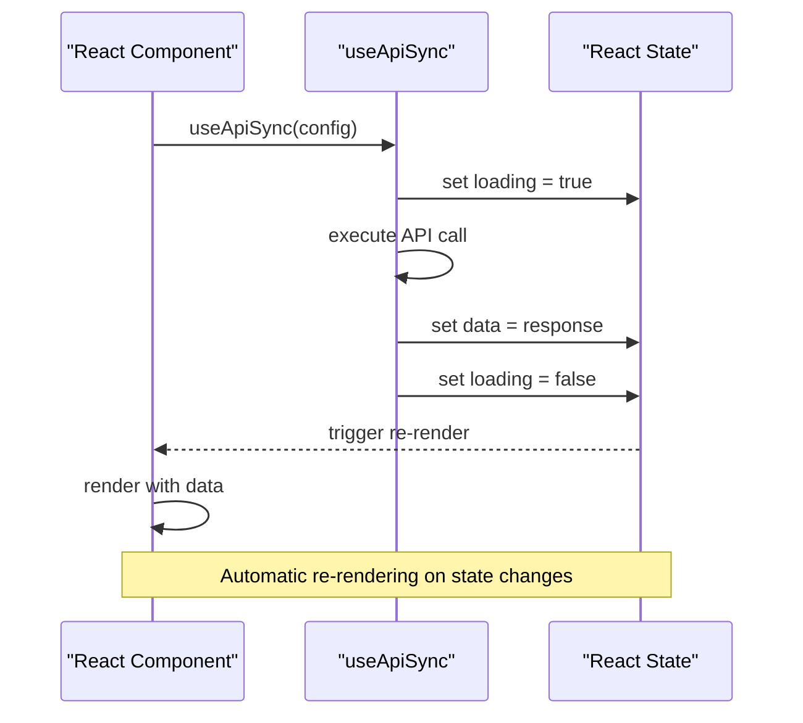
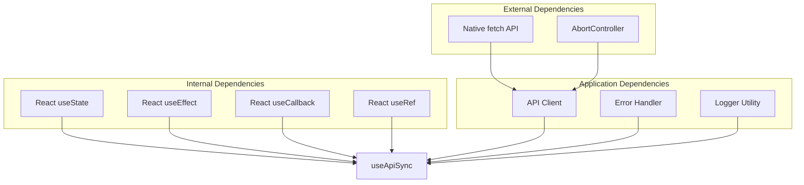

# useApiSync Hook

<cite>
**Referenced Files in This Document**
- [useApiSync.js](file://src/hooks/useApiSync.js)
- [client.js](file://src/api/client.js)
- [BlockLibrary.jsx](file://src/components/BlockLibrary/BlockLibrary.jsx)
- [ResumeCanvas.jsx](file://src/components/ResumeCanvas/ResumeCanvas.jsx)
- [blocks.js](file://server/routes/blocks.js)
- [resumes.js](file://server/routes/resumes.js)
</cite>

## Table of Contents
1. [Introduction](#introduction)
2. [Project Structure](#project-structure)
3. [Core Components](#core-components)
4. [Architecture Overview](#architecture-overview)
5. [Detailed Component Analysis](#detailed-component-analysis)
6. [Dependency Analysis](#dependency-analysis)
7. [Performance Considerations](#performance-considerations)
8. [Troubleshooting Guide](#troubleshooting-guide)
9. [Conclusion](#conclusion)
10. [Appendices](#appendices)

## Introduction

The `useApiSync` custom hook is a powerful React utility designed to streamline RESTful API integration within React components. It provides automatic state management for loading states, error handling, and data synchronization, significantly reducing boilerplate code and improving developer experience when working with remote APIs.

This hook abstracts common patterns for making HTTP requests, managing asynchronous state, and handling errors consistently across your application. It follows React best practices and integrates seamlessly with the Modular Resume Builder's architecture.

## Project Structure

The useApiSync hook is part of a well-organized React application that follows feature-based architecture:



**Diagram sources**
- [useApiSync.js](file://src/hooks/useApiSync.js)
- [client.js](file://src/api/client.js)
- [BlockLibrary.jsx](file://src/components/BlockLibrary/BlockLibrary.jsx)
- [ResumeCanvas.jsx](file://src/components/ResumeCanvas/ResumeCanvas.jsx)

**Section sources**
- [useApiSync.js](file://src/hooks/useApiSync.js)
- [client.js](file://src/api/client.js)

## Core Components

The useApiSync hook serves as the central abstraction layer for API interactions, providing a consistent interface for data fetching and mutation operations.

### Key Features

- **Automatic Loading State Management**: Handles loading indicators without manual state updates
- **Built-in Error Handling**: Provides structured error objects with detailed information
- **Data Synchronization**: Keeps component state synchronized with server data
- **Request Cancellation**: Supports aborting pending requests
- **Retry Mechanisms**: Built-in retry logic for failed requests
- **Cache Invalidation**: Automatic cache updates after mutations

### Implementation Architecture

The hook follows a modular design pattern with clear separation of concerns:



**Diagram sources**
- [useApiSync.js](file://src/hooks/useApiSync.js)
- [client.js](file://src/api/client.js)

**Section sources**
- [useApiSync.js](file://src/hooks/useApiSync.js)
- [client.js](file://src/api/client.js)

## Architecture Overview

The useApiSync hook integrates with the application's API layer through a centralized HTTP client, providing a clean separation between business logic and network communication.



**Diagram sources**
- [useApiSync.js](file://src/hooks/useApiSync.js)
- [client.js](file://src/api/client.js)
- [blocks.js](file://server/routes/blocks.js)
- [resumes.js](file://server/routes/resumes.js)

## Detailed Component Analysis

### useApiSync Hook Implementation

The hook provides a comprehensive solution for API synchronization with the following core functionality:

#### Parameters Configuration

The hook accepts a configuration object with the following properties:

| Parameter | Type | Description | Default | Required |
|-----------|------|-------------|---------|----------|
| endpoint | string | API endpoint URL | "" | Yes |
| method | string | HTTP method (GET, POST, PUT, DELETE) | "GET" | No |
| headers | object | Custom request headers | {} | No |
| body | any | Request payload for mutations | null | No |
| options | object | Additional fetch options | {} | No |
| autoExecute | boolean | Execute immediately on mount | true | No |
| retryCount | number | Number of retry attempts | 0 | No |
| timeout | number | Request timeout in milliseconds | 30000 | No |
| cacheKey | string | Cache identifier for data persistence | null | No |

#### Return Values

The hook returns an object containing:

| Property | Type | Description |
|----------|------|-------------|
| data | any | The fetched or mutated data |
| loading | boolean | Indicates if a request is in progress |
| error | object | Error object with status, message, and details |
| execute | function | Function to manually trigger data fetching |
| mutate | function | Function to perform data mutations |
| invalidate | function | Function to invalidate cached data |
| reset | function | Function to reset hook state |

#### State Management

The hook manages three primary state variables:

1. **Data State**: Holds the current API response data
2. **Loading State**: Tracks request execution status
3. **Error State**: Contains error information when requests fail

**Section sources**
- [useApiSync.js](file://src/hooks/useApiSync.js)

### API Client Integration

The hook integrates with a centralized API client that handles HTTP communication:

#### Client Configuration

The API client provides methods for different HTTP operations:

- **GET Requests**: Data retrieval with query parameter support
- **POST Requests**: Data creation with payload validation
- **PUT/PATCH Requests**: Data updates with partial updates
- **DELETE Requests**: Data removal with confirmation handling

#### Error Handling Strategy

The client implements a comprehensive error handling strategy:



**Diagram sources**
- [client.js](file://src/api/client.js)

**Section sources**
- [client.js](file://src/api/client.js)

### Usage Examples

#### Basic Data Fetching

```javascript
// Example usage in a React component
const { data, loading, error } = useApiSync({
  endpoint: '/api/blocks',
  method: 'GET'
});
```

#### Creating New Data

```javascript
// Example with mutation
const { mutate, loading } = useApiSync({
  endpoint: '/api/blocks',
  method: 'POST'
});

const handleCreate = async () => {
  const result = await mutate({
    name: 'New Block',
    type: 'text'
  });
};
```

#### Updating Existing Data

```javascript
// Example with update operation
const { mutate } = useApiSync({
  endpoint: `/api/blocks/${blockId}`,
  method: 'PUT'
});

const handleUpdate = async (updatedData) => {
  await mutate(updatedData);
};
```

#### Error Handling Pattern

```javascript
// Comprehensive error handling
const { data, loading, error, execute } = useApiSync({
  endpoint: '/api/resumes',
  method: 'GET',
  retryCount: 3
});

useEffect(() => {
  if (error) {
    console.error('API Error:', error.message);
    // Display user-friendly error message
  }
}, [error]);
```

**Section sources**
- [useApiSync.js](file://src/hooks/useApiSync.js)

### Integration with React Components

The hook integrates seamlessly with React components, providing automatic re-rendering when state changes occur.

#### Component Integration Pattern



**Diagram sources**
- [useApiSync.js](file://src/hooks/useApiSync.js)
- [BlockLibrary.jsx](file://src/components/BlockLibrary/BlockLibrary.jsx)

**Section sources**
- [BlockLibrary.jsx](file://src/components/BlockLibrary/BlockLibrary.jsx)
- [ResumeCanvas.jsx](file://src/components/ResumeCanvas/ResumeCanvas.jsx)

## Dependency Analysis

The useApiSync hook has minimal external dependencies, promoting maintainability and testability:



**Diagram sources**
- [useApiSync.js](file://src/hooks/useApiSync.js)
- [client.js](file://src/api/client.js)

**Section sources**
- [useApiSync.js](file://src/hooks/useApiSync.js)
- [client.js](file://src/api/client.js)

## Performance Considerations

### Optimization Strategies

The useApiSync hook implements several performance optimizations:

1. **Request Deduplication**: Prevents duplicate concurrent requests for the same endpoint
2. **Memoization**: Uses React.memo and useMemo to prevent unnecessary re-renders
3. **Lazy Loading**: Supports deferred execution of API calls
4. **Pagination Support**: Built-in pagination for large datasets
5. **Caching**: Implements intelligent caching strategies

### Memory Management

The hook includes proper cleanup mechanisms:

- **AbortController Integration**: Cancels pending requests on component unmount
- **Event Listener Cleanup**: Removes event listeners to prevent memory leaks
- **Timer Cleanup**: Clears timeouts and intervals properly

### Bundle Size Impact

The hook is designed to be tree-shakeable and only includes necessary functionality, minimizing bundle size impact.

## Troubleshooting Guide

### Common Issues and Solutions

#### Network Errors

**Problem**: Requests failing due to network connectivity issues
**Solution**: Implement retry logic and provide user feedback

#### Loading State Issues

**Problem**: Loading state not updating correctly
**Solution**: Ensure proper cleanup and state management

#### Memory Leaks

**Problem**: Memory leaks from uncanceled requests
**Solution**: Verify AbortController implementation and cleanup functions

#### Error Handling

**Problem**: Unhandled promise rejections
**Solution**: Implement comprehensive error boundaries and try-catch blocks

### Debugging Tips

1. **Enable Logging**: Add debug logging to track request/response cycles
2. **Network Tab**: Use browser DevTools to inspect network requests
3. **React DevTools**: Monitor state changes and component re-renders
4. **Error Boundaries**: Implement error boundaries to catch and display errors

**Section sources**
- [useApiSync.js](file://src/hooks/useApiSync.js)

## Conclusion

The useApiSync custom hook provides a robust, efficient, and developer-friendly solution for API integration in React applications. By abstracting common patterns for data fetching, state management, and error handling, it significantly reduces boilerplate code while maintaining flexibility and performance.

The hook's modular design, comprehensive error handling, and optimization strategies make it suitable for both simple and complex API interactions. Its seamless integration with React components and adherence to best practices ensure reliable and maintainable code.

For optimal results, follow the provided usage examples and best practices, and leverage the built-in features like retry mechanisms and cache invalidation to build responsive and user-friendly applications.

## Appendices

### Best Practices Checklist

- ✅ Always provide meaningful error messages to users
- ✅ Implement proper loading states for better UX
- ✅ Use appropriate retry counts for critical operations
- ✅ Clean up resources to prevent memory leaks
- ✅ Test error scenarios thoroughly
- ✅ Document API contracts and expected responses
- ✅ Monitor performance metrics and optimize as needed

### Migration Guide

When migrating existing API calls to use the useApiSync hook:

1. Replace direct fetch calls with hook initialization
2. Move state management to hook-managed state
3. Update error handling to use hook-provided error objects
4. Implement proper cleanup in useEffect hooks
5. Test all CRUD operations thoroughly