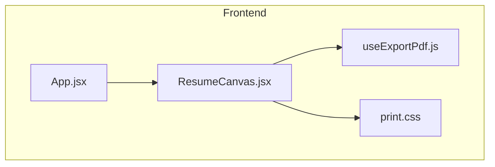
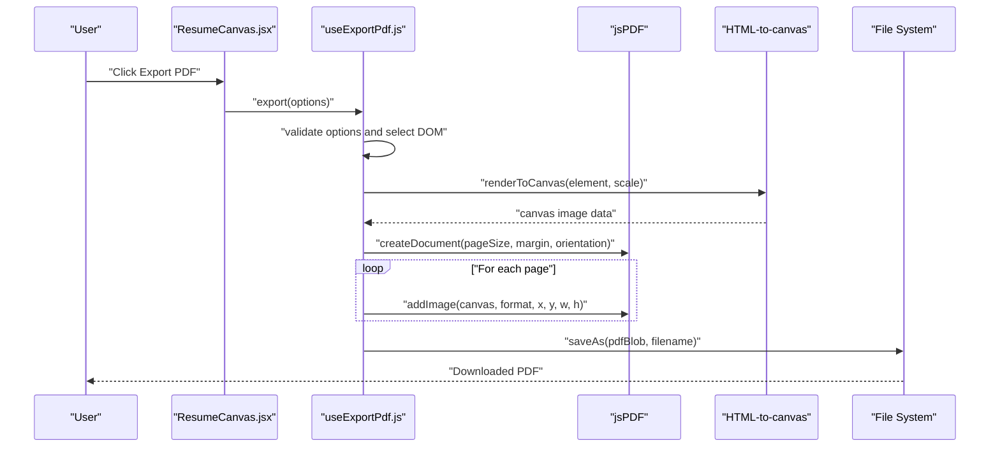
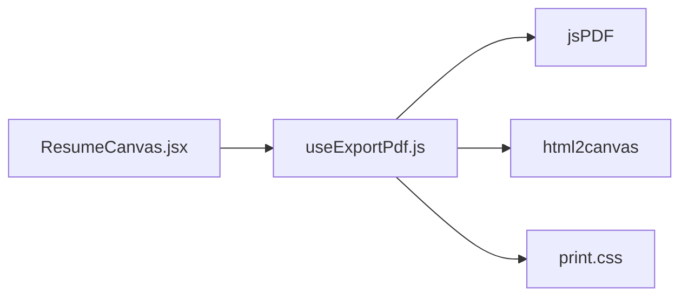

# useExportPdf Hook

<cite>
**Referenced Files in This Document**
- [useExportPdf.js](file://src/hooks/useExportPdf.js)
- [print.css](file://src/print.css)
- [ResumeCanvas.jsx](file://src/components/ResumeCanvas/ResumeCanvas.jsx)
- [package.json](file://package.json)
</cite>

## Table of Contents
1. [Introduction](#introduction)
2. [Project Structure](#project-structure)
3. [Core Components](#core-components)
4. [Architecture Overview](#architecture-overview)
5. [Detailed Component Analysis](#detailed-component-analysis)
6. [Dependency Analysis](#dependency-analysis)
7. [Performance Considerations](#performance-considerations)
8. [Troubleshooting Guide](#troubleshooting-guide)
9. [Conclusion](#conclusion)
10. [Appendices](#appendices)

## Introduction
This document provides comprehensive documentation for the useExportPdf custom hook used to generate PDFs from React components using jsPDF with canvas rendering. It explains parameters, return values, usage patterns, print optimization, quality settings, and performance considerations for large documents.

## Project Structure
The hook is implemented under src/hooks and integrates with the resume canvas component and print styles. The project includes a dedicated print stylesheet and a dependency declaration for jsPDF.

**Diagram sources**
- [ResumeCanvas.jsx](file://src/components/ResumeCanvas/ResumeCanvas.jsx)
- [useExportPdf.js](file://src/hooks/useExportPdf.js)
- [print.css](file://src/print.css)

**Section sources**
- [useExportPdf.js](file://src/hooks/useExportPdf.js)
- [ResumeCanvas.jsx](file://src/components/ResumeCanvas/ResumeCanvas.jsx)
- [print.css](file://src/print.css)
- [package.json](file://package.json)

## Core Components
- useExportPdf: A React hook that encapsulates PDF export logic using jsPDF and HTML-to-canvas rendering. It exposes functions to trigger exports, progress tracking, and error handling.
- ResumeCanvas: The UI component that renders the resume content and typically invokes the export function provided by the hook.
- print.css: Styles optimized for printing and high-quality rasterization when converting DOM to canvas.

Key responsibilities:
- Selecting the target DOM element(s) to render into the PDF
- Configuring page size, orientation, margins, and scaling
- Rendering the selected content to a canvas and then to PDF pages
- Managing export state (progress, errors) and exposing callbacks

**Section sources**
- [useExportPdf.js](file://src/hooks/useExportPdf.js)
- [ResumeCanvas.jsx](file://src/components/ResumeCanvas/ResumeCanvas.jsx)
- [print.css](file://src/print.css)

## Architecture Overview
The export flow uses jsPDF to create a PDF document and an HTML-to-canvas utility to rasterize the selected DOM subtree. The hook coordinates selection, rendering, pagination, and download.

**Diagram sources**
- [useExportPdf.js](file://src/hooks/useExportPdf.js)
- [ResumeCanvas.jsx](file://src/components/ResumeCanvas/ResumeCanvas.jsx)

## Detailed Component Analysis

### useExportPdf Hook API
- Purpose: Provide a reusable interface to export any DOM subtree to a multi-page PDF using jsPDF and canvas-based rendering.
- Typical integration: Called within a component that owns or references the resume container element.

Parameters (options object):
- selector or ref: Target DOM node or query selector string for the content to export.
- pageSize: Page dimensions (e.g., A4, Letter).
- orientation: Portrait or landscape.
- margin: Page margins in points or mm.
- scale: Canvas scale factor for resolution control.
- format: Image format for embedding (e.g., PNG, JPEG).
- quality: Compression quality for lossy formats.
- filename: Output file name.
- onPageBreak: Callback invoked before adding a new page; can be used to adjust layout or pause rendering.
- onProgress: Callback reporting progress percentage.
- onError: Callback for error handling.

Return values:
- export(): Function to start the export process with optional overrides.
- state: Object containing current status, progress, and lastError.
- cancel(): Optional cancellation mechanism if supported by the underlying renderer.

Behavioral notes:
- Uses a fixed devicePixelRatio or configurable scale to balance quality vs. performance.
- Splits tall content across multiple pages based on available height after margins.
- Applies print CSS rules during rendering to ensure consistent visuals.

**Section sources**
- [useExportPdf.js](file://src/hooks/useExportPdf.js)

### Integration with ResumeCanvas
- The resume canvas component typically holds a reference to the root resume element and calls the exported function from useExportPdf.
- It may pass user-configurable options such as page size, orientation, and filename.
- It displays progress and error feedback to the user.

**Section sources**
- [ResumeCanvas.jsx](file://src/components/ResumeCanvas/ResumeCanvas.jsx)
- [useExportPdf.js](file://src/hooks/useExportPdf.js)

### Print Optimization and Quality Settings
- Use print.css to hide non-essential UI elements, enforce background graphics, and set typography for crisp output.
- Increase scale for higher-resolution images at the cost of memory and time.
- Prefer PNG for sharp text and vector-like elements; use JPEG only when reducing file size is critical.
- Adjust margins and pageSize to avoid clipping and reduce unnecessary page breaks.

**Section sources**
- [print.css](file://src/print.css)
- [useExportPdf.js](file://src/hooks/useExportPdf.js)

## Dependency Analysis
External dependencies relevant to PDF export:
- jsPDF: Creates and manipulates PDF documents.
- html2canvas (or similar): Renders DOM nodes to canvas for embedding into PDF.

**Diagram sources**
- [useExportPdf.js](file://src/hooks/useExportPdf.js)
- [ResumeCanvas.jsx](file://src/components/ResumeCanvas/ResumeCanvas.jsx)
- [print.css](file://src/print.css)

**Section sources**
- [package.json](file://package.json)
- [useExportPdf.js](file://src/hooks/useExportPdf.js)

## Performance Considerations
- Scale and resolution: Higher scale improves quality but increases memory usage and processing time. Choose a moderate scale for typical resumes.
- Image format: PNG preserves text clarity; JPEG reduces size but may introduce artifacts.
- Pagination strategy: Avoid overly small page heights to minimize page count and reflows.
- Large documents: Consider splitting exports into sections or lazy-loading heavy assets before export.
- Browser constraints: Very large canvases may hit memory limits; prefer efficient layouts and minimal DOM depth.

[No sources needed since this section provides general guidance]

## Troubleshooting Guide
Common issues and resolutions:
- Blank or truncated pages: Ensure the target element is fully rendered before export; increase scale or adjust margins.
- Blurry text: Prefer PNG format and higher scale; verify print CSS does not disable background graphics.
- Slow export: Reduce scale, simplify DOM, or split content into smaller exports.
- Memory errors: Lower scale, avoid extremely large images, and close other heavy tabs.
- Orientation/page size mismatch: Verify pageSize and orientation match your intended output.

**Section sources**
- [useExportPdf.js](file://src/hooks/useExportPdf.js)
- [print.css](file://src/print.css)

## Conclusion
The useExportPdf hook centralizes PDF generation logic, offering flexible configuration for content selection, formatting, and output. By combining jsPDF with canvas rendering and thoughtful print styles, it delivers reliable, high-quality PDF exports suitable for resumes and other professional documents.

[No sources needed since this section summarizes without analyzing specific files]

## Appendices

### Usage Examples

- Resume export
  - Select the resume container element
  - Set pageSize to A4, orientation to portrait
  - Provide a meaningful filename
  - Observe progress via onProgress callback

- Print optimization
  - Enable background graphics in print styles
  - Use appropriate font sizes and line heights
  - Hide navigation and action buttons via print media queries

- Quality settings
  - For crisp text, choose PNG and a moderate scale
  - For smaller files, consider JPEG with reduced quality
  - Tune margins to prevent content clipping

[No sources needed since this section provides general guidance]