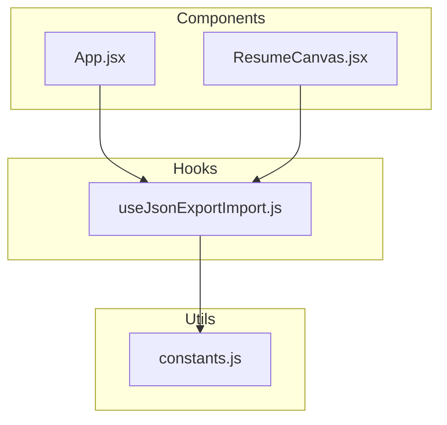
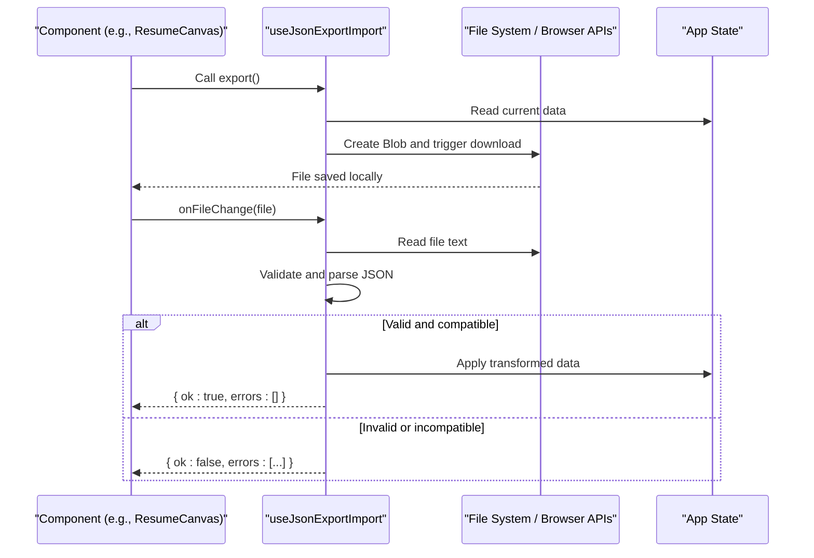
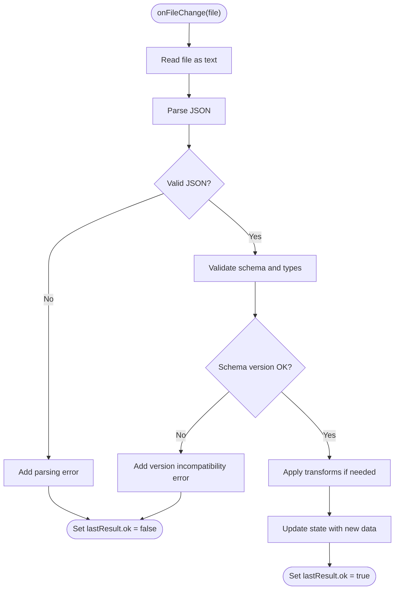
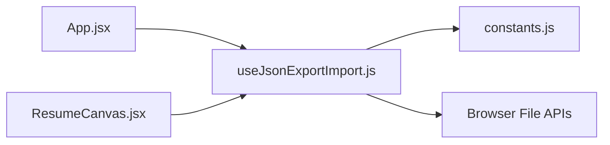

# useJsonExportImport Hook

<cite>
**Referenced Files in This Document**
- [useJsonExportImport.js](file://src/hooks/useJsonExportImport.js)
- [App.jsx](file://src/App.jsx)
- [ResumeCanvas.jsx](file://src/components/ResumeCanvas/ResumeCanvas.jsx)
- [constants.js](file://src/utils/constants.js)
</cite>

## Table of Contents
1. [Introduction](#introduction)
2. [Project Structure](#project-structure)
3. [Core Components](#core-components)
4. [Architecture Overview](#architecture-overview)
5. [Detailed Component Analysis](#detailed-component-analysis)
6. [Dependency Analysis](#dependency-analysis)
7. [Performance Considerations](#performance-considerations)
8. [Troubleshooting Guide](#troubleshooting-guide)
9. [Conclusion](#conclusion)
10. [Appendices](#appendices)

## Introduction
This document explains the useJsonExportImport custom hook that provides JSON-based export and import functionality for resume data. It covers how the hook exposes triggers to export current state, handlers to import from files, validation and error recovery strategies, and return values consumed by components. It also includes usage examples for backup/restore, template sharing, and migration scenarios, along with security considerations and schema versioning guidance.

## Project Structure
The hook lives under src/hooks and is consumed by application components such as App and ResumeCanvas. Utility constants may define supported schemas or defaults.

[No sources needed since this diagram shows conceptual structure]

## Core Components
- Hook: useJsonExportImport
  - Purpose: Provide a cohesive API to export current resume data to JSON and import JSON back into the app state with validation and error recovery.
  - Responsibilities:
    - Export: Serialize current data to JSON and trigger file download.
    - Import: Parse uploaded JSON, validate against expected schema, transform if necessary, and update state safely.
    - Validation: Enforce required fields, types, and optional schema version checks.
    - Error Recovery: Handle malformed files, unsupported versions, and partial failures; expose actionable errors.
    - State: Track loading, success, and error states during import/export operations.

- Consumers:
  - App.jsx: May orchestrate global actions like “Export All” and “Import Backup”.
  - ResumeCanvas.jsx: May provide per-canvas export/import controls and display validation feedback.

**Section sources**
- [useJsonExportImport.js](file://src/hooks/useJsonExportImport.js)
- [App.jsx](file://src/App.jsx)
- [ResumeCanvas.jsx](file://src/components/ResumeCanvas/ResumeCanvas.jsx)
- [constants.js](file://src/utils/constants.js)

## Architecture Overview
The hook encapsulates all logic for JSON I/O and validation. Components call exported functions and react to returned state.

**Diagram sources**
- [useJsonExportImport.js](file://src/hooks/useJsonExportImport.js)
- [ResumeCanvas.jsx](file://src/components/ResumeCanvas/ResumeCanvas.jsx)

## Detailed Component Analysis

### Hook Interface
- Inputs
  - Initial data object representing the current resume state.
  - Optional configuration:
    - Schema version policy (strict or lenient).
    - Transform hooks for backward compatibility.
    - Max file size and allowed MIME types.
- Returned Values
  - export(): Function to serialize current data and trigger a JSON download.
  - onFileChange(file): Handler for <input type="file"> onChange events.
  - onDrop(files): Drag-and-drop handler for imported files.
  - validateOnly(jsonString): Validates without mutating state; returns validation result.
  - state:
    - importing: boolean indicating ongoing import.
    - exporting: boolean indicating ongoing export.
    - lastResult: { ok: boolean, errors: string[], warnings?: string[] }.
    - lastFileName: string of the most recently processed file.
- Behaviors
  - Export:
    - Serializes provided data to JSON.
    - Creates a Blob and triggers a browser download via an anchor element.
    - Sets exporting flag while processing.
  - Import:
    - Reads file content as text.
    - Parses JSON and validates structure and types.
    - Applies schema version checks and transforms when needed.
    - Updates state only after successful validation.
    - Populates lastResult with detailed errors/warnings.
  - Validation:
    - Required fields presence.
    - Type checks for primitive and nested structures.
    - Enum checks for constrained fields.
    - Optional schema version compatibility matrix.
  - Error Recovery:
    - Graceful handling of malformed JSON, oversized files, and unsupported versions.
    - Non-fatal warnings do not block import unless configured strictly.
    - Provides user-friendly messages mapped to specific fields.

**Section sources**
- [useJsonExportImport.js](file://src/hooks/useJsonExportImport.js)

### Data Flow and Processing Logic

**Diagram sources**
- [useJsonExportImport.js](file://src/hooks/useJsonExportImport.js)

### Usage Examples

- Resume Backup/Restore
  - Export:
    - Trigger export() from a toolbar button to save the current resume as a JSON file.
    - Use exporting state to show progress and disable controls during export.
  - Import:
    - Bind onFileChange to a file input.
    - On success, replace current resume data with imported content.
    - Display lastResult.errors to guide users if import fails.

- Template Sharing
  - Export:
    - Provide a “Share Template” action that exports a minimal subset of fields.
    - Optionally include metadata like template name and version.
  - Import:
    - Validate that the incoming template matches expected schema.
    - Merge template blocks into existing resume sections if desired.

- Data Migration
  - Import:
    - Use validateOnly to preview changes before applying.
    - Apply transforms to map deprecated fields to new ones.
    - Record warnings for non-breaking changes and allow user confirmation.

**Section sources**
- [useJsonExportImport.js](file://src/hooks/useJsonExportImport.js)
- [App.jsx](file://src/App.jsx)
- [ResumeCanvas.jsx](file://src/components/ResumeCanvas/ResumeCanvas.jsx)

### Security Considerations
- File Upload Safety
  - Restrict accepted file types to application/json.
  - Enforce maximum file size to prevent memory exhaustion.
  - Avoid executing any code contained within the JSON payload.
- Data Validation Rules
  - Strictly validate all fields and types before updating state.
  - Reject unknown top-level keys to reduce attack surface.
  - Normalize strings and trim whitespace where appropriate.
- Schema Versioning Support
  - Include a schemaVersion field in exported payloads.
  - Maintain a compatibility matrix mapping supported versions.
  - Implement transforms for known migrations between versions.
  - Fail fast on unsupported versions with clear messaging.

**Section sources**
- [useJsonExportImport.js](file://src/hooks/useJsonExportImport.js)
- [constants.js](file://src/utils/constants.js)

## Dependency Analysis
The hook depends on browser APIs for file reading and downloading, and optionally reads constants for schema policies.

**Diagram sources**
- [useJsonExportImport.js](file://src/hooks/useJsonExportImport.js)
- [constants.js](file://src/utils/constants.js)
- [App.jsx](file://src/App.jsx)
- [ResumeCanvas.jsx](file://src/components/ResumeCanvas/ResumeCanvas.jsx)

**Section sources**
- [useJsonExportImport.js](file://src/hooks/useJsonExportImport.js)
- [constants.js](file://src/utils/constants.js)
- [App.jsx](file://src/App.jsx)
- [ResumeCanvas.jsx](file://src/components/ResumeCanvas/ResumeCanvas.jsx)

## Performance Considerations
- Batch updates: Apply validated data in a single state update to avoid re-renders.
- Lazy transforms: Only run transforms when schema version differs.
- Memory management: Revoke object URLs and release large Blobs promptly.
- Input throttling: Debounce drag-and-drop handlers to avoid repeated parses.
- Large files: Stream or chunk parsing if very large resumes are anticipated.

[No sources needed since this section provides general guidance]

## Troubleshooting Guide
Common issues and resolutions:
- Malformed JSON
  - Symptom: lastResult.ok is false with parsing errors.
  - Action: Ensure the exported file was not modified externally and re-export.
- Unsupported schema version
  - Symptom: Version incompatibility error.
  - Action: Upgrade to a newer version of the builder or apply recommended transforms.
- Missing required fields
  - Symptom: Field-specific validation errors.
  - Action: Fill missing fields using the original export or regenerate from source.
- Oversized file
  - Symptom: Import rejected due to size limit.
  - Action: Reduce payload size by removing unused blocks or splitting imports.
- Unexpected keys
  - Symptom: Unknown field errors.
  - Action: Remove unknown keys or enable lenient mode if safe.

**Section sources**
- [useJsonExportImport.js](file://src/hooks/useJsonExportImport.js)

## Conclusion
The useJsonExportImport hook centralizes JSON export/import with robust validation and error recovery. It offers a simple interface for components to export backups, share templates, and migrate data across versions. By enforcing strict validation, supporting schema versioning, and providing clear error reporting, it ensures safe and reliable data portability.

[No sources needed since this section summarizes without analyzing specific files]

## Appendices

### Return Values Reference
- export()
  - Behavior: Serializes current data and triggers download.
  - Side effects: Sets exporting state; creates downloadable file.
- onFileChange(file)
  - Behavior: Reads, parses, validates, and applies import.
  - Returns: Updates lastResult with ok/errors.
- onDrop(files)
  - Behavior: Delegates to onFileChange for first valid file.
- validateOnly(jsonString)
  - Behavior: Validates without changing state.
  - Returns: Validation result suitable for preview.
- state
  - importing: boolean
  - exporting: boolean
  - lastResult: { ok: boolean, errors: string[], warnings?: string[] }
  - lastFileName: string

**Section sources**
- [useJsonExportImport.js](file://src/hooks/useJsonExportImport.js)