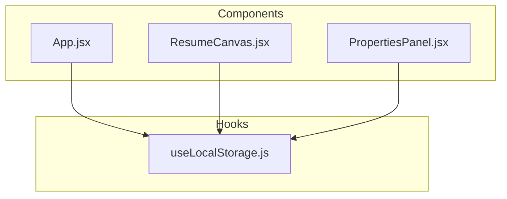
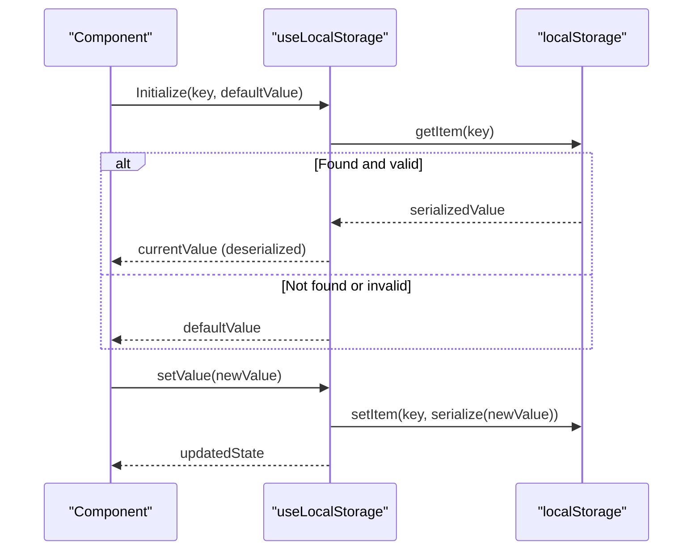
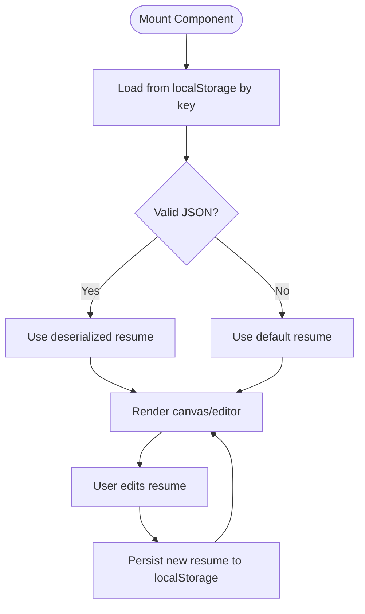
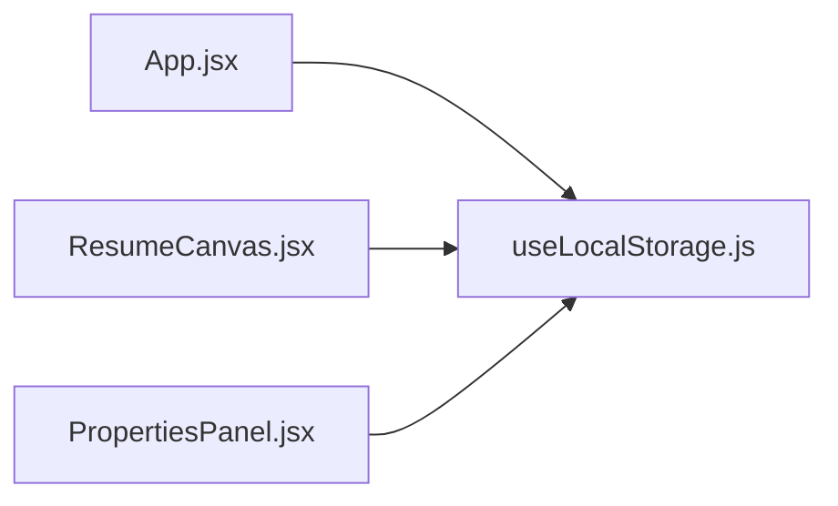

# useLocalStorage Hook

<cite>
**Referenced Files in This Document**
- [useLocalStorage.js](file://src/hooks/useLocalStorage.js)
- [App.jsx](file://src/App.jsx)
- [ResumeCanvas.jsx](file://src/components/ResumeCanvas/ResumeCanvas.jsx)
- [PropertiesPanel.jsx](file://src/components/PropertiesPanel/PropertiesPanel.jsx)
</cite>

## Table of Contents
1. [Introduction](#introduction)
2. [Project Structure](#project-structure)
3. [Core Components](#core-components)
4. [Architecture Overview](#architecture-overview)
5. [Detailed Component Analysis](#detailed-component-analysis)
6. [Dependency Analysis](#dependency-analysis)
7. [Performance Considerations](#performance-considerations)
8. [Troubleshooting Guide](#troubleshooting-guide)
9. [Conclusion](#conclusion)
10. [Appendices](#appendices)

## Introduction
This document explains the useLocalStorage custom hook used for persisting application state to the browser’s localStorage with automatic JSON serialization and deserialization. It covers the hook’s interface, return values, usage patterns (resume persistence, user preferences, application state), error handling strategies (quota exceeded, data corruption recovery), and cross-browser compatibility considerations.

## Project Structure
The hook is implemented as a standalone React hook under src/hooks and consumed by components that need persistent state across sessions.

**Diagram sources**
- [useLocalStorage.js](file://src/hooks/useLocalStorage.js)
- [App.jsx](file://src/App.jsx)
- [ResumeCanvas.jsx](file://src/components/ResumeCanvas/ResumeCanvas.jsx)
- [PropertiesPanel.jsx](file://src/components/PropertiesPanel/PropertiesPanel.jsx)

**Section sources**
- [useLocalStorage.js](file://src/hooks/useLocalStorage.js)
- [App.jsx](file://src/App.jsx)
- [ResumeCanvas.jsx](file://src/components/ResumeCanvas/ResumeCanvas.jsx)
- [PropertiesPanel.jsx](file://src/components/PropertiesPanel/PropertiesPanel.jsx)

## Core Components
- Hook implementation: Provides key-based storage access, default value handling, type preservation via JSON serialization/deserialization, and optional utilities for clearing or removing keys.
- Consumers: Components that manage resume content, user preferences, and general app state leverage the hook to keep UI synchronized with persisted data.

Key responsibilities:
- Read from localStorage on initialization using a provided key and default value.
- Serialize complex values to strings when writing to localStorage.
- Deserialize stored strings back to original types on read.
- Expose a setter function that updates both React state and localStorage atomically.
- Provide helpers to clear or remove specific keys if needed.

Typical return shape:
- State variable reflecting current value.
- Setter function to update the value.
- Optional utility functions for storage operations (e.g., clear, remove).

Usage examples:
- Resume persistence: Store structured resume data keyed by resume ID.
- User preferences: Persist theme, layout, or editor settings.
- Application state: Keep transient but important state across reloads.

Error handling highlights:
- Graceful fallback to defaults when localStorage is unavailable or corrupted.
- Handling quota exceeded errors by falling back to memory-only mode or prompting the user.
- Safe parsing to avoid crashes on malformed data.

Cross-browser considerations:
- Feature detection for localStorage availability.
- Handling privacy modes where localStorage may throw.
- Consistent behavior across modern browsers.

**Section sources**
- [useLocalStorage.js](file://src/hooks/useLocalStorage.js)
- [App.jsx](file://src/App.jsx)
- [ResumeCanvas.jsx](file://src/components/ResumeCanvas/ResumeCanvas.jsx)
- [PropertiesPanel.jsx](file://src/components/PropertiesPanel/PropertiesPanel.jsx)

## Architecture Overview
The hook encapsulates all persistence logic, keeping components focused on rendering and interaction. Data flows from component state through the hook into localStorage and back on load.

**Diagram sources**
- [useLocalStorage.js](file://src/hooks/useLocalStorage.js)

## Detailed Component Analysis

### Hook Interface and Behavior
- Initialization parameters:
  - key: string identifier for the storage entry.
  - defaultValue: initial value used when no persisted data exists or when parsing fails.
- Return values:
  - state: current value (type preserved).
  - setState: function to update state and persist changes.
  - utilities (optional): clear/remove helpers depending on implementation.

Behavioral guarantees:
- Automatic JSON serialization/deserialization for objects, arrays, primitives.
- Synchronous updates to both React state and localStorage.
- Defensive parsing to recover from corrupted entries.

**Section sources**
- [useLocalStorage.js](file://src/hooks/useLocalStorage.js)

### Usage Patterns

#### Resume Persistence
- Key strategy: Use a stable key per resume (e.g., based on resume ID).
- Value structure: Serialized resume object containing blocks, metadata, and layout.
- Lifecycle: On mount, load resume; on change, persist automatically.

**Diagram sources**
- [useLocalStorage.js](file://src/hooks/useLocalStorage.js)
- [ResumeCanvas.jsx](file://src/components/ResumeCanvas/ResumeCanvas.jsx)

**Section sources**
- [ResumeCanvas.jsx](file://src/components/ResumeCanvas/ResumeCanvas.jsx)
- [useLocalStorage.js](file://src/hooks/useLocalStorage.js)

#### User Preferences
- Key strategy: Use feature-scoped keys (e.g., theme, editorSettings).
- Value structure: Small configuration objects or primitive values.
- Benefits: Immediate persistence without extra boilerplate.

**Section sources**
- [PropertiesPanel.jsx](file://src/components/PropertiesPanel/PropertiesPanel.jsx)
- [useLocalStorage.js](file://src/hooks/useLocalStorage.js)

#### Application State Management
- Key strategy: Group related state under shared keys or separate keys per module.
- Value structure: Aggregated state slices suitable for quick restoration.
- Caution: Avoid storing large payloads; prefer selective persistence.

**Section sources**
- [App.jsx](file://src/App.jsx)
- [useLocalStorage.js](file://src/hooks/useLocalStorage.js)

### Error Handling Strategies
- Storage quota exceeded:
  - Detect write failures and fall back to in-memory state or prompt the user to reduce payload size.
- Data corruption recovery:
  - Wrap parsing in try/catch; revert to default value when JSON is invalid.
- Cross-browser compatibility:
  - Guard against undefined localStorage (e.g., private browsing) and handle exceptions gracefully.

**Section sources**
- [useLocalStorage.js](file://src/hooks/useLocalStorage.js)

## Dependency Analysis
The hook has minimal dependencies and is designed for low coupling. Components depend only on its public API.

**Diagram sources**
- [App.jsx](file://src/App.jsx)
- [ResumeCanvas.jsx](file://src/components/ResumeCanvas/ResumeCanvas.jsx)
- [PropertiesPanel.jsx](file://src/components/PropertiesPanel/PropertiesPanel.jsx)
- [useLocalStorage.js](file://src/hooks/useLocalStorage.js)

**Section sources**
- [App.jsx](file://src/App.jsx)
- [ResumeCanvas.jsx](file://src/components/ResumeCanvas/ResumeCanvas.jsx)
- [PropertiesPanel.jsx](file://src/components/PropertiesPanel/PropertiesPanel.jsx)
- [useLocalStorage.js](file://src/hooks/useLocalStorage.js)

## Performance Considerations
- Serialization overhead: Large objects can be expensive to serialize/deserialize; consider chunking or debouncing writes if necessary.
- Storage size limits: Be mindful of quotas; store only essential data.
- Re-renders: The setter should trigger minimal re-renders by updating state directly.
- Initial load: Parse once on mount; avoid repeated reads during render.

[No sources needed since this section provides general guidance]

## Troubleshooting Guide
Common issues and resolutions:
- Quota exceeded:
  - Symptoms: Write errors or silent failures.
  - Actions: Reduce payload size, implement fallback to memory-only mode, or notify the user.
- Corrupted data:
  - Symptoms: Unexpected default values or parse errors.
  - Actions: Validate and reset to defaults; provide a mechanism to clear corrupted keys.
- Cross-browser quirks:
  - Symptoms: Inconsistent behavior in private/incognito modes.
  - Actions: Feature-detect localStorage and degrade gracefully.

**Section sources**
- [useLocalStorage.js](file://src/hooks/useLocalStorage.js)

## Conclusion
The useLocalStorage hook offers a simple, robust way to persist React state to the browser with automatic JSON handling, strong defaults, and resilient error management. By centralizing persistence logic, it keeps components clean and ensures consistent behavior across different environments.

[No sources needed since this section summarizes without analyzing specific files]

## Appendices

### API Reference Summary
- Parameters:
  - key: string
  - defaultValue: any
- Returns:
  - state: any
  - setState: function
  - utilities: optional clear/remove helpers

[No sources needed since this section provides a summary without analyzing specific files]