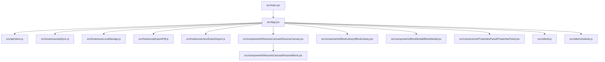
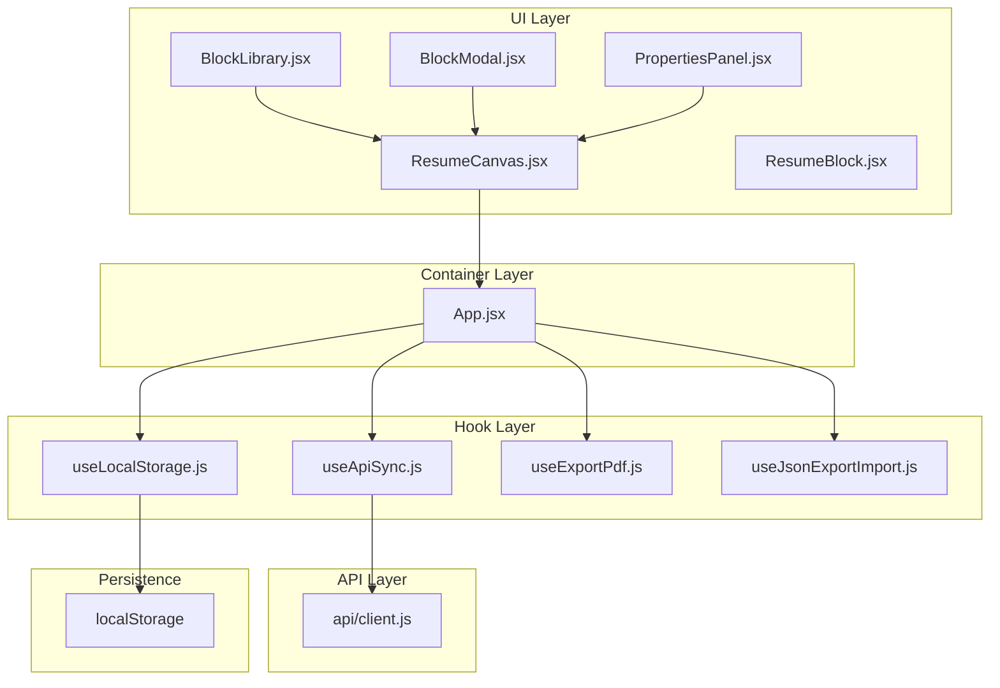
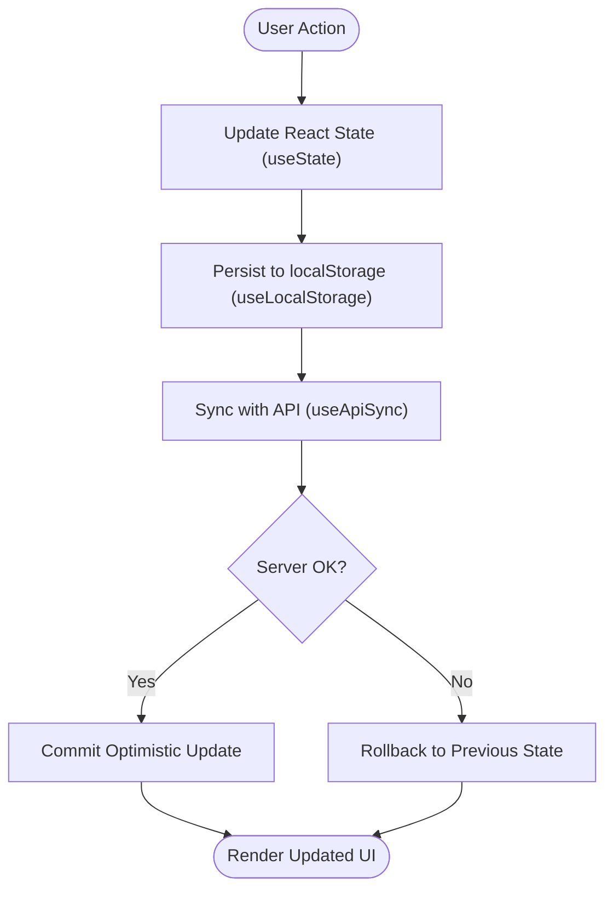
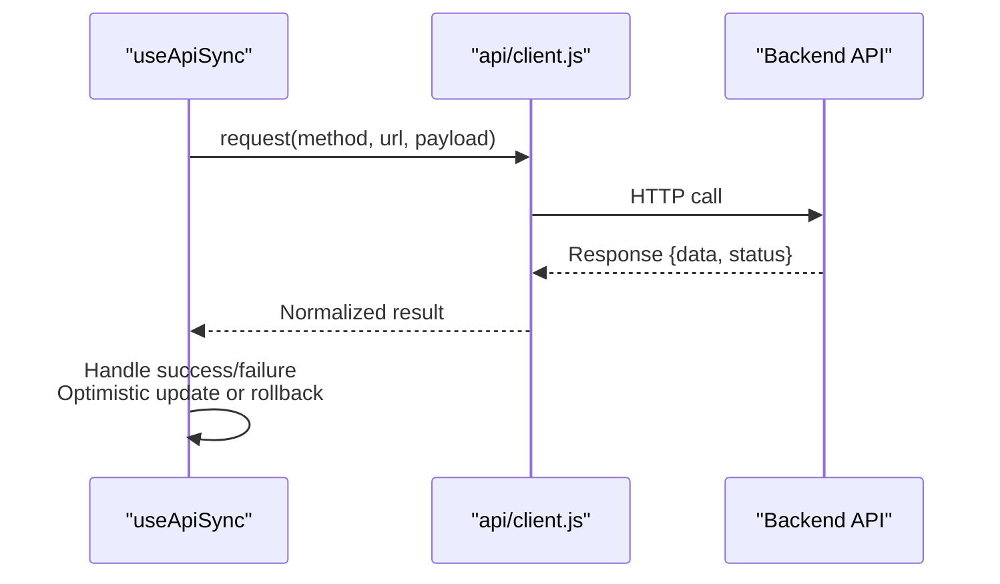
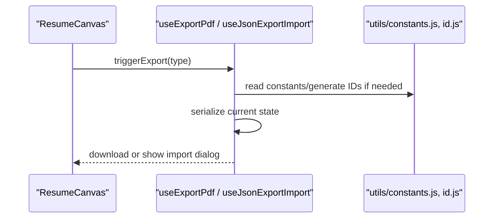
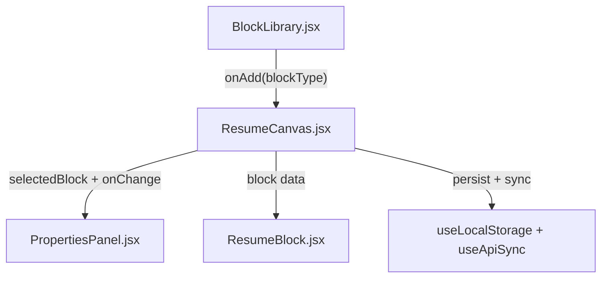
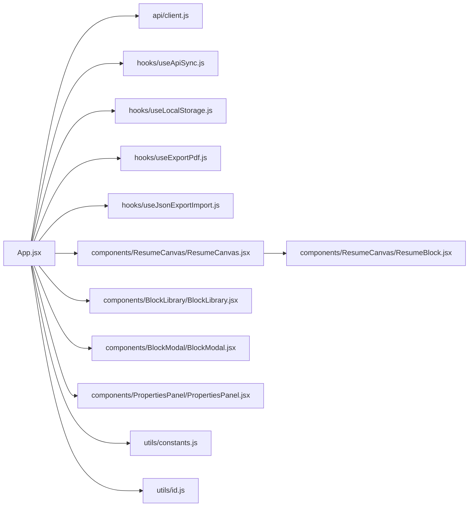

# Frontend Architecture

<cite>
**Referenced Files in This Document**
- [main.jsx](file://src/main.jsx)
- [App.jsx](file://src/App.jsx)
- [client.js](file://src/api/client.js)
- [useApiSync.js](file://src/hooks/useApiSync.js)
- [useLocalStorage.js](file://src/hooks/useLocalStorage.js)
- [useExportPdf.js](file://src/hooks/useExportPdf.js)
- [useJsonExportImport.js](file://src/hooks/useJsonExportImport.js)
- [BlockLibrary.jsx](file://src/components/BlockLibrary/BlockLibrary.jsx)
- [BlockModal.jsx](file://src/components/BlockModal/BlockModal.jsx)
- [PropertiesPanel.jsx](file://src/components/PropertiesPanel/PropertiesPanel.jsx)
- [ResumeCanvas.jsx](file://src/components/ResumeCanvas/ResumeCanvas.jsx)
- [ResumeBlock.jsx](file://src/components/ResumeCanvas/ResumeBlock.jsx)
- [constants.js](file://src/utils/constants.js)
- [id.js](file://src/utils/id.js)
</cite>

## Table of Contents
1. [Introduction](#introduction)
2. [Project Structure](#project-structure)
3. [Core Components](#core-components)
4. [Architecture Overview](#architecture-overview)
5. [Detailed Component Analysis](#detailed-component-analysis)
6. [Dependency Analysis](#dependency-analysis)
7. [Performance Considerations](#performance-considerations)
8. [Troubleshooting Guide](#troubleshooting-guide)
9. [Conclusion](#conclusion)

## Introduction
This document describes the frontend architecture of the Modular Resume Builder, focusing on a React component-based design with clear separation between presentation components and container logic. It explains the custom hooks pattern used to encapsulate business logic (API integration, persistence, and export), the state management strategy combining React useState with local storage synchronization, the API client abstraction and error handling patterns, and the composition and prop drilling strategies used across the application.

## Project Structure
The frontend is organized by feature and concern:
- Entry point and root app
  - src/main.jsx: Application bootstrap and React tree initialization
  - src/App.jsx: Root layout and top-level state orchestration
- API layer
  - src/api/client.js: Centralized HTTP client abstraction for backend calls
- Hooks (business logic)
  - src/hooks/useApiSync.js: Syncs React state with remote API using optimistic updates and retries
  - src/hooks/useLocalStorage.js: Persists state to localStorage with serialization and fallbacks
  - src/hooks/useExportPdf.js: PDF export orchestration hook
  - src/hooks/useJsonExportImport.js: JSON export/import utilities as a hook
- Components (UI)
  - src/components/BlockLibrary/: Block palette and selection UI
  - src/components/BlockModal/: Modal for editing block properties
  - src/components/PropertiesPanel/: Contextual property editor
  - src/components/ResumeCanvas/: Canvas rendering blocks and managing drag-and-drop interactions
- Utilities
  - src/utils/constants.js: Shared constants (e.g., block types, defaults)
  - src/utils/id.js: Stable ID generation helpers

**Diagram sources**
- [main.jsx](file://src/main.jsx)
- [App.jsx](file://src/App.jsx)
- [client.js](file://src/api/client.js)
- [useApiSync.js](file://src/hooks/useApiSync.js)
- [useLocalStorage.js](file://src/hooks/useLocalStorage.js)
- [useExportPdf.js](file://src/hooks/useExportPdf.js)
- [useJsonExportImport.js](file://src/hooks/useJsonExportImport.js)
- [BlockLibrary.jsx](file://src/components/BlockLibrary/BlockLibrary.jsx)
- [BlockModal.jsx](file://src/components/BlockModal/BlockModal.jsx)
- [PropertiesPanel.jsx](file://src/components/PropertiesPanel/PropertiesPanel.jsx)
- [ResumeCanvas.jsx](file://src/components/ResumeCanvas/ResumeCanvas.jsx)
- [ResumeBlock.jsx](file://src/components/ResumeCanvas/ResumeBlock.jsx)
- [constants.js](file://src/utils/constants.js)
- [id.js](file://src/utils/id.js)

**Section sources**
- [main.jsx](file://src/main.jsx)
- [App.jsx](file://src/App.jsx)
- [client.js](file://src/api/client.js)
- [useApiSync.js](file://src/hooks/useApiSync.js)
- [useLocalStorage.js](file://src/hooks/useLocalStorage.js)
- [useExportPdf.js](file://src/hooks/useExportPdf.js)
- [useJsonExportImport.js](file://src/hooks/useJsonExportImport.js)
- [BlockLibrary.jsx](file://src/components/BlockLibrary/BlockLibrary.jsx)
- [BlockModal.jsx](file://src/components/BlockModal/BlockModal.jsx)
- [PropertiesPanel.jsx](file://src/components/PropertiesPanel/PropertiesPanel.jsx)
- [ResumeCanvas.jsx](file://src/components/ResumeCanvas/ResumeCanvas.jsx)
- [ResumeBlock.jsx](file://src/components/ResumeCanvas/ResumeBlock.jsx)
- [constants.js](file://src/utils/constants.js)
- [id.js](file://src/utils/id.js)

## Core Components
- Presentation components (UI-only):
  - BlockLibrary: Displays available blocks and triggers add actions via callbacks
  - BlockModal: Renders a modal form for editing block properties; emits change events
  - PropertiesPanel: Shows contextual properties for the selected block; emits changes
  - ResumeBlock: Renders a single block instance based on its type and data
- Container components (orchestrate logic):
  - ResumeCanvas: Manages block list state, selection, reordering, and delegates rendering to ResumeBlock
  - App: Holds global state, wires hooks (persistence, API sync, exports), and composes child components

Key responsibilities:
- Separation of concerns: UI components receive data and callbacks; container components manage state and side effects
- Composition: Higher-order behavior is provided via context or callback props rather than deep inheritance
- Prop drilling strategy: Minimal necessary props are passed down; shared state is lifted to the nearest container that needs it

**Section sources**
- [BlockLibrary.jsx](file://src/components/BlockLibrary/BlockLibrary.jsx)
- [BlockModal.jsx](file://src/components/BlockModal/BlockModal.jsx)
- [PropertiesPanel.jsx](file://src/components/PropertiesPanel/PropertiesPanel.jsx)
- [ResumeCanvas.jsx](file://src/components/ResumeCanvas/ResumeCanvas.jsx)
- [ResumeBlock.jsx](file://src/components/ResumeCanvas/ResumeBlock.jsx)
- [App.jsx](file://src/App.jsx)

## Architecture Overview
The application follows a layered architecture:
- UI Layer: Presentational components render views and emit user actions
- Container Layer: Components like ResumeCanvas and App coordinate state and side effects
- Hook Layer: Custom hooks encapsulate cross-cutting concerns (API sync, persistence, export)
- API Layer: A centralized client abstracts HTTP requests and errors
- Persistence Layer: LocalStorage-backed state ensures resilience and offline drafts

**Diagram sources**
- [App.jsx](file://src/App.jsx)
- [BlockLibrary.jsx](file://src/components/BlockLibrary/BlockLibrary.jsx)
- [BlockModal.jsx](file://src/components/BlockModal/BlockModal.jsx)
- [PropertiesPanel.jsx](file://src/components/PropertiesPanel/PropertiesPanel.jsx)
- [ResumeCanvas.jsx](file://src/components/ResumeCanvas/ResumeCanvas.jsx)
- [ResumeBlock.jsx](file://src/components/ResumeCanvas/ResumeBlock.jsx)
- [useApiSync.js](file://src/hooks/useApiSync.js)
- [useLocalStorage.js](file://src/hooks/useLocalStorage.js)
- [useExportPdf.js](file://src/hooks/useExportPdf.js)
- [useJsonExportImport.js](file://src/hooks/useJsonExportImport.js)
- [client.js](file://src/api/client.js)

## Detailed Component Analysis

### State Management Strategy
- React useState drives UI state at the component level
- useLocalStorage synchronizes critical state with localStorage to persist across sessions
- useApiSync coordinates optimistic updates with server reconciliation and rollback on failure
- Export hooks provide deterministic snapshots for PDF and JSON without mutating live state

**Diagram sources**
- [useApiSync.js](file://src/hooks/useApiSync.js)
- [useLocalStorage.js](file://src/hooks/useLocalStorage.js)

**Section sources**
- [useApiSync.js](file://src/hooks/useApiSync.js)
- [useLocalStorage.js](file://src/hooks/useLocalStorage.js)

### API Client Abstraction and Error Handling
- Centralized client provides typed methods for CRUD operations
- Encapsulates base URL, headers, and common error transformations
- Returns structured results with success flags and error messages for consistent handling in hooks and containers

**Diagram sources**
- [useApiSync.js](file://src/hooks/useApiSync.js)
- [client.js](file://src/api/client.js)

**Section sources**
- [client.js](file://src/api/client.js)
- [useApiSync.js](file://src/hooks/useApiSync.js)

### Export Functionality Hooks
- useExportPdf orchestrates PDF generation from the current resume snapshot
- useJsonExportImport provides JSON export and import flows, including validation and error feedback

**Diagram sources**
- [useExportPdf.js](file://src/hooks/useExportPdf.js)
- [useJsonExportImport.js](file://src/hooks/useJsonExportImport.js)
- [constants.js](file://src/utils/constants.js)
- [id.js](file://src/utils/id.js)

**Section sources**
- [useExportPdf.js](file://src/hooks/useExportPdf.js)
- [useJsonExportImport.js](file://src/hooks/useJsonExportImport.js)
- [constants.js](file://src/utils/constants.js)
- [id.js](file://src/utils/id.js)

### Component Composition and Prop Drilling
- Composition over inheritance: small, focused presentational components composed into larger screens
- Prop drilling strategy:
  - Lift minimal state to the nearest container (e.g., ResumeCanvas) that requires it
  - Pass only necessary props down to avoid unnecessary re-renders
  - Use callback props to decouple UI from business logic
- Example flow:
  - BlockLibrary emits an “add block” event
  - ResumeCanvas handles the event, updates state, persists, and syncs with API
  - PropertiesPanel receives the selected block and emits changes back to ResumeCanvas

**Diagram sources**
- [BlockLibrary.jsx](file://src/components/BlockLibrary/BlockLibrary.jsx)
- [ResumeCanvas.jsx](file://src/components/ResumeCanvas/ResumeCanvas.jsx)
- [PropertiesPanel.jsx](file://src/components/PropertiesPanel/PropertiesPanel.jsx)
- [ResumeBlock.jsx](file://src/components/ResumeCanvas/ResumeBlock.jsx)
- [useLocalStorage.js](file://src/hooks/useLocalStorage.js)
- [useApiSync.js](file://src/hooks/useApiSync.js)

**Section sources**
- [BlockLibrary.jsx](file://src/components/BlockLibrary/BlockLibrary.jsx)
- [ResumeCanvas.jsx](file://src/components/ResumeCanvas/ResumeCanvas.jsx)
- [PropertiesPanel.jsx](file://src/components/PropertiesPanel/PropertiesPanel.jsx)
- [ResumeBlock.jsx](file://src/components/ResumeCanvas/ResumeBlock.jsx)
- [useLocalStorage.js](file://src/hooks/useLocalStorage.js)
- [useApiSync.js](file://src/hooks/useApiSync.js)

## Dependency Analysis
High-level dependencies among key modules:

**Diagram sources**
- [App.jsx](file://src/App.jsx)
- [client.js](file://src/api/client.js)
- [useApiSync.js](file://src/hooks/useApiSync.js)
- [useLocalStorage.js](file://src/hooks/useLocalStorage.js)
- [useExportPdf.js](file://src/hooks/useExportPdf.js)
- [useJsonExportImport.js](file://src/hooks/useJsonExportImport.js)
- [ResumeCanvas.jsx](file://src/components/ResumeCanvas/ResumeCanvas.jsx)
- [ResumeBlock.jsx](file://src/components/ResumeCanvas/ResumeBlock.jsx)
- [BlockLibrary.jsx](file://src/components/BlockLibrary/BlockLibrary.jsx)
- [BlockModal.jsx](file://src/components/BlockModal/BlockModal.jsx)
- [PropertiesPanel.jsx](file://src/components/PropertiesPanel/PropertiesPanel.jsx)
- [constants.js](file://src/utils/constants.js)
- [id.js](file://src/utils/id.js)

**Section sources**
- [App.jsx](file://src/App.jsx)
- [client.js](file://src/api/client.js)
- [useApiSync.js](file://src/hooks/useApiSync.js)
- [useLocalStorage.js](file://src/hooks/useLocalStorage.js)
- [useExportPdf.js](file://src/hooks/useExportPdf.js)
- [useJsonExportImport.js](file://src/hooks/useJsonExportImport.js)
- [ResumeCanvas.jsx](file://src/components/ResumeCanvas/ResumeCanvas.jsx)
- [ResumeBlock.jsx](file://src/components/ResumeCanvas/ResumeBlock.jsx)
- [BlockLibrary.jsx](file://src/components/BlockLibrary/BlockLibrary.jsx)
- [BlockModal.jsx](file://src/components/BlockModal/BlockModal.jsx)
- [PropertiesPanel.jsx](file://src/components/PropertiesPanel/PropertiesPanel.jsx)
- [constants.js](file://src/utils/constants.js)
- [id.js](file://src/utils/id.js)

## Performance Considerations
- Memoization: Consider memoizing expensive computations and derived data in hooks to reduce recalculations
- Batched updates: Group multiple state updates to minimize re-renders
- Selective re-rendering: Pass stable references for callbacks and objects to prevent unnecessary child re-renders
- Debounced persistence: Throttle writes to localStorage and API to avoid excessive I/O during rapid edits
- Efficient lists: Ensure stable keys for block lists to optimize diffing and DOM updates

[No sources needed since this section provides general guidance]

## Troubleshooting Guide
Common issues and resolutions:
- API failures:
  - Verify network connectivity and endpoint availability
  - Check normalized error responses from the client and ensure hooks handle rollback paths
- Persistence mismatches:
  - Confirm localStorage serialization/deserialization matches expected schema
  - Validate initial state fallback when storage is empty or corrupted
- Export problems:
  - Ensure all required fields exist before generating PDF or JSON
  - Inspect generated payloads for missing or invalid values

**Section sources**
- [client.js](file://src/api/client.js)
- [useApiSync.js](file://src/hooks/useApiSync.js)
- [useLocalStorage.js](file://src/hooks/useLocalStorage.js)
- [useExportPdf.js](file://src/hooks/useExportPdf.js)
- [useJsonExportImport.js](file://src/hooks/useJsonExportImport.js)

## Conclusion
The Modular Resume Builder’s frontend employs a clean, modular architecture:
- Clear separation between presentation and container components
- Custom hooks encapsulating API sync, persistence, and export logic
- Robust state management combining React state with local storage and server reconciliation
- Centralized API client with consistent error handling
- Thoughtful composition and controlled prop drilling to maintain scalability and readability

[No sources needed since this section summarizes without analyzing specific files]