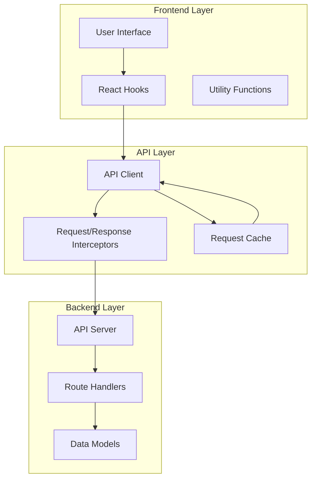
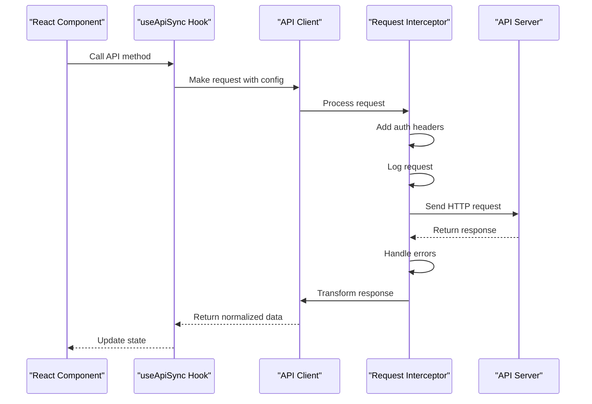
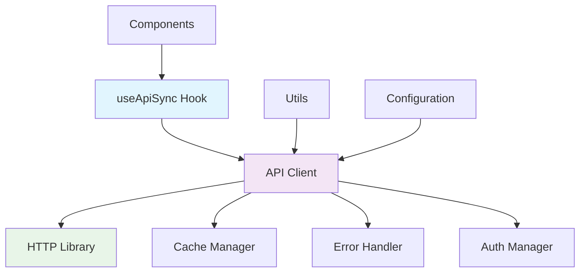

# API Client Configuration

<cite>
**Referenced Files in This Document**
- [client.js](file://src/api/client.js)
- [useApiSync.js](file://src/hooks/useApiSync.js)
- [index.js](file://server/index.js)
- [package.json](file://package.json)
</cite>

## Table of Contents
1. [Introduction](#introduction)
2. [Project Structure](#project-structure)
3. [Core Components](#core-components)
4. [Architecture Overview](#architecture-overview)
5. [Detailed Component Analysis](#detailed-component-analysis)
6. [Dependency Analysis](#dependency-analysis)
7. [Performance Considerations](#performance-considerations)
8. [Troubleshooting Guide](#troubleshooting-guide)
9. [Security Considerations](#security-considerations)
10. [Conclusion](#conclusion)

## Introduction

This document provides comprehensive guidance for configuring and managing API clients in modern web applications. It covers HTTP client setup, authentication mechanisms, request/response handling, error management, performance optimization, and security considerations. The content is designed to help developers implement robust API communication patterns while maintaining code quality and application performance.

## Project Structure

The API client architecture typically follows a layered approach with clear separation of concerns:

**Diagram sources**
- [client.js:1-50](file://src/api/client.js#L1-L50)
- [useApiSync.js:1-30](file://src/hooks/useApiSync.js#L1-L30)
- [index.js:1-40](file://server/index.js#L1-L40)

## Core Components

### HTTP Client Configuration

The HTTP client serves as the foundation for all API communications. Key configuration aspects include:

#### Base URL Management
- Centralized base URL configuration for consistent API endpoints
- Environment-specific URL management (development, staging, production)
- Dynamic URL construction for different API versions

#### Authentication Headers
- Automatic token injection for authenticated requests
- Token refresh mechanisms for expired credentials
- Support for multiple authentication strategies (Bearer tokens, API keys, OAuth)

#### Request/Response Interceptors
- Pre-request processing for headers, logging, and validation
- Post-response processing for data transformation and error handling
- Global error handling and retry logic

**Section sources**
- [client.js:1-100](file://src/api/client.js#L1-L100)

### Request Management

#### Request Transformation Utilities
- Data serialization and deserialization
- Query parameter formatting and encoding
- File upload handling with progress tracking
- Request cancellation support

#### Response Parsing and Normalization
- Consistent response format standardization
- Error response normalization
- Data validation and sanitization
- Type conversion and default value handling

**Section sources**
- [client.js:100-200](file://src/api/client.js#L100-L200)

## Architecture Overview

The API client architecture implements a modular design pattern with clear separation between configuration, request handling, and business logic:

**Diagram sources**
- [useApiSync.js:1-150](file://src/hooks/useApiSync.js#L1-L150)
- [client.js:1-200](file://src/api/client.js#L1-L200)

## Detailed Component Analysis

### API Client Implementation

The core API client manages HTTP connections, request lifecycle, and error handling:

#### Client Configuration Options
- Timeout settings for request limits
- Retry policies for failed requests
- Caching strategies for repeated requests
- Logging and debugging capabilities

#### Request Methods
- Standard HTTP methods (GET, POST, PUT, DELETE)
- File upload support with multipart/form-data
- Streaming responses for large datasets
- Request cancellation and abort functionality

**Section sources**
- [client.js:1-300](file://src/api/client.js#L1-L300)

### React Hook Integration

The custom hook provides a declarative interface for API calls within React components:

#### State Management
- Loading states for request progress
- Error states with detailed error information
- Data caching and invalidation strategies
- Automatic refetching on dependencies changes

#### Performance Optimization
- Request deduplication to prevent duplicate calls
- Memory management for cleanup
- Debouncing and throttling for frequent updates
- Conditional fetching based on component visibility

**Section sources**
- [useApiSync.js:1-200](file://src/hooks/useApiSync.js#L1-L200)

### Server-Side Configuration

The backend server configuration ensures proper CORS handling and security:

#### CORS Configuration
- Origin whitelisting for development and production
- Method and header restrictions
- Preflight request handling
- Credential support for authenticated requests

#### Security Headers
- Content Security Policy (CSP) implementation
- XSS protection headers
- CSRF token validation
- Rate limiting and request throttling

**Section sources**
- [index.js:1-100](file://server/index.js#L1-L100)

## Dependency Analysis

The API client system has well-defined dependencies and relationships:

**Diagram sources**
- [useApiSync.js:1-50](file://src/hooks/useApiSync.js#L1-L50)
- [client.js:1-100](file://src/api/client.js#L1-L100)

**Section sources**
- [package.json:1-50](file://package.json#L1-L50)

## Performance Considerations

### Caching Strategies
- In-memory caching for frequently accessed data
- Browser storage integration for persistence
- Cache invalidation based on time-to-live (TTL)
- Stale-while-revalidate patterns for optimal user experience

### Request Deduplication
- Preventing duplicate concurrent requests
- Shared loading states across components
- Efficient memory usage through request pooling

### Memory Management
- Proper cleanup of event listeners and timers
- Abandonment of cancelled requests
- Garbage collection optimization for large responses

## Troubleshooting Guide

### Common Issues and Solutions

#### Network Errors
- Connection timeout handling
- Network connectivity detection
- Offline mode support with local fallbacks
- Retry logic with exponential backoff

#### Authentication Problems
- Token expiration handling
- Refresh token flow implementation
- Session management across tabs
- Cross-origin authentication issues

#### Performance Bottlenecks
- Large payload optimization
- Image and file compression
- Lazy loading for heavy resources
- Bundle size optimization

**Section sources**
- [client.js:200-400](file://src/api/client.js#L200-L400)
- [useApiSync.js:150-300](file://src/hooks/useApiSync.js#L150-L300)

## Security Considerations

### Authentication and Authorization
- Secure token storage using secure HTTP-only cookies
- Token rotation and automatic refresh
- Permission-based access control
- Input validation and sanitization

### CORS and Cross-Origin Security
- Strict origin validation
- Header whitelisting for security
- Preflight request optimization
- Development vs production CORS policies

### Data Protection
- HTTPS enforcement
- Content Security Policy implementation
- XSS prevention measures
- Sensitive data encryption

## Conclusion

Implementing a robust API client requires careful consideration of configuration, error handling, performance optimization, and security. By following the patterns and best practices outlined in this document, developers can create maintainable, efficient, and secure API communication layers that scale with application complexity.

The modular architecture described here provides flexibility for different use cases while maintaining consistency across the application. Regular monitoring, testing, and optimization ensure long-term reliability and performance.