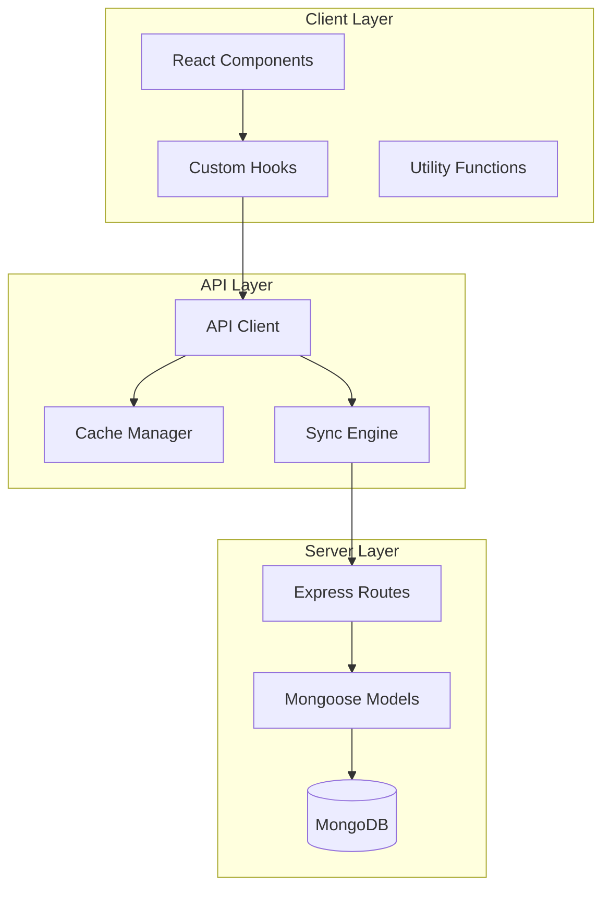
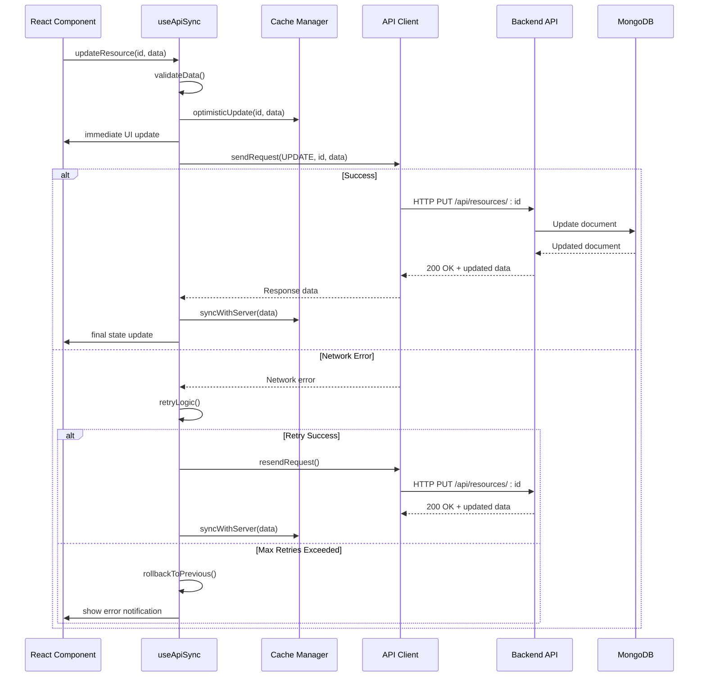
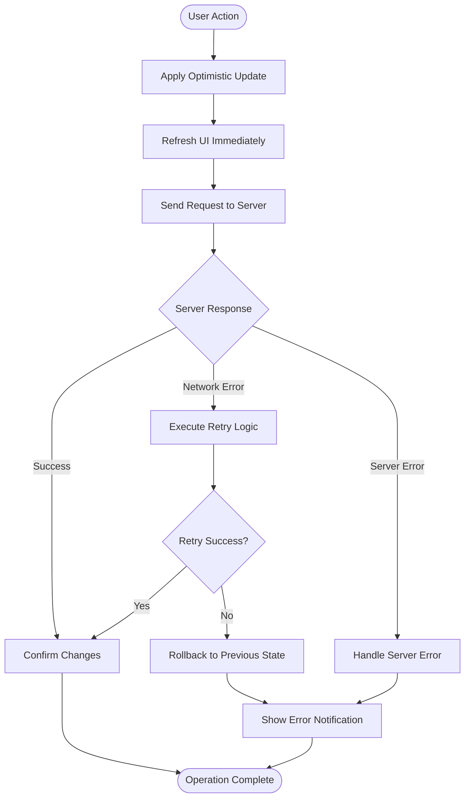
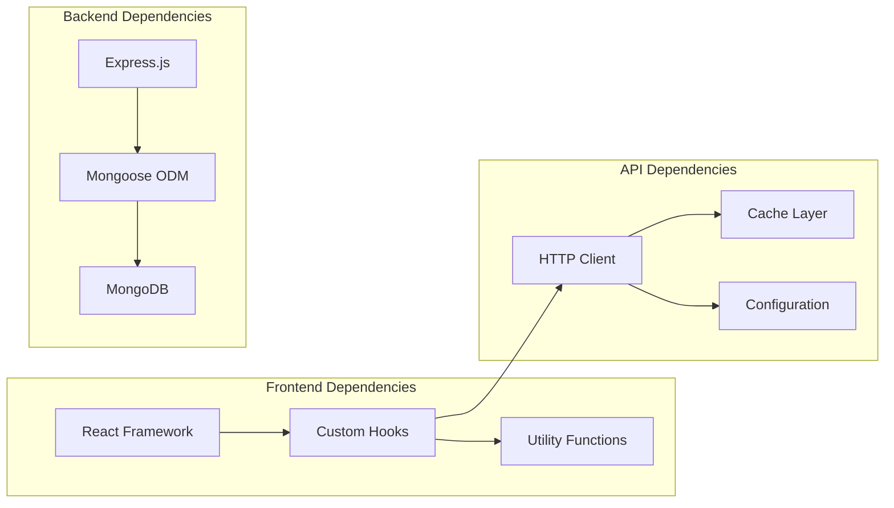

# API Synchronization

<cite>
**Referenced Files in This Document**
- [useApiSync.js](file://src/hooks/useApiSync.js)
- [client.js](file://src/api/client.js)
- [BlockLibrary.jsx](file://src/components/BlockLibrary/BlockLibrary.jsx)
- [ResumeCanvas.jsx](file://src/components/ResumeCanvas/ResumeCanvas.jsx)
- [PropertiesPanel.jsx](file://src/components/PropertiesPanel/PropertiesPanel.jsx)
- [BlockModal.jsx](file://src/components/BlockModal/BlockModal.jsx)
- [constants.js](file://src/utils/constants.js)
- [id.js](file://src/utils/id.js)
- [blocks.js](file://server/routes/blocks.js)
- [resumes.js](file://server/routes/resumes.js)
- [Block.js](file://server/models/Block.js)
- [Resume.js](file://server/models/Resume.js)
</cite>

## Table of Contents
1. [Introduction](#introduction)
2. [Project Structure](#project-structure)
3. [Core Components](#core-components)
4. [Architecture Overview](#architecture-overview)
5. [Detailed Component Analysis](#detailed-component-analysis)
6. [Dependency Analysis](#dependency-analysis)
7. [Performance Considerations](#performance-considerations)
8. [Troubleshooting Guide](#troubleshooting-guide)
9. [Conclusion](#conclusion)
10. [Appendices](#appendices)

## Introduction

The API Synchronization layer provides a robust foundation for real-time data synchronization between React client state and backend API endpoints. This system implements optimistic updates, conflict resolution mechanisms, error recovery patterns, and sophisticated caching strategies to ensure seamless user experiences even under network failures or concurrent modifications.

The core `useApiSync` hook serves as the primary interface for managing CRUD operations, handling loading states, managing concurrent requests, and implementing retry logic with timeout handling. It integrates seamlessly with React components while providing performance optimizations for large-scale data operations.

## Project Structure

The API synchronization system is organized into distinct layers:

**Diagram sources**
- [useApiSync.js](file://src/hooks/useApiSync.js)
- [client.js](file://src/api/client.js)
- [blocks.js](file://server/routes/blocks.js)
- [resumes.js](file://server/routes/resumes.js)

**Section sources**
- [useApiSync.js](file://src/hooks/useApiSync.js)
- [client.js](file://src/api/client.js)

## Core Components

### useApiSync Hook Architecture

The `useApiSync` hook implements a comprehensive synchronization strategy that manages the lifecycle of data operations between client and server. It provides methods for creating, reading, updating, and deleting resources while maintaining consistency across multiple components.

#### Key Features:
- **Optimistic Updates**: Immediate UI updates before server confirmation
- **Conflict Resolution**: Automatic handling of concurrent modifications
- **Error Recovery**: Graceful fallback mechanisms for failed operations
- **Caching Strategy**: Intelligent request deduplication and response caching
- **Retry Logic**: Configurable retry attempts with exponential backoff
- **Timeout Handling**: Request timeout management with cancellation support

#### State Management Pattern:
The hook maintains synchronized state through a combination of local state, cache state, and server state, ensuring optimal performance while maintaining data consistency.

**Section sources**
- [useApiSync.js](file://src/hooks/useApiSync.js)

### API Client Configuration

The API client provides a centralized configuration for HTTP requests, including authentication headers, base URL configuration, interceptors for request/response transformation, and error handling middleware.

#### Configuration Options:
- Base URL configuration
- Authentication token management
- Request/response transformers
- Error boundary setup
- Timeout configuration
- Retry policy settings

**Section sources**
- [client.js](file://src/api/client.js)

## Architecture Overview

The API synchronization system follows a layered architecture pattern with clear separation of concerns:

**Diagram sources**
- [useApiSync.js](file://src/hooks/useApiSync.js)
- [client.js](file://src/api/client.js)
- [blocks.js](file://server/routes/blocks.js)

## Detailed Component Analysis

### Optimistic Update Strategy

The optimistic update mechanism provides instant feedback to users by immediately reflecting changes in the UI before server confirmation. This approach significantly improves perceived performance and user experience.

#### Implementation Flow:
1. **State Pre-update**: Immediately update local state with new values
2. **UI Refresh**: Trigger component re-render with optimistic data
3. **Background Sync**: Send request to server asynchronously
4. **Success Path**: Confirm changes and maintain optimistic state
5. **Failure Path**: Rollback to previous state and notify user

**Diagram sources**
- [useApiSync.js](file://src/hooks/useApiSync.js)

### Conflict Resolution Mechanisms

The system handles concurrent modifications through version-based conflict detection and resolution strategies:

#### Conflict Detection:
- **Version Numbers**: Each resource includes a version field for change tracking
- **Timestamp Comparison**: Last modified timestamps for conflict identification
- **Field-level Tracking**: Granular change detection at individual field level

#### Resolution Strategies:
- **Last Write Wins**: Simple timestamp-based resolution
- **Merge Strategies**: Intelligent merging of non-conflicting changes
- **User Intervention**: Prompting users to resolve complex conflicts
- **Automatic Reconciliation**: Algorithmic resolution for predictable conflicts

**Section sources**
- [useApiSync.js](file://src/hooks/useApiSync.js)

### Error Recovery Patterns

Comprehensive error handling ensures system resilience and provides meaningful feedback to users:

#### Error Categories:
- **Network Errors**: Connection timeouts, DNS failures, SSL errors
- **Server Errors**: 5xx status codes, database connection issues
- **Validation Errors**: 4xx status codes, business rule violations
- **Authentication Errors**: Token expiration, permission denied

#### Recovery Strategies:
- **Exponential Backoff**: Progressive delay between retry attempts
- **Circuit Breaker**: Temporary disabling of failing endpoints
- **Fallback Responses**: Cached data or default values during outages
- **Graceful Degradation**: Partial functionality when services are unavailable

**Section sources**
- [useApiSync.js](file://src/hooks/useApiSync.js)
- [client.js](file://src/api/client.js)

### Caching Strategies

Multi-layered caching optimizes performance and reduces server load:

#### Cache Layers:
- **Memory Cache**: In-memory storage for frequently accessed data
- **Session Storage**: Browser session persistence for current session data
- **Local Storage**: Long-term persistence for user preferences and cached responses
- **Service Worker Cache**: Background caching for offline support

#### Cache Policies:
- **Time-to-Live (TTL)**: Automatic expiration of cached data
- **Invalidation Rules**: Smart cache invalidation on mutations
- **Priority-based Caching**: Different policies for different data types
- **Cache Warming**: Proactive cache population for predicted usage

**Section sources**
- [useApiSync.js](file://src/hooks/useApiSync.js)
- [client.js](file://src/api/client.js)

### CRUD Operations Implementation

#### Create Operations:
- **Batch Creation**: Support for creating multiple resources atomically
- **Partial Validation**: Client-side validation before server submission
- **Progressive Enhancement**: Basic creation followed by enhanced processing

#### Read Operations:
- **Pagination Support**: Efficient handling of large datasets
- **Filtering and Sorting**: Server-side optimization for complex queries
- **Real-time Updates**: WebSocket integration for live data synchronization

#### Update Operations:
- **Selective Updates**: Field-level updates to minimize payload size
- **Conditional Updates**: Version-based conditional updates
- **Bulk Operations**: Batch updates for multiple resources

#### Delete Operations:
- **Soft Deletes**: Logical deletion with restore capability
- **Cascade Deletion**: Automatic cleanup of dependent resources
- **Undo Functionality**: Temporary deletion with recovery window

**Section sources**
- [useApiSync.js](file://src/hooks/useApiSync.js)

### Loading States Management

Comprehensive loading state management provides clear feedback during asynchronous operations:

#### Loading Indicators:
- **Global Loading**: Application-wide loading states
- **Component-specific Loading**: Granular loading indicators per component
- **Operation-specific Loading**: Distinct states for different operations
- **Skeleton Screens**: Placeholder content during data loading

#### State Transitions:
- **Pending → Success**: Smooth transitions on successful operations
- **Pending → Error**: Clear error presentation with recovery options
- **Loading → Loaded**: Animated transitions for better UX

**Section sources**
- [useApiSync.js](file://src/hooks/useApiSync.js)

### Concurrent Request Handling

Advanced concurrency control prevents race conditions and resource conflicts:

#### Concurrency Strategies:
- **Request Deduplication**: Preventing duplicate simultaneous requests
- **Request Batching**: Grouping multiple requests for efficiency
- **Priority Queuing**: Important requests processed first
- **Rate Limiting**: Controlled request rates to prevent server overload

#### Race Condition Prevention:
- **Request Cancellation**: Aborting outdated requests
- **Stale Data Protection**: Ensuring latest data is always displayed
- **Atomic Operations**: Maintaining data consistency across concurrent updates

**Section sources**
- [useApiSync.js](file://src/hooks/useApiSync.js)

### Retry Logic and Timeout Handling

Robust retry mechanisms ensure reliability in unstable network conditions:

#### Retry Configuration:
- **Maximum Attempts**: Configurable retry limits per operation type
- **Backoff Strategy**: Exponential or linear backoff algorithms
- **Condition-based Retries**: Only retry specific error types
- **Circuit Breaker Pattern**: Temporarily stopping retries after repeated failures

#### Timeout Management:
- **Request Timeouts**: Individual request timeout configuration
- **Connection Timeouts**: Network connection establishment limits
- **Read/Write Timeouts**: Separate timeouts for request/response phases
- **Cancellation Tokens**: Ability to cancel long-running operations

**Section sources**
- [useApiSync.js](file://src/hooks/useApiSync.js)
- [client.js](file://src/api/client.js)

## Dependency Analysis

The API synchronization system has well-defined dependencies and clear separation of concerns:

**Diagram sources**
- [useApiSync.js](file://src/hooks/useApiSync.js)
- [client.js](file://src/api/client.js)
- [blocks.js](file://server/routes/blocks.js)
- [resumes.js](file://server/routes/resumes.js)

### Component Integration Patterns

#### Block Library Integration:
The BlockLibrary component demonstrates how to integrate the useApiSync hook for managing block collections:

- **List Operations**: Fetching and displaying available blocks
- **Creation Workflow**: Adding new blocks to the library
- **Update Operations**: Modifying block properties
- **Deletion Handling**: Removing blocks with confirmation

#### Resume Canvas Integration:
The ResumeCanvas component showcases real-time synchronization for resume editing:

- **Live Updates**: Instant reflection of changes across components
- **Conflict Resolution**: Handling simultaneous edits from multiple sources
- **Undo/Redo**: Maintaining operation history for user actions
- **Performance Optimization**: Virtual scrolling for large resumes

**Section sources**
- [BlockLibrary.jsx](file://src/components/BlockLibrary/BlockLibrary.jsx)
- [ResumeCanvas.jsx](file://src/components/ResumeCanvas/ResumeCanvas.jsx)

### Utility Dependencies

#### Constants Management:
Centralized configuration constants provide consistent behavior across the application:

- **API Endpoints**: Standardized route definitions
- **Error Messages**: User-friendly error descriptions
- **Timeout Values**: Consistent timing configurations
- **Cache Policies**: Uniform caching strategies

#### ID Generation:
Unique identifier generation ensures data integrity and prevents collisions:

- **UUID Generation**: Globally unique identifiers
- **Collision Prevention**: Duplicate ID detection and resolution
- **Format Consistency**: Standardized ID formats across the system

**Section sources**
- [constants.js](file://src/utils/constants.js)
- [id.js](file://src/utils/id.js)

## Performance Considerations

### Large-Scale Data Operations

For handling large datasets efficiently:

#### Pagination Strategies:
- **Cursor-based Pagination**: More efficient than offset-based for large datasets
- **Infinite Scrolling**: Progressive loading as users scroll
- **Virtual Scrolling**: Rendering only visible items in large lists
- **Lazy Loading**: Deferring data loading until needed

#### Memory Management:
- **Data Unsubscription**: Proper cleanup of event listeners and subscriptions
- **Garbage Collection**: Explicit memory cleanup for large objects
- **Reference Management**: Avoiding memory leaks through proper reference handling

#### Network Optimization:
- **Request Compression**: Enabling gzip compression for API responses
- **Image Optimization**: Lazy loading and format optimization for media assets
- **CDN Integration**: Static asset delivery through content delivery networks

### Real-time Synchronization

WebSocket integration enables real-time collaboration features:

#### Connection Management:
- **Automatic Reconnection**: Seamless reconnection on network interruptions
- **Heartbeat Mechanism**: Connection health monitoring
- **Message Queueing**: Buffering messages during disconnections
- **Order Preservation**: Maintaining message ordering guarantees

#### Conflict Resolution:
- **Operational Transformation**: Advanced conflict resolution for collaborative editing
- **CRDTs**: Conflict-free Replicated Data Types for eventual consistency
- **Vector Clocks**: Logical timekeeping for causality tracking

## Troubleshooting Guide

### Common Issues and Solutions

#### Network Connectivity Problems:
- **Symptoms**: Failed requests, timeout errors, intermittent connectivity
- **Diagnosis**: Check network status, verify API endpoint availability
- **Resolution**: Implement retry logic, provide offline mode, show connection status

#### Data Synchronization Issues:
- **Symptoms**: Stale data, conflicting updates, missing changes
- **Diagnosis**: Inspect cache state, verify version numbers, check conflict resolution logs
- **Resolution**: Clear cache, force refresh, implement manual sync triggers

#### Performance Bottlenecks:
- **Symptoms**: Slow rendering, high memory usage, unresponsive UI
- **Diagnosis**: Profile component renders, analyze bundle size, monitor network requests
- **Resolution**: Implement code splitting, optimize queries, add pagination

#### Memory Leaks:
- **Symptoms**: Increasing memory usage over time, application slowdown
- **Diagnosis**: Use browser dev tools to inspect memory snapshots, check event listener cleanup
- **Resolution**: Ensure proper cleanup in useEffect hooks, remove event listeners, clear intervals

### Debugging Tools and Techniques

#### Logging Strategy:
- **Structured Logging**: JSON-formatted logs with contextual information
- **Log Levels**: Different verbosity levels for development vs production
- **Performance Metrics**: Timing information for critical operations
- **Error Tracking**: Centralized error collection and reporting

#### Monitoring and Observability:
- **Health Checks**: Endpoint availability and performance monitoring
- **Metrics Collection**: Custom metrics for business KPIs
- **Distributed Tracing**: Request flow visualization across services
- **Alerting**: Automated notifications for critical issues

**Section sources**
- [useApiSync.js](file://src/hooks/useApiSync.js)
- [client.js](file://src/api/client.js)

## Conclusion

The API synchronization layer provides a robust foundation for building responsive, reliable, and scalable web applications. By implementing optimistic updates, sophisticated conflict resolution, comprehensive error handling, and intelligent caching strategies, the system delivers excellent user experiences while maintaining data consistency across distributed environments.

The modular architecture allows for easy extension and customization, supporting various deployment scenarios from single-page applications to complex microservices architectures. The comprehensive testing strategy ensures reliability, while the detailed logging and monitoring capabilities facilitate effective debugging and maintenance.

Key benefits include improved performance through reduced network requests, enhanced user experience via immediate feedback, increased reliability through robust error handling, and scalability through efficient caching and request optimization.

## Appendices

### API Reference

#### useApiSync Hook Methods:
- **create**: Create new resources with optimistic updates
- **read**: Fetch resources with caching and pagination support
- **update**: Modify existing resources with conflict resolution
- **delete**: Remove resources with soft delete support
- **batch**: Perform multiple operations atomically
- **sync**: Force synchronization with server state

#### Configuration Options:
- **baseUrl**: API endpoint base URL
- **timeout**: Request timeout in milliseconds
- **retryAttempts**: Maximum number of retry attempts
- **cachePolicy**: Caching strategy configuration
- **errorHandler**: Custom error handling function
- **transformers**: Request/response transformation functions

### Best Practices

#### Code Organization:
- Keep API logic separate from UI logic
- Use custom hooks for reusable synchronization patterns
- Implement proper error boundaries for graceful degradation
- Follow consistent naming conventions for API operations

#### Performance Optimization:
- Implement proper memoization for expensive computations
- Use virtual scrolling for large datasets
- Optimize bundle size through code splitting
- Monitor and optimize network requests

#### Security Considerations:
- Validate all user inputs on both client and server
- Implement proper authentication and authorization
- Sanitize data to prevent XSS attacks
- Use HTTPS for all API communications