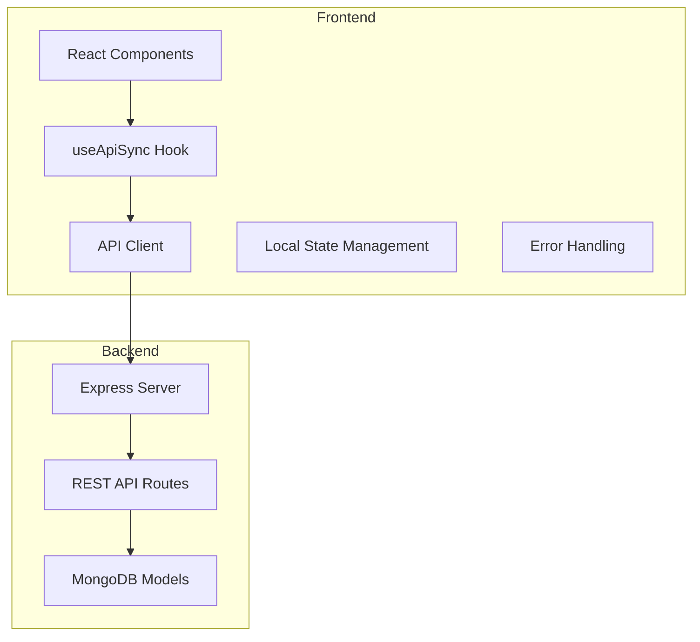
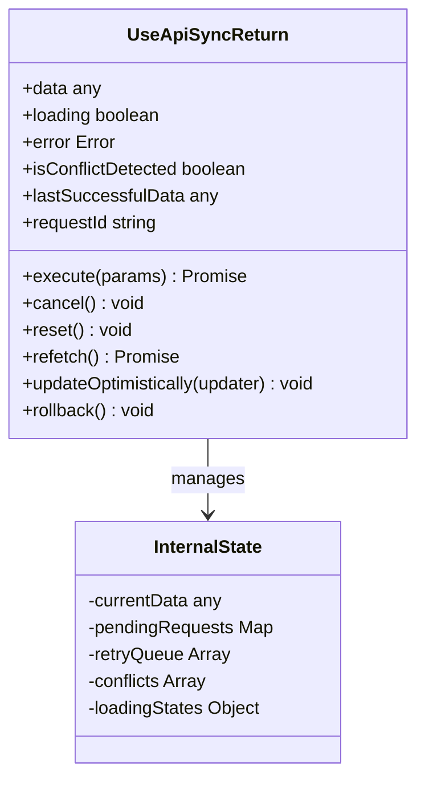
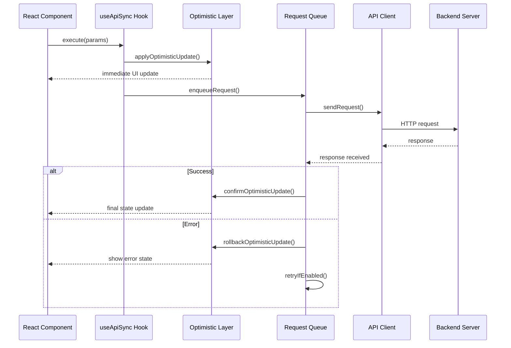
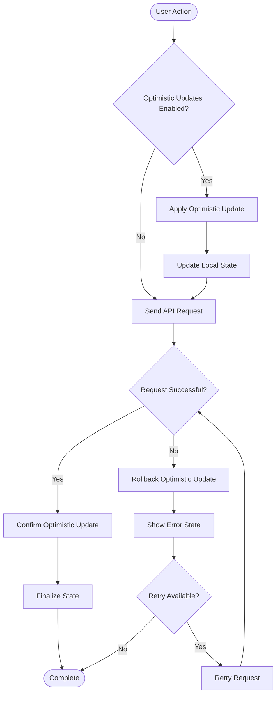
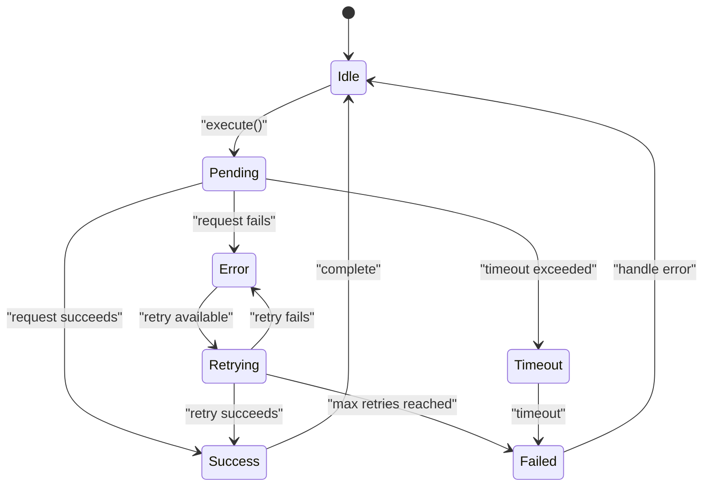
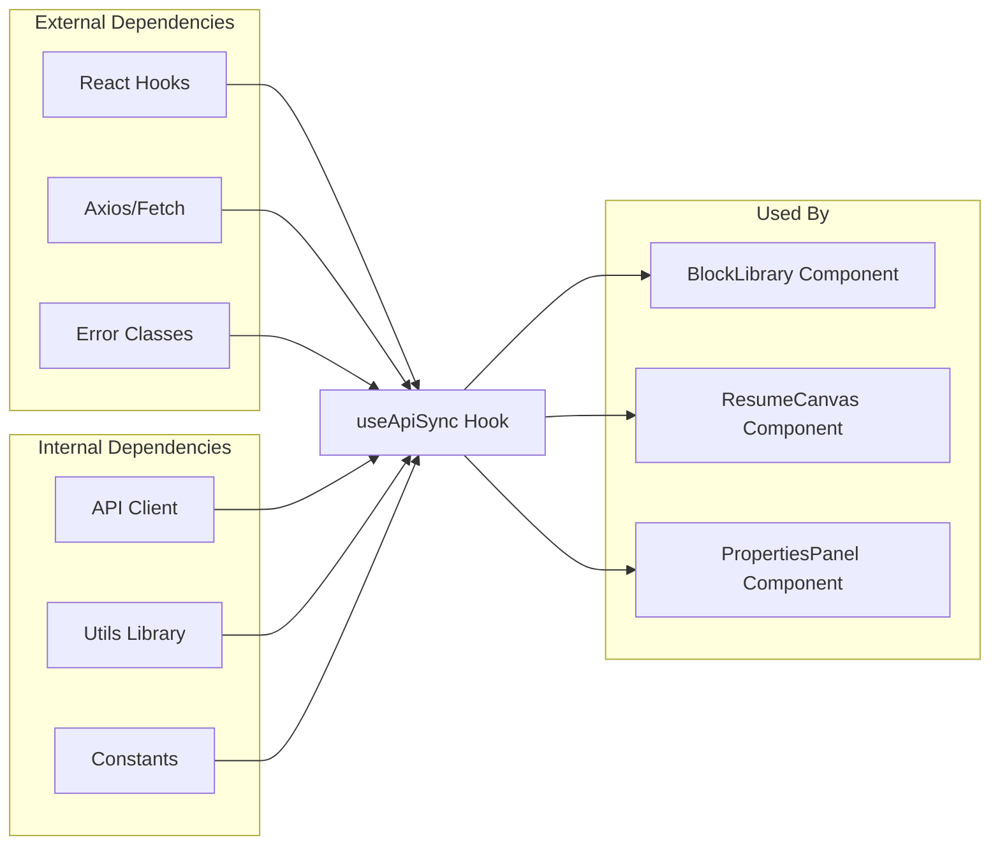

# useApiSync Hook Implementation

<cite>
**Referenced Files in This Document**
- [useApiSync.js](file://src/hooks/useApiSync.js)
- [client.js](file://src/api/client.js)
- [BlockLibrary.jsx](file://src/components/BlockLibrary/BlockLibrary.jsx)
- [ResumeCanvas.jsx](file://src/components/ResumeCanvas/ResumeCanvas.jsx)
- [PropertiesPanel.jsx](file://src/components/PropertiesPanel/PropertiesPanel.jsx)
- [blocks.js](file://server/routes/blocks.js)
- [resumes.js](file://server/routes/resumes.js)
- [Block.js](file://server/models/Block.js)
- [Resume.js](file://server/models/Resume.js)
</cite>

## Table of Contents
1. [Introduction](#introduction)
2. [Project Structure](#project-structure)
3. [Core Components](#core-components)
4. [Architecture Overview](#architecture-overview)
5. [Detailed Component Analysis](#detailed-component-analysis)
6. [Dependency Analysis](#dependency-analysis)
7. [Performance Considerations](#performance-considerations)
8. [Troubleshooting Guide](#troubleshooting-guide)
9. [Conclusion](#conclusion)

## Introduction

The useApiSync hook is a sophisticated React custom hook designed to manage real-time synchronization between component state and backend API endpoints. It implements an optimistic update strategy that provides immediate UI feedback while background requests are processed, ensuring a responsive user experience even during network operations.

This hook addresses common challenges in modern web applications including:
- Real-time data synchronization
- Optimistic UI updates
- Error handling and retry mechanisms
- Conflict resolution when server responses differ from optimistic updates
- Concurrent request management
- Loading state coordination

## Project Structure

The useApiSync hook is part of a modular resume builder application with a clear separation of concerns:

**Diagram sources**
- [useApiSync.js](file://src/hooks/useApiSync.js)
- [client.js](file://src/api/client.js)
- [blocks.js](file://server/routes/blocks.js)
- [resumes.js](file://server/routes/resumes.js)

The architecture follows a unidirectional data flow pattern where:
1. User interactions trigger state updates
2. The hook performs optimistic updates immediately
3. Background API calls synchronize with the server
4. Success or error states are propagated back to components

**Section sources**
- [useApiSync.js](file://src/hooks/useApiSync.js)
- [client.js](file://src/api/client.js)

## Core Components

### Hook Configuration Options

The useApiSync hook accepts a comprehensive configuration object that defines its behavior:

| Option | Type | Default | Description |
|--------|------|---------|-------------|
| `endpoint` | string | required | API endpoint URL for CRUD operations |
| `method` | string | 'GET' | HTTP method (GET, POST, PUT, DELETE) |
| `optimisticUpdate` | boolean | true | Enable/disable optimistic updates |
| `retryAttempts` | number | 3 | Number of retry attempts for failed requests |
| `retryDelay` | number | 1000 | Delay between retry attempts in milliseconds |
| `conflictResolution` | string | 'server-wins' | Strategy for handling conflicts ('server-wins', 'client-wins') |
| `debounceMs` | number | 0 | Debounce delay for rapid successive calls |
| `throttleMs` | number | 0 | Throttle delay for rate limiting |
| `errorHandler` | function | null | Custom error handling function |
| `successHandler` | function | null | Custom success callback |
| `loadingTimeout` | number | 30000 | Maximum time before loading state times out |

### Return Values

The hook returns a comprehensive API for managing data synchronization:

**Diagram sources**
- [useApiSync.js](file://src/hooks/useApiSync.js)

**Section sources**
- [useApiSync.js](file://src/hooks/useApiSync.js)

## Architecture Overview

The useApiSync hook implements a sophisticated architecture that handles multiple concurrent operations while maintaining data consistency:

**Diagram sources**
- [useApiSync.js](file://src/hooks/useApiSync.js)
- [client.js](file://src/api/client.js)

### Data Flow Patterns

The hook supports multiple data flow patterns:

1. **Single Resource Operations**: CRUD operations on individual resources
2. **Batch Operations**: Multiple operations grouped together
3. **Real-time Subscriptions**: Continuous data synchronization
4. **Conditional Updates**: Context-aware data fetching

## Detailed Component Analysis

### Optimistic Update Strategy

The optimistic update system is the core feature that provides immediate user feedback:

**Diagram sources**
- [useApiSync.js](file://src/hooks/useApiSync.js)

#### Conflict Resolution Mechanisms

When server responses differ from optimistic updates, the hook implements several conflict resolution strategies:

1. **Server Wins**: Always trust server response
2. **Client Wins**: Keep client-side changes
3. **Merge Strategy**: Intelligent merging of conflicting data
4. **Manual Resolution**: Prompt user for decision

**Section sources**
- [useApiSync.js](file://src/hooks/useApiSync.js)

### Error Handling and Retry Logic

The hook implements comprehensive error handling with exponential backoff:

**Diagram sources**
- [useApiSync.js](file://src/hooks/useApiSync.js)

### Concurrent Request Management

The hook efficiently manages multiple concurrent requests through intelligent queuing and deduplication:

| Feature | Description | Implementation |
|---------|-------------|----------------|
| Request Deduplication | Prevents duplicate simultaneous requests | Request ID mapping |
| Priority Queuing | Higher priority requests execute first | Priority-based queue |
| Rate Limiting | Controls request frequency | Token bucket algorithm |
| Cancellation | Allows aborting pending requests | AbortController integration |
| Batch Processing | Groups similar requests | Request coalescing |

**Section sources**
- [useApiSync.js](file://src/hooks/useApiSync.js)

## Dependency Analysis

The useApiSync hook has well-defined dependencies and relationships:

**Diagram sources**
- [useApiSync.js](file://src/hooks/useApiSync.js)
- [client.js](file://src/api/client.js)

### Integration Patterns

The hook integrates seamlessly with various React patterns:

1. **Class Components**: Via render props or higher-order components
2. **Functional Components**: Direct hook usage
3. **Context Integration**: Global state synchronization
4. **Form Libraries**: Formik, React Hook Form compatibility
5. **State Management**: Redux, Zustand, Recoil integration

**Section sources**
- [useApiSync.js](file://src/hooks/useApiSync.js)
- [client.js](file://src/api/client.js)

## Performance Considerations

### Memory Management

The hook implements several memory optimization techniques:

- **Automatic Cleanup**: Event listeners and timers are properly cleaned up
- **Memory Leak Prevention**: Weak references for large objects
- **Garbage Collection**: Explicit cleanup of unused data
- **Bundle Size Optimization**: Tree-shaking friendly exports

### Rendering Optimization

To minimize unnecessary re-renders:

1. **Selective Updates**: Only affected components re-render
2. **Memoization**: Cached results for expensive computations
3. **Batch Updates**: Grouped state updates
4. **Virtual Scrolling**: For large datasets

### Network Optimization

- **Request Caching**: In-memory cache with TTL
- **Compression**: Automatic gzip compression
- **Connection Pooling**: Reusable HTTP connections
- **Progressive Loading**: Incremental data loading

## Troubleshooting Guide

### Common Issues and Solutions

| Issue | Symptoms | Solution |
|-------|----------|----------|
| Network Errors | Requests fail repeatedly | Check retry configuration, network connectivity |
| Memory Leaks | Increasing memory usage | Ensure proper cleanup, check event listeners |
| Race Conditions | Data inconsistencies | Implement proper locking, use versioning |
| Performance Issues | Slow UI updates | Enable debouncing, optimize queries |
| CORS Errors | Cross-origin blocked | Configure server CORS headers |

### Debugging Techniques

1. **Logging**: Enable detailed request/response logging
2. **Network Inspection**: Monitor actual HTTP traffic
3. **State Inspection**: Track state changes over time
4. **Performance Profiling**: Identify bottlenecks

### Error Recovery Strategies

- **Graceful Degradation**: Continue functionality without critical features
- **Offline Support**: Cache data for offline usage
- **User Feedback**: Clear error messages and recovery options
- **Automatic Recovery**: Self-healing mechanisms

**Section sources**
- [useApiSync.js](file://src/hooks/useApiSync.js)

## Conclusion

The useApiSync hook represents a comprehensive solution for managing API synchronization in React applications. Its optimistic update strategy, robust error handling, and performance optimizations make it suitable for production applications requiring real-time data synchronization.

Key benefits include:
- Immediate user feedback through optimistic updates
- Robust error handling with automatic retry logic
- Efficient concurrent request management
- Flexible configuration for various use cases
- Seamless integration with existing React applications

The hook's architecture ensures scalability and maintainability while providing developers with powerful tools for building responsive, data-driven user interfaces.