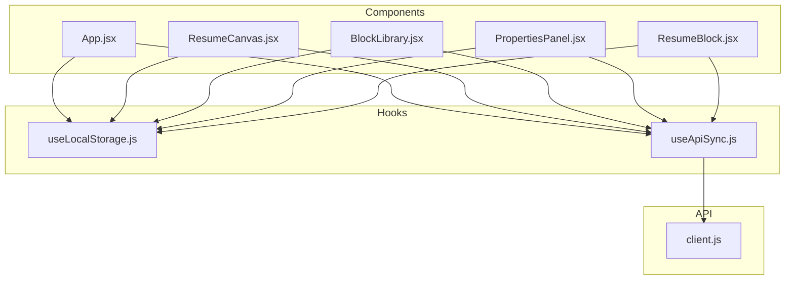
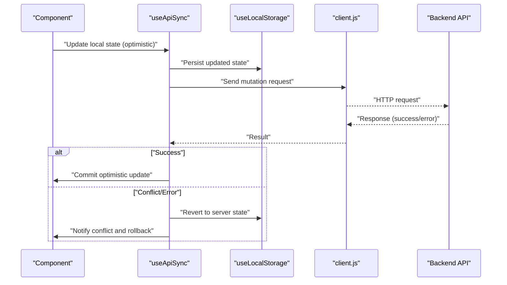
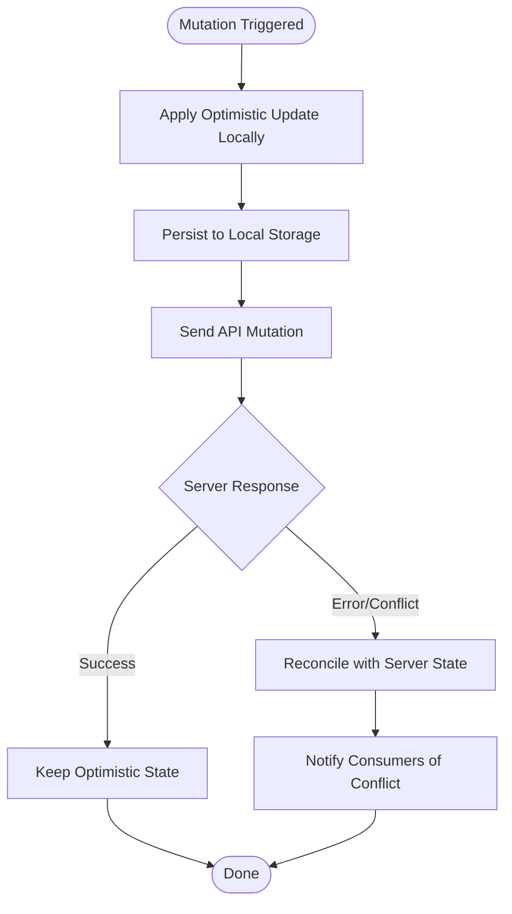
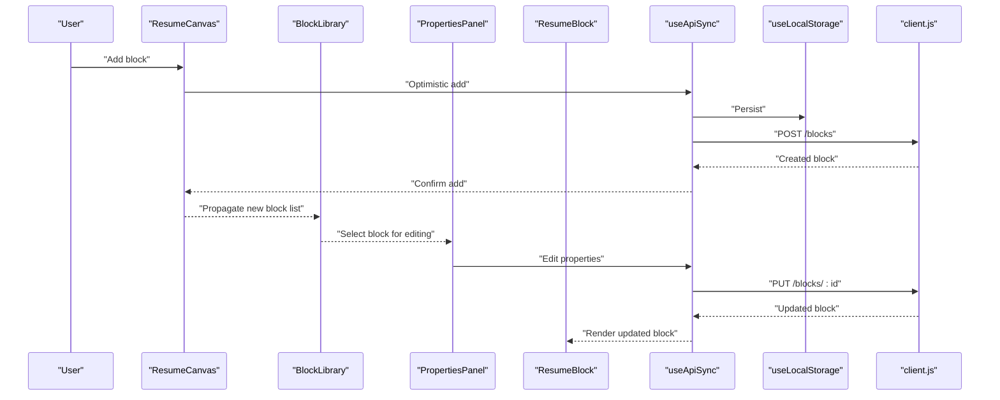
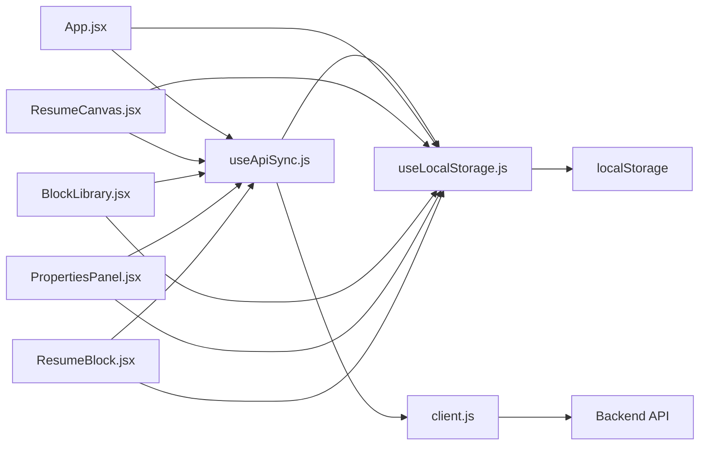

# State Management

<cite>
**Referenced Files in This Document**
- [useApiSync.js](file://src/hooks/useApiSync.js)
- [useLocalStorage.js](file://src/hooks/useLocalStorage.js)
- [client.js](file://src/api/client.js)
- [App.jsx](file://src/App.jsx)
- [ResumeCanvas.jsx](file://src/components/ResumeCanvas/ResumeCanvas.jsx)
- [BlockLibrary.jsx](file://src/components/BlockLibrary/BlockLibrary.jsx)
- [PropertiesPanel.jsx](file://src/components/PropertiesPanel/PropertiesPanel.jsx)
- [ResumeBlock.jsx](file://src/components/ResumeCanvas/ResumeBlock.jsx)
</cite>

## Table of Contents
1. [Introduction](#introduction)
2. [Project Structure](#project-structure)
3. [Core Components](#core-components)
4. [Architecture Overview](#architecture-overview)
5. [Detailed Component Analysis](#detailed-component-analysis)
6. [Dependency Analysis](#dependency-analysis)
7. [Performance Considerations](#performance-considerations)
8. [Troubleshooting Guide](#troubleshooting-guide)
9. [Conclusion](#conclusion)

## Introduction
This document explains the frontend state management strategy for the application, focusing on a hybrid approach that combines React useState hooks with local storage persistence and API synchronization. The design centers around two custom hooks:
- useLocalStorage: Provides automatic persistence of component state across browser sessions using localStorage.
- useApiSync: Synchronizes client-side state with a backend API, supporting optimistic updates and conflict resolution.

The goal is to deliver a responsive user experience while ensuring data durability and consistency between the client and server.

## Project Structure
State-related logic is primarily implemented in the hooks directory and consumed by components that manage resume content and UI interactions. The API client abstracts network calls used by the synchronization hook.

**Diagram sources**
- [useApiSync.js](file://src/hooks/useApiSync.js)
- [useLocalStorage.js](file://src/hooks/useLocalStorage.js)
- [client.js](file://src/api/client.js)
- [App.jsx](file://src/App.jsx)
- [ResumeCanvas.jsx](file://src/components/ResumeCanvas/ResumeCanvas.jsx)
- [BlockLibrary.jsx](file://src/components/BlockLibrary/BlockLibrary.jsx)
- [PropertiesPanel.jsx](file://src/components/PropertiesPanel/PropertiesPanel.jsx)
- [ResumeBlock.jsx](file://src/components/ResumeCanvas/ResumeBlock.jsx)

**Section sources**
- [useApiSync.js](file://src/hooks/useApiSync.js)
- [useLocalStorage.js](file://src/hooks/useLocalStorage.js)
- [client.js](file://src/api/client.js)
- [App.jsx](file://src/App.jsx)
- [ResumeCanvas.jsx](file://src/components/ResumeCanvas/ResumeCanvas.jsx)
- [BlockLibrary.jsx](file://src/components/BlockLibrary/BlockLibrary.jsx)
- [PropertiesPanel.jsx](file://src/components/PropertiesPanel/PropertiesPanel.jsx)
- [ResumeBlock.jsx](file://src/components/ResumeCanvas/ResumeBlock.jsx)

## Core Components
This section outlines the core building blocks of the state management strategy.

- useLocalStorage
  - Purpose: Persist state to localStorage and initialize state from it when available.
  - Behavior: Reads from localStorage on initialization; writes to localStorage on state changes; supports optional serialization/deserialization.
  - Typical usage: Wrap any useState-based state that should survive page reloads or browser restarts.

- useApiSync
  - Purpose: Keep client state synchronized with a remote API.
  - Behavior:
    - Initializes state from either local storage or an initial value.
    - Performs GET requests to fetch current server state when needed.
    - Supports optimistic updates: immediately apply local changes, then reconcile with server results.
    - Handles conflicts by comparing versions or timestamps and applying server wins when necessary.
    - Debounces or batches writes to reduce network overhead.
  - Typical usage: Manage collections (e.g., blocks) or documents (e.g., resumes) that must be persisted remotely.

- API Client
  - Purpose: Encapsulate HTTP calls to the backend.
  - Behavior: Provides typed methods for GET, POST, PUT, DELETE operations with error handling and retry strategies as appropriate.

- App and Components
  - App orchestrates top-level state and passes down handlers or context where needed.
  - ResumeCanvas, BlockLibrary, PropertiesPanel, and ResumeBlock consume hooks to read/write state and trigger sync operations.

**Section sources**
- [useLocalStorage.js](file://src/hooks/useLocalStorage.js)
- [useApiSync.js](file://src/hooks/useApiSync.js)
- [client.js](file://src/api/client.js)
- [App.jsx](file://src/App.jsx)
- [ResumeCanvas.jsx](file://src/components/ResumeCanvas/ResumeCanvas.jsx)
- [BlockLibrary.jsx](file://src/components/BlockLibrary/BlockLibrary.jsx)
- [PropertiesPanel.jsx](file://src/components/PropertiesPanel/PropertiesPanel.jsx)
- [ResumeBlock.jsx](file://src/components/ResumeCanvas/ResumeBlock.jsx)

## Architecture Overview
The state architecture follows a layered pattern:
- Presentation layer (components) uses React useState via custom hooks.
- Persistence layer (useLocalStorage) ensures durability across sessions.
- Sync layer (useApiSync) coordinates with the API client to maintain consistency with the server.

**Diagram sources**
- [useApiSync.js](file://src/hooks/useApiSync.js)
- [useLocalStorage.js](file://src/hooks/useLocalStorage.js)
- [client.js](file://src/api/client.js)

## Detailed Component Analysis

### useLocalStorage Hook
Responsibilities:
- Initialize state from localStorage if present.
- Persist state changes automatically.
- Provide a stable interface similar to useState.

Key behaviors:
- Serialization/deserialization for complex objects.
- Safe fallbacks when localStorage is unavailable.
- Optional key configuration to scope storage per feature.

Typical integration points:
- Used by components to persist UI preferences, draft content, or small datasets.

**Section sources**
- [useLocalStorage.js](file://src/hooks/useLocalStorage.js)

### useApiSync Hook
Responsibilities:
- Maintain a single source of truth combining local state, persistence, and server state.
- Implement optimistic updates for responsiveness.
- Resolve conflicts by comparing versioning metadata or timestamps.
- Manage loading and error states during network operations.

Optimistic Update Flow:
- Immediately apply local change.
- Persist to localStorage.
- Send mutation to server.
- On success, keep local state.
- On failure/conflict, revert to server state and notify consumers.

Conflict Resolution Strategy:
- Compare server-provided version/timestamp with local version.
- If server is newer, merge or replace local state accordingly.
- Surface conflict details to UI for user awareness if needed.

Debouncing/Batching:
- Coalesce rapid mutations to minimize network traffic.
- Ensure final state reflects all intended changes.

**Diagram sources**
- [useApiSync.js](file://src/hooks/useApiSync.js)
- [client.js](file://src/api/client.js)

**Section sources**
- [useApiSync.js](file://src/hooks/useApiSync.js)
- [client.js](file://src/api/client.js)

### API Client
Responsibilities:
- Centralize HTTP requests.
- Handle headers, base URLs, and error normalization.
- Provide methods for CRUD operations used by useApiSync.

Integration:
- Consumed by useApiSync for all network interactions.
- May include retry/backoff policies and timeout handling.

**Section sources**
- [client.js](file://src/api/client.js)

### App and Component Integration
Responsibilities:
- App initializes top-level state and composes features.
- Components like ResumeCanvas, BlockLibrary, PropertiesPanel, and ResumeBlock use hooks to read and mutate state.

State Propagation Patterns:
- Lifting state up to App or shared containers when multiple components need access.
- Passing callbacks down to allow child components to trigger mutations.
- Using context only when necessary to avoid unnecessary re-renders.

**Diagram sources**
- [ResumeCanvas.jsx](file://src/components/ResumeCanvas/ResumeCanvas.jsx)
- [BlockLibrary.jsx](file://src/components/BlockLibrary/BlockLibrary.jsx)
- [PropertiesPanel.jsx](file://src/components/PropertiesPanel/PropertiesPanel.jsx)
- [ResumeBlock.jsx](file://src/components/ResumeCanvas/ResumeBlock.jsx)
- [useApiSync.js](file://src/hooks/useApiSync.js)
- [useLocalStorage.js](file://src/hooks/useLocalStorage.js)
- [client.js](file://src/api/client.js)

**Section sources**
- [App.jsx](file://src/App.jsx)
- [ResumeCanvas.jsx](file://src/components/ResumeCanvas/ResumeCanvas.jsx)
- [BlockLibrary.jsx](file://src/components/BlockLibrary/BlockLibrary.jsx)
- [PropertiesPanel.jsx](file://src/components/PropertiesPanel/PropertiesPanel.jsx)
- [ResumeBlock.jsx](file://src/components/ResumeCanvas/ResumeBlock.jsx)

## Dependency Analysis
The following diagram shows how state management dependencies are organized:

**Diagram sources**
- [useApiSync.js](file://src/hooks/useApiSync.js)
- [useLocalStorage.js](file://src/hooks/useLocalStorage.js)
- [client.js](file://src/api/client.js)
- [App.jsx](file://src/App.jsx)
- [ResumeCanvas.jsx](file://src/components/ResumeCanvas/ResumeCanvas.jsx)
- [BlockLibrary.jsx](file://src/components/BlockLibrary/BlockLibrary.jsx)
- [PropertiesPanel.jsx](file://src/components/PropertiesPanel/PropertiesPanel.jsx)
- [ResumeBlock.jsx](file://src/components/ResumeCanvas/ResumeBlock.jsx)

**Section sources**
- [useApiSync.js](file://src/hooks/useApiSync.js)
- [useLocalStorage.js](file://src/hooks/useLocalStorage.js)
- [client.js](file://src/api/client.js)
- [App.jsx](file://src/App.jsx)
- [ResumeCanvas.jsx](file://src/components/ResumeCanvas/ResumeCanvas.jsx)
- [BlockLibrary.jsx](file://src/components/BlockLibrary/BlockLibrary.jsx)
- [PropertiesPanel.jsx](file://src/components/PropertiesPanel/PropertiesPanel.jsx)
- [ResumeBlock.jsx](file://src/components/ResumeCanvas/ResumeBlock.jsx)

## Performance Considerations
- Minimize re-renders:
  - Use memoization (e.g., useMemo, useCallback) for derived data and callbacks passed to children.
  - Avoid passing large objects directly; prefer IDs and lookups where possible.
- Debounce/batch mutations:
  - Coalesce frequent updates to reduce network calls and storage writes.
- Efficient persistence:
  - Serialize only necessary fields; avoid storing transient UI state.
  - Consider chunking large payloads if supported by the API.
- Large datasets:
  - Paginate or virtualize lists to limit DOM size.
  - Use normalized state shapes to prevent duplication and simplify updates.
- Memory management:
  - Clean up listeners and timers in useEffect.
  - Avoid retaining references to large objects after unmount.

[No sources needed since this section provides general guidance]

## Troubleshooting Guide
Common issues and resolutions:
- Conflicts between local and server state:
  - Verify version/timestamp comparison logic in the sync hook.
  - Ensure optimistic updates are rolled back correctly on errors.
- Stale data after refresh:
  - Confirm that initialization reads from both local storage and API as appropriate.
- Excessive network calls:
  - Check debouncing/throttling settings and ensure mutations are coalesced.
- localStorage limitations:
  - Validate storage quotas and handle quota exceeded errors gracefully.
- Error visibility:
  - Surface meaningful messages to users when sync fails or conflicts occur.

**Section sources**
- [useApiSync.js](file://src/hooks/useApiSync.js)
- [useLocalStorage.js](file://src/hooks/useLocalStorage.js)
- [client.js](file://src/api/client.js)

## Conclusion
The hybrid state management approach leverages React’s useState for simplicity and performance, useLocalStorage for durability, and useApiSync for consistency with the backend. By applying optimistic updates, conflict resolution, and careful performance practices, the application delivers a responsive and reliable user experience while maintaining data integrity across sessions and devices.

[No sources needed since this section summarizes without analyzing specific files]