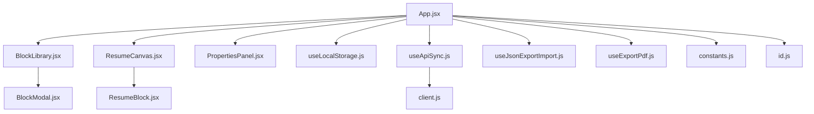
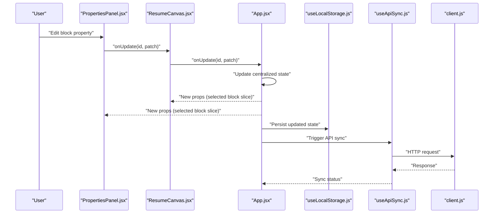
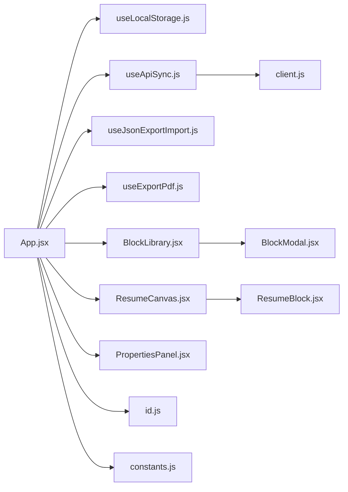
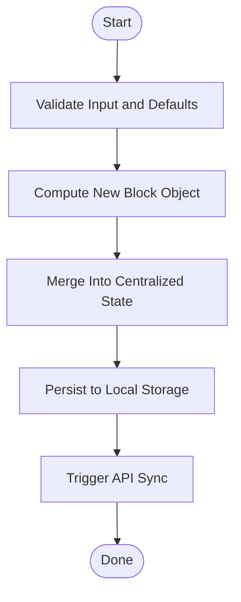
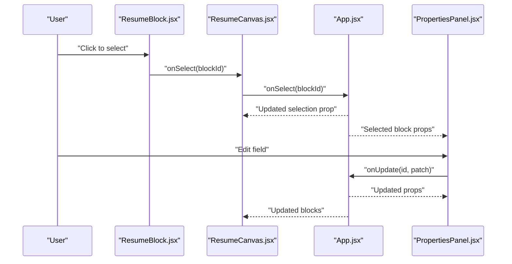

# State Update Patterns

<cite>
**Referenced Files in This Document**
- [App.jsx](file://src/App.jsx)
- [main.jsx](file://src/main.jsx)
- [BlockLibrary.jsx](file://src/components/BlockLibrary/BlockLibrary.jsx)
- [BlockModal.jsx](file://src/components/BlockModal/BlockModal.jsx)
- [PropertiesPanel.jsx](file://src/components/PropertiesPanel/PropertiesPanel.jsx)
- [ResumeCanvas.jsx](file://src/components/ResumeCanvas/ResumeCanvas.jsx)
- [ResumeBlock.jsx](file://src/components/ResumeCanvas/ResumeBlock.jsx)
- [useApiSync.js](file://src/hooks/useApiSync.js)
- [useExportPdf.js](file://src/hooks/useExportPdf.js)
- [useJsonExportImport.js](file://src/hooks/useJsonExportImport.js)
- [useLocalStorage.js](file://src/hooks/useLocalStorage.js)
- [client.js](file://src/api/client.js)
- [constants.js](file://src/utils/constants.js)
- [id.js](file://src/utils/id.js)
</cite>

## Table of Contents
1. [Introduction](#introduction)
2. [Project Structure](#project-structure)
3. [Core Components](#core-components)
4. [Architecture Overview](#architecture-overview)
5. [Detailed Component Analysis](#detailed-component-analysis)
6. [Dependency Analysis](#dependency-analysis)
7. [Performance Considerations](#performance-considerations)
8. [Troubleshooting Guide](#troubleshooting-guide)
9. [Conclusion](#conclusion)
10. [Appendices](#appendices)

## Introduction
This document explains state update patterns across the application with a focus on:
- Local component state using React useState hooks
- Propagation of state through component trees via props and callbacks
- Event handling patterns for user interactions
- Relationship between local state and persisted state (local storage and API), including sync triggers and update cascades
- Performance optimizations such as memoization, selective re-rendering, and state normalization
- Complex state transformations, batch updates, and consistency across multiple components
- Common pitfalls like unnecessary re-renders and memory leaks, with solutions and best practices

## Project Structure
The application is organized into feature-based directories:
- src/components: UI components that manage local state and render views
- src/hooks: Custom hooks encapsulating stateful logic (persistence, export/import, API sync)
- src/api: HTTP client abstraction for server communication
- src/utils: Shared utilities (constants, ID generation)
- src: Application entry points and top-level app shell

**Diagram sources**
- [App.jsx](file://src/App.jsx)
- [BlockLibrary.jsx](file://src/components/BlockLibrary/BlockLibrary.jsx)
- [ResumeCanvas.jsx](file://src/components/ResumeCanvas/ResumeCanvas.jsx)
- [ResumeBlock.jsx](file://src/components/ResumeCanvas/ResumeBlock.jsx)
- [BlockModal.jsx](file://src/components/BlockModal/BlockModal.jsx)
- [useLocalStorage.js](file://src/hooks/useLocalStorage.js)
- [useApiSync.js](file://src/hooks/useApiSync.js)
- [useJsonExportImport.js](file://src/hooks/useJsonExportImport.js)
- [useExportPdf.js](file://src/hooks/useExportPdf.js)
- [client.js](file://src/api/client.js)
- [constants.js](file://src/utils/constants.js)
- [id.js](file://src/utils/id.js)

**Section sources**
- [main.jsx](file://src/main.jsx)
- [App.jsx](file://src/App.jsx)

## Core Components
- App.jsx: Orchestrates global resume state, persistence, and cross-component coordination. It typically holds arrays of blocks and related metadata, exposes setters via props, and wires up sync/export hooks.
- BlockLibrary.jsx: Presents available block types; dispatches actions to add new blocks to the canvas.
- ResumeCanvas.jsx: Renders the ordered list of blocks and provides handlers for reorder, delete, and selection.
- ResumeBlock.jsx: Represents an individual block instance; manages its own local editing state and forwards changes upward.
- PropertiesPanel.jsx: Displays and edits properties of the selected block; applies updates back to the central state.
- BlockModal.jsx: Modal used to choose or configure a block before insertion.

State responsibilities:
- Centralized resume model (e.g., blocks array) lives at the top level and is passed down via props.
- Local editing state resides within leaf components (e.g., per-block fields) and is committed upward via callbacks.
- Persistence and synchronization are handled by custom hooks that observe state changes and trigger side effects.

**Section sources**
- [App.jsx](file://src/App.jsx)
- [BlockLibrary.jsx](file://src/components/BlockLibrary/BlockLibrary.jsx)
- [ResumeCanvas.jsx](file://src/components/ResumeCanvas/ResumeCanvas.jsx)
- [ResumeBlock.jsx](file://src/components/ResumeCanvas/ResumeBlock.jsx)
- [PropertiesPanel.jsx](file://src/components/PropertiesPanel/PropertiesPanel.jsx)
- [BlockModal.jsx](file://src/components/BlockModal/BlockModal.jsx)

## Architecture Overview
The state architecture follows a unidirectional data flow:
- User events trigger local state updates in leaf components.
- Leaf components call prop callbacks to commit changes to parent state.
- Parent components update centralized state and pass relevant slices down to children.
- Custom hooks observe state changes and perform persistence and API sync.

**Diagram sources**
- [PropertiesPanel.jsx](file://src/components/PropertiesPanel/PropertiesPanel.jsx)
- [ResumeCanvas.jsx](file://src/components/ResumeCanvas/ResumeCanvas.jsx)
- [App.jsx](file://src/App.jsx)
- [useLocalStorage.js](file://src/hooks/useLocalStorage.js)
- [useApiSync.js](file://src/hooks/useApiSync.js)
- [client.js](file://src/api/client.js)

## Detailed Component Analysis

### App.jsx: Central State and Sync Orchestration
Responsibilities:
- Holds the canonical resume model (e.g., blocks array and selection).
- Exposes updater functions via props to child components.
- Integrates persistence and API synchronization hooks.
- Coordinates import/export flows.

Key patterns:
- State normalization: store blocks as an array of entities with stable IDs to enable efficient lookups and updates.
- Batch updates: group multiple mutations into a single state update to avoid intermediate renders.
- Selective propagation: pass only necessary props to deep children to minimize re-renders.
- Memoization: wrap derived values and callbacks with memoization to prevent unnecessary recomputation and re-renders.

Common operations:
- Add block: generate unique ID, append to blocks, persist, and sync.
- Update block: compute new block object immutably, replace in array, persist, and sync.
- Delete block: filter out by ID, persist, and sync.
- Reorder blocks: compute new order immutably, persist, and sync.

**Section sources**
- [App.jsx](file://src/App.jsx)
- [useLocalStorage.js](file://src/hooks/useLocalStorage.js)
- [useApiSync.js](file://src/hooks/useApiSync.js)
- [useJsonExportImport.js](file://src/hooks/useJsonExportImport.js)
- [useExportPdf.js](file://src/hooks/useExportPdf.js)
- [id.js](file://src/utils/id.js)
- [constants.js](file://src/utils/constants.js)

### ResumeCanvas.jsx: Container for Blocks
Responsibilities:
- Renders the ordered list of blocks.
- Provides handlers for reorder, delete, and selection.
- Forwards selection and update callbacks to App.

Patterns:
- Stable keys: use block IDs as keys to optimize reconciliation.
- Event delegation: handle drag-and-drop or reorder events efficiently.
- Derived state: compute visible selection and active block references from centralized state.

**Section sources**
- [ResumeCanvas.jsx](file://src/components/ResumeCanvas/ResumeCanvas.jsx)
- [ResumeBlock.jsx](file://src/components/ResumeCanvas/ResumeBlock.jsx)
- [App.jsx](file://src/App.jsx)

### ResumeBlock.jsx: Per-Block Editing State
Responsibilities:
- Manages local editing state for a specific block’s fields.
- Commits changes to parent via callback when appropriate (e.g., on blur or explicit save).
- Renders block-specific controls based on type.

Patterns:
- Local vs. committed state: keep draft edits locally and apply them to centralized state on confirmation to reduce churn.
- Controlled inputs: bind input values to state and update via event handlers.
- Memoized subcomponents: memoize expensive rendering parts of the block editor.

**Section sources**
- [ResumeBlock.jsx](file://src/components/ResumeCanvas/ResumeBlock.jsx)
- [App.jsx](file://src/App.jsx)

### PropertiesPanel.jsx: Selected Block Editor
Responsibilities:
- Displays and edits properties of the currently selected block.
- Applies patches to the selected block and notifies parent.

Patterns:
- Patch-based updates: send minimal diffs to parent to simplify merging.
- Validation: validate inputs before committing to ensure consistent state.
- Avoiding stale closures: ensure event handlers capture latest props/state.

**Section sources**
- [PropertiesPanel.jsx](file://src/components/PropertiesPanel/PropertiesPanel.jsx)
- [App.jsx](file://src/App.jsx)

### BlockLibrary.jsx and BlockModal.jsx: Adding New Blocks
Responsibilities:
- BlockLibrary lists available block types and triggers insertion.
- BlockModal may provide additional configuration before insertion.

Patterns:
- Action dispatch: call a callback to create a new block with default properties and a unique ID.
- Confirmation flow: modal can gate creation until user confirms settings.

**Section sources**
- [BlockLibrary.jsx](file://src/components/BlockLibrary/BlockLibrary.jsx)
- [BlockModal.jsx](file://src/components/BlockModal/BlockModal.jsx)
- [App.jsx](file://src/App.jsx)
- [id.js](file://src/utils/id.js)

### useLocalStorage.js: Persistent Local State
Responsibilities:
- Initializes state from localStorage if available.
- Persists state changes to localStorage.
- Handles serialization/deserialization safely.

Patterns:
- Initialization with fallbacks: provide sensible defaults when no stored state exists.
- Debounced or throttled writes: avoid excessive writes during rapid updates.
- Error boundaries around parsing: guard against corrupted storage.

**Section sources**
- [useLocalStorage.js](file://src/hooks/useLocalStorage.js)

### useApiSync.js: Server Synchronization
Responsibilities:
- Observes state changes and triggers API calls to persist to the server.
- Manages loading and error states for network requests.
- Retries or queues failed requests as needed.

Patterns:
- Effect-driven sync: watch dependencies and invoke API client methods.
- Idempotency: ensure repeated syncs do not cause duplicate entries.
- Backoff and retry: implement robust strategies for transient failures.

**Section sources**
- [useApiSync.js](file://src/hooks/useApiSync.js)
- [client.js](file://src/api/client.js)

### useJsonExportImport.js: Import/Export
Responsibilities:
- Export current state to JSON for download.
- Import JSON to restore state, validating structure before applying.

Patterns:
- Validation: verify imported schema matches expected shape.
- Atomic updates: apply imports in a single state update to maintain consistency.

**Section sources**
- [useJsonExportImport.js](file://src/hooks/useJsonExportImport.js)

### useExportPdf.js: PDF Generation
Responsibilities:
- Triggers PDF export of the current resume view.
- May coordinate with print styles and temporary DOM manipulations.

Patterns:
- Side-effect isolation: encapsulate print-related logic in a hook to avoid polluting components.
- Cleanup: ensure any listeners or temporary elements are removed after export.

**Section sources**
- [useExportPdf.js](file://src/hooks/useExportPdf.js)

### client.js: API Client Abstraction
Responsibilities:
- Encapsulates HTTP requests for resumes/blocks.
- Normalizes responses and errors.

Patterns:
- Centralized base URL and headers.
- Typed request/response shapes for clarity.

**Section sources**
- [client.js](file://src/api/client.js)

### utils/constants.js and id.js
Responsibilities:
- constants.js: shared configuration values (e.g., block types, default sizes).
- id.js: generates stable unique IDs for new blocks.

Patterns:
- Deterministic defaults: ensure consistent initial state across sessions.
- Collision-resistant IDs: prefer UUIDs or similar schemes.

**Section sources**
- [constants.js](file://src/utils/constants.js)
- [id.js](file://src/utils/id.js)

## Dependency Analysis
The following diagram shows how components and hooks depend on each other and on utilities/API.

**Diagram sources**
- [App.jsx](file://src/App.jsx)
- [useLocalStorage.js](file://src/hooks/useLocalStorage.js)
- [useApiSync.js](file://src/hooks/useApiSync.js)
- [useJsonExportImport.js](file://src/hooks/useJsonExportImport.js)
- [useExportPdf.js](file://src/hooks/useExportPdf.js)
- [BlockLibrary.jsx](file://src/components/BlockLibrary/BlockLibrary.jsx)
- [ResumeCanvas.jsx](file://src/components/ResumeCanvas/ResumeCanvas.jsx)
- [PropertiesPanel.jsx](file://src/components/PropertiesPanel/PropertiesPanel.jsx)
- [ResumeBlock.jsx](file://src/components/ResumeCanvas/ResumeBlock.jsx)
- [BlockModal.jsx](file://src/components/BlockModal/BlockModal.jsx)
- [client.js](file://src/api/client.js)
- [id.js](file://src/utils/id.js)
- [constants.js](file://src/utils/constants.js)

**Section sources**
- [App.jsx](file://src/App.jsx)
- [client.js](file://src/api/client.js)

## Performance Considerations
- Memoization
  - Use memoization for expensive computations and derived data (e.g., filtered block lists, computed summaries).
  - Memoize callbacks passed to deeply nested components to prevent unnecessary re-renders.
- Selective Re-rendering
  - Pass only the minimal required props to children.
  - Split large components into smaller ones focused on specific responsibilities.
- State Normalization
  - Store blocks as an array of entities keyed by stable IDs to enable O(1) lookups and efficient updates.
  - Keep selection state separate from content state to limit scope of updates.
- Batch Updates
  - Group multiple mutations into a single state update to avoid intermediate renders.
  - Use functional updates to compute next state based on previous state reliably.
- Avoiding Unnecessary Work
  - Stabilize keys and avoid recreating objects/arrays on every render.
  - Debounce/throttle frequent updates (e.g., live typing) before persisting or syncing.
- Memory Management
  - Clean up timers, event listeners, and subscriptions in effect cleanup functions.
  - Avoid capturing large objects in closures unnecessarily.

[No sources needed since this section provides general guidance]

## Troubleshooting Guide
Common issues and resolutions:
- Unnecessary re-renders
  - Symptom: components re-render even when their props have not changed.
  - Resolution: memoize callbacks and derived values; split components; pass stable references.
- Stale closures in event handlers
  - Symptom: handler uses outdated props/state.
  - Resolution: include correct dependencies in effect/useCallback; prefer functional updates.
- Inconsistent state after rapid updates
  - Symptom: final state does not reflect all intended changes.
  - Resolution: batch updates; use functional setState; normalize state.
- Persisted state corruption
  - Symptom: app fails to load due to invalid stored data.
  - Resolution: wrap parsing in try/catch; provide fallback defaults; validate schema on import.
- Network sync failures
  - Symptom: UI indicates success but server did not receive updates.
  - Resolution: implement retries/backoff; surface errors to users; queue pending changes.
- Memory leaks
  - Symptom: performance degrades over time; warnings about unmounted components.
  - Resolution: clean up timers/listeners in effect cleanup; cancel in-flight requests on unmount.

**Section sources**
- [useLocalStorage.js](file://src/hooks/useLocalStorage.js)
- [useApiSync.js](file://src/hooks/useApiSync.js)
- [useJsonExportImport.js](file://src/hooks/useJsonExportImport.js)
- [useExportPdf.js](file://src/hooks/useExportPdf.js)

## Conclusion
This application employs a clear, scalable state management pattern:
- Centralized normalized state at the top level
- Local editing state in leaf components
- Explicit prop/callback contracts for state propagation
- Custom hooks for persistence and synchronization
Adhering to memoization, selective re-rendering, and careful batching ensures high performance and maintainability while avoiding common pitfalls like stale closures and memory leaks.

[No sources needed since this section summarizes without analyzing specific files]

## Appendices

### Example: Complex State Transformation Flow

**Diagram sources**
- [App.jsx](file://src/App.jsx)
- [useLocalStorage.js](file://src/hooks/useLocalStorage.js)
- [useApiSync.js](file://src/hooks/useApiSync.js)
- [id.js](file://src/utils/id.js)
- [constants.js](file://src/utils/constants.js)

### Example: Selection and Edit Cascade

**Diagram sources**
- [ResumeBlock.jsx](file://src/components/ResumeCanvas/ResumeBlock.jsx)
- [ResumeCanvas.jsx](file://src/components/ResumeCanvas/ResumeCanvas.jsx)
- [App.jsx](file://src/App.jsx)
- [PropertiesPanel.jsx](file://src/components/PropertiesPanel/PropertiesPanel.jsx)