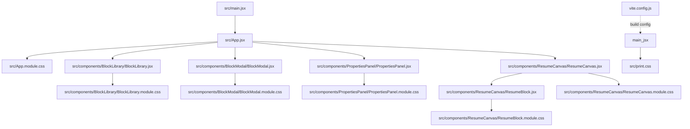
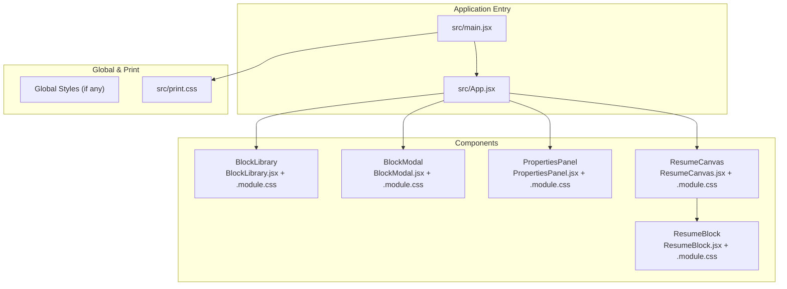
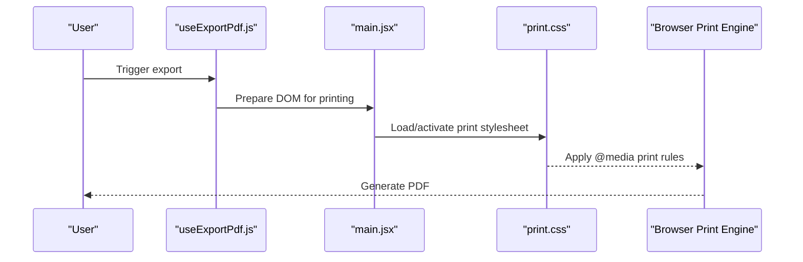
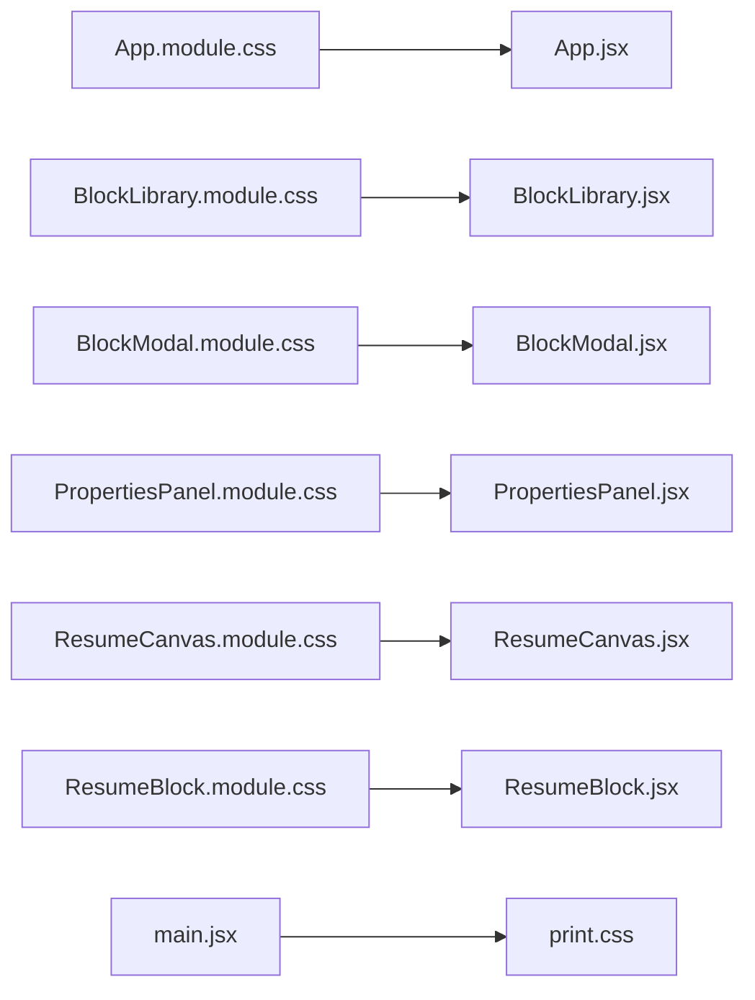

# Styling System

<cite>
**Referenced Files in This Document**
- [App.jsx](file://src/App.jsx)
- [App.module.css](file://src/App.module.css)
- [main.jsx](file://src/main.jsx)
- [print.css](file://src/print.css)
- [BlockLibrary.jsx](file://src/components/BlockLibrary/BlockLibrary.jsx)
- [BlockLibrary.module.css](file://src/components/BlockLibrary/BlockLibrary.module.css)
- [BlockModal.jsx](file://src/components/BlockModal/BlockModal.jsx)
- [BlockModal.module.css](file://src/components/BlockModal/BlockModal.module.css)
- [PropertiesPanel.jsx](file://src/components/PropertiesPanel/PropertiesPanel.jsx)
- [PropertiesPanel.module.css](file://src/components/PropertiesPanel/PropertiesPanel.module.css)
- [ResumeCanvas.jsx](file://src/components/ResumeCanvas/ResumeCanvas.jsx)
- [ResumeCanvas.module.css](file://src/components/ResumeCanvas/ResumeCanvas.module.css)
- [ResumeBlock.jsx](file://src/components/ResumeCanvas/ResumeBlock.jsx)
- [ResumeBlock.module.css](file://src/components/ResumeCanvas/ResumeBlock.module.css)
- [useExportPdf.js](file://src/hooks/useExportPdf.js)
- [vite.config.js](file://vite.config.js)
</cite>

## Table of Contents
1. [Introduction](#introduction)
2. [Project Structure](#project-structure)
3. [Core Components](#core-components)
4. [Architecture Overview](#architecture-overview)
5. [Detailed Component Analysis](#detailed-component-analysis)
6. [Dependency Analysis](#dependency-analysis)
7. [Performance Considerations](#performance-considerations)
8. [Troubleshooting Guide](#troubleshooting-guide)
9. [Conclusion](#conclusion)
10. [Appendices](#appendices)

## Introduction
This document explains the CSS Modules-based styling system used across the application. It covers how scoped styles are implemented via .module.css files to avoid global conflicts, responsive design patterns (mobile-first and breakpoints), print stylesheet optimization for PDF export, theme customization through CSS variables, component-specific styling patterns, accessibility considerations, and performance optimization techniques for CSS assets.

## Project Structure
The styling system is organized around:
- Application-level entry points that import global and print styles
- Per-component CSS Modules (.module.css) providing scoped styles
- A dedicated print stylesheet for PDF export
- Build configuration that enables CSS Modules and asset handling

**Diagram sources**
- [main.jsx:1-200](file://src/main.jsx#L1-L200)
- [App.jsx:1-200](file://src/App.jsx#L1-L200)
- [App.module.css:1-200](file://src/App.module.css#L1-L200)
- [BlockLibrary.jsx:1-200](file://src/components/BlockLibrary/BlockLibrary.jsx#L1-L200)
- [BlockLibrary.module.css:1-200](file://src/components/BlockLibrary/BlockLibrary.module.css#L1-L200)
- [BlockModal.jsx:1-200](file://src/components/BlockModal/BlockModal.jsx#L1-L200)
- [BlockModal.module.css:1-200](file://src/components/BlockModal/BlockModal.module.css#L1-L200)
- [PropertiesPanel.jsx:1-200](file://src/components/PropertiesPanel/PropertiesPanel.jsx#L1-L200)
- [PropertiesPanel.module.css:1-200](file://src/components/PropertiesPanel/PropertiesPanel.module.css#L1-L200)
- [ResumeCanvas.jsx:1-200](file://src/components/ResumeCanvas/ResumeCanvas.jsx#L1-L200)
- [ResumeCanvas.module.css:1-200](file://src/components/ResumeCanvas/ResumeCanvas.module.css#L1-L200)
- [ResumeBlock.jsx:1-200](file://src/components/ResumeCanvas/ResumeBlock.jsx#L1-L200)
- [ResumeBlock.module.css:1-200](file://src/components/ResumeCanvas/ResumeBlock.module.css#L1-L200)
- [print.css:1-200](file://src/print.css#L1-L200)
- [vite.config.js:1-200](file://vite.config.js#L1-L200)

**Section sources**
- [main.jsx:1-200](file://src/main.jsx#L1-L200)
- [App.jsx:1-200](file://src/App.jsx#L1-L200)
- [vite.config.js:1-200](file://vite.config.js#L1-L200)

## Core Components
- Scoped Styles with CSS Modules
  - Each component imports a corresponding .module.css file and applies class names from the imported object. This ensures style scoping at build time, preventing global collisions.
  - Example references:
    - [App.module.css](file://src/App.module.css)
    - [BlockLibrary.module.css](file://src/components/BlockLibrary/BlockLibrary.module.css)
    - [BlockModal.module.css](file://src/components/BlockModal/BlockModal.module.css)
    - [PropertiesPanel.module.css](file://src/components/PropertiesPanel/PropertiesPanel.module.css)
    - [ResumeCanvas.module.css](file://src/components/ResumeCanvas/ResumeCanvas.module.css)
    - [ResumeBlock.module.css](file://src/components/ResumeCanvas/ResumeBlock.module.css)

- Global and Print Styles
  - Global or shared styles can be applied once at the application root.
  - The print stylesheet is loaded separately to optimize output for PDF generation.
  - Example references:
    - [main.jsx](file://src/main.jsx)
    - [print.css](file://src/print.css)

- Build Configuration
  - Vite is configured to support CSS Modules and asset processing.
  - Example reference:
    - [vite.config.js](file://vite.config.js)

**Section sources**
- [App.jsx:1-200](file://src/App.jsx#L1-L200)
- [App.module.css:1-200](file://src/App.module.css#L1-L200)
- [BlockLibrary.jsx:1-200](file://src/components/BlockLibrary/BlockLibrary.jsx#L1-L200)
- [BlockLibrary.module.css:1-200](file://src/components/BlockLibrary/BlockLibrary.module.css#L1-L200)
- [BlockModal.jsx:1-200](file://src/components/BlockModal/BlockModal.jsx#L1-L200)
- [BlockModal.module.css:1-200](file://src/components/BlockModal/BlockModal.module.css#L1-L200)
- [PropertiesPanel.jsx:1-200](file://src/components/PropertiesPanel/PropertiesPanel.jsx#L1-L200)
- [PropertiesPanel.module.css:1-200](file://src/components/PropertiesPanel/PropertiesPanel.module.css#L1-L200)
- [ResumeCanvas.jsx:1-200](file://src/components/ResumeCanvas/ResumeCanvas.jsx#L1-L200)
- [ResumeCanvas.module.css:1-200](file://src/components/ResumeCanvas/ResumeCanvas.module.css#L1-L200)
- [ResumeBlock.jsx:1-200](file://src/components/ResumeCanvas/ResumeBlock.jsx#L1-L200)
- [ResumeBlock.module.css:1-200](file://src/components/ResumeCanvas/ResumeBlock.module.css#L1-L200)
- [main.jsx:1-200](file://src/main.jsx#L1-L200)
- [print.css:1-200](file://src/print.css#L1-L200)
- [vite.config.js:1-200](file://vite.config.js#L1-L200)

## Architecture Overview
The styling architecture follows a modular, component-scoped approach with clear separation between runtime UI styles and print-specific rules.

**Diagram sources**
- [main.jsx:1-200](file://src/main.jsx#L1-L200)
- [App.jsx:1-200](file://src/App.jsx#L1-L200)
- [BlockLibrary.jsx:1-200](file://src/components/BlockLibrary/BlockLibrary.jsx#L1-L200)
- [BlockLibrary.module.css:1-200](file://src/components/BlockLibrary/BlockLibrary.module.css#L1-L200)
- [BlockModal.jsx:1-200](file://src/components/BlockModal/BlockModal.jsx#L1-L200)
- [BlockModal.module.css:1-200](file://src/components/BlockModal/BlockModal.module.css#L1-L200)
- [PropertiesPanel.jsx:1-200](file://src/components/PropertiesPanel/PropertiesPanel.jsx#L1-L200)
- [PropertiesPanel.module.css:1-200](file://src/components/PropertiesPanel/PropertiesPanel.module.css#L1-L200)
- [ResumeCanvas.jsx:1-200](file://src/components/ResumeCanvas/ResumeCanvas.jsx#L1-L200)
- [ResumeCanvas.module.css:1-200](file://src/components/ResumeCanvas/ResumeCanvas.module.css#L1-L200)
- [ResumeBlock.jsx:1-200](file://src/components/ResumeCanvas/ResumeBlock.jsx#L1-L200)
- [ResumeBlock.module.css:1-200](file://src/components/ResumeCanvas/ResumeBlock.module.css#L1-L200)
- [print.css:1-200](file://src/print.css#L1-L200)

## Detailed Component Analysis

### App Root Styling
- Purpose: Provide top-level layout and global tokens (e.g., CSS variables) consumed by child components.
- Patterns:
  - Use CSS custom properties for theme tokens such as colors, spacing, typography scale, and radii.
  - Apply base resets and container constraints here to ensure consistent behavior across components.
- References:
  - [App.jsx](file://src/App.jsx)
  - [App.module.css](file://src/App.module.css)

**Section sources**
- [App.jsx:1-200](file://src/App.jsx#L1-L200)
- [App.module.css:1-200](file://src/App.module.css#L1-L200)

### Block Library
- Purpose: Display available blocks for insertion into the resume canvas.
- Patterns:
  - Grid or list layout using CSS Modules classes.
  - Hover/focus states for interactivity; keyboard focus outlines for accessibility.
- Responsive Strategy:
  - Mobile-first grid that adapts to larger screens via media queries.
- References:
  - [BlockLibrary.jsx](file://src/components/BlockLibrary/BlockLibrary.jsx)
  - [BlockLibrary.module.css](file://src/components/BlockLibrary/BlockLibrary.module.css)

**Section sources**
- [BlockLibrary.jsx:1-200](file://src/components/BlockLibrary/BlockLibrary.jsx#L1-L200)
- [BlockLibrary.module.css:1-200](file://src/components/BlockLibrary/BlockLibrary.module.css#L1-L200)

### Block Modal
- Purpose: Overlay modal for block details or configuration.
- Patterns:
  - Centered overlay with backdrop; z-index layering managed within the module.
  - Focus trapping and escape key handling for accessibility.
- Responsive Strategy:
  - Full-screen on small devices; constrained width on larger screens.
- References:
  - [BlockModal.jsx](file://src/components/BlockModal/BlockModal.jsx)
  - [BlockModal.module.css](file://src/components/BlockModal/BlockModal.module.css)

**Section sources**
- [BlockModal.jsx:1-200](file://src/components/BlockModal/BlockModal.jsx#L1-L200)
- [BlockModal.module.css:1-200](file://src/components/BlockModal/BlockModal.module.css#L1-L200)

### Properties Panel
- Purpose: Editable panel for adjusting block properties.
- Patterns:
  - Form controls styled consistently using CSS variables for color, border, and spacing.
  - Clear label-to-control relationships and visible focus indicators.
- Responsive Strategy:
  - Collapsible or stacked layout on narrow viewports; side-by-side on wider screens.
- References:
  - [PropertiesPanel.jsx](file://src/components/PropertiesPanel/PropertiesPanel.jsx)
  - [PropertiesPanel.module.css](file://src/components/PropertiesPanel/PropertiesPanel.module.css)

**Section sources**
- [PropertiesPanel.jsx:1-200](file://src/components/PropertiesPanel/PropertiesPanel.jsx#L1-L200)
- [PropertiesPanel.module.css:1-200](file://src/components/PropertiesPanel/PropertiesPanel.module.css#L1-L200)

### Resume Canvas and Blocks
- Purpose: Render the live resume preview and individual blocks.
- Patterns:
  - Canvas provides a fixed-aspect container suitable for print/PDF.
  - Blocks use internal modules for self-contained styling.
- Responsive Strategy:
  - Scale and padding adjustments based on viewport; maintain readability and print fidelity.
- References:
  - [ResumeCanvas.jsx](file://src/components/ResumeCanvas/ResumeCanvas.jsx)
  - [ResumeCanvas.module.css](file://src/components/ResumeCanvas/ResumeCanvas.module.css)
  - [ResumeBlock.jsx](file://src/components/ResumeCanvas/ResumeBlock.jsx)
  - [ResumeBlock.module.css](file://src/components/ResumeCanvas/ResumeBlock.module.css)

**Section sources**
- [ResumeCanvas.jsx:1-200](file://src/components/ResumeCanvas/ResumeCanvas.jsx#L1-L200)
- [ResumeCanvas.module.css:1-200](file://src/components/ResumeCanvas/ResumeCanvas.module.css#L1-L200)
- [ResumeBlock.jsx:1-200](file://src/components/ResumeCanvas/ResumeBlock.jsx#L1-L200)
- [ResumeBlock.module.css:1-200](file://src/components/ResumeCanvas/ResumeBlock.module.css#L1-L200)

### Print Stylesheet for PDF Export
- Purpose: Optimize the DOM for high-quality PDF output.
- Patterns:
  - Hide non-print elements (toolbars, modals).
  - Enforce page breaks and margins; adjust font sizes and line heights for legibility.
  - Ensure background graphics are preserved if needed.
- Integration:
  - Loaded during export flow to apply only when generating PDFs.
- References:
  - [print.css](file://src/print.css)
  - [useExportPdf.js](file://src/hooks/useExportPdf.js)

**Diagram sources**
- [useExportPdf.js:1-200](file://src/hooks/useExportPdf.js#L1-L200)
- [main.jsx:1-200](file://src/main.jsx#L1-L200)
- [print.css:1-200](file://src/print.css#L1-L200)

**Section sources**
- [print.css:1-200](file://src/print.css#L1-L200)
- [useExportPdf.js:1-200](file://src/hooks/useExportPdf.js#L1-L200)

## Dependency Analysis
- CSS Modules dependency graph shows each component depends only on its own stylesheet, minimizing cross-component coupling.
- Global dependencies are limited to the application entry point and print stylesheet.

**Diagram sources**
- [App.jsx:1-200](file://src/App.jsx#L1-L200)
- [App.module.css:1-200](file://src/App.module.css#L1-L200)
- [BlockLibrary.jsx:1-200](file://src/components/BlockLibrary/BlockLibrary.jsx#L1-L200)
- [BlockLibrary.module.css:1-200](file://src/components/BlockLibrary/BlockLibrary.module.css#L1-L200)
- [BlockModal.jsx:1-200](file://src/components/BlockModal/BlockModal.jsx#L1-L200)
- [BlockModal.module.css:1-200](file://src/components/BlockModal/BlockModal.module.css#L1-L200)
- [PropertiesPanel.jsx:1-200](file://src/components/PropertiesPanel/PropertiesPanel.jsx#L1-L200)
- [PropertiesPanel.module.css:1-200](file://src/components/PropertiesPanel/PropertiesPanel.module.css#L1-L200)
- [ResumeCanvas.jsx:1-200](file://src/components/ResumeCanvas/ResumeCanvas.jsx#L1-L200)
- [ResumeCanvas.module.css:1-200](file://src/components/ResumeCanvas/ResumeCanvas.module.css#L1-L200)
- [ResumeBlock.jsx:1-200](file://src/components/ResumeCanvas/ResumeBlock.jsx#L1-L200)
- [ResumeBlock.module.css:1-200](file://src/components/ResumeCanvas/ResumeBlock.module.css#L1-L200)
- [main.jsx:1-200](file://src/main.jsx#L1-L200)
- [print.css:1-200](file://src/print.css#L1-L200)

**Section sources**
- [App.jsx:1-200](file://src/App.jsx#L1-L200)
- [App.module.css:1-200](file://src/App.module.css#L1-L200)
- [BlockLibrary.jsx:1-200](file://src/components/BlockLibrary/BlockLibrary.jsx#L1-L200)
- [BlockLibrary.module.css:1-200](file://src/components/BlockLibrary/BlockLibrary.module.css#L1-L200)
- [BlockModal.jsx:1-200](file://src/components/BlockModal/BlockModal.jsx#L1-L200)
- [BlockModal.module.css:1-200](file://src/components/BlockModal/BlockModal.module.css#L1-L200)
- [PropertiesPanel.jsx:1-200](file://src/components/PropertiesPanel/PropertiesPanel.jsx#L1-L200)
- [PropertiesPanel.module.css:1-200](file://src/components/PropertiesPanel/PropertiesPanel.module.css#L1-L200)
- [ResumeCanvas.jsx:1-200](file://src/components/ResumeCanvas/ResumeCanvas.jsx#L1-L200)
- [ResumeCanvas.module.css:1-200](file://src/components/ResumeCanvas/ResumeCanvas.module.css#L1-L200)
- [ResumeBlock.jsx:1-200](file://src/components/ResumeCanvas/ResumeBlock.jsx#L1-L200)
- [ResumeBlock.module.css:1-200](file://src/components/ResumeCanvas/ResumeBlock.module.css#L1-L200)
- [main.jsx:1-200](file://src/main.jsx#L1-L200)
- [print.css:1-200](file://src/print.css#L1-L200)

## Performance Considerations
- Keep CSS Modules co-located with components to improve locality and reduce unused styles.
- Prefer CSS variables for theming to avoid duplicating values across files.
- Use media queries efficiently; group related rules and avoid deep nesting.
- Minimize heavy background images; prefer scalable vector graphics where possible.
- Leverage browser caching by keeping filenames stable; CSS Modules already hash class names but not filenames.
- For PDF export, ensure print rules are minimal and targeted to reduce rendering overhead.

[No sources needed since this section provides general guidance]

## Troubleshooting Guide
- Styles not applying
  - Verify the component imports the correct .module.css file and uses the imported class names.
  - Check that the build toolchain supports CSS Modules.
- Conflicts between components
  - Confirm that no global selectors override module-scoped classes unintentionally.
- Print output issues
  - Inspect whether non-print elements are hidden correctly.
  - Validate page break and margin settings in the print stylesheet.
- Accessibility problems
  - Ensure focus indicators are visible and contrast meets standards.
  - Confirm labels and roles are properly associated with form controls.

**Section sources**
- [print.css:1-200](file://src/print.css#L1-L200)
- [App.module.css:1-200](file://src/App.module.css#L1-L200)
- [BlockLibrary.module.css:1-200](file://src/components/BlockLibrary/BlockLibrary.module.css#L1-L200)
- [BlockModal.module.css:1-200](file://src/components/BlockModal/BlockModal.module.css#L1-L200)
- [PropertiesPanel.module.css:1-200](file://src/components/PropertiesPanel/PropertiesPanel.module.css#L1-L200)
- [ResumeCanvas.module.css:1-200](file://src/components/ResumeCanvas/ResumeCanvas.module.css#L1-L200)
- [ResumeBlock.module.css:1-200](file://src/components/ResumeCanvas/ResumeBlock.module.css#L1-L200)

## Conclusion
The styling system leverages CSS Modules to provide robust, component-scoped styles while maintaining a clean separation for global and print-specific rules. By adopting mobile-first responsive strategies, consistent design tokens via CSS variables, and accessible interaction patterns, the application achieves a scalable and maintainable styling architecture optimized for both screen and PDF outputs.

[No sources needed since this section summarizes without analyzing specific files]

## Appendices

### Theme Customization Guidelines
- Centralize tokens (colors, spacing, typography, radii) as CSS variables at the application root.
- Consume variables within component modules to keep themes portable and consistent.
- Provide default tokens and allow overrides via data attributes or wrapper classes.

References:
- [App.module.css](file://src/App.module.css)

### Responsive Design Patterns
- Start with mobile layouts and progressively enhance for larger screens using media queries.
- Use relative units (rem, em, %) and flexible containers to adapt content fluidly.
- Test common breakpoints and ensure touch targets meet minimum size guidelines.

References:
- [BlockLibrary.module.css](file://src/components/BlockLibrary/BlockLibrary.module.css)
- [BlockModal.module.css](file://src/components/BlockModal/BlockModal.module.css)
- [PropertiesPanel.module.css](file://src/components/PropertiesPanel/PropertiesPanel.module.css)
- [ResumeCanvas.module.css](file://src/components/ResumeCanvas/ResumeCanvas.module.css)
- [ResumeBlock.module.css](file://src/components/ResumeCanvas/ResumeBlock.module.css)

### Accessibility Checklist
- Maintain sufficient color contrast for text and interactive elements.
- Provide visible focus styles and logical tab order.
- Associate labels with inputs and ensure semantic HTML structure.

References:
- [PropertiesPanel.module.css](file://src/components/PropertiesPanel/PropertiesPanel.module.css)
- [BlockModal.module.css](file://src/components/BlockModal/BlockModal.module.css)

### Build and Asset Optimization
- Ensure CSS Modules are enabled in the build configuration.
- Avoid large inline styles; prefer external modules for better caching.
- Keep print styles minimal and targeted to reduce PDF generation time.

References:
- [vite.config.js](file://vite.config.js)
- [print.css](file://src/print.css)