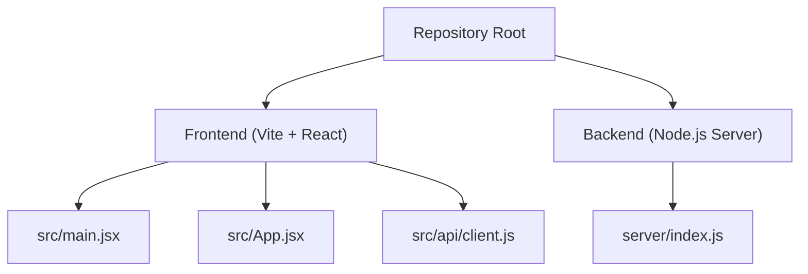
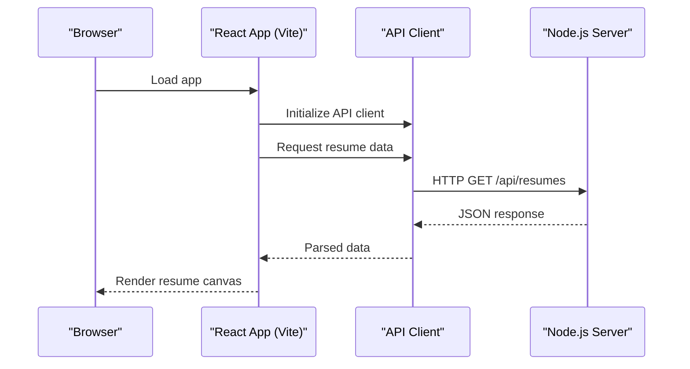

# Getting Started

<cite>
**Referenced Files in This Document**
- [README.md](file://README.md)
- [package.json](file://package.json)
- [vite.config.js](file://vite.config.js)
- [index.html](file://index.html)
- [server/index.js](file://server/index.js)
- [src/main.jsx](file://src/main.jsx)
- [src/App.jsx](file://src/App.jsx)
- [src/api/client.js](file://src/api/client.js)
</cite>

## Table of Contents
1. Introduction
2. Project Structure
3. Prerequisites
4. Installation and Setup
5. Environment Configuration
6. Running the Application Locally
7. First Steps Tutorial
8. Architecture Overview
9. Troubleshooting Guide
10. Conclusion

## Introduction
This guide helps you set up and run the Modular Resume Builder locally, create your first resume, and understand the basic interface. It covers prerequisites, installation steps, environment configuration, running both frontend and backend services, and common troubleshooting tips for development.

## Project Structure
The project is a full-stack application with:
- Frontend built with React and Vite under src/
- Backend server under server/
- Shared configuration files at the repository root

**Diagram sources**
- [src/main.jsx](file://src/main.jsx)
- [src/App.jsx](file://src/App.jsx)
- [src/api/client.js](file://src/api/client.js)
- [server/index.js](file://server/index.js)

**Section sources**
- [README.md](file://README.md)
- [package.json](file://package.json)
- [vite.config.js](file://vite.config.js)
- [index.html](file://index.html)
- [server/index.js](file://server/index.js)
- [src/main.jsx](file://src/main.jsx)
- [src/App.jsx](file://src/App.jsx)
- [src/api/client.js](file://src/api/client.js)

## Prerequisites
Before you begin, ensure you have the following installed on your machine:
- Node.js: Use a recent LTS version compatible with the project’s dependencies. Check the engines field in package.json to confirm the required version range.
- npm or yarn: Either package manager can be used to install dependencies and run scripts.
- Basic knowledge of React and Node.js will help you navigate the codebase and troubleshoot issues.

Verify installations by running:
- node -v
- npm -v (or yarn -v if using Yarn)

If Node.js is not installed or an incompatible version is detected, install a supported LTS release from the official Node.js website.

**Section sources**
- [package.json](file://package.json)

## Installation and Setup
Follow these steps to clone the repository and prepare your local development environment:

1. Clone the repository
   - git clone <repository-url>
   - cd into the project directory

2. Install dependencies
   - Using npm: npm install
   - Using yarn: yarn install

3. Verify the build tooling
   - The project uses Vite for the frontend. Confirm vite.config.js exists and index.html is present at the root.

4. Prepare the backend
   - Ensure server/index.js is present and that any required server-side dependencies are included in package.json scripts or separate server package.json if applicable.

**Section sources**
- [package.json](file://package.json)
- [vite.config.js](file://vite.config.js)
- [index.html](file://index.html)
- [server/index.js](file://server/index.js)

## Environment Configuration
Environment variables may be required for both frontend and backend. Typical patterns include:
- API base URL for the backend
- Feature flags or logging levels
- Port overrides for local development

Where to configure:
- Frontend: Vite reads environment variables prefixed according to its conventions. Check vite.config.js and src/api/client.js for how the API client resolves the backend URL.
- Backend: server/index.js may read environment variables for port, CORS settings, or database connections.

Steps:
1. Create a .env file at the repository root if needed.
2. Add variables such as:
   - VITE_API_BASE_URL=http://localhost:<backend-port>
   - PORT=<frontend-port>
3. Save the file and restart the dev servers after changes.

Note: Do not commit secrets. Keep .env out of version control.

**Section sources**
- [vite.config.js](file://vite.config.js)
- [src/api/client.js](file://src/api/client.js)
- [server/index.js](file://server/index.js)

## Running the Application Locally
Start both the backend and frontend services:

1. Start the backend server
   - Run the server script defined in package.json (for example, start:server or similar).
   - Confirm it listens on the expected port.

2. Start the frontend development server
   - Run the frontend dev script (for example, dev or start).
   - Open the provided local URL in your browser.

3. Verify connectivity
   - Ensure the frontend can reach the backend via the configured API base URL.
   - Check the browser console and network tab for errors.

Tip: If ports conflict, adjust the PORT variable in your .env file and restart the relevant service.

**Section sources**
- [package.json](file://package.json)
- [vite.config.js](file://vite.config.js)
- [src/api/client.js](file://src/api/client.js)
- [server/index.js](file://server/index.js)

## First Steps Tutorial
Create your first resume and explore the interface:

1. Open the app in your browser at the local development URL.
2. Navigate to the canvas area where resumes are composed.
3. Add blocks from the block library to structure your resume sections.
4. Edit properties using the properties panel to customize content.
5. Preview and export your resume using available actions (e.g., PDF export).

Tips:
- Use the block modal to insert new sections quickly.
- Save frequently; data persistence depends on backend availability and storage hooks.

**Section sources**
- [src/App.jsx](file://src/App.jsx)
- [src/main.jsx](file://src/main.jsx)
- [src/api/client.js](file://src/api/client.js)

## Architecture Overview
High-level flow between frontend and backend during typical operations:

**Diagram sources**
- [src/api/client.js](file://src/api/client.js)
- [server/index.js](file://server/index.js)

## Troubleshooting Guide
Common setup issues and resolutions:

- Node.js version mismatch
  - Symptom: Dependency installation fails or runtime errors.
  - Fix: Install an LTS version matching the engines field in package.json.

- Missing or incorrect environment variables
  - Symptom: Frontend cannot connect to backend; API calls fail.
  - Fix: Define VITE_API_BASE_URL in .env and ensure it points to the running backend.

- Port conflicts
  - Symptom: Dev server fails to start due to occupied port.
  - Fix: Change PORT in .env or stop the conflicting process.

- CORS errors
  - Symptom: Network requests blocked by browser security policy.
  - Fix: Configure CORS on the backend to allow the frontend origin.

- Build or dev server issues
  - Symptom: Vite errors or missing entry points.
  - Fix: Confirm vite.config.js and index.html exist; reinstall dependencies.

- Backend startup problems
  - Symptom: Server crashes or does not listen on the expected port.
  - Fix: Check server/index.js for required environment variables and dependencies.

For further debugging:
- Inspect the browser console and Network tab for failed requests.
- Review terminal logs for both frontend and backend processes.

**Section sources**
- [package.json](file://package.json)
- [vite.config.js](file://vite.config.js)
- [src/api/client.js](file://src/api/client.js)
- [server/index.js](file://server/index.js)

## Conclusion
You now have the essentials to install, configure, and run the Modular Resume Builder locally. Use this guide to bootstrap your development environment, create your first resume, and resolve common setup issues. Refer back to the architecture overview and troubleshooting sections when integrating features or diagnosing problems.