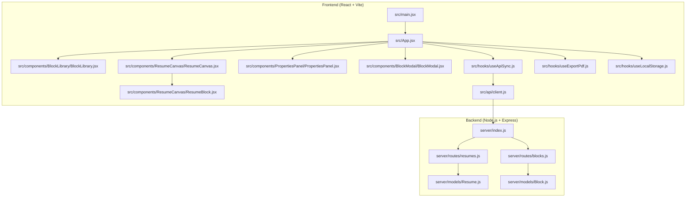
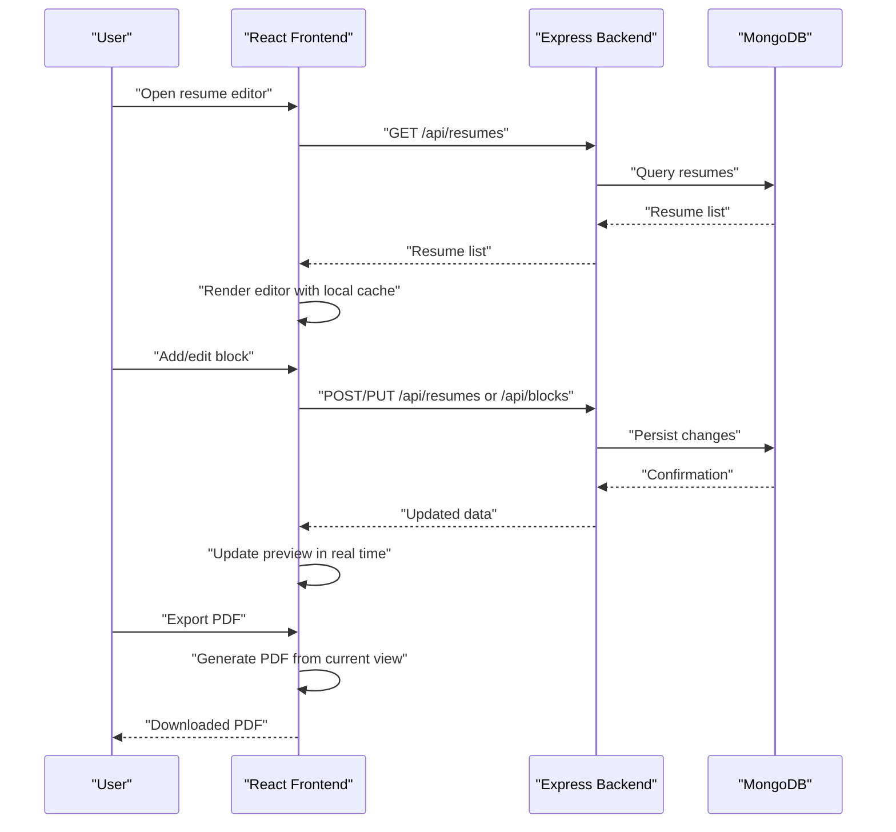
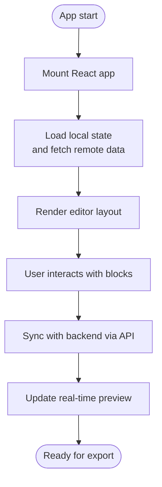
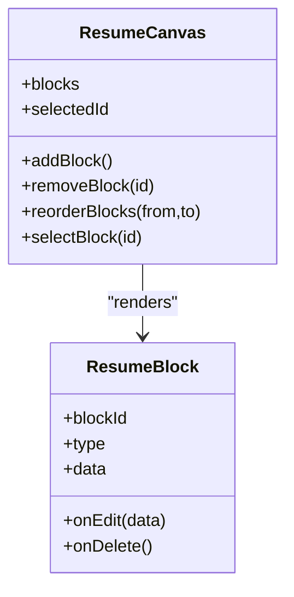
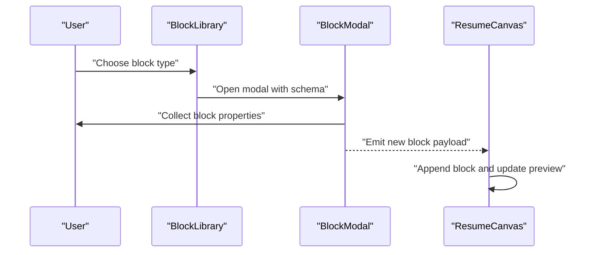
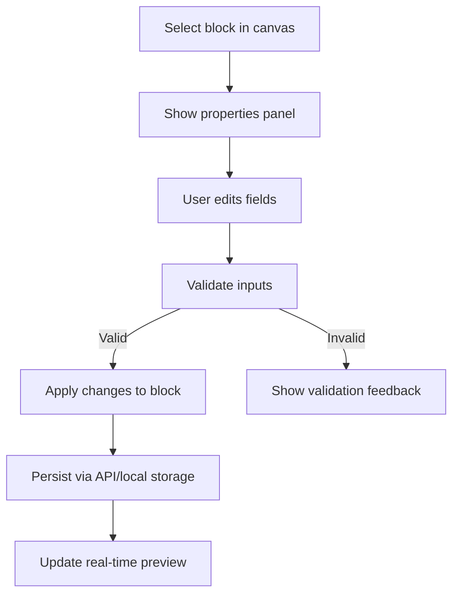
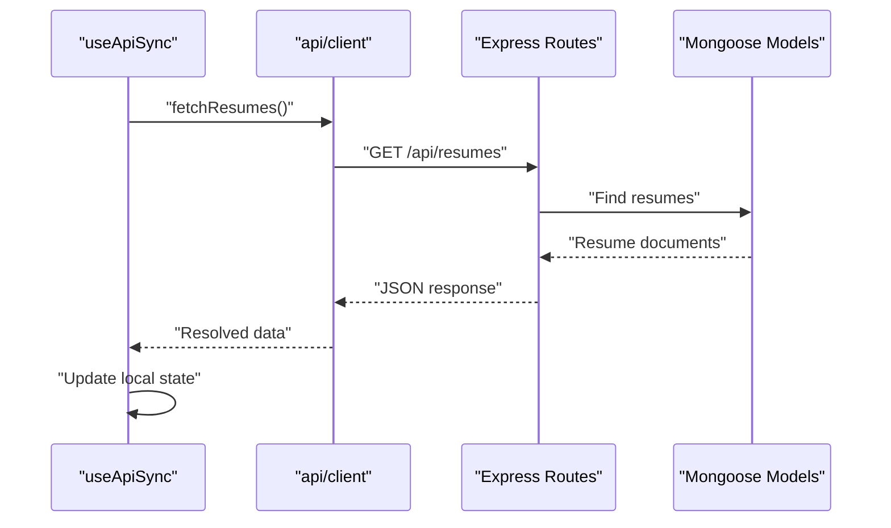
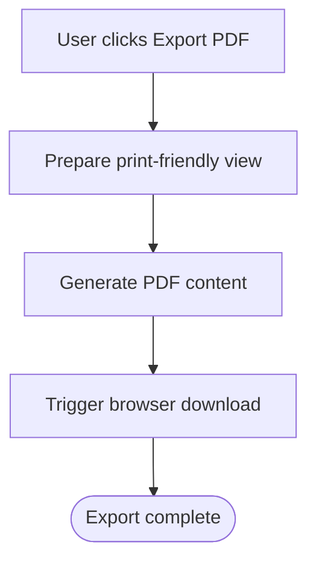
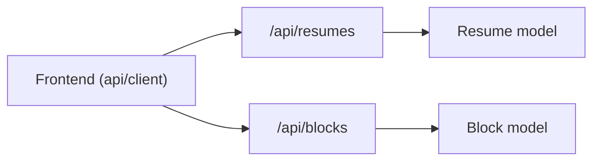
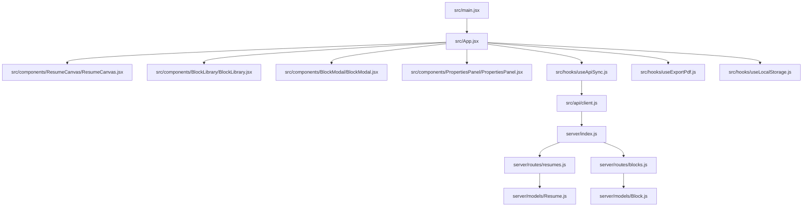

# Project Overview

<cite>
**Referenced Files in This Document**
- [README.md](file://README.md)
- [Resume_Builder_PRD.md](file://Resume_Builder_PRD.md)
- [package.json](file://package.json)
- [vite.config.js](file://vite.config.js)
- [index.html](file://index.html)
- [server/index.js](file://server/index.js)
- [server/models/Resume.js](file://server/models/Resume.js)
- [server/models/Block.js](file://server/models/Block.js)
- [server/routes/resumes.js](file://server/routes/resumes.js)
- [server/routes/blocks.js](file://server/routes/blocks.js)
- [src/main.jsx](file://src/main.jsx)
- [src/App.jsx](file://src/App.jsx)
- [src/api/client.js](file://src/api/client.js)
- [src/hooks/useApiSync.js](file://src/hooks/useApiSync.js)
- [src/hooks/useExportPdf.js](file://src/hooks/useExportPdf.js)
- [src/hooks/useLocalStorage.js](file://src/hooks/useLocalStorage.js)
- [src/components/BlockLibrary/BlockLibrary.jsx](file://src/components/BlockLibrary/BlockLibrary.jsx)
- [src/components/BlockModal/BlockModal.jsx](file://src/components/BlockModal/BlockModal.jsx)
- [src/components/PropertiesPanel/PropertiesPanel.jsx](file://src/components/PropertiesPanel/PropertiesPanel.jsx)
- [src/components/ResumeCanvas/ResumeCanvas.jsx](file://src/components/ResumeCanvas/ResumeCanvas.jsx)
- [src/components/ResumeCanvas/ResumeBlock.jsx](file://src/components/ResumeCanvas/ResumeBlock.jsx)
</cite>

## Table of Contents
1. [Introduction](#introduction)
2. [Project Structure](#project-structure)
3. [Core Components](#core-components)
4. [Architecture Overview](#architecture-overview)
5. [Detailed Component Analysis](#detailed-component-analysis)
6. [Dependency Analysis](#dependency-analysis)
7. [Performance Considerations](#performance-considerations)
8. [Troubleshooting Guide](#troubleshooting-guide)
9. [Conclusion](#conclusion)

## Introduction
The Modular Resume Builder is a full-stack web application that enables users to create professional resumes using modular blocks with drag-and-drop functionality. It provides a block-based resume building experience, real-time preview, PDF export, and data persistence across sessions. The target audience includes job seekers who want an intuitive builder, HR professionals seeking consistent resume formats, and developers who wish to customize or extend the tool.

Key features:
- Block-based resume building with drag-and-drop composition
- Real-time preview as blocks are added, reordered, and edited
- PDF export for sharing and printing
- Data persistence via local storage and server-side storage for resumes and blocks

Technology stack summary:
- Frontend: React with Vite for fast development and optimized builds
- Backend: Node.js with Express for REST APIs
- Database: MongoDB for storing resumes and blocks
- Development tools: Vite, modern CSS modules, and utility hooks for API sync, PDF export, and JSON import/export

High-level architecture overview:
- The React frontend renders the editor UI and communicates with the Express backend over HTTP
- The backend exposes REST endpoints for resumes and blocks, persisting data to MongoDB
- The frontend also persists draft state locally for resilience and offline editing

**Section sources**
- [README.md](file://README.md)
- [Resume_Builder_PRD.md](file://Resume_Builder_PRD.md)
- [package.json](file://package.json)
- [vite.config.js](file://vite.config.js)

## Project Structure
The repository follows a clear separation between client and server code:
- server/: Express backend with models and routes
- src/: React frontend with components, hooks, utilities, and entry points
- Root configuration files for build and project metadata

**Diagram sources**
- [src/main.jsx](file://src/main.jsx)
- [src/App.jsx](file://src/App.jsx)
- [src/components/BlockLibrary/BlockLibrary.jsx](file://src/components/BlockLibrary/BlockLibrary.jsx)
- [src/components/ResumeCanvas/ResumeCanvas.jsx](file://src/components/ResumeCanvas/ResumeCanvas.jsx)
- [src/components/ResumeCanvas/ResumeBlock.jsx](file://src/components/ResumeCanvas/ResumeBlock.jsx)
- [src/components/PropertiesPanel/PropertiesPanel.jsx](file://src/components/PropertiesPanel/PropertiesPanel.jsx)
- [src/components/BlockModal/BlockModal.jsx](file://src/components/BlockModal/BlockModal.jsx)
- [src/hooks/useApiSync.js](file://src/hooks/useApiSync.js)
- [src/hooks/useExportPdf.js](file://src/hooks/useExportPdf.js)
- [src/hooks/useLocalStorage.js](file://src/hooks/useLocalStorage.js)
- [src/api/client.js](file://src/api/client.js)
- [server/index.js](file://server/index.js)
- [server/routes/resumes.js](file://server/routes/resumes.js)
- [server/routes/blocks.js](file://server/routes/blocks.js)
- [server/models/Resume.js](file://server/models/Resume.js)
- [server/models/Block.js](file://server/models/Block.js)

**Section sources**
- [index.html](file://index.html)
- [package.json](file://package.json)
- [vite.config.js](file://vite.config.js)
- [src/main.jsx](file://src/main.jsx)
- [src/App.jsx](file://src/App.jsx)
- [server/index.js](file://server/index.js)

## Core Components
This section outlines the primary responsibilities of each core module and how they collaborate to deliver the resume builder experience.

- Application shell and routing
  - Entry point initializes the React app and mounts the root component
  - App orchestrates layout, global state, and integration with hooks and services

- Editor surface
  - ResumeCanvas renders the live resume preview and manages block ordering and selection
  - ResumeBlock represents a single editable block within the canvas

- Block management
  - BlockLibrary provides available block types for insertion
  - BlockModal handles adding or configuring new blocks
  - PropertiesPanel edits properties of the selected block

- Data layer
  - useApiSync synchronizes local state with the backend
  - useLocalStorage persists drafts locally for resilience
  - api/client centralizes HTTP calls to the backend

- Export utilities
  - useExportPdf triggers PDF generation from the current resume view

**Section sources**
- [src/main.jsx](file://src/main.jsx)
- [src/App.jsx](file://src/App.jsx)
- [src/components/ResumeCanvas/ResumeCanvas.jsx](file://src/components/ResumeCanvas/ResumeCanvas.jsx)
- [src/components/ResumeCanvas/ResumeBlock.jsx](file://src/components/ResumeCanvas/ResumeBlock.jsx)
- [src/components/BlockLibrary/BlockLibrary.jsx](file://src/components/BlockLibrary/BlockLibrary.jsx)
- [src/components/BlockModal/BlockModal.jsx](file://src/components/BlockModal/BlockModal.jsx)
- [src/components/PropertiesPanel/PropertiesPanel.jsx](file://src/components/PropertiesPanel/PropertiesPanel.jsx)
- [src/hooks/useApiSync.js](file://src/hooks/useApiSync.js)
- [src/hooks/useLocalStorage.js](file://src/hooks/useLocalStorage.js)
- [src/hooks/useExportPdf.js](file://src/hooks/useExportPdf.js)
- [src/api/client.js](file://src/api/client.js)

## Architecture Overview
The system follows a classic client-server architecture:
- The React frontend renders the editor and sends requests to the Express backend
- The backend exposes REST endpoints for resumes and blocks, interacting with MongoDB
- Local storage is used on the client to persist drafts and improve UX

**Diagram sources**
- [src/api/client.js](file://src/api/client.js)
- [server/index.js](file://server/index.js)
- [server/routes/resumes.js](file://server/routes/resumes.js)
- [server/routes/blocks.js](file://server/routes/blocks.js)
- [server/models/Resume.js](file://server/models/Resume.js)
- [server/models/Block.js](file://server/models/Block.js)
- [src/hooks/useApiSync.js](file://src/hooks/useApiSync.js)
- [src/hooks/useExportPdf.js](file://src/hooks/useExportPdf.js)

## Detailed Component Analysis

### Frontend Application Shell
- main.jsx bootstraps the React application and mounts it into the DOM
- App.jsx composes the editor layout, integrates hooks for synchronization and export, and coordinates component interactions

**Diagram sources**
- [src/main.jsx](file://src/main.jsx)
- [src/App.jsx](file://src/App.jsx)
- [src/hooks/useApiSync.js](file://src/hooks/useApiSync.js)

**Section sources**
- [src/main.jsx](file://src/main.jsx)
- [src/App.jsx](file://src/App.jsx)

### Resume Canvas and Blocks
- ResumeCanvas manages the ordered list of blocks, selection state, and drag-and-drop operations
- ResumeBlock renders individual blocks and forwards property changes to the parent

**Diagram sources**
- [src/components/ResumeCanvas/ResumeCanvas.jsx](file://src/components/ResumeCanvas/ResumeCanvas.jsx)
- [src/components/ResumeCanvas/ResumeBlock.jsx](file://src/components/ResumeCanvas/ResumeBlock.jsx)

**Section sources**
- [src/components/ResumeCanvas/ResumeCanvas.jsx](file://src/components/ResumeCanvas/ResumeCanvas.jsx)
- [src/components/ResumeCanvas/ResumeBlock.jsx](file://src/components/ResumeCanvas/ResumeBlock.jsx)

### Block Library and Modal
- BlockLibrary lists available block types and allows insertion into the canvas
- BlockModal provides a form to configure new blocks before adding them

**Diagram sources**
- [src/components/BlockLibrary/BlockLibrary.jsx](file://src/components/BlockLibrary/BlockLibrary.jsx)
- [src/components/BlockModal/BlockModal.jsx](file://src/components/BlockModal/BlockModal.jsx)
- [src/components/ResumeCanvas/ResumeCanvas.jsx](file://src/components/ResumeCanvas/ResumeCanvas.jsx)

**Section sources**
- [src/components/BlockLibrary/BlockLibrary.jsx](file://src/components/BlockLibrary/BlockLibrary.jsx)
- [src/components/BlockModal/BlockModal.jsx](file://src/components/BlockModal/BlockModal.jsx)

### Properties Panel
- PropertiesPanel displays and edits fields for the currently selected block
- Changes propagate back to the canvas and can be persisted via API sync

**Diagram sources**
- [src/components/PropertiesPanel/PropertiesPanel.jsx](file://src/components/PropertiesPanel/PropertiesPanel.jsx)
- [src/hooks/useApiSync.js](file://src/hooks/useApiSync.js)

**Section sources**
- [src/components/PropertiesPanel/PropertiesPanel.jsx](file://src/components/PropertiesPanel/PropertiesPanel.jsx)
- [src/hooks/useApiSync.js](file://src/hooks/useApiSync.js)

### Data Persistence and API Integration
- useApiSync coordinates fetching and saving resumes and blocks through the centralized API client
- useLocalStorage ensures drafts survive refreshes and network issues
- api/client encapsulates HTTP requests to the backend

**Diagram sources**
- [src/hooks/useApiSync.js](file://src/hooks/useApiSync.js)
- [src/api/client.js](file://src/api/client.js)
- [server/routes/resumes.js](file://server/routes/resumes.js)
- [server/models/Resume.js](file://server/models/Resume.js)

**Section sources**
- [src/hooks/useApiSync.js](file://src/hooks/useApiSync.js)
- [src/hooks/useLocalStorage.js](file://src/hooks/useLocalStorage.js)
- [src/api/client.js](file://src/api/client.js)
- [server/routes/resumes.js](file://server/routes/resumes.js)
- [server/models/Resume.js](file://server/models/Resume.js)

### PDF Export
- useExportPdf generates a printable version of the current resume, suitable for download

**Diagram sources**
- [src/hooks/useExportPdf.js](file://src/hooks/useExportPdf.js)

**Section sources**
- [src/hooks/useExportPdf.js](file://src/hooks/useExportPdf.js)

### Backend Services
- server/index.js initializes the Express server and registers routes
- server/routes/resumes.js and server/routes/blocks.js implement REST endpoints
- server/models/Resume.js and server/models/Block.js define data schemas and queries

**Diagram sources**
- [server/index.js](file://server/index.js)
- [server/routes/resumes.js](file://server/routes/resumes.js)
- [server/routes/blocks.js](file://server/routes/blocks.js)
- [server/models/Resume.js](file://server/models/Resume.js)
- [server/models/Block.js](file://server/models/Block.js)

**Section sources**
- [server/index.js](file://server/index.js)
- [server/routes/resumes.js](file://server/routes/resumes.js)
- [server/routes/blocks.js](file://server/routes/blocks.js)
- [server/models/Resume.js](file://server/models/Resume.js)
- [server/models/Block.js](file://server/models/Block.js)

## Dependency Analysis
The following diagram shows key runtime dependencies among frontend modules and backend services.

**Diagram sources**
- [src/main.jsx](file://src/main.jsx)
- [src/App.jsx](file://src/App.jsx)
- [src/components/ResumeCanvas/ResumeCanvas.jsx](file://src/components/ResumeCanvas/ResumeCanvas.jsx)
- [src/components/BlockLibrary/BlockLibrary.jsx](file://src/components/BlockLibrary/BlockLibrary.jsx)
- [src/components/BlockModal/BlockModal.jsx](file://src/components/BlockModal/BlockModal.jsx)
- [src/components/PropertiesPanel/PropertiesPanel.jsx](file://src/components/PropertiesPanel/PropertiesPanel.jsx)
- [src/hooks/useApiSync.js](file://src/hooks/useApiSync.js)
- [src/hooks/useExportPdf.js](file://src/hooks/useExportPdf.js)
- [src/hooks/useLocalStorage.js](file://src/hooks/useLocalStorage.js)
- [src/api/client.js](file://src/api/client.js)
- [server/index.js](file://server/index.js)
- [server/routes/resumes.js](file://server/routes/resumes.js)
- [server/routes/blocks.js](file://server/routes/blocks.js)
- [server/models/Resume.js](file://server/models/Resume.js)
- [server/models/Block.js](file://server/models/Block.js)

**Section sources**
- [package.json](file://package.json)
- [vite.config.js](file://vite.config.js)

## Performance Considerations
- Prefer debounced updates when syncing large resumes to reduce network overhead
- Use virtualization or pagination if block counts grow significantly
- Cache frequently accessed block templates on the client
- Optimize PDF generation by limiting heavy assets and leveraging print styles

[No sources needed since this section provides general guidance]

## Troubleshooting Guide
Common areas to inspect:
- Network connectivity and CORS settings between frontend and backend
- API route definitions and request/response payloads
- Local storage availability and quota limits
- PDF export behavior across browsers

Checkpoints:
- Verify backend health and database connectivity
- Confirm API client base URL and environment variables
- Inspect browser console for errors during save/export flows

**Section sources**
- [src/api/client.js](file://src/api/client.js)
- [src/hooks/useApiSync.js](file://src/hooks/useApiSync.js)
- [src/hooks/useExportPdf.js](file://src/hooks/useExportPdf.js)
- [server/index.js](file://server/index.js)

## Conclusion
The Modular Resume Builder delivers a flexible, block-based resume creation experience with real-time preview, PDF export, and robust data persistence. Its clean separation of concerns—React frontend, Express backend, and MongoDB storage—makes it easy to maintain, extend, and customize for diverse audiences including job seekers, HR professionals, and developers.

[No sources needed since this section summarizes without analyzing specific files]