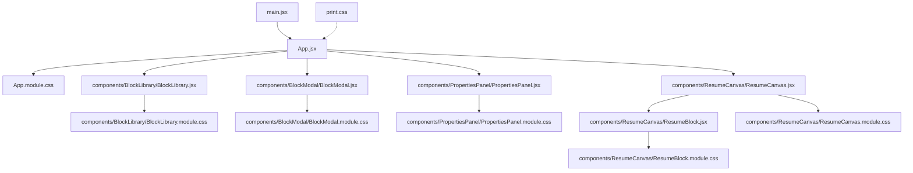
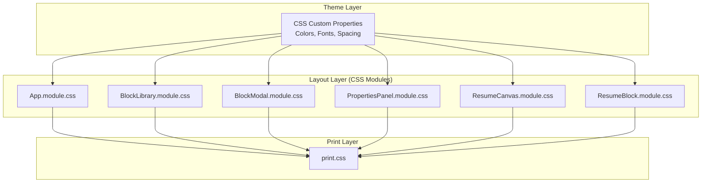
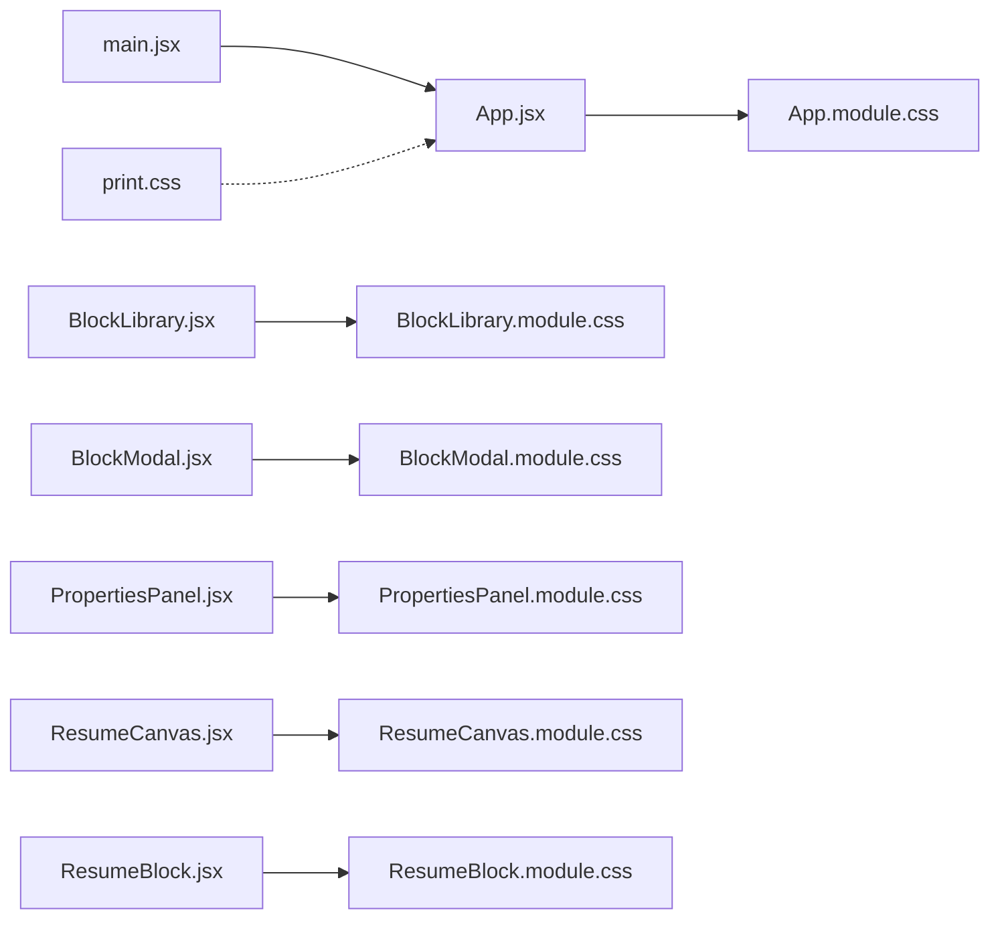

# Styling and Theming

<cite>
**Referenced Files in This Document**
- [App.jsx](file://src/App.jsx)
- [App.module.css](file://src/App.module.css)
- [main.jsx](file://src/main.jsx)
- [print.css](file://src/print.css)
- [BlockLibrary.jsx](file://src/components/BlockLibrary/BlockLibrary.jsx)
- [BlockLibrary.module.css](file://src/components/BlockLibrary/BlockLibrary.module.css)
- [BlockModal.jsx](file://src/components/BlockModal/BlockModal.jsx)
- [BlockModal.module.css](file://src/components/BlockModal/BlockModal.module.css)
- [PropertiesPanel.jsx](file://src/components/PropertiesPanel/PropertiesPanel.jsx)
- [PropertiesPanel.module.css](file://src/components/PropertiesPanel/PropertiesPanel.module.css)
- [ResumeCanvas.jsx](file://src/components/ResumeCanvas/ResumeCanvas.jsx)
- [ResumeCanvas.module.css](file://src/components/ResumeCanvas/ResumeCanvas.module.css)
- [ResumeBlock.jsx](file://src/components/ResumeCanvas/ResumeBlock.jsx)
- [ResumeBlock.module.css](file://src/components/ResumeCanvas/ResumeBlock.module.css)
</cite>

## Table of Contents
1. [Introduction](#introduction)
2. [Project Structure](#project-structure)
3. [Core Components](#core-components)
4. [Architecture Overview](#architecture-overview)
5. [Detailed Component Analysis](#detailed-component-analysis)
6. [Dependency Analysis](#dependency-analysis)
7. [Performance Considerations](#performance-considerations)
8. [Troubleshooting Guide](#troubleshooting-guide)
9. [Conclusion](#conclusion)
10. [Appendices](#appendices)

## Introduction
This document explains the styling system used by the Modular Resume Builder with a focus on:
- CSS Modules for scoped styles that prevent global conflicts
- Responsive design patterns across devices and screen sizes
- Print stylesheet optimization for PDF generation
- Theming customization options (colors, fonts, layout parameters)
- Component-specific styling approaches and best practices
- Cross-browser compatibility considerations
- Performance optimizations for stylesheets

The goal is to help developers understand how styles are organized, applied, and extended while maintaining consistency and performance.

## Project Structure
Styles are implemented using CSS Modules alongside a dedicated print stylesheet. Each component has its own module file, ensuring encapsulation and predictability. The application entry points import these modules and apply them via className bindings.

**Diagram sources**
- [App.jsx](file://src/App.jsx)
- [App.module.css](file://src/App.module.css)
- [BlockLibrary.jsx](file://src/components/BlockLibrary/BlockLibrary.jsx)
- [BlockLibrary.module.css](file://src/components/BlockLibrary/BlockLibrary.module.css)
- [BlockModal.jsx](file://src/components/BlockModal/BlockModal.jsx)
- [BlockModal.module.css](file://src/components/BlockModal/BlockModal.module.css)
- [PropertiesPanel.jsx](file://src/components/PropertiesPanel/PropertiesPanel.jsx)
- [PropertiesPanel.module.css](file://src/components/PropertiesPanel/PropertiesPanel.module.css)
- [ResumeCanvas.jsx](file://src/components/ResumeCanvas/ResumeCanvas.jsx)
- [ResumeCanvas.module.css](file://src/components/ResumeCanvas/ResumeCanvas.module.css)
- [ResumeBlock.jsx](file://src/components/ResumeCanvas/ResumeBlock.jsx)
- [ResumeBlock.module.css](file://src/components/ResumeCanvas/ResumeBlock.module.css)
- [main.jsx](file://src/main.jsx)
- [print.css](file://src/print.css)

**Section sources**
- [App.jsx](file://src/App.jsx)
- [App.module.css](file://src/App.module.css)
- [main.jsx](file://src/main.jsx)
- [print.css](file://src/print.css)
- [BlockLibrary.jsx](file://src/components/BlockLibrary/BlockLibrary.jsx)
- [BlockLibrary.module.css](file://src/components/BlockLibrary/BlockLibrary.module.css)
- [BlockModal.jsx](file://src/components/BlockModal/BlockModal.jsx)
- [BlockModal.module.css](file://src/components/BlockModal/BlockModal.module.css)
- [PropertiesPanel.jsx](file://src/components/PropertiesPanel/PropertiesPanel.jsx)
- [PropertiesPanel.module.css](file://src/components/PropertiesPanel/PropertiesPanel.module.css)
- [ResumeCanvas.jsx](file://src/components/ResumeCanvas/ResumeCanvas.jsx)
- [ResumeCanvas.module.css](file://src/components/ResumeCanvas/ResumeCanvas.module.css)
- [ResumeBlock.jsx](file://src/components/ResumeCanvas/ResumeBlock.jsx)
- [ResumeBlock.module.css](file://src/components/ResumeCanvas/ResumeBlock.module.css)

## Core Components
Each UI component uses a corresponding CSS Module to scope its styles. The typical pattern is:
- Import the module object from the .module.css file
- Bind class names from the module to JSX elements via className
- Use media queries within the module for responsive behavior
- Apply theme tokens (variables) for colors, fonts, and spacing

Key components and their style modules:
- App-level layout and global container styles
- BlockLibrary for browsing and selecting resume blocks
- BlockModal for editing block properties
- PropertiesPanel for configuration controls
- ResumeCanvas for rendering the live resume preview
- ResumeBlock for individual block rendering inside the canvas

Best practices observed:
- Keep selectors local to the component’s module
- Prefer semantic class names defined in the module
- Centralize theme variables at the app level for consistent theming
- Use CSS custom properties for easy overrides

**Section sources**
- [App.jsx](file://src/App.jsx)
- [App.module.css](file://src/App.module.css)
- [BlockLibrary.jsx](file://src/components/BlockLibrary/BlockLibrary.jsx)
- [BlockLibrary.module.css](file://src/components/BlockLibrary/BlockLibrary.module.css)
- [BlockModal.jsx](file://src/components/BlockModal/BlockModal.jsx)
- [BlockModal.module.css](file://src/components/BlockModal/BlockModal.module.css)
- [PropertiesPanel.jsx](file://src/components/PropertiesPanel/PropertiesPanel.jsx)
- [PropertiesPanel.module.css](file://src/components/PropertiesPanel/PropertiesPanel.module.css)
- [ResumeCanvas.jsx](file://src/components/ResumeCanvas/ResumeCanvas.jsx)
- [ResumeCanvas.module.css](file://src/components/ResumeCanvas/ResumeCanvas.module.css)
- [ResumeBlock.jsx](file://src/components/ResumeCanvas/ResumeBlock.jsx)
- [ResumeBlock.module.css](file://src/components/ResumeCanvas/ResumeBlock.module.css)

## Architecture Overview
The styling architecture follows a layered approach:
- Theme layer: CSS custom properties define colors, typography, and spacing tokens
- Layout layer: CSS Modules provide component-scoped classes and responsive rules
- Print layer: A dedicated print stylesheet optimizes output for PDFs

[No diagram sources needed since this diagram shows conceptual architecture]

## Detailed Component Analysis

### App-Level Styles
Responsibilities:
- Root container layout and page background
- Global typography defaults and theme variable definitions
- Base responsive breakpoints and grid/flex utilities

Implementation notes:
- Uses CSS Modules to avoid polluting global scope
- Defines theme tokens as CSS custom properties for reuse
- Applies media queries for mobile-first responsiveness

**Section sources**
- [App.jsx](file://src/App.jsx)
- [App.module.css](file://src/App.module.css)

### BlockLibrary Styles
Responsibilities:
- Grid or list layout for available blocks
- Hover states, selection indicators, and accessibility focus styles
- Responsive adjustments for smaller screens

Implementation notes:
- Scoped classes ensure no cross-component interference
- Media queries adjust column counts and spacing

**Section sources**
- [BlockLibrary.jsx](file://src/components/BlockLibrary/BlockLibrary.jsx)
- [BlockLibrary.module.css](file://src/components/BlockLibrary/BlockLibrary.module.css)

### BlockModal Styles
Responsibilities:
- Modal overlay and content container
- Form fields, buttons, and validation feedback
- Focus management and keyboard navigation support

Implementation notes:
- Z-index and positioning managed within the module
- Responsive padding and font scaling for readability

**Section sources**
- [BlockModal.jsx](file://src/components/BlockModal/BlockModal.jsx)
- [BlockModal.module.css](file://src/components/BlockModal/BlockModal.module.css)

### PropertiesPanel Styles
Responsibilities:
- Control panel layout for editing block properties
- Input groups, labels, and helper text
- Collapsible sections and scrollable areas when content overflows

Implementation notes:
- Flexbox/Grid for alignment and spacing
- Consistent use of theme tokens for color and typography

**Section sources**
- [PropertiesPanel.jsx](file://src/components/PropertiesPanel/PropertiesPanel.jsx)
- [PropertiesPanel.module.css](file://src/components/PropertiesPanel/PropertiesPanel.module.css)

### ResumeCanvas Styles
Responsibilities:
- Canvas viewport and background
- Block arrangement and spacing
- Scroll handling and overflow management

Implementation notes:
- Uses CSS Modules for precise control
- Responsive scaling ensures accurate preview across devices

**Section sources**
- [ResumeCanvas.jsx](file://src/components/ResumeCanvas/ResumeCanvas.jsx)
- [ResumeCanvas.module.css](file://src/components/ResumeCanvas/ResumeCanvas.module.css)

### ResumeBlock Styles
Responsibilities:
- Individual block presentation within the canvas
- Typography hierarchy and spacing
- Interaction states (hover, selected)

Implementation notes:
- Encapsulated styles prevent bleed into other blocks
- Theme tokens ensure visual consistency

**Section sources**
- [ResumeBlock.jsx](file://src/components/ResumeCanvas/ResumeBlock.jsx)
- [ResumeBlock.module.css](file://src/components/ResumeCanvas/ResumeBlock.module.css)

### Print Stylesheet Optimization
Responsibilities:
- Remove non-print UI chrome (buttons, panels, modals)
- Ensure readable typography and proper margins
- Optimize page breaks and pagination for PDF output

Implementation notes:
- Dedicated print stylesheet targets print media
- Uses @media print rules to override screen styles
- Ensures high contrast and minimal ink usage

**Section sources**
- [print.css](file://src/print.css)

## Dependency Analysis
Styling dependencies follow a clear pattern:
- Components import CSS Modules locally
- Theme tokens are consumed via CSS custom properties
- Print styles are applied globally during print/PDF generation

**Diagram sources**
- [App.jsx](file://src/App.jsx)
- [App.module.css](file://src/App.module.css)
- [BlockLibrary.jsx](file://src/components/BlockLibrary/BlockLibrary.jsx)
- [BlockLibrary.module.css](file://src/components/BlockLibrary/BlockLibrary.module.css)
- [BlockModal.jsx](file://src/components/BlockModal/BlockModal.jsx)
- [BlockModal.module.css](file://src/components/BlockModal/BlockModal.module.css)
- [PropertiesPanel.jsx](file://src/components/PropertiesPanel/PropertiesPanel.jsx)
- [PropertiesPanel.module.css](file://src/components/PropertiesPanel/PropertiesPanel.module.css)
- [ResumeCanvas.jsx](file://src/components/ResumeCanvas/ResumeCanvas.jsx)
- [ResumeCanvas.module.css](file://src/components/ResumeCanvas/ResumeCanvas.module.css)
- [ResumeBlock.jsx](file://src/components/ResumeCanvas/ResumeBlock.jsx)
- [ResumeBlock.module.css](file://src/components/ResumeCanvas/ResumeBlock.module.css)
- [main.jsx](file://src/main.jsx)
- [print.css](file://src/print.css)

**Section sources**
- [App.jsx](file://src/App.jsx)
- [App.module.css](file://src/App.module.css)
- [BlockLibrary.jsx](file://src/components/BlockLibrary/BlockLibrary.jsx)
- [BlockLibrary.module.css](file://src/components/BlockLibrary/BlockLibrary.module.css)
- [BlockModal.jsx](file://src/components/BlockModal/BlockModal.jsx)
- [BlockModal.module.css](file://src/components/BlockModal/BlockModal.module.css)
- [PropertiesPanel.jsx](file://src/components/PropertiesPanel/PropertiesPanel.jsx)
- [PropertiesPanel.module.css](file://src/components/PropertiesPanel/PropertiesPanel.module.css)
- [ResumeCanvas.jsx](file://src/components/ResumeCanvas/ResumeCanvas.jsx)
- [ResumeCanvas.module.css](file://src/components/ResumeCanvas/ResumeCanvas.module.css)
- [ResumeBlock.jsx](file://src/components/ResumeCanvas/ResumeBlock.jsx)
- [ResumeBlock.module.css](file://src/components/ResumeCanvas/ResumeBlock.module.css)
- [main.jsx](file://src/main.jsx)
- [print.css](file://src/print.css)

## Performance Considerations
- CSS Modules reduce specificity wars and enable tree-shaking-friendly builds
- Prefer CSS custom properties for theming to minimize recalculation overhead
- Use media queries efficiently; avoid excessive nesting
- Limit heavy effects (shadows, filters) on frequently re-rendered components
- Keep print styles minimal and targeted to reduce parsing time during PDF generation
- Avoid large images in favor of scalable vector graphics where possible

[No sources needed since this section provides general guidance]

## Troubleshooting Guide
Common issues and resolutions:
- Styles not applying: Verify the component imports the correct CSS Module and binds className properly
- Unexpected global styles: Ensure no global CSS files override module-scoped classes unintentionally
- Print output misaligned: Review print media rules and ensure page-break properties are set appropriately
- Theme changes not reflected: Confirm CSS custom properties are defined at the root and consumed consistently
- Responsiveness problems: Check breakpoint values and test on multiple viewports

**Section sources**
- [App.jsx](file://src/App.jsx)
- [App.module.css](file://src/App.module.css)
- [print.css](file://src/print.css)

## Conclusion
The Modular Resume Builder leverages CSS Modules for robust, scoped styling, combined with a dedicated print stylesheet for professional PDF outputs. Theme tokens via CSS custom properties enable flexible customization while maintaining consistency. Following the documented best practices will help you extend and maintain the visual design effectively across devices and browsers.

[No sources needed since this section summarizes without analyzing specific files]

## Appendices

### Responsive Design Patterns
- Mobile-first approach with incremental enhancements for larger screens
- Flexible layouts using flexbox and grid
- Relative units (rem, em, %) for scalable typography and spacing
- Breakpoints aligned to common device widths

[No sources needed since this section provides general guidance]

### Theming Customization Options
- Colors: Override CSS custom properties for primary, secondary, text, and background colors
- Fonts: Adjust font families, weights, and line heights via theme tokens
- Spacing: Modify base spacing scale for consistent rhythm
- Borders and shadows: Customize border radii and shadow depths for brand consistency

[No sources needed since this section provides general guidance]

### Cross-Browser Compatibility
- Test print styles in major browsers’ print dialogs and PDF exporters
- Validate CSS custom property support and fallbacks if targeting legacy environments
- Ensure focus styles and keyboard navigation remain accessible across browsers

[No sources needed since this section provides general guidance]