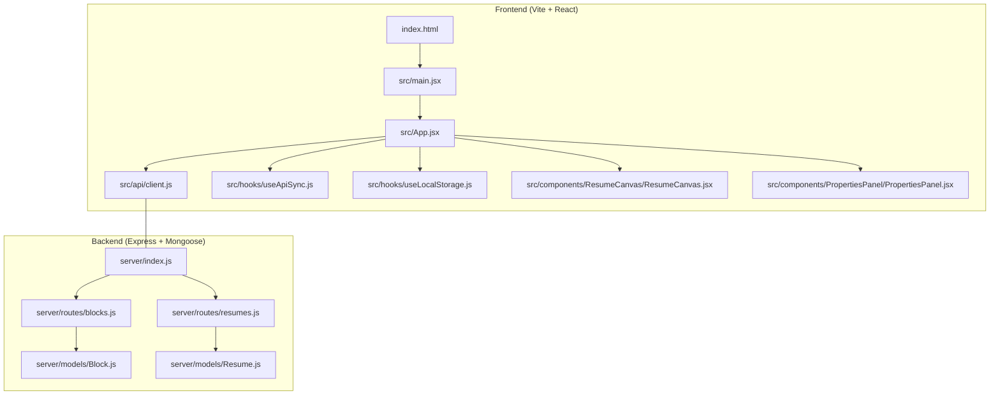
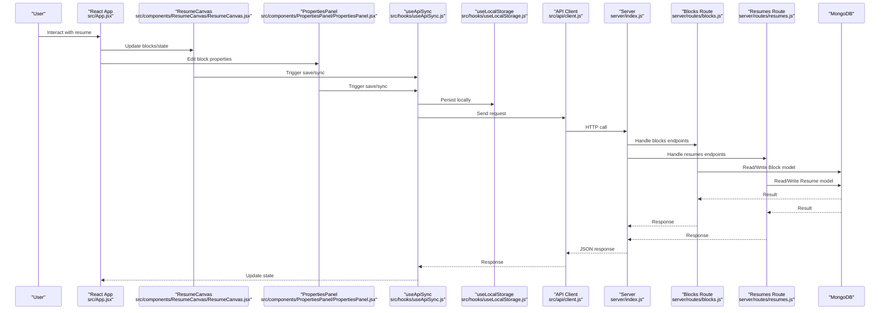
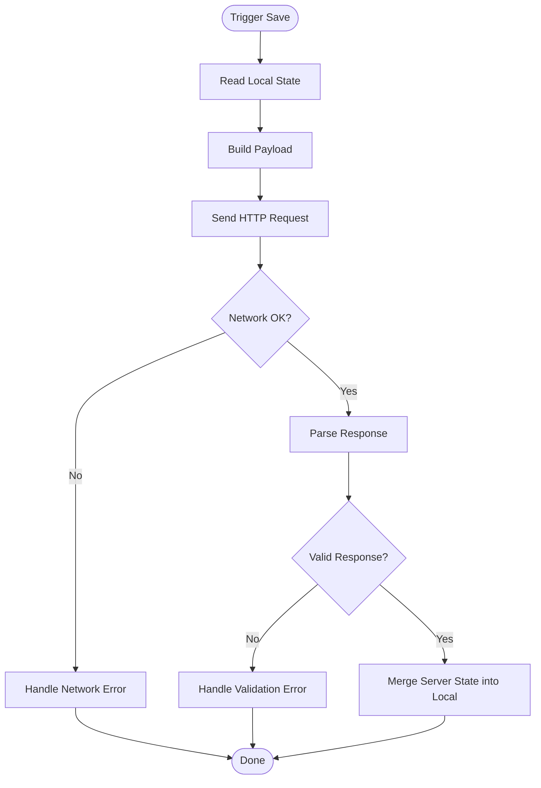
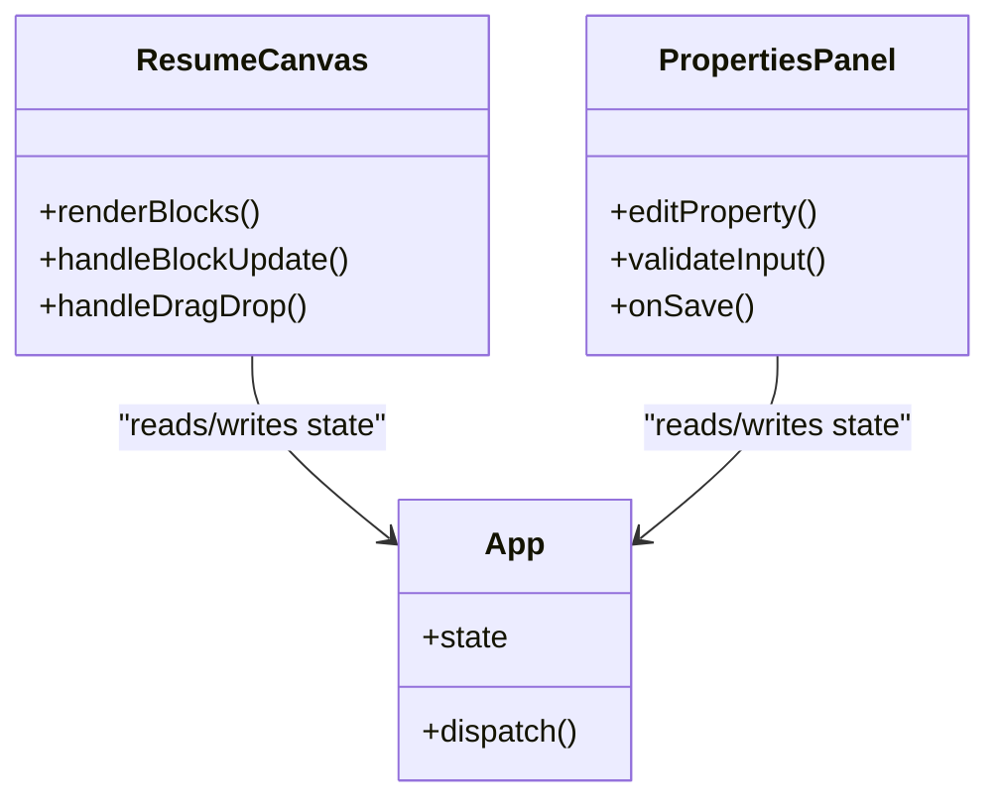
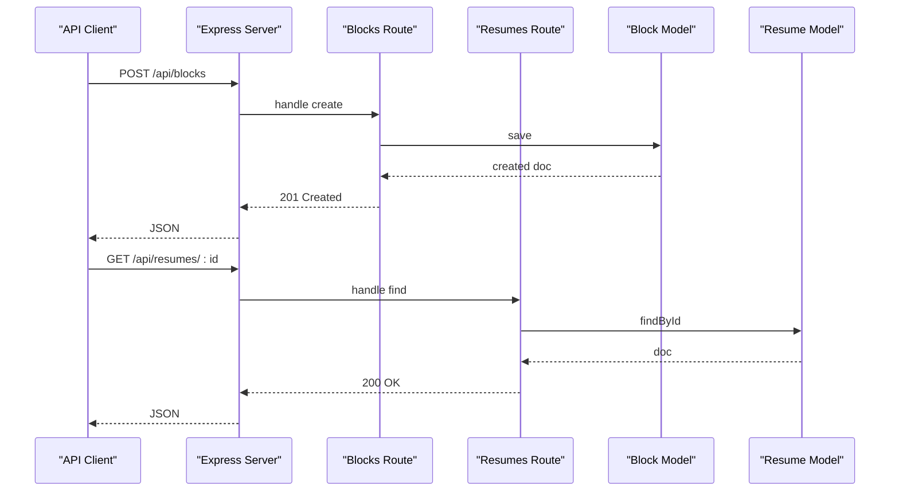
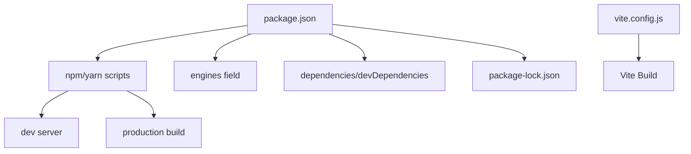

# Troubleshooting and Debugging

<cite>
**Referenced Files in This Document**
- [package.json](file://package.json)
- [vite.config.js](file://vite.config.js)
- [index.html](file://index.html)
- [server/index.js](file://server/index.js)
- [server/models/Block.js](file://server/models/Block.js)
- [server/models/Resume.js](file://server/models/Resume.js)
- [server/routes/blocks.js](file://server/routes/blocks.js)
- [server/routes/resumes.js](file://server/routes/resumes.js)
- [src/main.jsx](file://src/main.jsx)
- [src/App.jsx](file://src/App.jsx)
- [src/api/client.js](file://src/api/client.js)
- [src/hooks/useApiSync.js](file://src/hooks/useApiSync.js)
- [src/hooks/useLocalStorage.js](file://src/hooks/useLocalStorage.js)
- [src/components/ResumeCanvas/ResumeCanvas.jsx](file://src/components/ResumeCanvas/ResumeCanvas.jsx)
- [src/components/PropertiesPanel/PropertiesPanel.jsx](file://src/components/PropertiesPanel/PropertiesPanel.jsx)
- [src/utils/constants.js](file://src/utils/constants.js)
</cite>

## Table of Contents
1. [Introduction](#introduction)
2. [Project Structure](#project-structure)
3. [Core Components](#core-components)
4. [Architecture Overview](#architecture-overview)
5. [Detailed Component Analysis](#detailed-component-analysis)
6. [Dependency Analysis](#dependency-analysis)
7. [Performance Considerations](#performance-considerations)
8. [Troubleshooting Guide](#troubleshooting-guide)
9. [Conclusion](#conclusion)
10. [Appendices](#appendices)

## Introduction
This document provides comprehensive troubleshooting and debugging guidance for the Modular Resume Builder. It covers common development issues such as dependency conflicts, build errors, and runtime problems; debugging strategies for both frontend and backend using browser developer tools and Node.js techniques; performance profiling to identify bottlenecks; error logging and monitoring approaches for production; and diagnostics for database connectivity, API communication, and state synchronization. It also includes diagnostic commands and log analysis techniques to resolve issues efficiently.

## Project Structure
The project is a full-stack application with:
- Frontend: Vite-based React app under src/, including components, hooks, utilities, and an API client.
- Backend: Express server under server/ with routes and Mongoose models.
- Configuration: package.json for dependencies and scripts, vite.config.js for dev/prod behavior, index.html as the entry HTML.

**Diagram sources**
- [index.html:1-50](file://index.html#L1-L50)
- [src/main.jsx:1-50](file://src/main.jsx#L1-L50)
- [src/App.jsx:1-100](file://src/App.jsx#L1-L100)
- [src/api/client.js:1-100](file://src/api/client.js#L1-L100)
- [src/hooks/useApiSync.js:1-100](file://src/hooks/useApiSync.js#L1-L100)
- [src/hooks/useLocalStorage.js:1-100](file://src/hooks/useLocalStorage.js#L1-L100)
- [src/components/ResumeCanvas/ResumeCanvas.jsx:1-100](file://src/components/ResumeCanvas/ResumeCanvas.jsx#L1-L100)
- [src/components/PropertiesPanel/PropertiesPanel.jsx:1-100](file://src/components/PropertiesPanel/PropertiesPanel.jsx#L1-L100)
- [server/index.js:1-100](file://server/index.js#L1-L100)
- [server/routes/blocks.js:1-100](file://server/routes/blocks.js#L1-L100)
- [server/routes/resumes.js:1-100](file://server/routes/resumes.js#L1-L100)
- [server/models/Block.js:1-100](file://server/models/Block.js#L1-L100)
- [server/models/Resume.js:1-100](file://server/models/Resume.js#L1-L100)

**Section sources**
- [package.json:1-100](file://package.json#L1-L100)
- [vite.config.js:1-100](file://vite.config.js#L1-L100)
- [index.html:1-50](file://index.html#L1-L50)
- [server/index.js:1-100](file://server/index.js#L1-L100)

## Core Components
Key areas where issues commonly arise:
- Build and Dev Server: Vite configuration and scripts.
- API Client and Sync: HTTP calls and optimistic/pessimistic sync patterns.
- Persistence: Local storage and server persistence.
- UI State: Canvas and properties panel interactions.
- Backend Routes and Models: Data access and validation.

Common symptoms and quick checks:
- Dependency conflicts or install failures: verify engine versions and lock file consistency.
- Build errors: inspect Vite config and import paths.
- Runtime network errors: validate base URL, CORS, and route availability.
- Database connection errors: confirm MongoDB URI and environment variables.
- State drift between local storage and server: review sync hooks and conflict resolution.

**Section sources**
- [vite.config.js:1-100](file://vite.config.js#L1-L100)
- [src/api/client.js:1-100](file://src/api/client.js#L1-L100)
- [src/hooks/useApiSync.js:1-100](file://src/hooks/useApiSync.js#L1-L100)
- [src/hooks/useLocalStorage.js:1-100](file://src/hooks/useLocalStorage.js#L1-L100)
- [src/components/ResumeCanvas/ResumeCanvas.jsx:1-100](file://src/components/ResumeCanvas/ResumeCanvas.jsx#L1-L100)
- [src/components/PropertiesPanel/PropertiesPanel.jsx:1-100](file://src/components/PropertiesPanel/PropertiesPanel.jsx#L1-L100)
- [server/routes/blocks.js:1-100](file://server/routes/blocks.js#L1-L100)
- [server/routes/resumes.js:1-100](file://server/routes/resumes.js#L1-L100)
- [server/models/Block.js:1-100](file://server/models/Block.js#L1-L100)
- [server/models/Resume.js:1-100](file://server/models/Resume.js#L1-L100)

## Architecture Overview
End-to-end flow from UI to persistence:

**Diagram sources**
- [src/App.jsx:1-100](file://src/App.jsx#L1-L100)
- [src/components/ResumeCanvas/ResumeCanvas.jsx:1-100](file://src/components/ResumeCanvas/ResumeCanvas.jsx#L1-L100)
- [src/components/PropertiesPanel/PropertiesPanel.jsx:1-100](file://src/components/PropertiesPanel/PropertiesPanel.jsx#L1-L100)
- [src/hooks/useApiSync.js:1-100](file://src/hooks/useApiSync.js#L1-L100)
- [src/hooks/useLocalStorage.js:1-100](file://src/hooks/useLocalStorage.js#L1-L100)
- [src/api/client.js:1-100](file://src/api/client.js#L1-L100)
- [server/index.js:1-100](file://server/index.js#L1-L100)
- [server/routes/blocks.js:1-100](file://server/routes/blocks.js#L1-L100)
- [server/routes/resumes.js:1-100](file://server/routes/resumes.js#L1-L100)
- [server/models/Block.js:1-100](file://server/models/Block.js#L1-L100)
- [server/models/Resume.js:1-100](file://server/models/Resume.js#L1-L100)

## Detailed Component Analysis

### API Client and Sync Layer
Focus areas:
- Base URL and environment configuration mismatches.
- Request/response shape changes causing deserialization errors.
- Error propagation and retry/backoff strategies.
- Conflict resolution between local and server state.

**Diagram sources**
- [src/hooks/useApiSync.js:1-100](file://src/hooks/useApiSync.js#L1-L100)
- [src/api/client.js:1-100](file://src/api/client.js#L1-L100)
- [src/hooks/useLocalStorage.js:1-100](file://src/hooks/useLocalStorage.js#L1-L100)

**Section sources**
- [src/api/client.js:1-100](file://src/api/client.js#L1-L100)
- [src/hooks/useApiSync.js:1-100](file://src/hooks/useApiSync.js#L1-L100)
- [src/hooks/useLocalStorage.js:1-100](file://src/hooks/useLocalStorage.js#L1-L100)

### Resume Canvas and Properties Panel
Focus areas:
- Event handling and state updates causing re-renders.
- Prop drilling vs context usage and performance implications.
- CSS module scoping and print styles affecting layout.

**Diagram sources**
- [src/components/ResumeCanvas/ResumeCanvas.jsx:1-100](file://src/components/ResumeCanvas/ResumeCanvas.jsx#L1-L100)
- [src/components/PropertiesPanel/PropertiesPanel.jsx:1-100](file://src/components/PropertiesPanel/PropertiesPanel.jsx#L1-L100)
- [src/App.jsx:1-100](file://src/App.jsx#L1-L100)

**Section sources**
- [src/components/ResumeCanvas/ResumeCanvas.jsx:1-100](file://src/components/ResumeCanvas/ResumeCanvas.jsx#L1-L100)
- [src/components/PropertiesPanel/PropertiesPanel.jsx:1-100](file://src/components/PropertiesPanel/PropertiesPanel.jsx#L1-L100)
- [src/App.jsx:1-100](file://src/App.jsx#L1-L100)

### Backend Routes and Models
Focus areas:
- Route handlers and parameter validation.
- Model schema constraints and indexes.
- Error responses and status codes.

**Diagram sources**
- [server/index.js:1-100](file://server/index.js#L1-L100)
- [server/routes/blocks.js:1-100](file://server/routes/blocks.js#L1-L100)
- [server/routes/resumes.js:1-100](file://server/routes/resumes.js#L1-L100)
- [server/models/Block.js:1-100](file://server/models/Block.js#L1-L100)
- [server/models/Resume.js:1-100](file://server/models/Resume.js#L1-L100)

**Section sources**
- [server/index.js:1-100](file://server/index.js#L1-L100)
- [server/routes/blocks.js:1-100](file://server/routes/blocks.js#L1-L100)
- [server/routes/resumes.js:1-100](file://server/routes/resumes.js#L1-L100)
- [server/models/Block.js:1-100](file://server/models/Block.js#L1-L100)
- [server/models/Resume.js:1-100](file://server/models/Resume.js#L1-L100)

## Dependency Analysis
Common dependency-related issues:
- Node version mismatch with engines field.
- Conflicting peer dependencies across packages.
- Lock file inconsistencies after manual edits.

**Diagram sources**
- [package.json:1-100](file://package.json#L1-L100)
- [vite.config.js:1-100](file://vite.config.js#L1-L100)

**Section sources**
- [package.json:1-100](file://package.json#L1-L100)
- [vite.config.js:1-100](file://vite.config.js#L1-L100)

## Performance Considerations
Guidance to identify and mitigate bottlenecks:
- Frontend:
  - Use React Profiler to measure component render times and identify unnecessary re-renders.
  - Profile network requests to detect slow APIs or large payloads.
  - Inspect memory snapshots to find leaks or retained DOM nodes.
  - Optimize images and assets; leverage code splitting if applicable.
- Backend:
  - Log query execution times and add indexes on frequently queried fields.
  - Monitor CPU and memory usage during load tests.
  - Use structured logging to correlate requests with database operations.

[No sources needed since this section provides general guidance]

## Troubleshooting Guide

### Development Environment Setup
Symptoms:
- Cannot start dev server or build fails.
- Port conflicts or missing environment variables.

Actions:
- Verify Node version matches engines requirements.
- Clean reinstall dependencies and regenerate lock file if corrupted.
- Ensure required ports are free and environment variables are set.

Diagnostic commands:
- Install dependencies and rebuild caches.
- Run dev server and check console output for early errors.
- Validate build process and inspect generated artifacts.

**Section sources**
- [package.json:1-100](file://package.json#L1-L100)
- [vite.config.js:1-100](file://vite.config.js#L1-L100)

### Dependency Conflicts
Symptoms:
- Installation warnings or errors about incompatible versions.
- Runtime errors due to missing modules or wrong versions.

Actions:
- Align Node version with engines field.
- Remove lock file and reinstall to resolve inconsistencies.
- Pin conflicting packages to compatible versions.

Diagnostic commands:
- Audit dependencies for known vulnerabilities and conflicts.
- List outdated packages and plan upgrades carefully.

**Section sources**
- [package.json:1-100](file://package.json#L1-L100)

### Build Errors (Vite)
Symptoms:
- Import path errors, unresolved modules, or CSS module issues.
- Assets not found or incorrect public paths.

Actions:
- Review vite.config.js for aliases, plugins, and asset handling.
- Confirm relative imports and file extensions.
- Ensure static assets are placed correctly and referenced properly.

Diagnostic commands:
- Run build with verbose logging to pinpoint failing modules.
- Inspect generated dist folder structure.

**Section sources**
- [vite.config.js:1-100](file://vite.config.js#L1-L100)
- [index.html:1-50](file://index.html#L1-L50)

### Runtime Problems (Frontend)
Symptoms:
- Blank screen, unhandled exceptions, or UI not updating.
- Network errors when calling backend APIs.

Actions:
- Open browser DevTools Console and Sources to locate stack traces.
- Check Network tab for failed requests, status codes, and payloads.
- Validate CORS settings on the backend and base URL configuration.

Debugging strategies:
- Add breakpoints in event handlers and async flows.
- Use React DevTools to inspect component props and state.
- Log key state transitions around save/sync operations.

**Section sources**
- [src/main.jsx:1-50](file://src/main.jsx#L1-L50)
- [src/App.jsx:1-100](file://src/App.jsx#L1-L100)
- [src/api/client.js:1-100](file://src/api/client.js#L1-L100)
- [src/hooks/useApiSync.js:1-100](file://src/hooks/useApiSync.js#L1-L100)

### Backend Issues (Node/Express/MongoDB)
Symptoms:
- Server fails to start, crashes, or returns 5xx errors.
- Database connection timeouts or authentication failures.

Actions:
- Check server logs for startup errors and route handler exceptions.
- Validate MongoDB URI and credentials; ensure network reachability.
- Inspect route handlers for validation errors and proper error responses.

Debugging strategies:
- Use Node.js debugger or IDE breakpoints in route handlers.
- Log request IDs and payload shapes for correlation.
- Test endpoints directly with curl or Postman.

**Section sources**
- [server/index.js:1-100](file://server/index.js#L1-L100)
- [server/routes/blocks.js:1-100](file://server/routes/blocks.js#L1-L100)
- [server/routes/resumes.js:1-100](file://server/routes/resumes.js#L1-L100)
- [server/models/Block.js:1-100](file://server/models/Block.js#L1-L100)
- [server/models/Resume.js:1-100](file://server/models/Resume.js#L1-L100)

### Database Connectivity Issues
Symptoms:
- Connection refused, authentication failed, or timeout errors.
- Schema validation errors on save.

Actions:
- Verify MongoDB service is running and accessible.
- Confirm environment variables for host, port, username, password, and database name.
- Check model schemas for required fields and types.

Diagnostic commands:
- Ping MongoDB from the server environment.
- Attempt a minimal connection script to isolate configuration issues.

**Section sources**
- [server/models/Block.js:1-100](file://server/models/Block.js#L1-L100)
- [server/models/Resume.js:1-100](file://server/models/Resume.js#L1-L100)

### API Communication Problems
Symptoms:
- 404 Not Found, 405 Method Not Allowed, or CORS errors.
- Unexpected response shapes causing parsing failures.

Actions:
- Confirm base URL and endpoint paths match server routes.
- Enable CORS on the server for the frontend origin.
- Normalize response data in the API client before use.

Diagnostic commands:
- Use curl to test endpoints independently of the frontend.
- Capture and replay requests in browser DevTools.

**Section sources**
- [src/api/client.js:1-100](file://src/api/client.js#L1-L100)
- [server/routes/blocks.js:1-100](file://server/routes/blocks.js#L1-L100)
- [server/routes/resumes.js:1-100](file://server/routes/resumes.js#L1-L100)

### State Synchronization Conflicts
Symptoms:
- Local changes overwritten by server state or vice versa.
- Duplicate entries or inconsistent UI after save.

Actions:
- Implement optimistic updates with rollback on failure.
- Use timestamps or version fields to resolve conflicts.
- Debounce rapid saves and batch updates where appropriate.

Diagnostic strategies:
- Log local vs server state diffs around sync points.
- Replay sequences in DevTools to reproduce race conditions.

**Section sources**
- [src/hooks/useApiSync.js:1-100](file://src/hooks/useApiSync.js#L1-L100)
- [src/hooks/useLocalStorage.js:1-100](file://src/hooks/useLocalStorage.js#L1-L100)

### Error Logging and Monitoring (Production)
Recommendations:
- Centralize logging with structured formats (timestamp, level, message, context).
- Correlate frontend and backend logs via unique request IDs.
- Set up health checks and readiness probes for services.
- Configure alerting for critical errors and high latency.

Operational tips:
- Rotate logs and retain only necessary history.
- Avoid logging sensitive data; sanitize inputs.
- Use metrics dashboards to track error rates and performance.

[No sources needed since this section provides general guidance]

### Diagnostic Commands and Log Analysis Techniques
Useful commands:
- Reinstall dependencies and clear caches.
- Run dev server with verbose logging.
- Execute production build and inspect artifacts.
- Test backend endpoints directly.
- Query MongoDB for specific documents to validate data integrity.

Log analysis techniques:
- Filter logs by request ID to trace end-to-end flows.
- Identify repeated error patterns and their origins.
- Compare timestamps across frontend and backend logs to spot delays.

**Section sources**
- [package.json:1-100](file://package.json#L1-L100)
- [server/index.js:1-100](file://server/index.js#L1-L100)

## Conclusion
Effective troubleshooting combines systematic checks, targeted diagnostics, and robust logging. By validating environment setup, isolating frontend and backend layers, and analyzing logs and network traffic, most issues can be resolved quickly. Adopting consistent error handling, structured logging, and performance profiling practices will improve reliability and maintainability in production.

[No sources needed since this section summarizes without analyzing specific files]

## Appendices

### Quick Reference: Common Symptoms and Fixes
- Build fails: check engines, lock file, and Vite config.
- API 404/405/CORS: verify routes, methods, and CORS settings.
- DB connection errors: confirm URI, credentials, and network access.
- State drift: implement conflict resolution and debounce saves.
- Slow UI: profile renders and network; optimize heavy operations.

[No sources needed since this section provides general guidance]