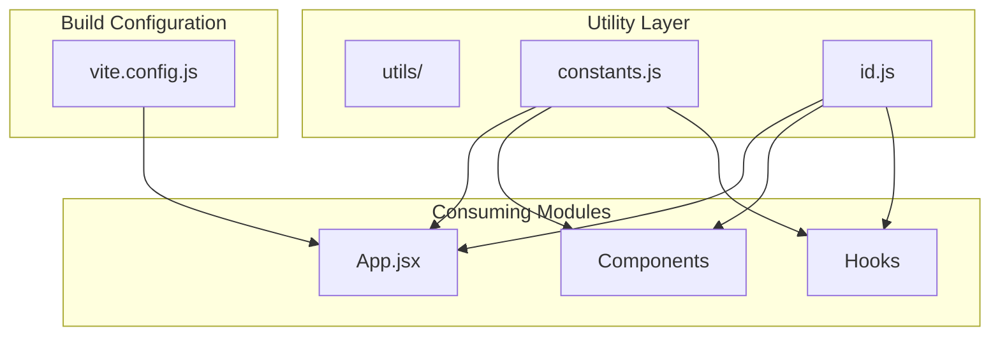
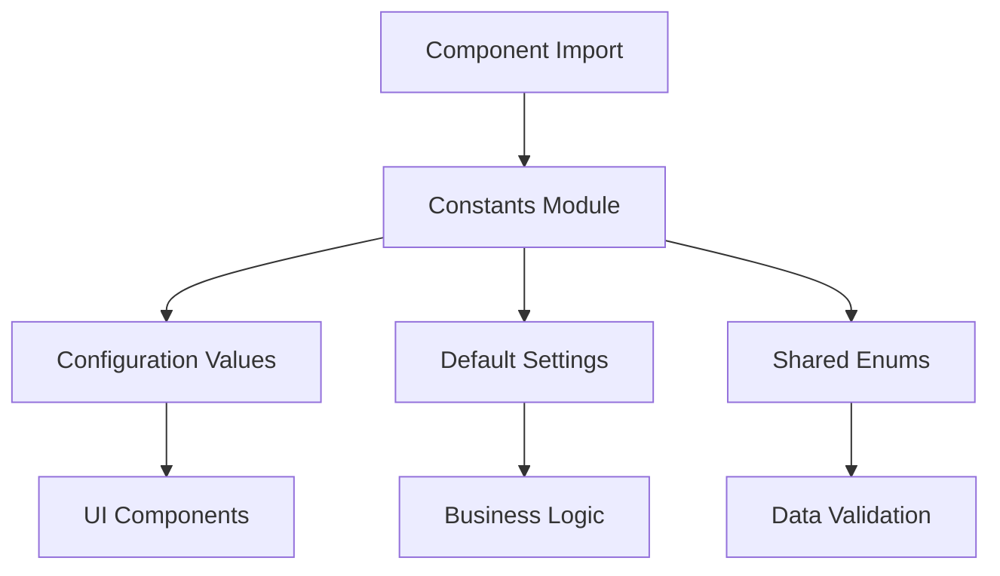
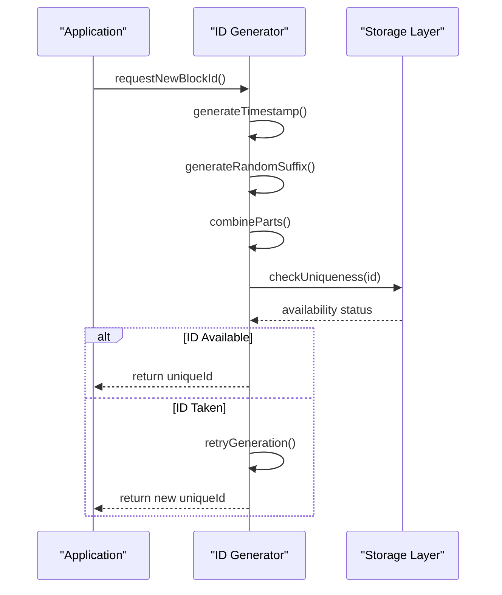
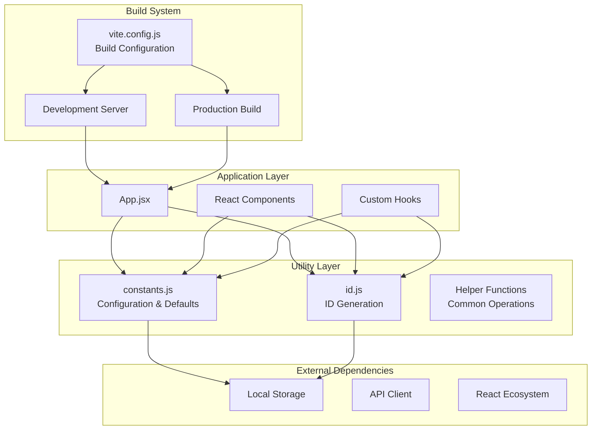
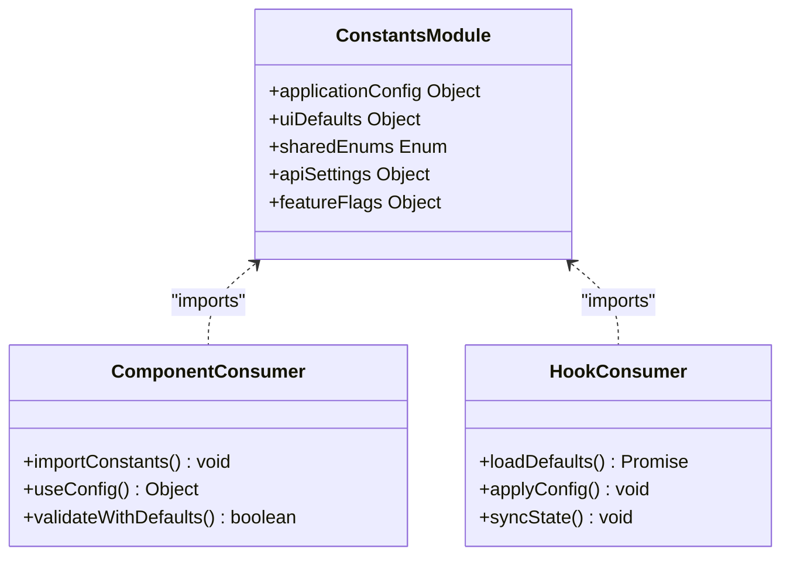
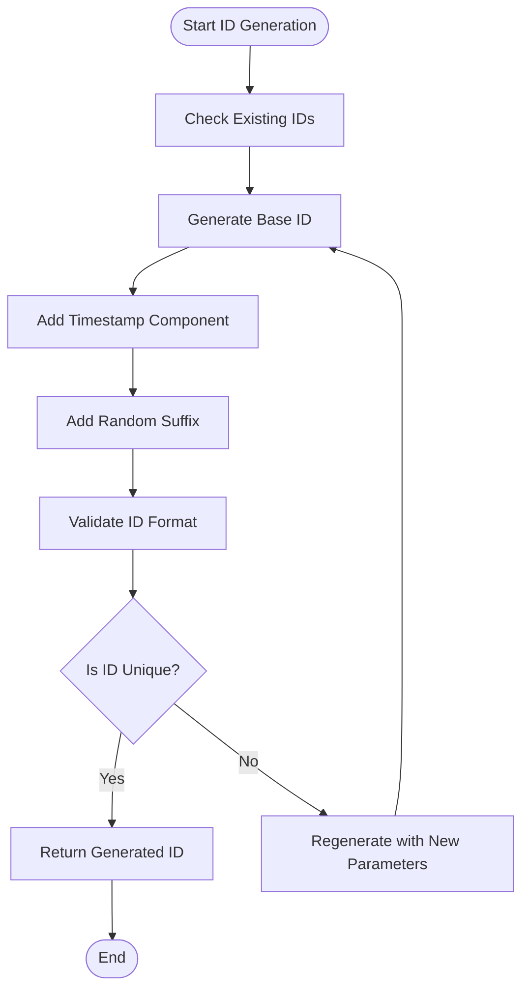
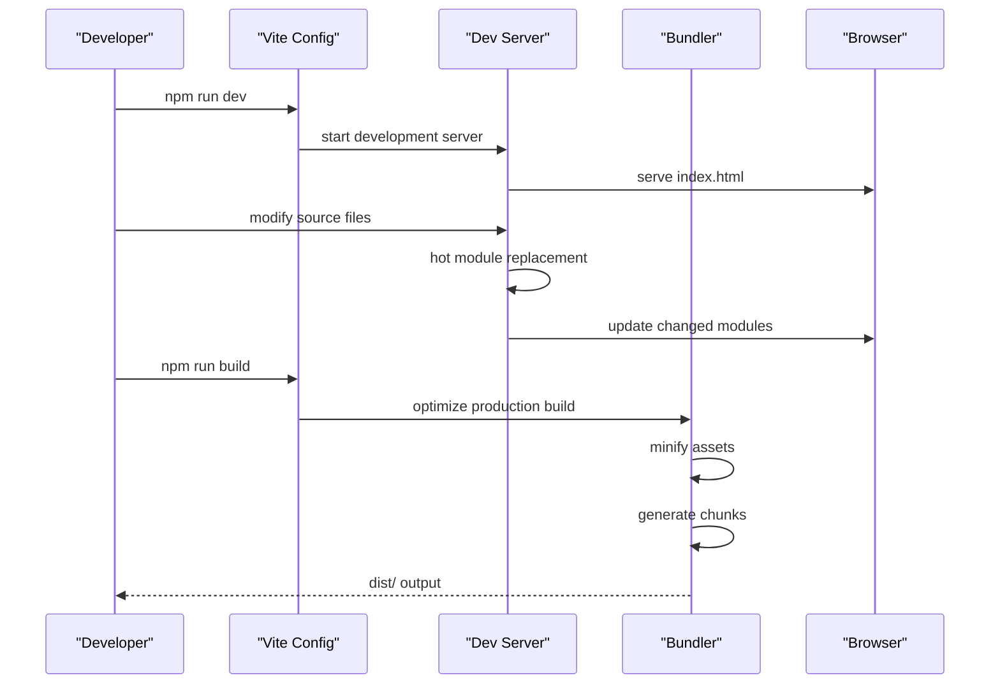
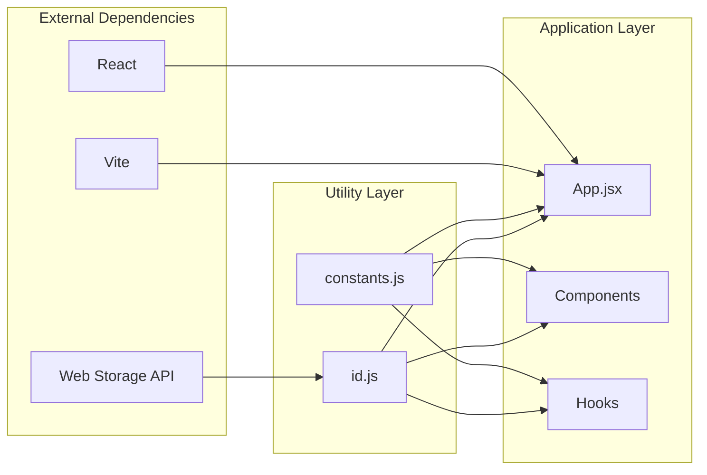
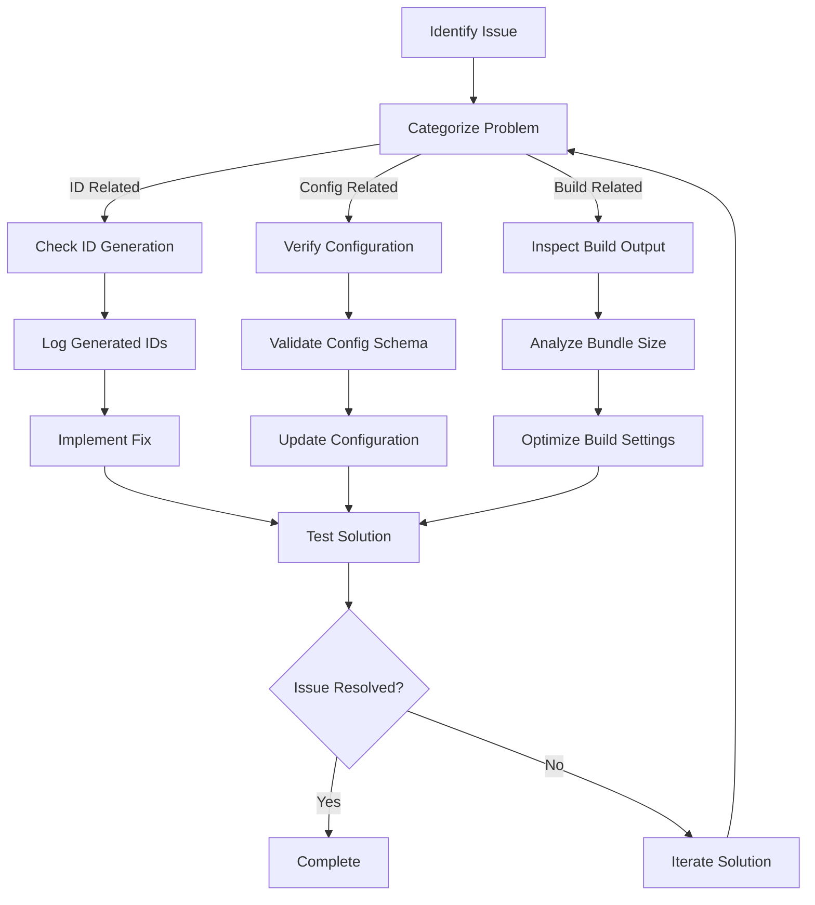

# Utilities and Helpers

<cite>
**Referenced Files in This Document**
- [constants.js](file://src/utils/constants.js)
- [id.js](file://src/utils/id.js)
- [vite.config.js](file://vite.config.js)
- [App.jsx](file://src/App.jsx)
- [main.jsx](file://src/main.jsx)
- [BlockLibrary.jsx](file://src/components/BlockLibrary/BlockLibrary.jsx)
- [ResumeCanvas.jsx](file://src/components/ResumeCanvas/ResumeCanvas.jsx)
- [useLocalStorage.js](file://src/hooks/useLocalStorage.js)
- [useApiSync.js](file://src/hooks/useApiSync.js)
</cite>

## Table of Contents
1. [Introduction](#introduction)
2. [Project Structure](#project-structure)
3. [Core Components](#core-components)
4. [Architecture Overview](#architecture-overview)
5. [Detailed Component Analysis](#detailed-component-analysis)
6. [Dependency Analysis](#dependency-analysis)
7. [Performance Considerations](#performance-considerations)
8. [Troubleshooting Guide](#troubleshooting-guide)
9. [Conclusion](#conclusion)
10. [Appendices](#appendices)

## Introduction

The Modular Resume Builder's utility layer provides essential building blocks for application-wide functionality, including configuration management, unique identifier generation, and build-time optimizations. This documentation focuses on the core utility modules that power the resume builder's data handling, ID generation, and development workflow.

The utility architecture follows a modular design pattern where each module serves a specific responsibility: constants for shared configuration, ID generation for unique block and resume identification, and build configuration for optimal development and production experiences.

## Project Structure

The utility layer is organized within the `src/utils` directory, containing focused modules for different concerns:

**Diagram sources**
- [constants.js](file://src/utils/constants.js)
- [id.js](file://src/utils/id.js)
- [vite.config.js](file://vite.config.js)
- [App.jsx](file://src/App.jsx)

**Section sources**
- [constants.js](file://src/utils/constants.js)
- [id.js](file://src/utils/id.js)
- [vite.config.js](file://vite.config.js)

## Core Components

### Constants Module

The constants module serves as the single source of truth for application-wide configuration values, default settings, and shared enumerations. This module centralizes configuration to ensure consistency across the application.

#### Key Responsibilities
- Application-wide configuration values
- Default settings for UI components
- Shared enumeration types
- Feature flags and toggles
- API endpoint definitions

#### Usage Patterns
The constants module is typically imported by components and services that need access to shared configuration:

**Diagram sources**
- [constants.js](file://src/utils/constants.js)
- [BlockLibrary.jsx](file://src/components/BlockLibrary/BlockLibrary.jsx)

**Section sources**
- [constants.js](file://src/utils/constants.js)
- [BlockLibrary.jsx](file://src/components/BlockLibrary/BlockLibrary.jsx)

### ID Generation Utilities

The ID generation module provides utilities for creating unique identifiers for blocks and resumes. This ensures data integrity and prevents conflicts when managing multiple resume elements.

#### Core Functions
- **Block ID Generation**: Creates unique IDs for individual resume blocks
- **Resume ID Generation**: Generates unique identifiers for complete resumes
- **ID Format Validation**: Ensures generated IDs follow expected patterns
- **Collision Prevention**: Implements strategies to avoid duplicate IDs

#### ID Generation Strategy

**Diagram sources**
- [id.js](file://src/utils/id.js)
- [ResumeCanvas.jsx](file://src/components/ResumeCanvas/ResumeCanvas.jsx)

**Section sources**
- [id.js](file://src/utils/id.js)
- [ResumeCanvas.jsx](file://src/components/ResumeCanvas/ResumeCanvas.jsx)

## Architecture Overview

The utility layer architecture follows a clean separation of concerns with clear boundaries between configuration, ID generation, and build-time optimizations.

**Diagram sources**
- [App.jsx](file://src/App.jsx)
- [constants.js](file://src/utils/constants.js)
- [id.js](file://src/utils/id.js)
- [vite.config.js](file://vite.config.js)

## Detailed Component Analysis

### Constants Module Implementation

The constants module provides centralized configuration management through a structured export system.

#### Configuration Categories

| Category | Purpose | Examples |
|----------|---------|----------|
| Application Settings | Global app behavior | Theme preferences, language settings |
| UI Defaults | Component default values | Button styles, layout dimensions |
| Data Types | Shared enumerations | Block types, validation rules |
| API Configuration | External service settings | Endpoint URLs, timeout values |
| Feature Flags | Runtime toggles | Experimental features, beta functions |

#### Integration Pattern

**Diagram sources**
- [constants.js](file://src/utils/constants.js)
- [useLocalStorage.js](file://src/hooks/useLocalStorage.js)

**Section sources**
- [constants.js](file://src/utils/constants.js)
- [useLocalStorage.js](file://src/hooks/useLocalStorage.js)

### ID Generation System

The ID generation system implements a robust strategy for creating unique identifiers that prevent collisions and maintain data integrity.

#### ID Generation Algorithm

**Diagram sources**
- [id.js](file://src/utils/id.js)

#### ID Format Specifications

| Component | Length | Format | Purpose |
|-----------|--------|--------|---------|
| Prefix | 2-4 chars | Alphanumeric | Type identification |
| Timestamp | 13 digits | Unix epoch | Temporal uniqueness |
| Random | 8-12 chars | Hexadecimal | Collision prevention |
| Separator | 1 char | Underscore | Component delimiter |

**Section sources**
- [id.js](file://src/utils/id.js)

### Build Configuration Analysis

The Vite configuration file defines the development and production build settings for the Modular Resume Builder.

#### Development Server Configuration

| Setting | Purpose | Default Value | Customization |
|---------|---------|---------------|---------------|
| Port | Development server port | 5173 | Environment variables |
| Host | Network accessibility | localhost | IP addresses |
| Open | Auto-open browser | true | User preference |
| Hot Reload | Live code reloading | enabled | Performance tuning |

#### Production Build Optimization

| Optimization | Description | Impact |
|--------------|-------------|---------|
| Code Splitting | Automatic chunk splitting | Reduced bundle size |
| Tree Shaking | Dead code elimination | Smaller production builds |
| Asset Minification | CSS/JS compression | Faster load times |
| Source Maps | Debugging support | Development experience |

#### Build Pipeline Flow

**Diagram sources**
- [vite.config.js](file://vite.config.js)
- [index.html](file://index.html)

**Section sources**
- [vite.config.js](file://vite.config.js)

## Dependency Analysis

The utility layer maintains low coupling with consuming modules while providing high cohesion within its own scope.

**Diagram sources**
- [constants.js](file://src/utils/constants.js)
- [id.js](file://src/utils/id.js)
- [App.jsx](file://src/App.jsx)

**Section sources**
- [constants.js](file://src/utils/constants.js)
- [id.js](file://src/utils/id.js)
- [App.jsx](file://src/App.jsx)

## Performance Considerations

### Memory Management
- **Constants Caching**: Configuration objects are memoized to prevent unnecessary re-renders
- **ID Generation Efficiency**: Timestamp-based IDs minimize collision checks
- **Bundle Size Optimization**: Tree shaking removes unused utility functions

### Load Time Optimization
- **Lazy Loading**: Utility modules are loaded on-demand when needed
- **Code Splitting**: Large utility functions are split into separate chunks
- **Asset Optimization**: Static assets are compressed and cached

### Runtime Performance
- **Immutable Configuration**: Constants use frozen objects to prevent accidental mutations
- **Efficient ID Lookup**: Indexed storage enables O(1) ID uniqueness checks
- **Minimal Dependencies**: Utility modules avoid heavy external dependencies

## Troubleshooting Guide

### Common Issues and Solutions

#### ID Generation Problems
- **Duplicate IDs**: Ensure timestamp precision and random suffix length
- **Performance Degradation**: Implement ID caching for frequently accessed IDs
- **Storage Limitations**: Monitor local storage usage for large numbers of IDs

#### Configuration Conflicts
- **Environment Variables**: Verify proper loading order and precedence
- **Type Mismatches**: Use TypeScript or PropTypes for configuration validation
- **Circular Dependencies**: Refactor constants to avoid import cycles

#### Build Configuration Issues
- **Port Conflicts**: Configure alternative ports in development environment
- **Asset Path Resolution**: Verify base path configuration for deployment
- **Source Map Generation**: Enable/disable based on debugging requirements

### Debugging Utilities

**Section sources**
- [id.js](file://src/utils/id.js)
- [constants.js](file://src/utils/constants.js)
- [vite.config.js](file://vite.config.js)

## Conclusion

The utility layer in the Modular Resume Builder provides a solid foundation for application-wide functionality through well-organized modules for configuration management, ID generation, and build optimization. The modular architecture ensures maintainability, testability, and extensibility while maintaining clear separation of concerns.

Key strengths include:
- Centralized configuration management
- Robust ID generation with collision prevention
- Optimized build pipeline for both development and production
- Clear dependency boundaries and low coupling

Future enhancements could include additional helper functions for data transformation, validation utilities, and internationalization support.

## Appendices

### Extension Guidelines

#### Adding New Constants
1. Define constant in appropriate category
2. Export with descriptive naming
3. Add type definitions if using TypeScript
4. Update documentation with usage examples

#### Extending ID Generation
1. Implement new ID format in generator function
2. Add validation logic for new formats
3. Update collision detection algorithms
4. Test with edge cases and stress scenarios

#### Customizing Build Configuration
1. Modify vite.config.js for specific requirements
2. Test changes in both development and production modes
3. Document impact on build performance
4. Provide migration guide for other developers